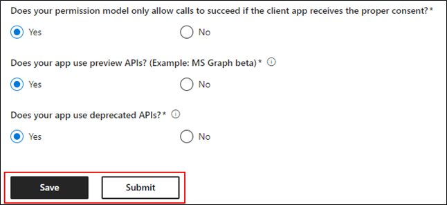
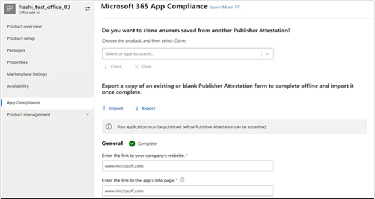

# Guida utente del partner per Microsoft 365 programma di conformità delle app - SaaS

|Fase|Titolo|
|---|---|
|Fase 1| Attestazione dell'autore|
|Fase 2| Certificazione Microsoft 365|

## 1. Panoramica 

Questo documento funge da guida dettagliata per l'utente per i partner, registrati per Microsoft 365 programma di conformità delle app con l'obiettivo di sottoporsi Publisher attestazione e certificazione per le app SaaS, tramite il portale del Centro per i partner.

## 2. Acronimi & definizioni
|Acronimi | Definizione |
|----|----|
|[PC (Centro per i partner)](https://partner.microsoft.com/)|Un portale per tutti i partner Microsoft. Un partner accede al Centro per i partner e invia un questionario di autovalutazione. Centro per i partner per [la conformità alle app Microsoft 365](https://partner.microsoft.com/dashboard/home)|
|ISV | Fornitore di software indipendente a.k.a. Partner o sviluppatore |
|Origine app | Catalogo di app |
|Esempio |[Ora agente virtuale](https://appsource.microsoft.com/product/office/WA104381816)|

## 3. Flusso di lavoro di attestazione Publisher

**Home page**: pagina di destinazione dopo l'accesso di un partner al Centro per i partner.

  
**Passaggio 1** : Selezionare le offerte del Marketplace

  
**Passaggio 2**: dopo aver selezionato "Offerte marketplace", passare a "Marketplace commerciale".

Selezionare un'app dall'elenco e verrà visualizzata un'altra barra di spostamento con l'opzione "Conformità app".
  
**Passaggio 3**: Selezionare "Conformità app"
  

  
**Passaggio 4**: Compilare il questionario di autovalutazione per Publisher Attestazione.

  
**NOTA Se si torna a aggiornare o inviare di nuovo l'applicazione, fare clic sull'elenco a discesa "Scegli il prodotto", selezionare l'app e fare clic su "Clona".**

**È anche possibile sfruttare la funzionalità Importazione/Esportazione per completare il modulo offline e importarlo una volta completato.**

 
**Passaggio 5**: al termine, fare clic su "Invia", la valutazione sarà ora "Sotto revisione".
 
  
  
**Approvare/rifiutare gli scenari:**
  
R. rifiuto attestazione Publisher
- In caso di rifiuto, un partner può:
     - Visualizzare il report degli errori
          - Il partner riceverà una notifica tramite posta elettronica e potrà visualizzare il report sugli errori nel Centro per i partner
     - Aggiornare e inviare nuovamente il questionario di autovalutazione.
        

B.  approvazione attestazione Publisher
- Al momento dell'approvazione, il partner può:
     - Aggiornare e inviare di nuovo l'attestazione
     - Visualizzazione completata Publisher attestazione
     - Avviare il processo di certificazione Microsoft 365
        
        
  
 
  
**Post Publisher Approvazione attestazione: esempio di collegamento in AppSource per le app con attestazione del server di pubblicazione.**
  

   
## 4. Flusso di lavoro di certificazione Microsoft 365
  
Un partner può iniziare il processo di certificazione selezionando la casella di controllo e facendo clic su "Invia"
  
 
  
**Passaggio 1**: Invio iniziale del documento

Compilare tutti i dettagli, caricare i documenti pertinenti e fare clic su "Invia"
  
 

  
Facendo clic su Invia, l'invio del documento iniziale verrà esaminato.

  
Un analista richiede una revisione nel caso in cui i documenti iniziali non siano sufficienti o pertinenti. L'analista collaborerà con il partner per ottenere i documenti corretti per l'approvazione.

Dopo che l'analista approva l'invio iniziale del documento, il partner deve inviare i requisiti di controllo.
  
**Passaggio 2**: Controllare l'invio dei requisiti
  
Compilare tutti i dettagli, caricare i documenti pertinenti e fare clic su 'Invia'

  

 
Facendo clic su Invia, l'invio del documento iniziale verrà esaminato.

  
Un analista richiede una revisione nel caso in cui i documenti sui requisiti di controllo non siano sufficienti o pertinenti. L'analista collaborerà con il partner per ottenere i documenti corretti per l'approvazione.

  
 
 
Nel caso in cui l'invio non soddisfi gli standard di approvazione, l'analista rifiuterà l'invio.
  
Il partner può collaborare con l'analista per fornire le informazioni e i documenti pertinenti.

  
Una volta soddisfatti tutti gli standard di sicurezza, l'analista approverà l'invio e il partner sarà Microsoft 365 Certified.

  
**Approvazione post certificazione: esempio di badge di certificazione Microsoft 365 in AppSource.** 

 
## 5. Microsoft 365 flusso di lavoro di rinnovo:
  
**flusso di lavoro di attestazione e rinnovo della certificazione Microsoft 365Publisher:**  

Microsoft 365 programma di conformità delle app offre ora un processo di rinnovo annuale. Durante questo processo, gli sviluppatori di app possono aggiornare il questionario di attestazione Publisher esistente e i documenti necessari per la certificazione Microsoft 365. 
 
**Benefici:** 

- Mantenere il badge di certificazione in AppSource, Office Store, Teams Store e vari portali di amministrazione per distinguere l'app dagli altri. 
- Aumentare la fiducia dei clienti nell'uso dell'app certificata. 
- Aiutare gli amministratori IT a prendere decisioni informate con informazioni aggiornate sulla certificazione.

Il nuovo processo di rinnovo è disponibile nel [Centro per i partner](https://partner.microsoft.com/dashboard/home) per offrire un'esperienza senza problemi. Un promemoria per il rinnovo verrà visualizzato nel Centro per i partner a partire da 90 giorni prima della data di scadenza. I promemoria periodici verranno inviati anche via e-mail a 90, 60 e 30 giorni prima della scadenza. 
 
**Fase 1: rinnovo dell'attestazione Publisher:**
  
Le risposte di attestazione Publisher dell'app dovranno essere inviate di nuovo su base annuale. Quando l'attestazione si avvicina al punteggio di 1 anno, verrà inviato un promemoria tramite posta elettronica che incoraggia la reinviazione dell'attestazione. 
 
**Passaggio 1**: selezionare **Rinnova** per rinnovare l'attestazione Publisher.
  

  
**Passaggio 2**: Esaminare le risposte di attestazione Publisher precedenti e aggiornare con le informazioni più recenti in base alle esigenze. 
  
Inviare Publisher attestazione per il rinnovo quando è pronto. Verrà esaminato da un analista di conformità delle app M365.

  
**Publisher rinnovo dell'attestazione approvato:**
  

  
**Publisher Attestazione scaduta:**
  
Le informazioni dell'app devono essere rinnovate prima della data di scadenza per mantenere la pagina attestazione Publisher dell'app nella documentazione Microsoft. Il rinnovo tempestivo garantirà anche il continuo badging e le icone per l'app in varie vetrine. 
 

**Nota**: una volta scaduto, Publisher processo di rinnovo dell'attestazione può essere avviato in qualsiasi momento facendo clic su "Rinnova".
 
**Fase 2: rinnovo della certificazione Microsoft 365**
  
Le informazioni di certificazione dell'app devono essere inviate di nuovo su base annuale. Ciò richiederà la riconvalida dei controlli nell'ambito dell'ambiente corrente. Quando la certificazione si avvicina a 1 anno, verrà inviata una notifica tramite posta elettronica che incoraggia la reinvio dei documenti e delle prove.
 
 

**Scenari di approvazione/rifiuto del rinnovo della certificazione:**

**Scenario 1:** 

Il rinnovo della certificazione è iniziato ed è in fase di revisione.
 
 

Scenario 1A: 

Rifiuto del rinnovo della certificazione: 
- La certificazione può essere rifiutata se: 
     - L'app non dispone degli strumenti, dei processi o delle configurazioni necessari e non sarà in grado di implementare le modifiche necessarie all'interno della finestra di certificazione. 
     - L'app presenta vulnerabilità in sospeso e non può essere risolta all'interno della finestra di certificazione. 
 

Scenario 1B: 

Il rinnovo della certificazione è approvato

**Scadenza certificazione:**

Le informazioni dell'app devono essere rinnovate prima della data di scadenza per mantenere la pagina Certificazione dell'app nella documentazione Microsoft. Il rinnovo tempestivo garantirà anche la continua creazione di errori e icone per l'app in AppSource e Team Store.

  
Nota: una volta scaduto, Publisher processo di attestazione e certificazione può essere avviato in qualsiasi momento facendo clic su "Rinnova". 
