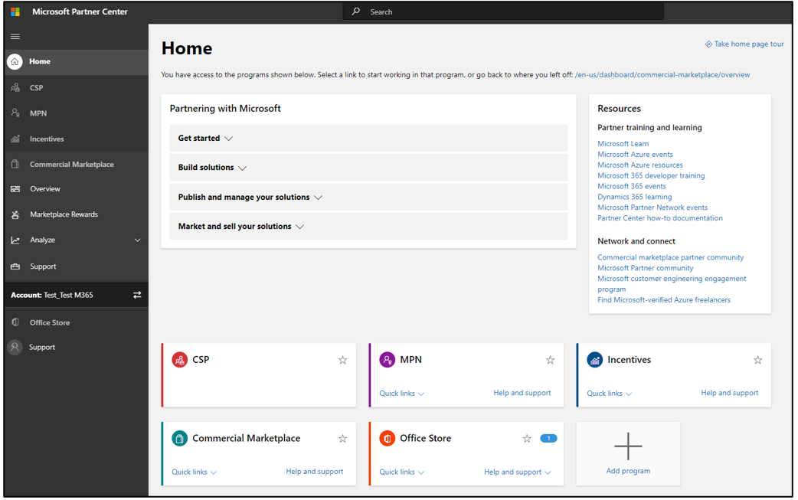
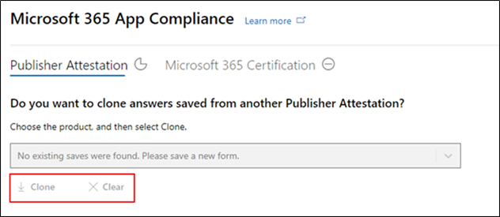
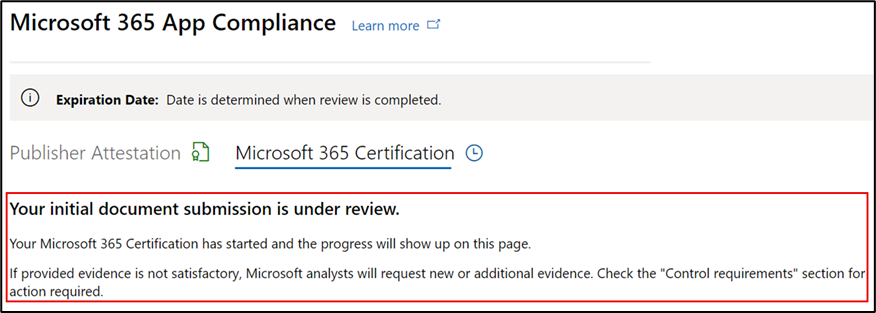

# Guida per l'utente del partner per Microsoft 365 App Compliance Program - SaaSPartner's User Guide for Microsoft 365 App Compliance Program - SaaS

|FasePhase|TitoloTitle|
|---|---|
|Fase 1Phase 1| Attestazione dell'autorePublisher Attestation|
|Fase 2Phase 2| Certificazione Microsoft 365Microsoft 365 Certification|

## 1. Panoramica1. Overview 

Questo documento funge da guida utente dettagliata per i partner, iscritti al programma conformità app Microsoft 365 che mira a sottoporsi Publisher attestazione e certificazione per le proprie app SaaS, anche se il portale del Centro per i partner.This document acts as a step-by-step user guide for our partners, enrolled for Microsoft 365 App Compliance program aiming to undergo Publisher Attestation and Certification for their SaaS apps, though the Partner Center portal.

## 2. Acronimi & Definizioni2. Acronyms & Definitions
|AcronimiAcronym | DefinizioneDefinition |
|----|----|
|[PC (Centro per i partner)PC (Partner Center)](https://partner.microsoft.com/)|Portale per tutti i partner Microsoft.A portal for all Microsoft partners. Un partner accede al Centro per i partner e invia un questionario di autovalutazione.A partner logs in to Partner Center and submits self-assessment questionnaire. Centro per i partner [per Microsoft 365 conformità delle app](https://partner.microsoft.com/dashboard/home)Partner Center for [Microsoft 365 App Compliance](https://partner.microsoft.com/dashboard/home)|
|ISVISV | Independent Software Vendor a.k.a.Independent Software Vendor a.k.a. Partner o sviluppatorePartner or Developer |
|Origine appApp Source | Catalogo di appCatalog of apps |
|EsempioExample |[Agente virtualeNow virtual agent](https://appsource.microsoft.com/product/office/WA104381816)|

## 3. Publisher flusso di lavoro di attestazione3. Publisher Attestation Workflow

**Home Page:** questa è la pagina di destinazione quando un partner accede al Centro per i partner.**Home Page**: This is the landing page once a partner logs in to Partner Center.

  
**Passaggio 1:** nella barra di spostamento a sinistra della pagina:**Step 1** : On the left side of the page, on the navigation bar:

- Seleziona Marketplace commercialeSelect Commercial Marketplace
- Seleziona panoramicaSelect Overview

  
Dopo aver selezionato "Panoramica", il partner può visualizzare l'elenco delle app disponibili per avviare il programma Microsoft 365 conformità.Upon selecting ‘Overview’, partner can see list of apps available to start the Microsoft 365 Compliance program.
  
**Passaggio 2:** selezionare un'app dall'elenco per iniziare Publisher processo di attestazione.**Step 2**: Select an app from the list to begin the Publisher Attestation process.

Quando selezioni un'app, verrà visualizzata un'altra barra di spostamento con l'opzione "Conformità app".On selecting an app, another navigation bar will pop up with option ‘App Compliance’.
  
**Passaggio 3:** selezionare "Conformità app"**Step 3**: Select 'App Compliance’
  

  
**Passaggio 4:** compilare il questionario di autovalutazione per Publisher attestazione.**Step 4**: Fill out the self-assessment questionnaire for Publisher Attestation.

  
**NOTA Se si torna ad aggiornare/inviare di nuovo l'applicazione, fare clic sull'elenco a discesa per "Scegli il prodotto", selezionare l'app e fare clic su "Clona".****NOTE If you are coming back to update/re-submit your application, click dropdown for ‘Choose the product’, select the app and click ‘Clone’.**

**È inoltre possibile utilizzare la funzionalità Importazione/Esportazione per completare il modulo offline e importarlo una volta completato.****You can also leverage the Import/Export feature to complete the form offline and import it once completed.**

 
**Passaggio 5:** una volta completato, fare clic su "Invia", la valutazione sarà ora "In revisione".**Step 5**: Once completed, click on ‘Submit’, the assessment will now be ‘Under Review’.
 
   
  
**Approva/Rifiuta scenari:****Approve/Reject Scenarios:**
  
R.A. Publisher Rifiuto attestazionePublisher Attestation Rejection
- In caso di rifiuto, un partner può:In case of rejection, a partner can:
     - Visualizzare il rapporto erroriView failure report
          - Il partner riceverà una notifica tramite posta elettronica e potrà visualizzare il rapporto errori nel Centro per i partnerPartner will be notified via email, and they can view the failure report in Partner Center
     - Aggiornare e inviare nuovamente il questionario di autovalutazione.Update and re-submit self-assessment questionnaire.
        

B.B.  Publisher Approvazione attestazionePublisher Attestation Approval
- Al momento dell'approvazione, il partner può:Upon approval, the partner can:
     - Aggiornare e inviare di nuovo l'attestazioneUpdate and resubmit attestation
     - Visualizzazione dell'attestazione Publisher completataView completed Publisher Attestation
     - Avviare il processo Microsoft 365 certificazioneStart the Microsoft 365 Certification process
        
        
  
 
  
**Post Publisher approvazione attestazione: esempio di collegamento in AppSource per le app attestate dall'autore.****Post Publisher Attestation Approval: Example of link in AppSource for publisher attested apps.**
  

   
## 4. Flusso di lavoro Microsoft 365 certificazione4.   Microsoft 365 Certification Workflow
  
Un partner può iniziare il processo di certificazione selezionando la casella di controllo e facendo clic su "Invia"A partner can begin the Certification process by selecting the checkbox and clicking ‘Submit’
  
 
  
**Passaggio 1** : Invio documento iniziale**Step 1** : Initial Document Submission

Compila tutti i dettagli, carica i documenti pertinenti e fai clic su 'Invia'Fill out all the details, upload relevant documents and click ‘Submit’
  
 
  

  
Facendo clic su Invia, l'invio del documento iniziale verrà esaminato.On clicking submit, the initial document submission will be under review.

  
Un analista richiede una revisione nel caso in cui i documenti iniziali non siano sufficienti o pertinenti.An analyst requests a revision in case the initial documents are not sufficient or relevant. L'analista collabora con il partner per ottenere i documenti necessari per l'approvazione.The analyst will work with the partner to help get the right documents for approval.

Dopo che l'analista ha approvato l'invio del documento iniziale, il partner deve inviare i requisiti di controllo.Once the analyst approves the initial document submission, the partner needs to submit the control requirements.
  
**Passaggio 2:** Controllare l'invio dei requisiti**Step 2**: Control Requirement Submission
  
Compilare tutti i dettagli, caricare i documenti pertinenti e fare clic su 'Invia'Fill out all the details, upload relevant documents and Click ‘Submit’

  

 
Facendo clic su Invia, l'invio del documento iniziale verrà esaminato.On clicking Submit, the initial document submission will be under review.

  
Un analista richiede una revisione nel caso in cui i documenti dei requisiti di controllo non siano sufficienti o pertinenti.An analyst requests a revision in case the control requirement documents are not sufficient or relevant. L'analista collabora con il partner per ottenere i documenti necessari per l'approvazione.The analyst will work with the partner to help get the right documents for approval.

  
 
 
Nel caso in cui l'invio non soddisfi gli standard di approvazione, l'analista rifiuterà l'invio.In case the submission does not satisfy the approval standards, the analyst will reject the submission.
  
Il partner può collaborare con l'analista per fornire le informazioni e i documenti pertinenti.The partner can work with the analyst to provide the relevant information and documents.

  
Una volta soddisfatti tutti gli standard di sicurezza, l'analista approverà l'invio e il partner sarà Microsoft 365 Certified.Once all the security standards have been met, the analyst will approve the submission and the partner will be Microsoft 365 Certified.

  
**Approvazione post-certificazione: esempio di Microsoft 365 badge di certificazione in AppSource.****Post Certification Approval: Example of Microsoft 365 certification badge in AppSource.** 

 
## 5. Microsoft 365 flusso di lavoro per il rinnovo:5.   Microsoft 365 Renewal Workflow:
  
**Microsoft 365Publisher flusso di lavoro di attestazione e rinnovo della certificazione:****Microsoft 365 Publisher Attestation and Certification Renewal Workflow:**  

Microsoft 365 Il programma di conformità delle app ora offre un processo di rinnovo annuale.Microsoft 365 App Compliance program now offers an annual renewal process. Durante questo processo, gli sviluppatori di app possono aggiornare il questionario Publisher attestazione e i documenti necessari per la Microsoft 365 certificazione.During this process, app developers can update their existing Publisher Attestation questionnaire and documents required for Microsoft 365 Certification. 
 
**Vantaggi:****Benefits:** 

- Mantieni il badge di certificazione in AppSource, Office Store, Teams Store e vari portali di amministrazione per differenziare la tua app dagli altri.Maintain your certification badge in AppSource, the Office Store, the Teams Store and various admin portals to differentiate your app from others. 
- Aumentare la fiducia dei clienti nell'uso dell'app certificata.Increase customer confidence in using your certified app. 
- Aiutare gli amministratori IT a prendere decisioni informate con informazioni aggiornate sulla certificazione.Help IT admins make informed decisions with updated certification information.

Il nuovo processo di rinnovo è disponibile nel [Centro per i partner](https://partner.microsoft.com/dashboard/home) per offrire un'esperienza senza problemi.The new renewal process is available in [Partner Center](https://partner.microsoft.com/dashboard/home) to provide a seamless experience. Un promemoria di rinnovo verrà visualizzato nel Centro per i partner a partire da 90 giorni prima della data di scadenza.A renewal reminder will be shown in Partner Center starting 90 days before the expiration date. I promemoria periodici verranno inviati anche tramite posta elettronica a 90, 60 e 30 giorni prima della scadenza.Periodic reminders will also be sent via email at 90, 60 and 30 days before expiration. 
 
**Fase 1: Publisher rinnovo dell'attestazione:****Phase 1: Publisher Attestation Renewal:**
  
Le risposte dell'Publisher'attestazione dell'app dovranno essere reinviato su base annuale.The app’s Publisher Attestation answers will need to be resubmitted on an annual basis. Quando l'attestazione si avvicina al contrassegno di 1 anno, verrà inviato un promemoria tramite posta elettronica per incoraggiare il reinvio dell'attestazione.When the attestation nears the 1-year mark, an email reminder will be sent encouraging a resubmission of the attestation. 
 
**Passaggio 1:** selezionare **Rinnova** per rinnovare l Publisher attestazione.**Step 1**: Select **Renew** to renew the Publisher Attestation.
  

  
**Passaggio 2:** esaminare le risposte Publisher attestazione e aggiornare con le informazioni più recenti in base alle esigenze.**Step 2**: Review the previous Publisher Attestation answers and update with the latest information as needed. 
  
Inviare Publisher'attestazione per il rinnovo quando è pronto.Submit Publisher Attestation for renewal when ready. Verrà esaminato da un analista di conformità delle app M365.It will be reviewed by an M365 App Compliance analyst.

  
**Publisher Rinnovo attestazione approvato:****Publisher Attestation Renewal Approved:**
  

  
**Publisher Attestazione scaduta:****Publisher Attestation Expired:**
  
Le informazioni dell'app devono essere rinnovate prima della data di scadenza per mantenere la pagina dell'attestazione Publisher'app nei documenti Microsoft. Il rinnovo in tempo reale garantirà inoltre continui problemi e icone per l'app in vari storefront.The app’s information needs to be renewed before the expiration date to maintain the app’s Publisher Attestation page on the Microsoft docs. Timely renewal will also ensure continued badging and icons for the app in various storefronts. 
 

**Nota:** una volta scaduto, Publisher processo di rinnovo dell'attestazione può essere avviato in qualsiasi momento facendo clic su "Rinnova".**Note**: Once expired, Publisher Attestation renewal process can be started anytime by clicking ‘Renew’.
 
**Fase 2: rinnovo Microsoft 365 certificazione****Phase 2: Microsoft 365 Certification Renewal**
  
Le informazioni sulla certificazione dell'app devono essere reinvii su base annuale.The app’s certification information needs to be resubmitted on an annual basis. Ciò richiederà la riconvalida dei controlli nell'ambito dell'ambiente corrente.This will require revalidation of the in-scope controls of your current environment. Quando la certificazione si avvicina a 1 anno, verrà inviata una notifica tramite posta elettronica che incoraggia il reinvio dei documenti e delle prove.When the Certification nears 1-year mark an email notification will be sent encouraging a resubmission of the documents and evidence.
 
 

**Scenari di approvazione/rifiuto per il rinnovo della certificazione:****Certification Renewal Approve/Reject Scenarios:**

**Scenario 1:****Scenario 1:** 

Il rinnovo della certificazione è stato avviato ed è in fase di revisione.Certification renewal has started and is under review.
 
 

Scenario 1A:Scenario 1A: 

Rifiuto rinnovo certificazione:Certification renewal rejection: 
- La certificazione può essere rifiutata se:Certification may be rejected if: 
     - L'app non dispone degli strumenti, dei processi o delle configurazioni necessari e non sarà in grado di implementare le modifiche necessarie all'interno della finestra di certificazione.The app does not have the required tooling, processes, or configurations in place and will not be able to implement required changes within the certification window. 
     - L'app presenta vulnerabilità in sospeso e non può essere corretta all'interno della finestra di certificazione.The app has outstanding vulnerabilities in place and cannot be fixed within the certification window. 
 

Scenario 1B:Scenario 1B: 

Il rinnovo della certificazione è approvatoCertification renewal is approved

**Scadenza certificazione:****Certification Expiration:**

Le informazioni dell'app devono essere rinnovate prima della data di scadenza per mantenere la pagina Certificazione dell'app nei documenti Microsoft. Il rinnovo in tempo reale garantirà inoltre il continuo ritardo e le icone per l'app in AppSource e Nello Store del team.The app’s information needs to be renewed before the expiration date to maintain app’s Certification page on the Microsoft docs. Timely renewal will also ensure continued badging and icons for the app in AppSource and Team Store.

  
Nota: una volta scaduto, Publisher processo di attestazione e certificazione può essere avviato in qualsiasi momento facendo clic su "Rinnova".Note: Once expired, Publisher Attestation and Certification process can be started anytime by clicking ‘Renew’. 
