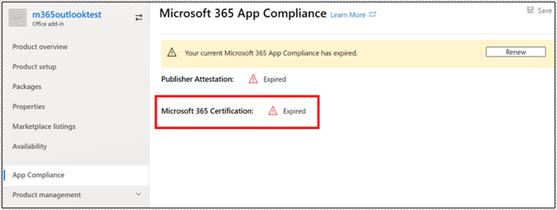

# Guida per l'utente del partner per Microsoft 365 di conformità delle appPartner's User Guide for Microsoft 365 App Compliance Program

|||
|---|---|
|Livello 1Tier 1| Attestazione dell'autorePublisher Attestation|
|Livello 2Tier 2| Certificazione Microsoft 365Microsoft 365 Certification|

## 1. Panoramica1. Overview
Questo documento funge da guida dettagliata per gli utenti per i nostri partner, iscritti Microsoft 365 un programma di conformità delle app con l'obiettivo di sottoporsi Publisher attestazione e certificazione tramite il portale del Centro per i partner.This document acts as a step-by-step user guide for our Partners, enrolled for Microsoft 365 App Compliance Program aiming to undergo Publisher Attestation and Certification though Partner Center portal.

## 2. Acronimi & definizioni2. Acronyms & Definitions
| | |
|---|----|
|AcronimiAcronym | DefinizioneDefinition |
|PC (Centro per i partner)PC (Partner Center)|Portale per tutti i partner Microsoft.A portal for all Microsoft Partners. Un partner accede al Centro per i partner e invia Self-Assessment questionario https://partner.microsoft.com/A Partner logs in to Partner Center and submits Self-Assessment Questionnaire https://partner.microsoft.com/|
|ISVISV|Fornitore di software indipendente A.k.a.Independent Software Vendor A.k.a. Partner o sviluppatorePartner or Developer|
|Origine dell'appApp Source| Catalogo delle app (https://appsource.microsoft.com/)Catalog of apps (https://appsource.microsoft.com/)
||Esempio: ora agente virtuale (https://appsource.microsoft.com/en-us/product/office/WA104381816)Example: Now virtual agent (https://appsource.microsoft.com/en-us/product/office/WA104381816)|

## 3. Flusso di lavoro Publisher attestazione di attestazione3.   Publisher Attestation Workflow

Home page: questa è la pagina di destinazione una volta che un partner accede al Centro per i partner.Home Page: This is the landing page once a partner logs in to Partner Center.

**Passaggio 1**   : Sul lato sinistro della pagina, nella barra di spostamento:**Step 1**   : On the left side of the page, in the navigation bar:
1. Seleziona Office negozioSelect Office store
1. Panoramica di SelectSelect Overview

Dopo aver selezionato 'Panoramica', il partner può visualizzare l'elenco delle app inviate tramite il Centro per i partner e disponibili per il Microsoft 365 conformità.Upon selecting ‘Overview’, partner can see list of apps submitted through Partner Center and available for the Microsoft 365 Compliance program.

**Passaggio 2** : Selezionare un'app dall'elenco per iniziare il processo Publisher attestazione.**Step 2** : Select an app from the list to begin the Publisher Attestation process.

Quando si seleziona un'app, verrà visualizzato un'altra barra di spostamento con l'opzione "Conformità dell'app"On selecting an app, another navigation bar will pop up with option ‘App Compliance’

**Passaggio 3**: Selezionare 'Conformità app'**Step 3**: Select ‘App Compliance’

**Passaggio 4**: Compilare il questionario Self-Assessment per l Publisher attestazione**Step 4**: Fill out the Self-Assessment Questionnaire for Publisher Attestation

**Nota:** se stai tornando ad aggiornare/inviare di nuovo la tua domanda, fai clic sull'elenco a discesa per "Scegli il prodotto", seleziona l'app e fai clic su "clona".**Note**:If you are coming back to update/re-submit your application, click dropdown for ‘Choose the product’, select the app and click ‘clone’.

 

Puoi anche sfruttare la funzione Importazione/Esportazione per completare il modulo offline e importarlo una volta completato.You can also leverage the Import/Export feature to complete the form offline and import it once completed. 

**Passo 5**: Una volta completato, clicca su "Invia", la valutazione sarà ora "in fase di revisione".**Step 5**: Once completed, click on ‘Submit’, the assessment will now be ‘under review’.

### Approva/Rifiuta scenari:Approve/Reject Scenarios:

**A.Publisher rifiuto attestazione****A.Publisher Attestation Rejection**

In caso di rifiuto in questa fase, un partner può:In case of rejection at this stage, an partner can:
-   Visualizza report errori.View failure report.
    - Il partner verrà avvisato nel Centro per i partner e via e-mail.Partner will be notified in Partner Center and via email.
-   Aggiornare Self-Assessment risposte.Update Self-Assessment responses.
-   Riinviare l'autovalutazione.Re-submit Self-Assessment.

**B.Publisher Attestazione Riinsoltazione****B.Publisher Attestation Re-submission**

**Approvazione attestazione C.Publisher****C.Publisher Attestation Approval**

-   Al momento dell'approvazione il partner può:Upon approval partner can:
    - Aggiornare e inviare nuovamente l'attestazioneUpdate and resubmit attestation
    - Visualizzare e condividere l'attestazione Publisher completataView and share completed Publisher Attestation
    - Avviare il processo di certificazione M365Start M365 Certification Process

**Approvazione Publisher verifica post-pubblicazione: esempio di collegamento in AppSource per le app attestate dall'editore****Post Publisher Verification Approval: Example of link in AppSource for publisher attested apps**

## 4. Flusso di lavoro Microsoft 365 certificazione di certificazione4. Microsoft 365 Certification Workflow

Una volta che il partner fa clic su "Invia" e invia tutti i documenti e le prove per la revisione:Once partner clicks on ‘Submit’ and submits all documents and evidence for review: 

### Microsoft 365 Certificazione - PresentataMicrosoft 365 Certification - Submitted

**Microsoft 365 certificazione - Rifiutata****Microsoft 365 certification - Rejected**

**Microsoft 365 Certificazione - Approvata****Microsoft 365 Certification - Approved**

**Approvazione post certificazione: esempio di Microsoft 365 badge di certificazione in AppSource****Post Certification Approval: Example of Microsoft 365 certification badge in AppSource**

## 5. Flusso di lavoro per isv esistenti5. Workflow for Existing ISVs

Se si è un ISV esistente e si desidera aggiornare Publisher attestazione.If you are an existing ISV and want to Update Publisher Attestation.

**Passaggio 1**: Fare clic sul collegamento "Aggiorna e invia di nuovo Publisher'attestazione".**Step 1**: Click on ‘Update and re-submit your Publisher Attestation’ link.

**Nota:** se stai tornando ad aggiornare/inviare di nuovo la tua domanda, fai clic sull'elenco a discesa per "Scegli il prodotto", seleziona l'app e fai clic su 'Importa'.**Note:**: If you are coming back to update/re-submit your application, click dropdown for ‘Choose the product’, select the app and click ‘Import’.

**Passaggio 2**: Apportare aggiornamenti al modulo e fare clic su Salva/Invia.**Step 2**: Make updates to your form and click Save/Submit.

Una volta inviato, sarà in fase di revisione.Once submitted, it will be under review.

## 6. Microsoft 365 Publisher di rinnovo dell'attestazione e della certificazione:6.   Microsoft 365 Publisher Attestation and Certification Renewal Workflow:

Microsoft 365 Il programma di conformità delle app offre ora un processo di rinnovo annuale.Microsoft 365 App Compliance Program now offers an annual renewal process. Durante questo processo, gli sviluppatori di app possono aggiornare i Publisher questionario di attestazione esistente e i documenti necessari per Microsoft 365 certificazione.During this process, app developers can update their existing Publisher Attestation questionnaire and documents required for Microsoft 365 Certification. 

**Benefici:****Benefits:**

- Gestisci il badge di certificazione in AppSource e Team Store per differenziare la tua app dagli altri.Maintain your certification badge in AppSource and Team Store to differentiate your app from others. 
- Aumenta la fiducia dei clienti nell'utilizzo della tua app certificata.Increase customer confidence in using your certified app. 
- Aiuta gli amministratori IT a prendere decisioni informate con informazioni di certificazione aggiornate.Help IT admins make informed decisions with updated certification information. 

Il nuovo processo di rinnovo è disponibile nel Centro [per i partner per offrire](https://partner.microsoft.com/en-us/dashboard/home) un'esperienza senza soluzione di continuità.The new renewal process is available in [Partner Center](https://partner.microsoft.com/en-us/dashboard/home) to provide a seamless experience. Un promemoria di rinnovo verrà visualizzato nel Centro per i partner a partire da 90 giorni prima della data di scadenza.A renewal reminder will be shown in Partner Center starting 90 days before the expiration date. I promemoria periodici verranno inviati anche via e-mail a 90, 60 e 30 giorni prima della scadenza.Periodic reminders will also be sent via email at 90, 60 and 30 days before expiration.

**Livello 1: rinnovo Publisher attestazione:****Tier 1: Publisher Attestation Renewal:** 

Le risposte all'attestazione Publisher'app dovranno essere ripresentate su base annuale.The app’s Publisher Attestation answers will need to be resubmitted on an annual basis. Quando l'attestazione si avvicina al voto di 1 anno, verrà inviato un promemoria via e-mail che incoraggia una nuova presentazione dell'attestazione.When the attestation nears 1-year mark, an email reminder will be sent encouraging a resubmission of the attestation. 

**Passaggio 1**: Selezionare **Rinnova per** rinnovare l'attestazione Publisher di lavoro.**Step 1**: Select **Renew** to renew the Publisher Attestation. 

**Passaggio 2**: Esaminare le risposte Publisher attestazione precedenti e aggiornarsi con le informazioni più recenti in base alle esigenze.**Step 2**: Review the previous Publisher Attestation answers and update with the latest information as needed. Invia Publisher attestazione per il rinnovo quando è pronto.Submit Publisher Attestation for renewal when ready. Sarà esaminato da un analista di conformità delle app M365.It will be reviewed by an M365 App Compliance Analyst.

**Publisher attestazione scaduta:** Le informazioni dell'app devono essere rinnovate prima della data di scadenza per mantenere la pagina attestazione Publisher dell'app nei documenti Microsoft. Il rinnovo tempestivo garantirà anche continui badging e icone per l'app in AppSource e Team Store.**Publisher Attestation Expired:** The app’s information needs to be renewed before the expiration date to maintain the app’s Publisher Attestation page on the Microsoft docs. Timely renewal will also ensure continued badging and icons for the app in AppSource and Team Store.

Nota: una volta scaduto, Publisher processo di rinnovo dell'attestazione può essere avviato in qualsiasi momento facendo clic su 'Rinnova'.Note: Once expired, Publisher Attestation renewal process can be started anytime by clicking ‘Renew’. 

**Livello 2: rinnovo Microsoft 365 certificazione di certificazione****Tier 2: Microsoft 365 Certification Renewal** 

Le informazioni di certificazione dell'app devono essere ripresentate su base annuale.The app’s certification information needs to be resubmitted on an annual basis. Ciò richiederà la riconvalida dei controlli nell'ambito dell'ambiente corrente.This will require revalidation of the in-scope controls of your current environment. Quando la certificazione si avvicina a un anno, verrà inviata una notifica via e-mail che incoraggia una nuova presentazione dei documenti e delle prove.When the Certification nears 1-year mark an email notification will be sent encouraging a resubmission of the documents and evidence. 

**Scenari di approvazione/rifiuto del rinnovo della certificazione:****Certification Renewal Approve/Reject Scenarios:**

**Scenario 1:****Scenario 1:** 

Publisher L'attestazione è completa.Publisher Attestation  is complete. Il rinnovo della certificazione è iniziato e in fase di revisione.Certification renewal has started and under review. 

**Scenario 1A:****Scenario 1A:**

Rifiuto rinnovo certificazione: la certificazione può essere rifiutata se:Certification renewal rejection: Certification may be rejected if: 

 - L'app non dispone degli strumenti, dei processi o delle configurazioni necessarie e non sarà in grado di implementare le modifiche necessarie all'interno della finestra di certificazione.The app does not have the required tooling, processes, or configurations in place and will not be able to implement required changes within the certification window. 
 - L'app presenta vulnerabilità eccezionali e non può essere corretta all'interno della finestra di certificazione.The app has outstanding vulnerabilities in place and cannot be fixed within the certification window. 

    
**Scenario 1B:****Scenario 1B:** 

Approvato il rinnovo della certificazioneCertification renewal is approved  

**Scadenza certificazione:****Certification Expiration:**

Le informazioni dell'app devono essere rinnovate prima della data di scadenza per gestire la pagina Certificazione dell'app nei documenti Microsoft. Il rinnovo tempestivo garantirà anche continui badging e icone per l'app in AppSource e Team Store.The app’s information needs to be renewed before the expiration date to maintain app’s Certification page on the Microsoft docs. Timely renewal will also ensure continued badging and icons for the app in AppSource and Team Store. 

    
**Nota:** una volta scaduto, Publisher processo di attestazione e certificazione può essere avviato in qualsiasi momento facendo clic su 'Rinnova'.**Note**: Once expired, Publisher Attestation and Certification process can be started anytime by clicking ‘Renew’. 

