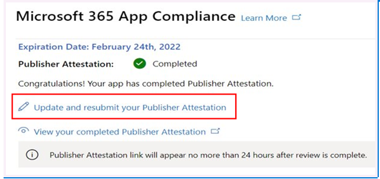

# Guida per l'utente del partner per Microsoft 365 App Compliance Program

|||
|---|---|
|Livello 1| Attestazione dell'autore|
|Livello 2| Certificazione Microsoft 365|

## 1. Panoramica
Questo documento funge da guida utente dettagliata per i nostri partner, iscritti al programma di conformità delle app Microsoft 365 con l'obiettivo di sottoporsi Publisher attestazione e certificazione tramite il portale del Centro per i partner.

## 2. Acronimi & Definizioni
| | |
|---|----|
|Acronimi | Definizione |
|PC (Centro per i partner)|Portale per tutti i partner Microsoft. Un partner accede al Centro per i partner e invia Self-Assessment questionario https://partner.microsoft.com/|
|ISV|Independent Software Vendor A.k.a. Partner o sviluppatore|
|Origine app| Catalogo di app (https://appsource.microsoft.com/)
||Esempio: agente virtuale (https://appsource.microsoft.com/en-us/product/office/WA104381816)|

## 3. Publisher flusso di lavoro di attestazione

Home Page: questa è la pagina di destinazione quando un partner accede al Centro per i partner.

**Passaggio 1:**   nella barra di spostamento a sinistra della pagina:
1. Selezionare Office store
1. Seleziona panoramica

Selezionando "Panoramica", il partner può visualizzare l'elenco delle app inviate tramite il Centro per i partner e disponibile per il programma Microsoft 365 conformità.

**Passaggio 2:** selezionare un'app dall'elenco per iniziare Publisher processo di attestazione.

Quando selezioni un'app, verrà visualizzata un'altra barra di spostamento con l'opzione "Conformità app"

**Passaggio 3:** selezionare "Conformità app"

**Passaggio 4:** compilare il Self-Assessment questionario per Publisher attestazione

**Nota:** se vuoi aggiornare/inviare di nuovo l'applicazione, fai clic sull'elenco a discesa per "Scegli il prodotto", seleziona l'app e fai clic su "clona".

 

È inoltre possibile utilizzare la funzionalità Importazione/Esportazione per completare il modulo offline e importarlo una volta completato. 

**Passaggio 5:** una volta completato, fare clic su "Invia", la valutazione sarà ora "in fase di revisione".

### Approva/Rifiuta scenari:

**A.Publisher Rifiuto attestazione**

In caso di rifiuto in questa fase, un partner può:
-   Visualizzare il rapporto errori.
    - Il partner riceverà una notifica nel Centro per i partner e tramite posta elettronica.
-   Aggiornare Self-Assessment risposte.
-   Inviare di nuovo l'autovalutazione.

**B.Publisher nuovo invio attestazione**

**Approvazione attestazione C.Publisher**

-   Al momento dell'approvazione, il partner può:
    - Aggiornare e inviare di nuovo l'attestazione
    - Visualizzare e condividere l'attestazione Publisher completata
    - Avviare il processo di certificazione M365

**Post Publisher Verifica approvazione: esempio di collegamento in AppSource per le app attestate dall'autore**

## 4. Flusso di lavoro Microsoft 365 certificazione

Una volta che il partner fa clic su "Invia" e invia tutti i documenti e le prove per la revisione: 

### Microsoft 365 Certificazione - Inviata

**Microsoft 365 - Rifiutata**

**Microsoft 365 Certificazione - Approvata**

**Approvazione post-certificazione: esempio di Microsoft 365 badge di certificazione in AppSource**

## 5. Flusso di lavoro per ISV esistenti

Se si è un ISV esistente e si desidera aggiornare Publisher attestazione.

**Passaggio 1:** fai clic sul collegamento "Aggiorna e invia di nuovo Publisher attestazione".

**Nota:** se si torna ad aggiornare/inviare di nuovo l'applicazione, fare clic sull'elenco a discesa per "Scegli il prodotto", selezionare l'app e fare clic su "Importa".

**Passaggio 2:** apportare aggiornamenti al modulo e fare clic su Salva/Invia.

Una volta inviato, sarà in fase di revisione.

## 6. Microsoft 365 Publisher flusso di lavoro di attestazione e rinnovo della certificazione:

Microsoft 365 Il programma di conformità delle app ora offre un processo di rinnovo annuale. Durante questo processo, gli sviluppatori di app possono aggiornare il questionario Publisher attestazione e i documenti necessari per la Microsoft 365 certificazione. 

**Vantaggi:**

- Mantieni il badge di certificazione in AppSource e Team Store per differenziare la tua app dagli altri. 
- Aumentare la fiducia dei clienti nell'uso dell'app certificata. 
- Aiutare gli amministratori IT a prendere decisioni informate con informazioni aggiornate sulla certificazione. 

Il nuovo processo di rinnovo è disponibile nel [Centro per i partner](https://partner.microsoft.com/en-us/dashboard/home) per offrire un'esperienza senza problemi. Un promemoria di rinnovo verrà visualizzato nel Centro per i partner a partire da 90 giorni prima della data di scadenza. I promemoria periodici verranno inviati anche tramite posta elettronica a 90, 60 e 30 giorni prima della scadenza.

**Livello 1: rinnovo Publisher attestazione:** 

Le risposte dell'Publisher'attestazione dell'app dovranno essere reinviato su base annuale. Quando l'attestazione si avvicina al contrassegno di 1 anno, verrà inviato un promemoria tramite posta elettronica che incoraggia il reinvio dell'attestazione. 

**Passaggio 1:** selezionare **Rinnova** per rinnovare l Publisher attestazione. 

**Passaggio 2:** esaminare le risposte Publisher attestazione e aggiornare con le informazioni più recenti in base alle esigenze. Inviare Publisher'attestazione per il rinnovo quando è pronto. Verrà esaminato da un analista di conformità delle app M365.

**Publisher attestazione scaduta:** Le informazioni dell'app devono essere rinnovate prima della data di scadenza per mantenere la pagina dell'attestazione Publisher'app nei documenti Microsoft. Il rinnovo in tempo reale garantirà inoltre il continuo ritardo e le icone per l'app in AppSource e Nello Store del team.

Nota: una volta scaduto, Publisher processo di rinnovo dell'attestazione può essere avviato in qualsiasi momento facendo clic su "Rinnova". 

**Livello 2: rinnovo Microsoft 365 certificazione** 

Le informazioni sulla certificazione dell'app devono essere reinvii su base annuale. Ciò richiederà la riconvalida dei controlli nell'ambito dell'ambiente corrente. Quando la certificazione si avvicina a 1 anno, verrà inviata una notifica tramite posta elettronica che incoraggia il reinvio dei documenti e delle prove. 

**Scenari di approvazione/rifiuto per il rinnovo della certificazione:**

**Scenario 1:** 

Publisher Attestazione completata. Il rinnovo della certificazione è stato avviato e in fase di revisione. 

**Scenario 1A:**

Rifiuto del rinnovo della certificazione: la certificazione può essere rifiutata se: 

 - L'app non dispone degli strumenti, dei processi o delle configurazioni necessari e non sarà in grado di implementare le modifiche necessarie all'interno della finestra di certificazione. 
 - L'app presenta vulnerabilità in sospeso e non può essere corretta all'interno della finestra di certificazione. 

    
**Scenario 1B:** 

Il rinnovo della certificazione è approvato  

**Scadenza certificazione:**

Le informazioni dell'app devono essere rinnovate prima della data di scadenza per mantenere la pagina Certificazione dell'app nei documenti Microsoft. Il rinnovo in tempo reale garantirà inoltre il continuo ritardo e le icone per l'app in AppSource e Nello Store del team. 

    
**Nota:** una volta scaduto, Publisher processo di attestazione e certificazione può essere avviato in qualsiasi momento facendo clic su "Rinnova". 

