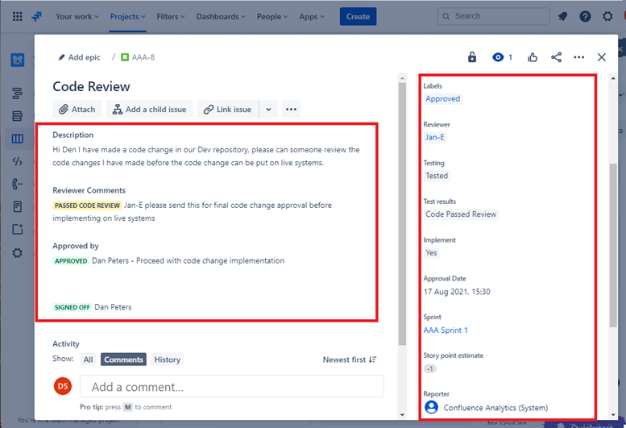
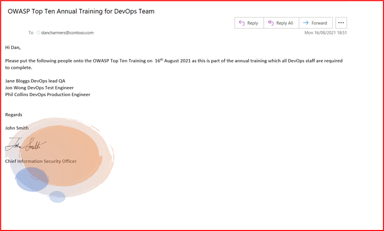
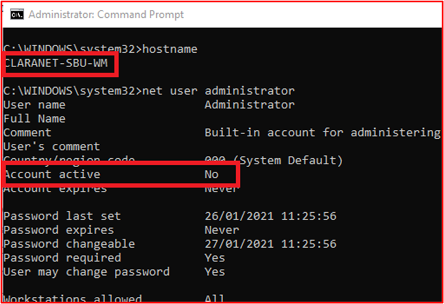
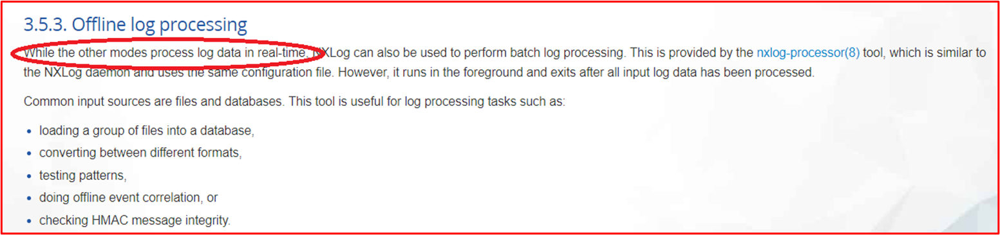
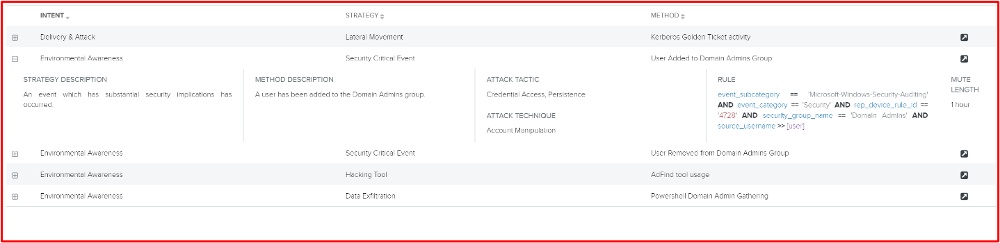
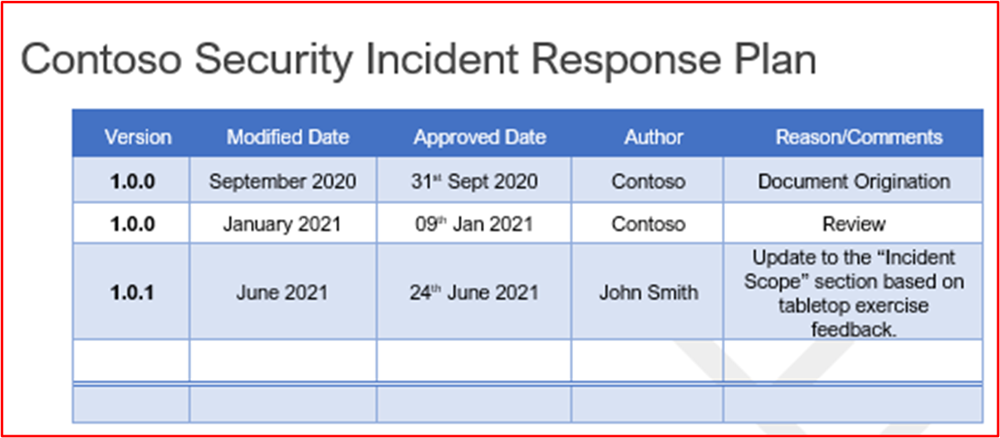
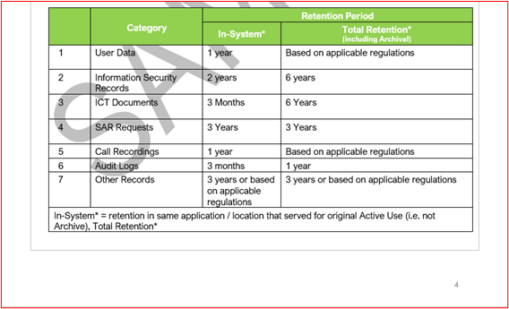
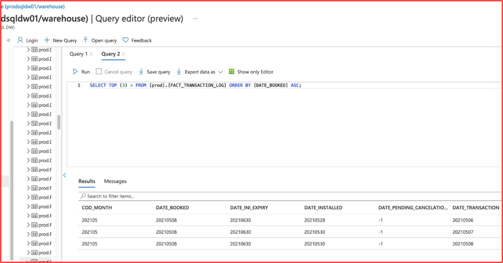

# Certificazione Microsoft 365 - Guida all'evidenza di esempio

## Panoramica

Questa guida è stata creata per fornire agli ISV esempi del tipo di evidenza e del livello di dettaglio richiesto per ognuno dei controlli di certificazione Microsoft 365. Tutti gli esempi condivisi in questo documento non rappresentano l'unica prova che può essere usata per dimostrare che i controlli vengono soddisfatti, ma agiscono solo come linee guida per il tipo di prova richiesto. 

Nota: le interfacce, gli screenshot e la documentazione effettivi usati per soddisfare i requisiti variano a seconda dell'uso del prodotto, della configurazione del sistema e dei processi interni. Si noti inoltre che quando è richiesta la documentazione di criteri o procedure, l'ISV dovrà inviare i documenti EFFETTIVI e non gli screenshot, come potrebbe essere illustrato in alcuni degli esempi. 

La certificazione include due sezioni che richiedono invii:
1. [**Invio iniziale del documento:**](../docs/initialdocumentsubguide.md) un piccolo set di documenti di alto livello necessari per definire l'ambito della valutazione.
1. **Invio di prove:** il set completo di prove necessarie per ogni controllo nell'ambito per la valutazione della certificazione. 

## Struttura 

Questo documento viene mappato direttamente ai controlli che verranno presentati durante la certificazione nel Centro per i partner. Le indicazioni fornite in questo documento sono dettagliate come segue:
- Dominio di sicurezza: i tre domini di sicurezza in cui sono raggruppati tutti i controlli: Sicurezza delle applicazioni, Sicurezza operativa e Sicurezza e privacy dei dati.
- Controlli: = Descrizione dell'attività di valutazione: questi controlli e il numero associato (No)) sono tratti direttamente dall'elenco di controllo per la certificazione Microsoft 365.  
- Finalità: = Finalità del motivo per cui il controllo di sicurezza è incluso nel programma e il rischio specifico che è destinato a mitigare.  La speranza è che queste informazioni forniscano agli ISV il ragionamento alla base del controllo per comprendere meglio i tipi di prove che devono essere raccolti e a quali ISV devono prestare attenzione e avere consapevolezza e comprensione nella produzione delle loro prove.
- Linee guida per l'evidenza di esempio: = Dato per aiutare a guidare le attività di raccolta delle prove nel foglio di calcolo dell'elenco di controllo di certificazione Microsoft 365, ciò consente agli ISV di visualizzare chiaramente esempi del tipo di prova che può essere usato dall'analista di certificazione che lo userà per stabilire con certezza che un controllo è in atto e gestito, non è affatto esaustivo.
- Esempio di evidenza: = Questa sezione fornisce screenshot e immagini di esempio di potenziali prove acquisite su ognuno dei controlli all'interno del foglio di calcolo elenco di controllo di certificazione Microsoft 365, in particolare per i domini di sicurezza operativa e sicurezza dei dati e privacy (schede all'interno del foglio di calcolo). Si prega di notare che qualsiasi informazione con frecce rosse e caselle all'interno degli esempi è per facilitare ulteriormente la comprensione dei requisiti necessari per soddisfare qualsiasi controllo.

## Dominio di sicurezza: Sicurezza delle applicazioni

**Controllo 1 - Controllo 16**:

I controlli di dominio di Application Security possono essere soddisfatti con un report di test di penetrazione emesso negli ultimi 12 mesi che mostra che l'app non presenta vulnerabilità in sospeso. L'unico invio richiesto è un report pulito da parte di una società indipendente affidabile. 

## Dominio di sicurezza: sicurezza operativa/sviluppo sicuro

Il dominio di sicurezza "Sicurezza operativa/sviluppo sicuro" è progettato per garantire che gli ISV implementino un solido set di tecniche di mitigazione della sicurezza contro una miriade di minacce affrontate dagli attori delle minacce.  Questo è progettato per proteggere l'ambiente operativo e i processi di sviluppo software per creare ambienti sicuri.

#### Protezione da malware - Antivirus

**Controllo n. 1:** Fornire la documentazione dei criteri che regola le procedure e le procedure antivirus.
- Finalità: lo scopo di questo controllo è valutare la comprensione da parte di un ISV dei problemi che devono affrontare quando si considera la minaccia da virus del computer. Definendo e usando le procedure consigliate del settore per lo sviluppo di criteri e processi antivirus, un ISV fornisce una risorsa personalizzata in base alla capacità dell'organizzazione di mitigare i rischi che il malware deve affrontare, elencando le procedure consigliate per il rilevamento e l'eliminazione dei virus e fornisce la prova che i criteri documentati forniscono indicazioni di sicurezza suggerite per l'organizzazione e i suoi dipendenti. Documentando un criterio e una procedura su come l'ISV distribuisce le decelerazione antimalware, questo garantisce l'implementazione e la manutenzione coerenti di questa tecnologia per ridurre il rischio di malware per l'ambiente.

- Linee guida per l'evidenza di esempio: fornire una copia dei criteri Antivirus/Antimalware che illustrano in dettaglio i processi e le procedure implementate all'interno dell'infrastruttura per promuovere le procedure consigliate antivirus/malware.
Prova di esempio

- Prova di esempio:

**Nota:** Questo screenshot mostra un documento di criteri/processi, l'aspettativa è che gli ISV condividano la documentazione effettiva di criteri/procedure di supporto e non forniscano semplicemente uno screenshot.

**Controllo n. 2:** Fornire prove dimostrabili che il software antivirus è in esecuzione in tutti i componenti del sistema campionati.

- Finalità: è importante che l'anti-virus (AV) (o le difese antimalware) siano in esecuzione nell'ambiente per proteggersi dai rischi di cyber security che si possono o meno essere a conoscenza di come gli attacchi potenzialmente dannosi stanno aumentando, sia in sofisticazione che in numeri. La distribuzione di AV in tutti i componenti di sistema che ne supportano l'uso consentirà di mitigare alcuni dei rischi dell'introduzione di antimalware nell'ambiente. È necessario un solo endpoint per non essere protetto per fornire potenzialmente un vettore di attacco per un attore di minaccia per ottenere un punto di appoggio nell'ambiente. Av deve quindi essere usato come uno dei diversi livelli di difesa per proteggere da questo tipo di minaccia.

- Linee guida di prova di esempio: per dimostrare che un'istanza attiva di AV è in esecuzione nell'ambiente valutato. Fornire uno screenshot per _ogni dispositivo_ nell'esempio che supporta l'uso di antivirus che mostra il processo antivirus in esecuzione, il software antivirus è attivo o se si dispone di una console di gestione centralizzata per l'antivirus, è possibile essere in grado di dimostrarlo da tale console di gestione. Se si usa la console di gestione, assicurarsi di dimostrare in uno screenshot che i dispositivi campionati sono connessi e funzionano.

- Esempio di prova 1: lo screenshot seguente è stato tratto da Centro sicurezza di Azure e mostra che è stata distribuita un'estensione Antimalware nella macchina virtuale denominata &quot;MSPGPRODAZUR01&quot;.

- Esempio di prova 2

Lo screenshot seguente è stato tratto da un Windows 10 dispositivi, che mostra che &quot;la protezione&quot; in tempo reale è attivata per il nome &quot;host CLARANET-SBU-WM&quot;.

**Controllo n. 3:** Fornire prove dimostrabili che le firme antivirus sono aggiornate in tutti gli ambienti (entro 1 giorno).

- Finalità: centinaia di migliaia di nuovi malware e applicazioni potenzialmente indesiderate (PUA) vengono identificati ogni giorno. Per fornire una protezione adeguata dal malware appena rilasciato, le firme av devono essere aggiornate regolarmente per tenere conto del malware appena rilasciato.

- Questo controllo esiste per garantire che l'ISV abbia preso in considerazione la sicurezza dell'ambiente e l'effetto che av obsoleto può avere sulla sicurezza.

- Linee guida di prova di esempio: fornire file di log antivirus da ogni dispositivo campionato, mostrando che gli aggiornamenti vengono applicati quotidianamente.

- Prova di esempio: lo screenshot seguente mostra l'aggiornamento di Microsoft Defender almeno ogni giorno mostrando &#39;evento 2000, Windows Defender&#39; che è l'aggiornamento. Viene visualizzato il nome host, che mostra che è stato preso dal sistema &quot;nell'ambito CLARANET-SBU-WM&quot;.

**Nota:** L'evidenza fornita dovrebbe includere un'esportazione dei log per visualizzare gli aggiornamenti giornalieri in un periodo di tempo maggiore. Alcuni prodotti antivirus genereranno file di log di aggiornamento in modo che questi file devono essere forniti o esportare i log da Visualizzatore eventi.

**Controllo n. 4:** Fornire prove dimostrabili che l'antivirus è configurato per eseguire analisi di accesso o analisi periodica in tutti i componenti del sistema campionati.

**Nota:** Se l'analisi all'accesso non è abilitata, almeno l'analisi giornaliera e alerting_ **DEVE** _be abilitata.

- Finalità: l'intenzione di questo controllo è garantire che il malware venga identificato rapidamente per ridurre al minimo l'effetto che questo potrebbe avere sull'ambiente. Dove l'analisi on-access viene eseguita e accoppiato con il blocco automatico del malware, questo aiuterà a fermare le infezioni da malware che sono noti dal software antivirus. Dove l'analisi in accesso non è&#39;auspicabile a causa dei rischi di falsi positivi che causano interruzioni del servizio, è necessario implementare meccanismi di analisi e avviso giornalieri appropriati per garantire una risposta tempestiva alle infezioni da malware per ridurre al minimo i danni.

- Linee guida di prova di esempio: fornire uno screenshot per _ogni dispositivo_ nell'esempio che supporta l'antivirus, che mostra che l'antivirus è in esecuzione nel dispositivo ed è configurato per l'analisi on-access (analisi in tempo reale), **oppure** fornire uno screenshot che mostra che l'analisi periodica è abilitata per l'analisi giornaliera, l'avviso è configurato e la data dell'ultima analisi per _ogni dispositivo_ nell'esempio.

- Prova di esempio: lo screenshot seguente mostra che la protezione in tempo reale è abilitata per l'host, &quot;CLARANET-SBU-WM&quot;.

**Controllo n. 5:** Fornire prove dimostrabili che l'antivirus è configurato per bloccare automaticamente malware o quarantena e avvisi in tutti i componenti di sistema campionati.

- Finalità: la raffinatezza del malware è in continua evoluzione insieme ai vari gradi di devastazione che possono portare. Lo scopo di questo controllo è quello di arrestare l'esecuzione di malware, e quindi impedire l'esecuzione del suo payload potenzialmente devastante, o se il blocco automatico non è un'opzione, limitando la quantità di tempo il malware può provocare il caos avvisando e rispondendo immediatamente alla potenziale infezione da malware.

- Linee guida di prova di esempio: fornire uno screenshot per _ogni dispositivo_ nell'esempio che supporta l'antivirus, che mostra che l'antivirus è in esecuzione nel computer ed è configurato per bloccare automaticamente malware, avvisi o quarantena e avviso.

- Prova di esempio 1: lo screenshot seguente mostra che l'host &quot;CLARANET-SBU-WM&quot; è configurato con la protezione in tempo reale attivata per Antivirus Microsoft Defender. Come dice l'impostazione, questo individua e impedisce l'installazione o l'esecuzione di malware nel dispositivo.

**Controllo n. 6:** Fornire prove dimostrabili che le applicazioni vengono approvate prima della distribuzione.

- Finalità: con il controllo dell'applicazione, l'organizzazione approverà ogni applicazione/processo che può essere eseguito nel sistema operativo. Lo scopo di questo controllo è garantire che sia in atto un processo di approvazione per autorizzare le applicazioni o i processi che possono essere eseguiti.

- Linee guida per l'evidenza di esempio: è possibile fornire prove che mostrano che il processo di approvazione viene seguito. Ciò può essere fornito tramite documenti firmati, verificando all'interno dei sistemi di controllo delle modifiche o usando qualcosa come Azure DevOps o JIRA per tenere traccia di queste richieste e autorizzazioni.

- Prova di esempio: lo screenshot seguente illustra un'approvazione da parte della gestione che ogni applicazione consentita per l'esecuzione nell'ambiente segue un processo di approvazione. Si tratta di un processo basato su carta in Contoso, tuttavia è possibile usare altri meccanismi.

**Controllo n. 7:** Fornire prove dimostrabili che esiste e viene mantenuto un elenco completo di applicazioni approvate con giustificazione aziendale.

- Finalità: è importante che le organizzazioni mantengano un elenco di tutte le applicazioni approvate, insieme alle informazioni sul motivo per cui l'applicazione/processo è stato approvato. In questo modo si garantisce che la configurazione rimanga aggiornata e che sia possibile esaminarla in base a una baseline per garantire che applicazioni/processi non autorizzati non siano configurati.

- Linee guida di prova di esempio: specificare l'elenco documentato di applicazioni/processi approvati insieme alla giustificazione aziendale.

- Prova di esempio: lo screenshot seguente elenca le applicazioni approvate con giustificazione aziendale.

**Nota:** Questo screenshot mostra un documento, l'aspettativa è che gli ISV condividano il documento di supporto effettivo e non forniscano semplicemente uno screenshot.

**Controllo n. 8:** Fornire la documentazione di supporto che illustra in dettaglio che il software di controllo dell'applicazione è configurato per soddisfare meccanismi di controllo dell'applicazione specifici.

- Finalità: la configurazione della tecnologia di controllo delle applicazioni deve essere documentata insieme a un processo di gestione della tecnologia, ad esempio aggiungere ed eliminare applicazioni/processi. Come parte di questa documentazione, il tipo di meccanismo usato deve essere dettagliato per ogni applicazione/processo. Verrà inserito nel controllo successivo per assicurarsi che la tecnologia sia configurata come documentato.

- Linee guida di prova di esempio: fornire la documentazione di supporto che descrive in dettaglio come è stato configurato il controllo dell'applicazione e come ogni applicazione/processo è stato configurato all'interno della tecnologia.

- Prova di esempio: lo screenshot seguente elenca il meccanismo di controllo usato per implementare il controllo applicazione. Di seguito è possibile vedere che 1 app usa i controlli certificato e gli altri usando il percorso del file.

**Nota:** Questo screenshot mostra un documento, l'aspettativa è che gli ISV condividano il documento di supporto effettivo e non forniscano semplicemente uno screenshot.

**Controllo n. 9:** Fornire prove dimostrabili che il controllo dell'applicazione è configurato come documentato da tutti i componenti di sistema campionati.

- Finalità: lo scopo consiste nel verificare che il controllo dell'applicazione sia configurato nell'esempio in base alla documentazione.

- Linee guida per l'evidenza di esempio: fornire uno screenshot per _ogni dispositivo_ nell'esempio per indicare che dispone di controlli applicazione configurati e attivati. Verranno visualizzati i nomi dei computer, i gruppi a cui appartengono e i criteri di controllo dell'applicazione applicati a tali gruppi e computer.

- Esempio di evidenza: lo screenshot seguente mostra un oggetto Criteri di gruppo con i criteri di restrizione software abilitati.

Questo screenshot successivo mostra la configurazione in linea con il controllo precedente.

Questo screenshot successivo mostra l'ambiente M365 e i computer inclusi nell'ambito da applicare a questo oggetto Oggetto Criteri di gruppo &#39;computer di dominio Impostazioni&#39;.

Questo screenshot finale mostra il server &quot;nell'ambito DBServer1&quot; all'interno dell'unità organizzativa all'interno dello screenshot precedente.

### Gestione delle patch - Classificazione dei rischi

La rapida identificazione e correzione delle vulnerabilità di sicurezza consente di ridurre al minimo i rischi di un attore di minacce che compromette l'ambiente o l'applicazione. La gestione delle patch è suddivisa in due sezioni: classificazione dei rischi e applicazione di patch. Questi tre controlli coprono l'identificazione delle vulnerabilità di sicurezza e le classificano in base al rischio che rappresentano.

Questo gruppo di controllo di sicurezza è nell'ambito degli ambienti di hosting PaaS (Platform-as-a-Service), poiché le librerie software e la codebase di terze parti dell'applicazione/componente aggiuntivo devono essere applicate in base alla classificazione dei rischi.

**Controllo n. 10:** Documentazione dei criteri di fornitura che regola il modo in cui vengono identificate le nuove vulnerabilità di sicurezza e viene assegnato un punteggio di rischio.

- Finalità: lo scopo di questo controllo è quello di avere documentazione di supporto per garantire che le vulnerabilità di sicurezza vengano identificate rapidamente per ridurre la finestra di opportunità che gli attori delle minacce devono sfruttare queste vulnerabilità. Deve essere in atto un solido meccanismo per identificare le vulnerabilità che coprono tutti i componenti di sistema in uso dalle organizzazioni; ad esempio sistemi operativi (Windows Server, Ubuntu e così via), applicazioni (Tomcat, MS Exchange, SolarWinds e così via), dipendenze del codice (AngularJS, jQuery e così via). Le organizzazioni devono non solo garantire l'identificazione tempestiva delle vulnerabilità all'interno del patrimonio, ma anche classificare eventuali vulnerabilità di conseguenza per garantire che la correzione venga eseguita entro un intervallo di tempo appropriato in base al rischio che la vulnerabilità presenta.

**Nota** Anche se si esegue esclusivamente un ambiente Platform as a Service, è comunque necessario identificare le vulnerabilità all'interno della base di codice, ad esempio le librerie di terze parti.

- Linee guida per l'evidenza di esempio: fornire la documentazione di supporto (non screenshot)

- Prova di esempio: questo screenshot mostra un frammento di criteri di classificazione dei rischi.

**Nota:** Questo screenshot mostra un documento di criteri/processo, l'aspettativa è che gli ISV condividano la documentazione effettiva di criteri/procedure di supporto e non forniscano semplicemente un screenshot._

**Controllo n. 11:** Fornire la prova di come vengono identificate nuove vulnerabilità di sicurezza.

- Finalità: lo scopo di questo controllo è garantire che il processo venga seguito e&#39;sufficientemente affidabile da identificare nuove vulnerabilità di sicurezza nell'ambiente. Questo potrebbe non essere solo il sistema operativo; può includere applicazioni in esecuzione all'interno dell'ambiente ed eventuali dipendenze del codice.

- Linee guida di prova di esempio: è possibile fornire prove tramite la visualizzazione delle sottoscrizioni alle mailing list, la revisione manuale delle origini di sicurezza per le vulnerabilità appena rilasciate (dovrebbe essere adeguatamente monitorata con timestamp delle attività, ad esempio con JIRA o Azure DevOps), strumenti che individuano software non aggiornato (ad esempio, potrebbe essere Snyk quando si cercano librerie software non aggiornate o potrebbe essere Nessus usando analisi autenticate che identificano  software non aggiornato).

**Nota** Se si usa Nessus, è necessario eseguirlo regolarmente per identificare rapidamente le vulnerabilità. È consigliabile almeno una settimana.

- Prova di esempio: questo screenshot dimostra che un gruppo di posta viene usato per ricevere notifiche sulle vulnerabilità di sicurezza.

**Controllo n. 12:** Fornire prove che dimostrino che a tutte le vulnerabilità viene assegnata una classificazione dei rischi una volta identificata.

- Finalità: l'applicazione di patch deve essere basata sul rischio, sul rischio più rischioso è la vulnerabilità, più rapidamente è necessario correggerla. La classificazione dei rischi delle vulnerabilità identificate è parte integrante di questo processo. Lo scopo di questo controllo è garantire che sia presente un processo di classificazione dei rischi documentato che viene seguito per garantire che tutte le vulnerabilità identificate siano classificate in modo adeguato in base al rischio. Le organizzazioni usano in genere la classificazione CVSS (Common Vulnerability Scoring System) fornita da fornitori o ricercatori di sicurezza. Se l'organizzazione si basa su CVSS, è consigliabile includere un meccanismo di riposizionamento all'interno del processo per consentire all'organizzazione di modificare la classificazione in base a una valutazione dei rischi interna. In alcuni casi, la vulnerabilità potrebbe non essere un'applicazione a causa del modo in cui l'applicazione è stata distribuita all'interno dell'ambiente. Ad esempio, è possibile rilasciare una vulnerabilità Java che influisce su una libreria specifica che non viene usata dall'organizzazione.

- Linee guida per l'evidenza di esempio: fornire prove tramite screenshot o altri mezzi, ad esempio DevOps/Jira, che dimostra che le vulnerabilità stanno attraversando il processo di classificazione dei rischi e vengono assegnate una classificazione dei rischi appropriata dall'organizzazione.

- Prova di esempio: questo screenshot mostra la classificazione dei rischi che si verifica all'interno della colonna D e la riclassifiazione nelle colonne F e G, nel caso in cui l'organizzazione esegua una valutazione dei rischi e determini che il rischio può essere declassato. L'evidenza di una rivalutazione delle valutazioni dei rischi dovrebbe essere fornita come prova a sostegno

### Gestione delle patch - Applicazione di patch

I controlli seguenti sono per l'elemento di applicazione di patch per Gestione patch. Per mantenere un ambiente operativo sicuro, è necessario applicare patch alle applicazioni/componenti aggiuntivi e ai sistemi di supporto. Un intervallo di tempo appropriato tra l'identificazione (o la versione pubblica) e l'applicazione di patch deve essere gestito per ridurre la finestra di opportunità per sfruttare una vulnerabilità da parte di un attore di minacce. La certificazione Microsoft 365 non prevede una finestra di applicazione di patch &#39;&#39;, ma gli analisti di certificazione rifiuteranno intervalli di tempo non ragionevoli.

Questo gruppo di controllo di sicurezza è nell'ambito degli ambienti di hosting PaaS (Platform-as-a-Service), poiché le librerie software e la codebase di terze parti dell'applicazione/componente aggiuntivo devono essere applicate in base alla classificazione dei rischi.

**Controllo n. 13:** Fornire la documentazione dei criteri per l'applicazione di patch ai componenti di sistema nell'ambito che include un intervallo di tempo di applicazione di patch minimo adatto per vulnerabilità critiche, ad alto e medio rischio; e la disattivazione di qualsiasi sistema operativo e software non supportato.

- Finalità: la gestione delle patch è richiesta da molti framework di conformità della sicurezza, ad esempio PCI-DSS, ISO 27001, NIST (SP) 800-53. L'importanza di una buona gestione delle patch non può essere sottolineata in quanto può correggere i problemi di sicurezza e funzionalità in software, firmware e mitigare le vulnerabilità, che aiuta a ridurre le opportunità di sfruttamento. Lo scopo di questo controllo è ridurre al minimo la finestra di opportunità che un attore di minacce deve sfruttare le vulnerabilità che possono esistere nell'ambiente nell'ambito.

- Linee guida di prova di esempio: fornire una copia di tutti i criteri e le procedure che illustrano in dettaglio il processo per la gestione delle patch. Deve includere una sezione su una finestra di applicazione di patch minima e che i sistemi operativi e il software non supportati non devono essere usati all'interno dell'ambiente.

- Prova di esempio: di seguito è riportato un documento di criteri di esempio.

**Nota:** Questo screenshot mostra un documento di criteri/processo, l'aspettativa è che gli ISV condividano la documentazione effettiva di criteri/procedure di supporto e non forniscano semplicemente un screenshot._

**Controllo n. 14:** Fornire prove dimostrabili che vengono applicate patch a tutti i componenti del sistema campionati.

**Nota:** Includere qualsiasi software/librerie di terze parti.

- Finalità: l'applicazione di patch alle vulnerabilità garantisce che i diversi moduli che fanno parte dell'infrastruttura informatica (hardware, software e servizi) siano aggiornati e privi di vulnerabilità note. L'applicazione di patch deve essere eseguita il prima possibile per ridurre al minimo il potenziale di un evento imprevisto di sicurezza tra il rilascio dei dettagli della vulnerabilità e l'applicazione di patch. Questo è ancora più critico in cui lo sfruttamento delle vulnerabilità note per essere in natura.

- Linee guida di prova di esempio: fornire uno screenshot per _ogni dispositivo_ nell'esempio e i componenti software di supporto che mostrano che le patch sono installate in linea con il processo di applicazione di patch documentato.

- Prova di esempio: lo screenshot seguente mostra che il componente &quot;di sistema nell'ambito CLARANET-SBU-WM&quot; esegue aggiornamenti Windows in linea con i criteri di applicazione di patch.

**Nota:** L'applicazione di patch a tutti i componenti del sistema nell'ambito deve essere un'evidenza. Questo include cose come; Aggiornamenti del sistema operativo, aggiornamenti di applicazioni/componenti (i.e__,_ _Apache Tomcat, OpenSSL e così via), dipendenze software (ad esempio JQuery, AngularJS e così via)._

**Controllo n. 15:** Fornire prove dimostrabili che tutti i sistemi operativi e i componenti software non supportati non vengono usati all'interno dell'ambiente.

- Finalità: il software che non viene gestito dai fornitori, straordinario, soffrirà di vulnerabilità note che non sono fisse. Pertanto, l'uso di sistemi operativi e componenti software non supportati non deve essere usato negli ambienti di produzione.

- Linee guida di prova di esempio: fornire uno screenshot per _ogni dispositivo_ nell'esempio che mostra la versione del sistema operativo in esecuzione (incluso il nome del server&#39;nello screenshot). Inoltre, fornire la prova che i componenti software in esecuzione nell'ambiente eseguono versioni supportate. Questa operazione può essere eseguita fornendo l'output dei report di analisi delle vulnerabilità interni (a condizione che sia inclusa l'analisi autenticata) e/o l'output degli strumenti che controllano le librerie di terze parti, ad esempio [Snyk](https://snyk.io/), [Trivy](https://github.com/aquasecurity/trivy) o [NPM Audit](https://docs.npmjs.com/cli/v7/commands/npm-audit). Se è in esecuzione solo in PaaS, solo l'applicazione di patch alle librerie di terze parti deve essere coperta dai gruppi di controllo di applicazione di patch.

- Prova di esempio: l'evidenza seguente mostra che il componente di sistema nell'ambito THOR esegue software supportato dal fornitore poiché Nessus non ha&#39;segnalato alcun problema.

**Nota:** Il report completo deve essere condiviso con gli analisti di certificazione.

- Prova di esempio 2

Questo screenshot mostra che il componente &quot;di sistema nell'ambito CLARANET-SBU-WM&quot; è in esecuzione in una versione di Windows supportata.

- Prova di esempio 3

Lo screenshot seguente è dell'output [di Trivy](https://github.com/aquasecurity/trivy) , che il report completo non&#39;elencare applicazioni non supportate.

**Nota:** Il report completo deve essere condiviso con gli analisti di certificazione.

### Analisi delle vulnerabilità

Grazie all'introduzione di valutazioni regolari delle vulnerabilità, le organizzazioni possono rilevare i punti di debolezza e le insicurezze all'interno degli ambienti che possono fornire un punto di ingresso per un attore dannoso per compromettere l'ambiente. L'analisi delle vulnerabilità può aiutare a identificare le patch mancanti o le configurazioni non corrette all'interno dell'ambiente. Eseguendo regolarmente queste analisi, un'organizzazione può fornire una correzione appropriata per ridurre al minimo il rischio di una compromissione a causa di problemi che vengono comunemente rilevati da questi strumenti di analisi delle vulnerabilità.

**Controllo n. 16:** Fornire i report trimestrali sull'analisi delle vulnerabilità dell'infrastruttura e dell'applicazione Web. L'analisi deve essere eseguita in base all'intero footprint pubblico (INDIRIZZI IP e URL) e agli intervalli IP interni.

**Nota:** **Deve includere** l'ambito completo dell'ambiente.

- Finalità: l'analisi delle vulnerabilità cerca i possibili punti deboli in un sistema informatico, reti e applicazioni Web delle organizzazioni per identificare i buchi che potrebbero potenzialmente causare violazioni della sicurezza e l'esposizione di dati sensibili. L'analisi delle vulnerabilità è spesso richiesta dagli standard del settore e dalle normative governative, ad esempio PCI DSS (Payment Card Industry Data Security Standard).

- Un report di Security Metric intitolato &quot;[2020 Security Metrics Guide to PCI DSS Compliance](https://info.securitymetrics.com/pci-guide-2020)&quot; indica che &#39;in media ci sono voluti 166 giorni dal momento in cui un'organizzazione ha riscontrato vulnerabilità per un utente malintenzionato per compromettere il sistema. Una volta compromesso, gli utenti malintenzionati hanno avuto accesso ai dati sensibili per una media di 127 giorni&#39; quindi questo controllo è volto a identificare potenziali vulnerabilità di sicurezza all'interno dell'ambiente di ambito.

- Linee guida di prova di esempio: fornire i report di analisi completi per ogni trimestre&#39;analisi della vulnerabilità eseguite negli ultimi 12 mesi. I report devono indicare chiaramente le destinazioni per verificare che il footprint pubblico completo sia incluso e, se applicabile, ogni subnet interna. Fornire **tutti i** report di analisi per **OGNI** trimestre.

- Prova di esempio: l'evidenza di esempio è fornire i report di analisi dallo strumento di analisi usato. Ogni trimestre&#39;report di analisi deve essere fornito per la revisione. L'analisi deve includere l'intero ambiente componenti del sistema in modo; ogni subnet interna e ogni indirizzo IP/URL pubblico disponibile per l'ambiente.

**Controllo n. 17:** Fornire prove dimostrabili che la correzione delle vulnerabilità identificate durante l'analisi delle vulnerabilità viene applicata a patch in linea con l'intervallo di tempo di applicazione delle patch documentato.

- Finalità: se non si identificano, si gestiscono e si correggono rapidamente vulnerabilità e configurazioni errate, un'organizzazione può aumentare&#39;il rischio di una compromissione che può causare potenziali violazioni dei dati. Identificare e correggere correttamente i problemi è considerato importante per un'organizzazione&#39;il comportamento di sicurezza generale e l'ambiente, in linea con le procedure consigliate di vari framework di sicurezza per; ad esempio ISO 27001 e PCI DSS.

- Linee guida per l'evidenza di esempio: fornire artefatti appropriati (ad esempio, screenshot) che mostrano che un esempio di vulnerabilità individuate dall'analisi delle vulnerabilità viene corretto in linea con le finestre di applicazione di patch già fornite nel controllo 13 precedente.

- Prova di esempio: lo screenshot seguente mostra un'analisi di Nessus dell'ambiente nell'ambito (un singolo computer in questo esempio denominato &quot;THOR&quot;) che mostra le vulnerabilità il 2 agosto 2021.

Lo screenshot seguente mostra che i problemi sono stati risolti, 2 giorni dopo, all'interno della finestra di applicazione di patch definita all'interno dei criteri di applicazione delle patch.

**Nota:** Per questo controllo, gli analisti di certificazione devono visualizzare i report di analisi delle vulnerabilità e la correzione per ogni trimestre negli ultimi dodici mesi.

### Firewall

I firewall offrono spesso un limite di sicurezza tra ambienti attendibili (rete interna), non attendibili (Internet) e semi-attendibili (DMZ). Si tratta in genere della prima linea di difesa all'interno di una strategia di sicurezza avanzata delle organizzazioni, progettata per controllare i flussi di traffico per i servizi in ingresso e in uscita e per bloccare il traffico indesiderato. Questi dispositivi devono essere strettamente controllati per garantire che funzionino in modo efficace e siano privi di errori di configurazione che potrebbero mettere a rischio l'ambiente.

**Controllo n. 18:** Fornire la documentazione dei criteri che regola le procedure e le procedure di gestione del firewall.

- Finalità: i firewall sono un'importante prima linea di difesa in una strategia di sicurezza a più livelli (difesa avanzata), che protegge gli ambienti da zone di rete meno attendibili. I firewall controllano in genere i flussi di traffico in base a indirizzi IP e protocolli/porte, altri firewall con funzionalità avanzate possono anche fornire ulteriori &quot;difese a livello&quot; di applicazione controllando il traffico delle applicazioni per proteggersi da usi impropri, vulnerabilità e minacce in base alle applicazioni a cui si accede. Queste protezioni sono valide solo come la configurazione del firewall, pertanto è necessario implementare criteri firewall e procedure di supporto sicuri per garantire che siano configurati per fornire una protezione adeguata degli asset interni. Ad esempio, un firewall con una regola per consentire tutto il traffico da QUALSIASI origine a QUALSIASI destinazione funge semplicemente da router.

- Linee guida di prova di esempio: fornire la documentazione di supporto completa per i criteri/procedure del firewall. Questo documento dovrebbe coprire tutti i punti seguenti ed eventuali procedure consigliate aggiuntive applicabili all'ambiente.

- Prova di esempio: di seguito è riportato un esempio del tipo di documento sui criteri del firewall richiesto (questa è una demo e potrebbe non essere completa).

**Controllo n. 19:** Fornire prove dimostrabili che tutte le credenziali amministrative predefinite vengono modificate prima dell'installazione in ambienti di produzione.

- Finalità: le organizzazioni devono tenere presente che il fornitore ha fornito credenziali amministrative predefinite configurate durante la configurazione del dispositivo o del software. Le credenziali predefinite sono spesso disponibili pubblicamente dai fornitori e possono offrire a un attore di minacce esterne l'opportunità di compromettere un ambiente. Ad esempio, una semplice ricerca su Internet delle credenziali iDrac predefinite (controller di accesso remoto Integrato Dell) evidenzia _root::calvin_ come nome utente e password predefiniti. In questo modo si concede a un utente l'accesso remoto alla gestione remota del server. Lo scopo di questo controllo è garantire che gli ambienti non siano soggetti ad attacchi tramite credenziali del fornitore predefinite che non sono state modificate durante la protezione avanzata del dispositivo o dell'applicazione.

- Linee guida per l'evidenza di esempio

- Ciò può essere evidenziato in una sessione di condivisione schermate in cui l'analista della certificazione può provare a eseguire l'autenticazione nei dispositivi nell'ambito usando le credenziali predefinite.

- Prova di esempio

Lo screenshot seguente mostra ciò che l'analista della certificazione vedrebbe da un nome utente/password non valido da un firewall WatchGuard.

**Controllo n. 20:** Fornire prove dimostrabili che i firewall sono installati sul limite dell'ambiente nell'ambito e installati tra la rete perimetrale (nota anche come rete perimetrale, zona demilitarizzata e subnet schermata) e le reti attendibili interne.

- Finalità: i firewall consentono di controllare il traffico tra zone di rete diverse con livelli di sicurezza diversi. Poiché tutti gli ambienti sono connessi a Internet, i firewall devono essere installati sul limite, ad esempio tra Internet e l'ambiente nell'ambito. Inoltre, i firewall devono essere installati tra le reti perimetrali meno attendibili (zona de-militarizzata) e le reti attendibili interne. Le reti perimetrali vengono in genere usate per gestire il traffico da Internet ed è quindi un obiettivo di attacco. Implementando una rete perimetrale e usando un firewall per controllare i flussi di traffico, una compromissione della rete perimetrale&#39;non comporta necessariamente una compromissione delle reti attendibili interne e dei dati aziendali/dei clienti. La registrazione e gli avvisi devono essere adeguati per consentire alle organizzazioni di identificare rapidamente un compromesso per ridurre al minimo l'opportunità per l'attore di minacce di compromettere ulteriormente le reti attendibili interne. Lo scopo di questo controllo è garantire un controllo adeguato tra reti attendibili e meno attendibili.

- Linee guida di prova di esempio: l'evidenza deve essere fornita tramite file di configurazione del firewall o screenshot che dimostrano che è presente una rete perimetrale. Questa operazione deve corrispondere ai diagrammi dell'architettura forniti che illustrano le diverse reti che supportano l'ambiente. Una schermata delle interfacce di rete nel firewall, insieme al diagramma di rete già fornito come parte dell'invio iniziale del documento, dovrebbe fornire questa prova.

- Prova di esempio: di seguito è riportato uno screenshot di un firewall WatchGuard che illustra due reti perimetrali, una per i servizi in ingresso (denominata DMZ), l'altra serve il jumpbox (host Bastian).

**Controllo n. 21:** Fornire prove dimostrabili che tutti gli accessi pubblici terminano nella zona demilitarizzata (DMZ).

- Finalità: le risorse accessibili pubblicamente sono aperte a una miriade di attacchi. Come già illustrato in precedenza, lo scopo di una rete perimetrale è segmentare le reti meno attendibili da reti interne attendibili che possono contenere dati sensibili. Una rete perimetrale è considerata meno attendibile poiché esiste un rischio molto elevato che gli host accessibili pubblicamente vengano compromessi da attori esterni alle minacce. L'accesso pubblico deve sempre terminare in queste reti meno attendibili che sono adeguatamente segmentate dal firewall per proteggere i dati e le risorse interne. Lo scopo di questo controllo è garantire che tutti gli accessi pubblici terminino all'interno di queste reti perimetrali meno attendibili come se le risorse nelle reti interne attendibili fossero pubbliche, una compromissione di queste risorse fornisce un attore di minaccia un punto d'appoggio nella rete in cui vengono conservati i dati sensibili.

- Linee guida per l'evidenza di esempio

- Le prove fornite a tale scopo potrebbero essere configurazioni del firewall che mostrano le regole in ingresso e dove terminano queste regole, instradando gli indirizzi IP pubblici alle risorse o fornendo il NAT (Network Address Translation) del traffico in ingresso.

- Prova di esempio

Nello screenshot seguente sono presenti tre regole in ingresso, ognuna delle quali mostra nat per le subnet 10.0.3.x e 10.0.4.x, che sono le subnet della rete perimetrale

**Controllo n. 22:** Fornire prove dimostrabili che tutto il traffico consentito attraverso il firewall passa attraverso un processo di approvazione.

- Finalità: poiché i firewall rappresentano una barriera difensiva tra il traffico non attendibile e le risorse interne e tra reti con livelli di attendibilità diversi, i firewall devono essere configurati in modo sicuro e assicurarsi che siano abilitati solo il traffico necessario per le operazioni aziendali. Consentendo un flusso di traffico non necessario o un flusso di traffico eccessivamente permissivo, questo può introdurre punti deboli all'interno della difesa al limite di queste diverse zone di rete. Definendo un solido processo di approvazione per tutte le modifiche del firewall, viene ridotto il rischio di introdurre una regola che introduce un rischio significativo per l'ambiente. [Verizon&#39;2020 Data Breach Investigation Report](https://enterprise.verizon.com/en-gb/resources/reports/dbir/) evidenzia che &quot;error&#39;s&quot;, che include errori di configurazione, è l'unico tipo di azione che sta costantemente aumentando anno per anno.

- Linee guida di prova di esempio: la prova può essere sotto forma di documentazione che mostra una richiesta di modifica del firewall autorizzata, che può essere a minuti da una riunione CAB (Change Advisor Board) o da un sistema di controllo delle modifiche che tiene traccia di tutte le modifiche.

- Prova di esempio: lo screenshot seguente mostra una modifica della regola del firewall richiesta e autorizzata tramite un processo basato su carta. Questo può essere ottenuto tramite qualcosa come DevOps o Jira, ad esempio.

**Controllo n. 23:** Fornire prove dimostrabili che la base di regole del firewall è configurata per eliminare il traffico non definito in modo esplicito.

- Finalità: la maggior parte dei firewall elabora le regole in un approccio dall'alto verso il basso per cercare di trovare una regola corrispondente. Se una regola corrisponde, verrà applicata l'azione di tale regola e tutte le ulteriori elaborazioni delle regole verranno arrestate. Se non vengono trovate regole corrispondenti, per impostazione predefinita il traffico viene negato. Lo scopo di questo controllo è che, se il firewall non&#39;predefinito l'eliminazione del traffico se non viene trovata alcuna regola corrispondente, la base di regole deve includere una &quot;regola Nega tutto&quot; alla fine di **TUTTI** gli elenchi di firewall. Questo per garantire che il firewall non&#39;predefinito in uno stato consenti predefinito durante l'elaborazione delle regole, consentendo così il traffico che non è stato&#39;definito in modo esplicito.

- Linee guida di prova di esempio: è possibile fornire prove tramite la configurazione del firewall o screenshot che mostrano tutte le regole del firewall che mostrano una &quot;regola Nega tutto&quot; alla fine o se il firewall elimina il traffico che non&#39;corrisponde a una regola per impostazione predefinita, quindi fornire uno screenshot di tutte le regole del firewall e un collegamento alle guide amministrative del fornitore evidenziando che per impostazione predefinita il firewall elimina tutto il traffico non corrispondente.

- Prova di esempio: di seguito è riportato uno screenshot della base di regole del firewall WatchGuard che dimostra che non sono configurate regole per consentire tutto il traffico. Non esiste una regola di negazione alla fine perché WatchGuard elimina il traffico che non&#39;corrisponde per impostazione predefinita.

Collegamento al Centro assistenza WatchGuard seguente; [https://www.watchguard.com/help/docs/help-center/en-US/Content/en-US/Fireware/policies/policies\_about\_c.html](https://www.watchguard.com/help/docs/help-center/en-US/Content/en-US/Fireware/policies/policies_about_c.html) include le informazioni seguenti:

**Controllo n. 24:** Fornire prove dimostrabili che il firewall supporta solo crittografia avanzata in tutte le interfacce amministrative non della console.

- Finalità: per attenuare gli attacchi man-in-the-middle del traffico amministrativo, tutte le interfacce amministrative non console devono supportare solo la crittografia avanzata. Lo scopo principale di questo controllo consiste nel proteggere le credenziali amministrative durante l'installazione della connessione non console. Inoltre, questo può anche aiutare a proteggere da intercettazioni nella connessione, cercando di riprodurre le funzioni amministrative per riconfigurare il dispositivo o come parte della ricognizione.

- Linee guida di prova di esempio: specificare la configurazione del firewall, se la configurazione fornisce la configurazione crittografica delle interfacce amministrative non della console (non tutti i dispositivi includeranno questa configurazione come opzioni configurabili). Se si tratta di&#39;t all'interno della configurazione, potrebbe essere possibile inviare comandi al dispositivo per visualizzare ciò che è configurato per queste connessioni. Alcuni fornitori possono pubblicare queste informazioni all'interno di articoli, quindi questo potrebbe essere anche un modo per dimostrare queste informazioni. Infine, potrebbe essere necessario eseguire gli strumenti per restituire la crittografia supportata.

- Prova di esempio: lo screenshot seguente mostra l'output di [SSLScan](https://github.com/rbsec/sslscan) sull'interfaccia di amministrazione Web del firewall WatchGuard sulla porta TCP 8080. Questo mostra TLS 1.2 o versione successiva con una crittografia di crittografia minima AES-128bit.

**Nota**: i firewall WatchGuard supportano anche funzioni amministrative tramite SSH (porta TCP 4118) e WatchGuard System Manager (porte TCP 4105 &amp; 4117). Sarebbe inoltre necessario fornire la prova di queste interfacce amministrative non console.

**Controllo n. 25:** Fornire prove dimostrabili che si eseguono revisioni delle regole del firewall almeno ogni 6 mesi.

- Finalità: nel corso del tempo, esiste il rischio di scorrimento della configurazione nei componenti di sistema con l'ambiente nell'ambito. Questo può spesso introdurre insicurezze o configurazioni errate che possono aumentare il rischio di compromissione per l'ambiente. Il creep di configurazione può essere introdotto per numerosi motivi, ad esempio modifiche temporanee per facilitare la risoluzione dei problemi, modifiche temporanee per modifiche funzionali ad hoc, per introdurre correzioni rapide a problemi che a volte possono essere eccessivamente permissivi a causa delle pressioni di introduzione di una correzione rapida. Ad esempio, è possibile introdurre una regola &quot;temporanea del firewall Consenti a tutti&quot; di risolvere un problema urgente. L'intento di questo controllo è duplice: in primo luogo, identificare i casi in cui si verificano errori di configurazione che possono introdurre insicurezze e, in secondo luogo, aiutare a identificare le regole del firewall che non sono più necessarie e pertanto possono essere rimosse, ad esempio se un servizio è stato ritirato ma la regola del firewall è stata lasciata indietro.

- Linee guida per le prove di esempio: le prove devono essere in grado di dimostrare che le riunioni di revisione si sono verificate. Questa operazione può essere eseguita condividendo i minuti della riunione della revisione del firewall e qualsiasi altra prova di controllo delle modifiche che mostra eventuali azioni eseguite dalla revisione. Verificare che le date siano presenti quando&#39;necessario visualizzare almeno due di queste riunioni (ad esempio, ogni sei mesi)

- Prova di esempio: lo screenshot seguente mostra l'evidenza di una revisione del firewall in corso nel gennaio 2021.

Lo screenshot seguente mostra le prove di una revisione del firewall che si svolge nel mese di luglio 2021.

### Firewall - WAF

È facoltativo distribuire un Web application firewall (WAF) nella soluzione. Se viene usato un WAF, verrà conteggiato come crediti aggiuntivi per la matrice di punteggio all'interno del dominio di sicurezza&#39; sicurezza &#39;sicurezza operativa. I WAF possono esaminare il traffico Web per filtrare e monitorare il traffico Web tra Internet e le applicazioni Web pubblicate per identificare gli attacchi specifici dell'applicazione Web. Le applicazioni Web possono subire molti attacchi specifici di applicazioni Web quali SQL Injection (SQLi), Cross Site Scripting (XSS), Cross Site Request Forgery (CSRF/XSRF) e così via e WAF sono progettati per proteggere da questi tipi di payload dannosi per proteggere le applicazioni Web da attacchi e potenziali compromissioni.

**Controllo n. 26:** Fornire prove dimostrabili che il Web application firewall (WAF) è configurato per monitorare, avvisare e bloccare attivamente il traffico dannoso.

- Finalità: questo controllo è disponibile per confermare che il WAF è disponibile per tutte le connessioni Web in ingresso e che è configurato per bloccare o avvisare il traffico dannoso. Per fornire un ulteriore livello di difesa per il traffico Web, i WAF devono essere configurati per tutte le connessioni Web in ingresso, in caso contrario, gli attori di minacce esterni potrebbero ignorare i WAF progettati per fornire questo livello aggiuntivo di protezione. Se il WAF non è&#39;configurato per bloccare attivamente il traffico dannoso, il WAF deve essere in grado di fornire un avviso immediato al personale che può reagire rapidamente al potenziale traffico dannoso per mantenere la sicurezza dell'ambiente e arrestare gli attacchi.

- Linee guida di prova di esempio: fornire l'output di configurazione del WAF che evidenzia le connessioni Web in ingresso servite e che la configurazione blocca attivamente il traffico dannoso o sta monitorando e avvisando. In alternativa, è possibile condividere screenshot delle impostazioni specifiche per dimostrare che un'organizzazione soddisfa questo controllo.

- Prova di esempio: gli screenshot seguenti mostrano che i criteri WAF gateway applicazione di Azure Contoso Production sono abilitati e che sono configurati per la modalità&#39; prevenzione &#39;, che elimina attivamente il traffico dannoso.

Lo screenshot seguente mostra la configurazione ip front-end

**Nota:** Le prove dovrebbero dimostrare tutti gli INDIRIZZI IP pubblici usati dall'ambiente per garantire che tutti i punti di ingresso siano coperti ed è per questo motivo che questo screenshot è incluso anche.

Lo screenshot seguente mostra le connessioni Web in ingresso che usano questo WAF.

Lo screenshot seguente mostra ContosoAppGWCoreRules\_\_ che mostra che si tratta del servizio api.contoso.com.

**Controllo n. 27:** Fornire prove dimostrabili che waf supporta l'offload SSL.

- Finalità: la possibilità di configurare il WAF per supportare l'offload SSL è importante, in caso contrario il WAF non sarà in grado di controllare il traffico HTTPS. Poiché questi ambienti devono supportare il traffico HTTPS, questa è una funzione fondamentale per waf per garantire che i payload dannosi all'interno del traffico HTTPS possano essere identificati e arrestati.

- Linee guida di prova di esempio: fornire prove di configurazione tramite un'esportazione di configurazione o screenshot che mostrano che l'offload SSL è supportato e configurato.

- Prova di esempio: all'interno di gateway applicazione di Azure, la configurazione di un listener SSL abilitato per l'offload SSL, vedere la pagina [Panoramica della terminazione TLS e di TLS end-to-end con gateway applicazione](/azure/application-gateway/ssl-overview) documentazione Microsoft. Lo screenshot seguente mostra questa configurazione per la gateway applicazione di Azure Produzione Contoso.

**Controllo n. 28:** "Fornire prove dimostrabili che il WAF è protetto da alcune o tutte le classi di vulnerabilità seguenti in base al set di regole di base OWASP (3.0 o 3.1):
- problemi di protocollo e codifica,
- inserimento di intestazione, contrabbando di richieste e divisione della risposta,
- attacchi di attraversamento di file e percorsi,
- attacchi rfi (Remote File Inclusion),
- attacchi di esecuzione di codice remoto,
- Attacchi php injection,
- attacchi di scripting tra siti,
- attacchi SQL-injection,
- attacchi di correzione della sessione.

- Finalità: i WAF devono essere configurati per identificare i payload di attacco per le classi comuni di vulnerabilità. Questo controllo intende garantire che il rilevamento adeguato delle classi di vulnerabilità sia coperto sfruttando il set di regole di base di OWASP.

- Linee guida di prova di esempio: fornire prove di configurazione tramite un'esportazione di configurazione o screenshot dimostrano che la maggior parte delle classi di vulnerabilità identificate in precedenza sono coperte dall'analisi.

- Prova di esempio: lo screenshot seguente mostra che i criteri WAF di Contoso Production gateway applicazione di Azure sono configurati per l'analisi in base al set di regole di base OWASP versione 3.2.

### Controllo delle modifiche

Un processo di controllo delle modifiche stabilito e compreso è essenziale per garantire che tutte le modifiche vengano eseguite attraverso un processo strutturato ripetibile. Assicurando che tutte le modifiche passino attraverso un processo strutturato, le organizzazioni possono garantire che le modifiche siano gestite in modo efficace, sottoposte a revisione peer e testate adeguatamente prima di essere firmate. Questo non solo consente di ridurre al minimo il rischio di interruzioni del sistema, ma consente anche di ridurre al minimo il rischio di potenziali incidenti di sicurezza attraverso modifiche non corretto introdotte.

**Controllo n. 29:** Fornire la documentazione dei criteri che regola i processi di controllo delle modifiche.

- Finalità: per mantenere un ambiente sicuro e un'applicazione sicura, è necessario stabilire un solido processo di controllo delle modifiche per garantire che tutte le modifiche all'infrastruttura e al codice vengano eseguite con una supervisione avanzata e processi definiti. In questo modo si garantisce che le modifiche siano documentate, che vengano prese in considerazione le implicazioni per la sicurezza, che si sia pensato in quale impatto sulla sicurezza avrà la modifica e così via. Lo scopo è garantire che il processo di controllo delle modifiche sia documentato per garantire che venga adottato un approccio sicuro e coerente a tutte le modifiche all'interno delle procedure di sviluppo dell'ambiente e delle applicazioni.

- Linee guida di prova di esempio: i criteri/procedure di controllo delle modifiche documentati devono essere condivisi con gli analisti di certificazione.

- Prova di esempio: di seguito viene illustrato l'inizio di un criterio di gestione delle modifiche di esempio. Fornire i criteri e le procedure completi nell'ambito della valutazione.

**Nota:** Questo screenshot mostra un documento di criteri/processi, l'aspettativa è che gli ISV condividano la documentazione effettiva di criteri/procedure di supporto e non forniscano semplicemente uno screenshot.

**Controllo n. 30:** Fornire prove dimostrabili che gli ambienti di sviluppo e test applicano la separazione dei compiti dall'ambiente di produzione.

- Finalità: la maggior parte degli ambienti di sviluppo/test dell'organizzazione&#39;non è configurata con lo stesso vigore degli ambienti di produzione e pertanto è meno sicura. Inoltre, i test non devono essere eseguiti all'interno dell'ambiente di produzione in quanto ciò può introdurre problemi di sicurezza o può essere dannoso per la distribuzione del servizio per i clienti. Mantenendo ambienti separati che impongono una separazione dei compiti, le organizzazioni possono garantire che le modifiche vengano applicate agli ambienti corretti, riducendo così il rischio di errori implementando le modifiche agli ambienti di produzione quando era destinato all'ambiente di sviluppo/test.

- Linee guida di prova di esempio: è possibile fornire screenshot che illustrano i diversi ambienti usati per ambienti di sviluppo/test e ambienti di produzione. In genere, si dispone di persone/team diversi con accesso a ogni ambiente o, in caso contrario, gli ambienti usano servizi di autorizzazione diversi per garantire che gli utenti non possano accedere erroneamente all'ambiente errato per applicare le modifiche.

- Prova di esempio: lo screenshot seguente mostra una sottoscrizione di Azure per l'ambiente TEST di Contoso&#39;.

Questo screenshot successivo mostra una sottoscrizione di Azure separata per l'ambiente&#39; &#39;PRODUCTION di Contoso&#39;.

**Controllo n. 31:** Fornire prove dimostrabili che i dati di produzione sensibili non vengono usati negli ambienti di sviluppo o di test.

- Finalità: come già illustrato in precedenza, le organizzazioni non implementeranno misure di sicurezza di un ambiente di sviluppo/test con lo stesso vigore dell'ambiente di produzione. Pertanto, utilizzando dati di produzione sensibili in questi ambienti di sviluppo/test, si aumenta il rischio di una compromissione e si deve evitare di usare dati sensibili/in tempo reale all'interno di questi ambienti di sviluppo/test.

**Nota:** È possibile usare i dati in tempo reale negli ambienti di sviluppo/test, a condizione che lo sviluppo/test sia incluso nell'ambito della valutazione in modo che la sicurezza possa essere valutata in base ai controlli di certificazione Microsoft 365.

- Linee guida per l'evidenza di esempio: è possibile fornire prove condividendo screenshot dell'output della stessa query SQL su un database di produzione (redact qualsiasi informazione sensibile) e il database di sviluppo/test. L'output degli stessi comandi deve produrre set di dati diversi. In cui vengono archiviati i file, anche la visualizzazione del contenuto delle cartelle in entrambi gli ambienti deve mostrare set di dati diversi.

- Prova di esempio: lo screenshot seguente mostra i primi 3 record (per l'invio di prove, specificare i primi 20) dal database di produzione.

Lo screenshot successivo mostra la stessa query del database di sviluppo, che mostra record diversi.

Ciò dimostra che i set di dati sono diversi.

**Controllo n. 32:** Fornire prove dimostrabili che le richieste di modifica documentate contengono l'impatto della modifica, i dettagli delle procedure di back-out e dei test da eseguire.

- Finalità: lo scopo di questo controllo è garantire che la modifica richiesta sia stata eseguita. L'impatto della modifica sulla sicurezza del sistema/ambiente deve essere considerato e chiaramente documentato, tutte le procedure di back-out devono essere documentate per facilitare il ripristino in caso di problemi e infine devono essere presi in considerazione e documentati anche i dettagli dei test necessari per convalidare il successo della modifica.

- Linee guida per l'evidenza di esempio: è possibile fornire prove esportando un campione di richieste di modifica, fornendo richieste di modifica cartacee o fornendo screenshot delle richieste di modifica che mostrano questi tre dettagli contenuti nella richiesta di modifica.

- Prova di esempio: l'immagine seguente mostra una nuova vulnerabilità cross site scripting (XSS) assegnata e un documento per la richiesta di modifica.

I ticket seguenti mostrano le informazioni impostate o aggiunte al ticket durante il percorso di risoluzione.

 

I due ticket seguenti mostrano l'impatto della modifica al sistema e le eventuali procedure di back out che potrebbero essere necessarie in caso di problema. È possibile notare che l'impatto delle modifiche e delle procedure di backup è stato sottoposto a un processo di approvazione ed è stato approvato per il test.

A sinistra dello schermo è possibile notare che il test delle modifiche è stato approvato, a destra si nota che le modifiche sono state approvate e testate.

Nel corso del processo si noti che la persona che svolge il lavoro, la persona che ne fa riferimento e la persona che approva il lavoro da svolgere sono persone diverse.

Il ticket precedente mostra che le modifiche sono state approvate per l'implementazione nell'ambiente di produzione. La casella a destra mostra che il test ha avuto esito positivo e che le modifiche sono state implementate in Ambiente prodotto.

**Controllo n. 33:** Fornire prove dimostrabili che le richieste di modifica vengono sottoposte a un processo di autorizzazione e di conclusione.

- Finalità: è necessario implementare un processo che proibisa l'esecuzione delle modifiche senza autorizzazione e disconnessione appropriate. La modifica deve essere autorizzata prima di essere implementata e la modifica deve essere firmata una volta completata. Ciò garantisce che le richieste di modifica siano state esaminate correttamente e che qualcuno nell'autorità abbia firmato la modifica.

- Linee guida per l'evidenza di esempio: è possibile fornire prove esportando un campione di richieste di modifica, fornendo richieste di modifica cartacee o fornendo screenshot delle richieste di modifica che mostrano che la modifica è stata autorizzata, prima dell'implementazione e che la modifica è stata firmata dopo il completamento.

- Prova di esempio: lo screenshot seguente mostra un ticket Jira di esempio che mostra che la modifica deve essere autorizzata prima di essere implementata e approvata da un altro utente diverso dallo sviluppatore/richiedente. È possibile visualizzare le modifiche qui approvate da un utente con autorità. A destra è stato firmato da DP al termine.

Nel ticket seguente è possibile vedere che la modifica è stata firmata al termine e mostra il processo completato e chiuso.

### Sviluppo/distribuzione di software sicuro

Le organizzazioni coinvolte nelle attività di sviluppo software si trovano spesso a dover affrontare priorità concorrenti tra la sicurezza e le pressioni TTM (Time to Market), tuttavia, l'implementazione di attività correlate alla sicurezza durante tutto il ciclo di vita dello sviluppo software (SDLC) non solo può risparmiare denaro, ma può anche risparmiare tempo. Quando la sicurezza viene lasciata come ripensamento, i problemi vengono in genere identificati solo durante la fase di test del (DSLC), che spesso può essere più dispendioso in termini di tempo e costoso da risolvere. Lo scopo di questa sezione sulla sicurezza è garantire che vengano seguite procedure di sviluppo software sicure per ridurre il rischio di errori di codifica introdotti nel software sviluppato. In questa sezione vengono inoltre inclusi alcuni controlli per facilitare la distribuzione sicura del software.

**Controllo n. 34:** Fornire criteri e procedure che supportano lo sviluppo e la distribuzione di software sicuri, incluse indicazioni sulle procedure consigliate per la codifica sicura per classi di vulnerabilità comuni, ad esempio OWASP Top 10 o SANS Top 25 CWE.

- Finalità: le organizzazioni devono fare tutto il possibile per garantire che il software sia sviluppato in modo sicuro e privo di vulnerabilità. A tale scopo, è necessario definire un solido ciclo di vita di sviluppo software sicuro (SDLC) e procedure consigliate per la codifica sicura per promuovere tecniche di codifica sicure e lo sviluppo sicuro durante l'intero processo di sviluppo software. Lo scopo è ridurre il numero e la gravità delle vulnerabilità nel software.

- Linee guida sulle prove di esempio: fornire la documentazione documentata di SDLC e/o di supporto che dimostra che è in uso un ciclo di vita di sviluppo sicuro e che sono disponibili indicazioni per tutti gli sviluppatori per promuovere la procedura consigliata per la codifica sicura. Esaminare [OWASP in SDLC](https://owasp.org/www-project-integration-standards/writeups/owasp_in_sdlc/) e il [modello di maturità OWASP Software Assurance](https://owaspsamm.org/model/) (SAMM).

- Prova di esempio: di seguito è riportato un estratto da Contoso&#39;Secure Software Development Procedure, che illustra le procedure di sviluppo e codifica sicure.

**Nota:** Questi screenshot mostrano il documento di sviluppo software sicuro, l'aspettativa è che gli ISV condividano la documentazione di supporto effettiva e non forniscano semplicemente uno screenshot.

**Controllo n. 35:** Fornire prove dimostrabili che le modifiche al codice vengono sottoposte a un processo di revisione e autorizzazione da parte di un secondo revisore.

- Finalità: lo scopo di questo controllo consiste nell'eseguire una revisione del codice da parte di un altro sviluppatore per identificare eventuali errori di scrittura del codice che potrebbero introdurre una vulnerabilità nel software. L'autorizzazione deve essere stabilita per garantire che vengano eseguite le revisioni del codice, che i test siano eseguiti e così via. prima della distribuzione. Il passaggio di autorizzazione può verificare che siano stati seguiti i processi corretti che sono alla base del SDLC definito in precedenza.

- Linee guida di prova di esempio: fornire la prova che il codice viene sottoposto a una revisione peer e deve essere autorizzato prima che possa essere applicato all'ambiente di produzione. Questa prova può essere tramite un'esportazione di biglietti di modifica, che dimostra che le revisioni del codice sono state eseguite e le modifiche autorizzate, o potrebbe essere tramite software di revisione del codice come Crucible ([https://www.atlassian.com/software/crucible](https://www.atlassian.com/software/crucible)).

- Prova di esempio

Di seguito è riportato un ticket che mostra le modifiche al codice sottoposte a un processo di revisione e autorizzazione da parte di un altro utente diverso dallo sviluppatore originale. Mostra che l'assegnatario ha richiesto una revisione del codice e verrà assegnata a un altro utente per la revisione del codice.

L'immagine seguente mostra che la revisione del codice è stata assegnata a un altro utente diverso dallo sviluppatore originale, come illustrato nella sezione evidenziata sul lato destro dell'immagine seguente. Sul lato sinistro è possibile notare che il codice è stato esaminato e ha ricevuto un &#39;PASS CODE REVIEW&#39; stato dal revisore del codice.

Il ticket deve ora ottenere l'approvazione da parte di un manager prima che le modifiche possano essere inserite nei sistemi di produzione live.

 L'immagine precedente mostra che al codice esaminato è stata concessa l'approvazione da implementare nei sistemi di produzione live.

 Dopo aver apportato le modifiche al codice, il processo finale viene firmato come illustrato nell'immagine precedente.

Si noti che durante tutto il processo sono coinvolte tre persone, lo sviluppatore originale del codice, il revisore del codice e un responsabile per dare l'approvazione e firmare. Per soddisfare i criteri per questo controllo, si prevede che i ticket seguano questo processo. Almeno tre persone coinvolte nel processo di controllo delle modifiche per le revisioni del codice.

**Controllo n. 36:** Fornire prove dimostrabili che gli sviluppatori vengono sottoposti a training di sviluppo software sicuro ogni anno.

- Finalità: esistono procedure consigliate e tecniche di codifica per tutti i linguaggi di programmazione per garantire che il codice sia sviluppato in modo sicuro. Esistono corsi di formazione esterni progettati per insegnare agli sviluppatori i diversi tipi di classi di vulnerabilità software e le tecniche di codifica che possono essere usate per interrompere l'introduzione di queste vulnerabilità nel software. L'intenzione di questo controllo è insegnare queste tecniche a tutti gli sviluppatori e garantire che queste tecniche non vengano dimenticate o che le tecniche più recenti vengano apprese eseguendo queste tecniche su base annuale.

- Linee guida sulle prove di esempio: fornire prove tramite certificati se eseguiti da una società di formazione esterna o fornendo screenshot dei diari di training o di altri artefatti che dimostrano che gli sviluppatori hanno partecipato alla formazione. Se questa formazione viene eseguita tramite risorse interne, fornire anche la prova del materiale formativo.

- Prova di esempio: di seguito è riportato il messaggio di posta elettronica che richiede che il personale del team di DevOps sia registrato nella formazione annuale di OWASP Top Ten Training

Di seguito viene illustrato che la formazione è stata richiesta con la giustificazione e l'approvazione aziendali. Questo è seguito da screenshot tratti dalla formazione e da un record di completamento che mostra che la persona ha completato la formazione annuale.

**Controllo n. 37:** Fornire prove dimostrabili che i repository di codice sono protetti con l'autenticazione a più fattori (MFA).

- Finalità: se un attore di minacce può accedere e modificare una base di codice&#39;software, potrebbe introdurre vulnerabilità, backdoor o codice dannoso nella codebase e quindi nell'applicazione. Ci sono stati diversi casi di questo già, con probabilmente il più pubblicizzato è l'attacco Ransomware NotPetya che è riferito infettato attraverso un aggiornamento compromesso al software fiscale ucraino chiamato M.E.Doc (vedere [What is NotPetya](https://www.itpro.co.uk/malware/34381/what-is-notpetya)).

- Linee guida per l'evidenza di esempio: fornire prove tramite screenshot dal repository di codice per cui **TUTTI** gli utenti hanno abilitato l'autenticazione a più fattori.

- Prova di esempio: lo screenshot seguente mostra che L'autenticazione a più fattori è abilitata per tutti gli 8 utenti di GitLab.

**Controllo n. 38:** Fornire prove dimostrabili che i controlli di accesso sono in atto per proteggere i repository di codice.

- Finalità: a partire dal controllo precedente, i controlli di accesso devono essere implementati per limitare l'accesso solo ai singoli utenti che lavorano su progetti specifici. Limitando l'accesso, si limita il rischio di modifiche non autorizzate e quindi si introducono modifiche del codice non sicure. È necessario adottare un approccio con privilegi minimi per proteggere il repository di codice.

- Linee guida di prova di esempio: fornire prove tramite screenshot dal repository di codice che l'accesso è limitato alle persone necessarie, inclusi privilegi diversi.

- Prova di esempio: lo screenshot seguente mostra i membri del &quot;progetto Customers&quot; in GitLab, ovvero il portale&quot; clienti Contoso&quot;. Come si può vedere nello screenshot, gli utenti hanno ruoli&quot; diversi &quot;per limitare l'accesso al progetto.

### Gestione account

Le procedure di gestione sicura degli account sono importanti in quanto gli account utente costituiscono la base per consentire l'accesso a sistemi informativi, ambienti di sistema e dati. Gli account utente devono essere protetti correttamente come compromissione delle credenziali dell'utente&#39;possono fornire non solo un punto di accesso all'ambiente e l'accesso ai dati sensibili, ma possono anche fornire il controllo amministrativo sull'intero ambiente o sui sistemi chiave se l'utente&#39;le credenziali hanno privilegi amministrativi.

**Controllo n. 39:** Fornire la documentazione dei criteri che regola le procedure e le procedure di gestione degli account.

- Finalità: gli account utente continuano a essere presi di mira dagli attori delle minacce e spesso sono l'origine di una compromissione dei dati. Configurando account eccessivamente permissivi, le organizzazioni non solo aumentano il pool di &#39;account&#39; privilegiati che possono essere sfruttati da un attore di minacce per eseguire una violazione dei dati, ma possono anche aumentare il rischio di sfruttamento di una vulnerabilità che richiederebbe privilegi specifici per avere esito positivo.

-  BeyondTrust genera ogni anno un &quot;report&quot; sulle vulnerabilità Microsoft che analizza le vulnerabilità di sicurezza Microsoft per l'anno precedente e descrive in dettaglio le percentuali di queste vulnerabilità che si basano sull'account utente con diritti di amministratore. In un recente post &quot; di blog [New Microsoft Vulnerabilities Report Reveals a 48% YoY Increase in Vulnerabilities &amp; How They Could Be Mitigated with Least Privilege](https://www.beyondtrust.com/blog/entry/microsoft-vulnerabilities-report)&quot;, 90% of Critical vulnerabilities in Internet Explorer, 85% of Critical vulnerabilities in Microsoft Edge and 100% of Critical vulnerabilities in Microsoft Outlook sarebbe stato attenuato rimuovendo i diritti di amministratore. Per supportare la gestione sicura degli account, le organizzazioni devono garantire che i criteri e le procedure di supporto che promuovono le procedure consigliate per la sicurezza siano in atto e seguiti per mitigare queste minacce.

- Linee guida di prova di esempio: specificare i criteri documentati e i documenti della procedura che coprono le procedure di gestione degli account. Come minimo, gli argomenti trattati devono essere allineati ai controlli all'interno della certificazione Microsoft 365.

- Prova di esempio: lo screenshot seguente mostra un esempio di criteri di gestione degli account per Contoso.

**Nota:** Questo screenshot mostra un documento di criteri/processi, l'aspettativa è che gli ISV condividano la documentazione effettiva di criteri/procedure di supporto e non forniscano semplicemente uno screenshot.

**Controllo n. 40:** Fornire prove dimostrabili che le credenziali predefinite vengono disabilitate, rimosse o modificate nei componenti di sistema campionati.

- Finalità: anche se questo sta diventando meno diffuso, ci sono ancora istanze in cui gli attori delle minacce possono sfruttare le credenziali utente predefinite e ben documentate per compromettere i componenti del sistema di produzione. Un esempio comune è l'uso di Dell iDRAC (Integrated Dell Remote Access Controller). Questo sistema può essere usato per gestire in remoto un server Dell, che può essere utilizzato da un attore di minacce per ottenere il controllo sul sistema operativo server&#39;. Le credenziali predefinite di root::calvin sono documentate e spesso possono essere sfruttate dagli attori delle minacce per ottenere l'accesso ai sistemi usati dalle organizzazioni. Lo scopo di questo controllo è garantire che queste credenziali predefinite siano disabilitate o rimosse

- Linee guida per l'evidenza di esempio: esistono vari modi in cui è possibile raccogliere le prove per supportare questo controllo. Gli screenshot degli utenti configurati in tutti i componenti di sistema possono essere utili, ad esempio gli screenshot dei file Linux /etc/shadow e /etc/passwd consentono di dimostrare se gli account sono stati disabilitati. Si noti che il file /etc/shadow sarebbe necessario per dimostrare che gli account sono realmente disabilitati osservando che l'hash della password inizia con un carattere non valido, ad esempio &#39;!&#39; che indica che la password è inutilizzabile. Il consiglio sarebbe quello di disabilitare solo alcuni caratteri della password ha e redact il resto. Altre opzioni potrebbero essere per le sessioni di screenharing in cui il valutatore è stato in grado di provare manualmente le credenziali predefinite, ad esempio nella discussione precedente su Dell iDRAC, il compilatore deve provare a eseguire l'autenticazione su tutte le interfacce Dell iDRAC usando le credenziali predefinite.

- Prova di esempio: lo screenshot seguente mostra gli account utente configurati per il componente &quot;di sistema nell'ambito CLARANET-SBU-WM&quot;. L'oggetto mostra diversi account predefiniti; Administrator, DefaultAccount e Guest, tuttavia, gli screenshot seguenti mostrano che questi account sono disabilitati.

Questo screenshot successivo mostra che l'account amministratore è disabilitato nel componente &quot;di sistema nell'ambito CLARANET-SBU-WM&quot;.

Questo screenshot successivo mostra che l'account guest è disabilitato nel componente &quot;di sistema nell'ambito CLARANET-SBU-WM&quot;.

Questo screenshot successivo mostra che DefaultAccount è disabilitato nel componente &quot;di sistema nell'ambito CLARANET-SBU-WM&quot;.

**Controllo n. 41:** Fornire prove dimostrabili che la creazione, la modifica e l'eliminazione dell'account passano attraverso un processo di approvazione stabilito.

- Finalità: l'intento è quello di avere un processo stabilito per garantire l'approvazione di tutte le attività di gestione degli account, garantendo che i privilegi dell'account mantengano i principi dei privilegi minimi e che le attività di gestione degli account possano essere esaminate e monitorate correttamente.

- Linee guida di prova di esempio: le prove in genere sono sotto forma di ticket di richiesta di modifica, richieste di gestione dei servizi IT o documenti che mostrano le richieste per gli account da creare, modificare o eliminare sono stati sottoposti a un processo di approvazione.

- Prova di esempio: le immagini seguenti mostrano la creazione dell'account per un nuovo starter del team di DevOps che deve avere l'impostazione controllo degli accessi in base alle autorizzazioni dell'ambiente di produzione senza accesso all'ambiente di sviluppo e all'accesso standard senza privilegi a tutti gli altri elementi.

La creazione dell'account è stata eseguita tramite il processo di approvazione e il processo di approvazione dopo la creazione dell'account e la chiusura del ticket.

**Controllo n. 42:** Fornire prove dimostrabili che è in atto un processo per disabilitare o eliminare gli account non usati entro 3 mesi.

- Finalità: gli account inattivi possono a volte essere compromessi perché sono mirati a attacchi di forza bruta che potrebbero non essere contrassegnati come l'utente non tenterà di accedere agli account o tramite una violazione del database delle password in cui un utente&#39;password è stata riutilizzata ed è disponibile all'interno di un dump di nome utente/password su Internet. Gli account inutilizzati devono essere disabilitati/rimossi per ridurre la superficie di attacco che un attore di minacce deve eseguire attività di compromissione dell'account. Questi conti possono essere dovuti a un processo di congedo non eseguito correttamente, a un membro del personale che sta per malattia a lungo termine o a un membro del personale in congedo di maternità/paternità. Implementando un processo trimestrale per identificare questi account, le organizzazioni possono ridurre al minimo la superficie di attacco.

- Linee guida per l'evidenza di esempio: l'evidenza deve essere doppia. In primo luogo, uno screenshot o un'esportazione di file che mostra l'ultimo &quot;accesso&quot; di tutti gli account utente all'interno dell'ambiente nell'ambito. Possono trattarsi di account locali e account all'interno di un servizio directory centralizzato, ad esempio AAD (Azure Active Directory). Ciò dimostrerà che non sono abilitati account di età superiore a 3 mesi. In secondo luogo, l'evidenza del processo di revisione trimestrale che può essere una prova documentale del completamento dell'attività all'interno dei biglietti ADO (Azure DevOps) o JIRA, o tramite documenti cartacei che devono essere firmati.

- Prova di esempio: questo primo screenshot mostra l'output dello script eseguito trimestralmente per visualizzare l'ultimo attributo di accesso per gli utenti all'interno di AAD.

Come si può vedere nello screenshot precedente, due utenti vengono visualizzati come non hanno effettuato l'accesso per qualche tempo. I due screenshot seguenti mostrano che questi due utenti sono disabilitati.

**Controllo n. 43:** Fornire prove dimostrabili che sono presenti criteri password complesse o altre mitigazioni appropriate per proteggere le credenziali utente.  Come linee guida minime, è consigliabile usare quanto segue:
- Lunghezza minima della password di 8 caratteri
- Soglia di blocco dell'account non superiore a 10 tentativi
- Cronologia password di almeno 5 password
- Imposizione dell'uso di password complesse

- Finalità: come già illustrato, le credenziali utente sono spesso oggetto di attacchi da parte degli attori delle minacce che tentano di ottenere l'accesso a un'organizzazione&#39;'ambiente. L'intento di un criterio password complesse è quello di tentare di forzare gli utenti a scegliere password complesse per attenuare le probabilità che gli attori delle minacce siano in grado di forzarle brutamente. L'intenzione di aggiungere o altre mitigazioni&quot; appropriate consiste nel riconoscere che le organizzazioni possono implementare altre misure di sicurezza per proteggere le credenziali utente in base agli sviluppi del settore, ad &quot; esempio [la pubblicazione speciale NIST 800-63B](https://pages.nist.gov/800-63-3/sp800-63b.html)&quot;.&quot;

- Linee guida per l'evidenza di esempio: l'evidenza per dimostrare un criterio password complessa può essere sotto forma di screenshot di un'organizzazione Criteri di gruppo criteri dell'account di oggetti o criteri &quot;di sicurezza locali a criteri&quot; password e &quot;criteri account con le impostazioni dei&quot; criteri di blocco dell'account. L'evidenza dipende dalle tecnologie utilizzate; Ad esempio, per Linux potrebbe essere il file di configurazione /etc/pam.d/common-password, per BitBucket la &quot;sezione Criteri&quot; di autenticazione all'interno del portale di amministrazione ([https://support.atlassian.com/security-and-access-policies/docs/manage-your-password-policy/](https://support.atlassian.com/security-and-access-policies/docs/manage-your-password-policy/)) e così via.

- Prova di esempio: l'evidenza seguente mostra i criteri password configurati all'interno dei &quot;criteri di sicurezza&quot; locali del componente &quot;di sistema nell'ambito CLARANET-SBU-WM&quot;.

Lo screenshot seguente mostra le impostazioni di blocco dell'account per un firewall WatchGuard.

Di seguito è riportato un esempio di lunghezza minima della passphrase per il firewall WatchGaurd.

**Controllo n. 44:** Fornire prove dimostrabili che gli account utente univoci vengono rilasciati a tutti gli utenti.

- Finalità: lo scopo di questo controllo è la responsabilità. Rilasciando agli utenti i propri account utente univoci, gli utenti saranno responsabili delle loro azioni, in quanto l'attività utente può essere tenuta traccia di un singolo utente.

- Linee guida di prova di esempio: l'evidenza è costituita da screenshot che mostrano gli account utente configurati nei componenti di sistema nell'ambito, che possono includere server, repository di codice, piattaforme di gestione cloud, Active Directory, firewall e così via.

- Prova di esempio: lo screenshot seguente mostra gli account utente configurati per il componente &quot;di sistema nell'ambito CLARANET-SBU-WM&quot;.

Questo screenshot successivo mostra che l'account amministratore è disabilitato nel componente &quot;di sistema nell'ambito CLARANET-SBU-WM&quot;.

Questo screenshot successivo mostra che l'account guest è disabilitato nel componente &quot;di sistema nell'ambito CLARANET-SBU-WM&quot;.

Questo screenshot successivo mostra che DefaultAccount è disabilitato nel componente &quot;di sistema nell'ambito CLARANET-SBU-WM&quot;.

**Controllo n. 45:** Fornire prove dimostrabili che i principi dei privilegi minimi vengono seguiti all'interno dell'ambiente.

- Finalità: agli utenti devono essere forniti solo i privilegi necessari per svolgere la funzione di lavoro. Ciò consente di limitare il rischio di un utente che accede intenzionalmente o involontariamente ai dati che deve&#39;o di eseguire un atto dannoso. Seguendo questo principio, riduce anche la superficie di attacco potenziale (ad esempio, gli account con privilegi) che possono essere presi di mira da un attore di minacce dannose.

- Linee guida di prova di esempio: la maggior parte delle organizzazioni userà i gruppi per assegnare privilegi in base ai team all'interno dell'organizzazione. Le prove potrebbero essere screenshot che mostrano i vari gruppi con privilegi e solo gli account utente dei team che richiedono questi privilegi. In genere, viene eseguito il backup con criteri/processi di supporto che definiscono ogni gruppo definito con i privilegi necessari e la giustificazione aziendale e una gerarchia di membri del team per convalidare l'appartenenza al gruppo è configurata correttamente.

- Ad esempio: all'interno di Azure, il gruppo Proprietari deve essere molto limitato, quindi deve essere documentato e deve avere un numero limitato di persone assegnate a tale gruppo. Un altro esempio potrebbe essere un numero limitato di personale con la possibilità di apportare modifiche al codice, un gruppo può essere configurato con questo privilegio con i membri del personale considerati come bisogno di questa autorizzazione configurata. Questa operazione deve essere documentata in modo che l'analista della certificazione possa fare riferimento incrociato al documento con i gruppi configurati e così via.

- Prova di esempio: lo screenshot seguente mostra che l'ambiente è configurato con i gruppi assegnati in base alla funzione del processo.

Lo screenshot seguente mostra che gli utenti vengono allocati ai gruppi in base alla funzione del processo.

**Controllo n. 46:** Fornire prove dimostrabili che è in atto un processo per proteggere o rafforzare gli account del servizio e che il processo viene seguito.

- Finalità: gli account del servizio vengono spesso indirizzati dagli attori delle minacce perché sono spesso configurati con privilegi elevati. Questi account potrebbero non seguire i criteri password standard perché la scadenza delle password dell'account del servizio spesso interrompe la funzionalità. Pertanto, possono essere configurati con password deboli o password riutilizzate all'interno dell'organizzazione. Un altro potenziale problema, in particolare all'interno di un ambiente Windows, può essere che il sistema operativo memorizza nella cache l'hash della password. Questo può essere un grosso problema se: l'account del servizio è configurato all'interno di un servizio directory, poiché questo account può essere usato per l'accesso tra più sistemi con il livello di privilegi configurato oppure l'account del servizio è locale, la probabilità è che lo stesso account/password venga usato in più sistemi all'interno dell'ambiente. I problemi precedenti possono portare a un attore di minaccia che ottiene l'accesso a più sistemi all'interno dell'ambiente e può portare a un'ulteriore elevazione dei privilegi e/o al movimento laterale. L'obiettivo è quindi garantire che gli account del servizio siano protetti e protetti correttamente per proteggerli dal rilevamento da parte di un attore di minacce o limitando il rischio in caso di compromissione di uno di questi account di servizio.

- Linee guida per l'evidenza di esempio: sono disponibili molte guide su Internet per migliorare la protezione avanzata degli account del servizio. Le prove possono essere sotto forma di screenshot che illustrano come l'organizzazione ha implementato la protezione avanzata dell'account. Alcuni esempi (l'aspettativa è che vengano usate più tecniche) includono:
- Limitando gli account a un set di computer all'interno di Active Directory,
- L'impostazione dell'account in modo che l'accesso interattivo non sia&#39;consentito,
- Impostazione di una password estremamente complessa,
- Per Active Directory, abilitare l'account &quot;è sensibile e non può essere delegato&quot; flag. Queste tecniche sono illustrate nell'articolo &quot;[segmentazione e active directory condivisa per un ambiente](https://pciramblings.com/2019/12/13/segmentation-and-shared-active-directory-of-a-cardholder-data-environment/)&quot; dati del titolare della carta.

- Prova di esempio: esistono diversi modi per rafforzare un account del servizio, che dipenderà da ogni singolo ambiente. I meccanismi adatti per l'ambiente in uso, che vengono usati, verranno documentati nel documento sui criteri/procedure di gestione account in precedenza, che consentirà di esaminare questa prova. Di seguito sono riportati alcuni dei meccanismi che possono essere utilizzati:

Lo screenshot seguente mostra la sensibilità dell'account &#39;e l'opzione Connetti&#39; delegato è selezionata nell'account &quot;\_del servizio Prod SQL Service Account&quot;.

Questo screenshot successivo mostra che l'account &quot;\_del servizio Prod SQL Service Account&quot; è bloccato nel SQL Server e può accedere solo a tale server.

Questo screenshot successivo mostra che l'account &quot;\_del servizio Prod SQL Service Account&quot; è autorizzato ad accedere solo come servizio.

**Controllo n. 47:** Fornire prove dimostrabili che L'autenticazione a più fattori è configurata per tutte le connessioni di accesso remoto e tutte le interfacce amministrative non console.

Termini definiti come:
- **Accesso remoto** : in genere si riferisce alle tecnologie usate per accedere all'ambiente di supporto. Ad esempio, VPN IPSec di accesso remoto, VPN SSL o Jumpbox/Host Bastian.
- **Interfacce amministrative non console** : in genere, questo si riferisce alle connessioni amministrative di rete ai componenti di sistema. Potrebbe trattarsi di Desktop remoto, SSH o un'interfaccia Web.

- Finalità: lo scopo di questo controllo è fornire mitigazioni contro la forza bruta di account e account con privilegi con accesso sicuro all'ambiente. Fornendo l'autenticazione a più fattori (MFA), una password compromessa deve comunque essere protetta da un account di accesso riuscito perché il meccanismo di autenticazione a più fattori deve ancora essere protetto. Ciò consente di garantire che tutte le azioni amministrative e di accesso vengano eseguite solo da membri del personale autorizzati e attendibili.

- Linee guida per l'evidenza di esempio: l'evidenza deve mostrare che L'autenticazione a più fattori è abilitata in tutte le tecnologie che rientrano nelle categorie precedenti. Questa operazione può essere eseguita tramite uno screenshot che mostra che L'autenticazione a più fattori è abilitata a livello di sistema. A livello di sistema, è necessario dimostrare che è abilitato per tutti gli utenti e non solo per un esempio di account con MFA abilitato. Quando la tecnologia viene supportata in una soluzione MFA, sono necessarie le prove per dimostrare che è abilitata e in uso. Ciò che si intende per questo è; in cui la tecnologia è configurata per l'autenticazione Radius, che punta a un provider MFA, è anche necessario dimostrare che il server Radius a cui punta, è una soluzione MFA e che gli account sono configurati per usarlo.

- Prova di esempio 1: gli screenshot seguenti mostrano le aree di autenticazione configurate in Pulse Secure, usate per l'accesso remoto all'ambiente. L'autenticazione è supportata dal servizio Duo SaaS per il supporto MFA.

Questo screenshot dimostra che è abilitato un server di autenticazione aggiuntivo che punta a &quot;Duo-LDAP&quot; per l'area di autenticazione &#39;Duo - Default Route&#39; authentication.

Questo screenshot finale mostra la configurazione per il server di autenticazione Duo-LDAP che dimostra che punta al servizio Duo SaaS per MFA.

Prova di esempio 2: gli screenshot seguenti mostrano che tutti gli utenti di Azure hanno abilitato l'autenticazione a più fattori.

**Nota:** Sarà necessario fornire prove per tutte le connessioni non console per dimostrare che l'autenticazione a più fattori è abilitata. Ad esempio, se si usa RDP o SSH per server o altri componenti di sistema ,ad esempio firewall.

**Controllo n. 48:** Fornire prove dimostrabili che la crittografia avanzata è configurata per tutte le connessioni di accesso remoto e tutte le interfacce amministrative non console, incluso l'accesso a qualsiasi repository di codice e interfacce di gestione cloud.

Termini definiti come:
- **Repository di codice** : la base di codice dell'app deve essere protetta da modifiche dannose che potrebbero introdurre malware nell'app. L'autenticazione a più fattori deve essere configurata nel repository di codice.
- **Interfacce di gestione** cloud: dove l'ambiente è ospitato in parte o in tutto il provider di servizi cloud (CSP), l'interfaccia amministrativa per la gestione cloud è inclusa qui.

- Finalità: l'intenzione di questo controllo è garantire che tutto il traffico amministrativo sia crittografato in modo adeguato per la protezione da attacchi man-in-the-middle.

- Linee guida di prova di esempio: è possibile fornire prove tramite screenshot che mostrano le impostazioni di crittografia per le tecnologie di accesso remoto, le interfacce RDP, SSH e Web Admin. Per le interfacce di amministrazione Web, è possibile usare lo scanner Qualys SSL Labs (se accessibile pubblicamente, ad esempio le interfacce di gestione cloud, i repository di codice SaaS o le connessioni VPN SSL).

- Prova di esempio: l'evidenza seguente mostra il livello di crittografia RDP in &quot;Webserver01&quot; configurato con un'impostazione di &#39;livello&quot; elevato. Come illustrato nel testo della Guida, viene usata la crittografia avanzata a 128 bit ,ovvero il livello più alto per Microsoft Windows RDP.

L'evidenza seguente mostra anche che la sicurezza del trasporto RDP è configurata per l'uso di TLS 1.0 in &quot;Webserver01&quot; (che è il più alto per Windows Server).

**Controllo n. 49:** Fornire prove dimostrabili dell'uso dell'autenticazione a più fattori per proteggere il portale di amministrazione usato per gestire e gestire tutti i record DNS (Public Domain Name Service).

- Finalità: se un attore di minacce dannose può ottenere l'accesso ai record DNS pubblici, esiste il rischio che sia in grado di modificare gli URL usati dall'app o in cui il file manifesto punta a introdurre codice dannoso o a indirizzare il traffico utente a un endpoint sotto il controllo degli attori. Questo potrebbe causare una perdita di dati utente o di malware/infezioni ransomware attraverso la base utente dell'app.

- Linee guida di prova di esempio: fornire prove che dimostri che i portali amministrativi DNS pubblici sono protetti da MFA. Anche se DNS pubblico è ospitato in server all'interno dell'ambiente nell'ambito (ad esempio, il controllo e gestito dall'organizzazione), potrebbe essere ancora presente un portale di amministrazione in cui è stato registrato il nome di dominio e i record DNS sono stati &#39;gestiti&#39; per puntare i server DNS alla propria infrastruttura. In questo caso, l'autenticazione a più fattori deve essere abilitata nell'interfaccia amministrativa del registrar di dominio se è possibile modificare i record DNS dei domini. È necessario fornire uno screenshot che mostra che l'interfaccia amministrativa è abilitata per l'autenticazione a più fattori a livello di sistema (ad esempio, tutti gli account con privilegi).

- Prova di esempio: lo screenshot seguente mostra l'contoso.com DNS è gestito all'interno di Microsoft Azure per Contoso Corporation.

**Nota:** Gli indirizzi IP sono indirizzi RFC privati 1918 e non sono indirizzati pubblicamente. Questo è solo a scopo dimostrativo.

Gli screenshot seguenti mostrano che tutti gli utenti di Azure hanno abilitato l'autenticazione a più fattori.

### Rilevamento e prevenzione delle intrusioni (facoltativo)

I sistemi di rilevamento e prevenzione delle intrusioni (IDPS) nel gateway possono offrire un ulteriore livello di protezione da una miriade di minacce interne e basate su Internet. Questi sistemi possono aiutare a impedire il successo di queste minacce e possono fornire funzionalità di avviso cruciali per avvisare le organizzazioni di tentativi di compromissione in tempo reale per consentire alle organizzazioni di implementare strategie difensive aggiuntive per proteggere ulteriormente l'ambiente da queste minacce attive.

**Questa sezione è per un credito aggiuntivo ed è quindi facoltativa. Non è un requisito, tuttavia, se lo si completa, la valutazione mostrerà un quadro più completo dell'ambiente e dei controlli e degli standard che hai messo in atto.**

**Controllo n. 50:** Fornire prove dimostrabili che i sistemi di rilevamento e prevenzione delle intrusioni (IDPS) vengono distribuiti nel perimetro degli ambienti nell'ambito.

- Finalità: anche se alcune fonti descrivono le minacce insider come ora superiori alle minacce da parte degli attori delle minacce esterne, le minacce interne includono anche la negligenza, con errori umani che aumentano in percentuale anno su anno. Lo scopo dell'installazione di IDPS nel perimetro degli ambienti nell'ambito è che le minacce esterne possono essere spesso rilevate tramite meccanismi IDPS a causa della natura e delle tecniche usate da questi tipi di minacce.

- Linee guida di prova di esempio: è necessario fornire una prova che dimostri che IDPS è installato nel perimetro, che può essere direttamente nel firewall se si esegue un firewall NextGen o da sensori IDPS di distribuzione configurati sulle porte del commutatore mirror per garantire che tutto il traffico venga visualizzato dai sensori distribuiti. Se vengono usati sensori IDPS, potrebbe essere necessario fornire ulteriori prove per dimostrare che i sensori sono in grado di visualizzare tutti i flussi di traffico esterni.

- Prova di esempio: lo screenshot seguente mostra che la funzionalità IDPS è abilitata nel firewall WatchGuard.

Lo screenshot aggiuntivo seguente dimostra che IDPS è abilitato in tutte le regole all'interno della configurazione di WatchGuard Firewall&#39;s.

**Controllo n. 51:** Fornire prove dimostrabili che le firme IDPS vengono mantenute aggiornate (entro 24 ore).

- Finalità: esistono più modalità di funzionamento per IDPS, la più comune è l'uso di firme per identificare il traffico di attacco. Man mano che gli attacchi si evolvono e vengono identificate vulnerabilità più recenti, è importante che le firme IDPS siano aggiornate per fornire una protezione adeguata. Lo scopo di questo controllo è quello di garantire la gestione di IDPS.

- Linee guida di prova di esempio: l'evidenza sarà probabilmente tramite uno screenshot che mostra che l'IDPS è configurato per aggiornare le firme almeno ogni giorno e che mostra l'ultimo aggiornamento.

- Prova di esempio: sebbene questo screenshot non mostri&#39;che le firme IDPS sono state aggiornate nelle ultime 24 ore, dimostra che la versione più recente è installata, ovvero una settimana fa (_Evidenza raccolta il 18__th_ _maggio_). Questo, in combinazione con lo screenshot seguente, mostra che le firme saranno aggiornate entro un periodo di 24 ore.

**Controllo n. 52:** Fornire prove dimostrabili che IDPS è configurato per supportare l'ispezione TLS di tutto il traffico Web in ingresso.

- Finalità: poiché IDPS si basa sulle firme, deve essere in grado di controllare tutti i flussi di traffico per identificare il traffico di attacco. Il traffico TLS è crittografato e pertanto IDPS non sarebbe in grado di controllare correttamente il traffico. Questo è fondamentale per il traffico HTTPS, poiché esiste una miriade di minacce comuni ai servizi Web. Lo scopo di questo controllo è garantire che i flussi di traffico crittografati possano essere controllati anche per verificare la presenza di IDPS.

- Linee guida di prova di esempio: le prove devono essere fornite tramite screenshot, a dimostrazione del fatto che anche il traffico TLS crittografato viene controllato dalla soluzione IDPS.

- Prova di esempio: questo screenshot mostra le regole HTTPS nel firewall

Questo screenshot successivo mostra che IDPS è abilitato per queste regole.

Lo screenshot seguente mostra che &quot;un'azione&quot; proxy viene applicata alla regola&#39; &#39;InboundBotTraffic\_\_, usata per attivare l'ispezione del contenuto.

Lo screenshot seguente mostra che l'ispezione del contenuto è abilitata.

**Controllo n. 53:** Fornire prove dimostrabili che IDPS è configurato per monitorare tutti i flussi di traffico in ingresso.

- Finalità: come già illustrato, è importante che tutti i flussi di traffico in ingresso vengano monitorati da IDPS per identificare qualsiasi forma di traffico di attacco.

- Linee guida di prova di esempio: è necessario fornire prove tramite screenshot per dimostrare che tutti i flussi di traffico in ingresso vengono monitorati. Può essere usando il firewall NextGen, che mostra che tutte le regole in ingresso sono abilitate per IDPS oppure tramite i sensori IDPS e dimostrando che tutto il traffico è configurato per raggiungere il sensore IDPS.

- Prova di esempio: questo screenshot mostra che IDPS è configurato in tutte le regole (criteri) di WatchGuard Firewall&#39;.

**Controllo n. 54:** Fornire prove dimostrabili che IDPS è configurato per monitorare tutti i flussi di traffico in uscita.

- Finalità: come già illustrato, è importante che tutti i flussi di traffico in uscita vengano monitorati da IDPS per identificare qualsiasi forma di traffico di attacco. Alcuni sistemi IDPS possono anche identificare potenziali violazioni interne monitorando tutto il traffico in uscita. Questa operazione può essere eseguita identificando il traffico destinato agli endpoint di &#39;comando e controllo&#39;.

- Linee guida di prova di esempio: è necessario fornire prove tramite screenshot per dimostrare che tutti i flussi di traffico in uscita vengono monitorati. È possibile usare il firewall NextGen, che mostra che tutte le regole in uscita sono abilitate per IDPS oppure tramite i sensori IDPS e dimostrando che tutto il traffico è configurato per raggiungere il sensore IDPS.

- Prova di esempio: questo screenshot mostra che IDPS è configurato in tutte le regole (criteri) di WatchGuard Firewall&#39;.

- Prova di esempio 2: Azure offre IDPS tramite app di terze parti. Nell'esempio seguente netwatcher packet capture è stato usato per acquisire pacchetti e usato insieme a Suricata, che è uno strumento IDS Open-Source.

Combinando l'acquisizione di pacchetti fornita da Network Watcher e strumenti IDS open source, ad esempio Suricata, è possibile eseguire il rilevamento delle intrusioni di rete per un'ampia gamma di minacce. L'immagine seguente mostra l'interfaccia Suricata.

Le firme vengono usate per attivare gli avvisi, che possono essere installati e aggiornati facilmente. L'immagine seguente mostra uno snapshot di alcune firme.

L'immagine seguente mostra come monitorare la configurazione idps del software di terze parti Netwatcher e Suricata usando Sentinel SIEM/SOAR.

- Prova di esempio 3: l'immagine seguente mostra come aggiungere la firma di intrusione di override o una regola di bypass per il rilevamento delle intrusioni tramite l'interfaccia della riga di comando

L'immagine seguente mostra come elencare tutte le configurazioni di rilevamento delle intrusioni tramite l'interfaccia della riga di comando

- Prova di esempio 4: Azure ha recentemente iniziato a offrire idps denominati Firewall di Azure Premium che consentiranno la configurazione di TLS, Threat Intelligence, IDPS tramite criteri, tuttavia, si noti che sarà comunque necessario usare Frontdoor o il gateway applicazione per l'offload SSL del traffico in ingresso come Firewall di Azure Premium  non supporta IDPS nelle connessioni SSL in ingresso.

Nell'esempio seguente sono state usate le impostazioni Premium predefinite per la configurazione delle regole dei criteri e l'ispezione TLS, la modalità IDPS, Threat Intelligence sono state tutte abilitate insieme alla protezione della rete virtuale.

### Registrazione eventi di sicurezza

La registrazione degli eventi di sicurezza è parte integrante di un'organizzazione&#39;programma di sicurezza s. La registrazione adeguata degli eventi di sicurezza e i processi di avviso e revisione ottimizzati consentono alle organizzazioni di identificare le violazioni o i tentativi di violazione che possono essere usati dall'organizzazione per migliorare le strategie di sicurezza difensiva e di sicurezza. Inoltre, una registrazione adeguata sarà determinante per una funzionalità di risposta agli eventi imprevisti delle organizzazioni che può alimentare altre attività, ad esempio la possibilità di identificare con precisione cosa e chi&#39;dati è stato compromesso, il periodo di compromissione, fornire report di analisi dettagliati alle agenzie governative e così via.

**Controllo n. 55:** Fornire la documentazione dei criteri per le procedure consigliate e le procedure che regolano la registrazione degli eventi di sicurezza.

- Finalità: la registrazione degli eventi di sicurezza è una funzione importante di qualsiasi organizzazione&#39;programma di sicurezza. I criteri e le procedure devono essere implementati per garantire chiarezza e coerenza per garantire che le organizzazioni implementino i controlli di registrazione in linea con le procedure consigliate dai fornitori e dal settore. Ciò consentirà di garantire l'utilizzo di log pertinenti e dettagliati che non solo sono utili per identificare eventi di sicurezza potenziali o effettivi, ma possono anche aiutare un'attività di risposta agli eventi imprevisti a identificare l'entità di una violazione della sicurezza.

- Linee guida di prova di esempio: fornire alle organizzazioni documenti documentati relativi ai criteri e alle procedure relativi alle procedure consigliate per la registrazione degli eventi di sicurezza.

- Prova di esempio: di seguito è riportato un estratto dai criteri/procedure di registrazione.

**Nota:** Questo screenshot mostra un documento di criteri/processi, l'aspettativa è che gli ISV condividano la documentazione effettiva di criteri/procedure di supporto e non forniscano semplicemente uno screenshot.

**Controllo n. 56:** Fornire prove dimostrabili che mostrano che la registrazione degli eventi di sicurezza è configurata in tutti i componenti di sistema campionati per registrare gli eventi seguenti:
- Accesso utente ai componenti di sistema e all'applicazione
- Tutte le azioni eseguite da un utente con privilegi elevati
- Tentativi di accesso logico non validi
- Creazione o modifica di account con privilegi
- Manomissione del registro eventi
- Disabilitazione degli strumenti di sicurezza, ad esempio antimalware o registrazione eventi
- Registrazione antimalware, ad esempio aggiornamenti, rilevamento di malware e errori di analisi
- Eventi IDPS e WAF, se configurati

- Finalità: per identificare le violazioni effettive e tentate, è importante che tutti i sistemi che costituiscono l'ambiente raccolgono log eventi di sicurezza adeguati. Lo scopo di questo controllo è garantire che vengano acquisiti i tipi corretti di eventi di sicurezza, che possono quindi essere inclusi nei processi di revisione e avviso per identificare e rispondere a questi eventi.

- Linee guida di prova di esempio: è necessario fornire prove tramite screenshot o impostazioni di configurazione in tutti i dispositivi campionati e in tutti i componenti di sistema rilevanti per dimostrare come viene configurata la registrazione per garantire che questi tipi di eventi di sicurezza vengano acquisiti.

- Prova di esempio 1: lo screenshot seguente mostra le impostazioni di configurazione di uno dei dispositivi campionati denominato &quot;VICTIM1-WINDOWS&quot;. Le impostazioni mostrano varie impostazioni di controllo abilitate all'interno delle impostazioni&#39; criteri di sicurezza locali &#39; Criteri locali  Criteri di controllo.

Questo screenshot successivo mostra un evento in cui un utente ha cancellato un registro eventi da uno dei dispositivi campionati denominato &quot;VICTIM1-WINDOWS&quot;.

Questo screenshot finale mostra il messaggio di log visualizzato all'interno della soluzione di registrazione centralizzata.

**Nota**: gli screenshot sono necessari in tutti i componenti del sistema campionati **E** **DEVONO** dimostrare tutti gli eventi di sicurezza descritti in precedenza.

**Controllo n. 57:** Fornire prove dimostrabili che gli eventi di sicurezza registrati contengono le informazioni minime seguenti:
- Utente
- Tipo di evento
- Data e ora
- Indicatori di esito positivo o negativo
- Etichetta che identifica il sistema interessato

- Finalità: gli eventi di sicurezza registrati devono fornire informazioni sufficienti per determinare se il traffico di attacco ha avuto esito positivo, quali informazioni sono state accessibili, a quale livello, a chi è stato responsabile, a dove ha avuto origine e così via.

- Linee guida di prova di esempio: l'evidenza deve mostrare esempi di log di tutti i componenti di sistema che mostrano questi tipi di eventi di sicurezza. I log devono includere tutte le informazioni elencate in precedenza.

- Prova di esempio: lo screenshot seguente mostra le informazioni degli eventi di sicurezza all'interno di Windows Visualizzatore eventi dal componente &quot;di sistema nell'ambito SEGSVR02&quot;.

**Nota**: gli screenshot sono necessari per tutti i componenti di sistema campionati **E DEVONO** dimostrare tutti gli eventi di sicurezza descritti nel controllo precedente. È probabile che le prove raccolte per il controllo precedente soddisfino anche questo controllo, fornendo dettagli adeguati sulle informazioni di registrazione.

**Controllo n. 58:** Fornire prove dimostrabili che tutti i componenti di sistema campionati sono sincronizzati nel tempo con gli stessi server primari e secondari.

- Finalità: un componente critico della registrazione è garantire che i log di tutti i sistemi dispongano di orologi di sistema tutti sincronizzati. Ciò è importante quando è necessaria un'indagine per tenere traccia di una violazione dei dati e/o di una compromissione. Tenere traccia degli eventi attraverso vari sistemi può diventare quasi impossibile se i log hanno vari gradi di timestamp in quanto i log importanti potrebbero non essere presenti e sarà difficile da tenere traccia.

- Linee guida di prova di esempio: idealmente, è consigliabile mantenere una topologia di sincronizzazione dell'ora che mostra come il tempo viene sincronizzato nell'intera proprietà. Le prove possono quindi essere fornite tramite screenshot delle impostazioni di sincronizzazione dell'ora tra i componenti di sistema campionati. Questo dovrebbe mostrare che la sincronizzazione di tutti i tempi è nello stesso server primario (o se sul posto secondario).

- Prova di esempio: questo diagramma mostra la topologia di sincronizzazione dell'ora in uso.

Lo screenshot successivo mostra WatchGuard configurato come server NTP e che punta a time.windows.com come&#39;'origine ora.

Questo screenshot finale mostra il componente di sistema nell'ambito, &quot;CLARANET-SBU-WM&quot; è configurato per NTP in modo che punti al server primario, ovvero watchguard firewall (10.0.1.1).

**Controllo n. 59:** Fornire prove dimostrabili quando i sistemi pubblici sono in uso che i log eventi di sicurezza vengono inviati a una soluzione di registrazione centralizzata non all'interno della rete perimetrale.

- Finalità: lo scopo di questo controllo è garantire una separazione logica o fisica tra la rete perimetrale e l'endpoint di registrazione. Poiché la rete perimetrale è pubblica, questa è esposta agli attori esterni delle minacce e quindi a un rischio maggiore rispetto ad altri componenti all'interno dell'ambiente. In caso di compromissione di un componente della rete perimetrale, è necessario mantenere l'integrità dei dati di registrazione non solo per impedire all'attore della minaccia di manomettere i log per nascondere la compromissione, ma anche per facilitare qualsiasi lavoro di indagine forense che potrebbe essere necessario. Effettuando la registrazione a sistemi esterni alla rete perimetrale, i controlli di sicurezza usati per limitare il traffico dalla rete perimetrale a questi sistemi di sicurezza dovrebbero contribuire a proteggerli da attività dannose e tentativi di manomissione.

- Linee guida di prova di esempio: l'evidenza deve essere fornita tramite screenshot o impostazioni di configurazione, che dimostrano che i log sono configurati per essere immediatamente (o vicini a immediatamente) inviati a una soluzione di registrazione centralizzata esterna alla rete perimetrale. Si sta cercando la spedizione quasi immediata dei log perché più tempo è necessario per la spedizione dei log nella soluzione di registrazione centralizzata, più tempo un attore di trattamento dovrà manomettere i log locali prima che si verifichi la spedizione.

- Prova di esempio: i sistemi della rete perimetrale Contoso usano NXLog per la spedizione dei file di log. Lo screenshot seguente mostra il servizio &#39;nxlog&#39; in esecuzione nel &quot;jumpbox DELLA RETE PERIMETRALe DESKTOP-7S65PN&quot; usato per gestire tutti i server della rete perimetrale.

Lo screenshot seguente mostra un'estrazione dal file nxlog.conf, che mostra che la destinazione è un agente di raccolta log interno all'interno della subnet dell'applicazione nella versione 10.0.1.250 usata per la spedizione a AlienVault.

L'URL seguente per NXLog ([https://nxlog.co/documentation/nxlog-user-guide/modes.html](https://nxlog.co/documentation/nxlog-user-guide/modes.html)) mostra che il log shipping è in tempo reale tramite l'estrazione seguente:

**Controllo n. 60:** Fornire prove dimostrabili per dimostrare che la soluzione di registrazione centralizzata è protetta da manomissioni non autorizzate dei dati di registrazione.

- Finalità: sebbene la separazione logica/fisica sia spesso presente tra i dispositivi di registrazione e la soluzione di registrazione centralizzata, esiste ancora il rischio che qualcuno possa provare a manomettere i log per nascondere le proprie attività. Lo scopo di questo controllo è garantire l'applicazione di meccanismi di autorizzazione adeguati per limitare il numero di utenti che possono eseguire azioni amministrative sulla soluzione di registrazione centralizzata.

- Linee guida per l'evidenza di esempio: l'evidenza è in genere costituita da screenshot che mostrano la configurazione di autorizzazione e autenticazione della soluzione di registrazione centralizzata, a dimostrazione del fatto che gli utenti sono limitati a quelli necessari per il ruolo o la funzione del processo.

- Prova di esempio: il SOC in outsourcing di Contoso usa AlienVault come strumento SIEM centralizzato. AlienVault è stato acquistato da ATT&amp; nel 2018 e ora va da USM Anywhere. La pagina Web seguente ([https://cybersecurity.att.com/documentation/usm-anywhere/deployment-guide/admin/usm-anywhere-data-security.htm](https://cybersecurity.att.com/documentation/usm-anywhere/deployment-guide/admin/usm-anywhere-data-security.htm)) illustra in che modo USM Anywhere protegge i dati da manomissioni non autorizzate. Il collegamento seguente ([https://cybersecurity.att.com/documentation/usm-appliance/raw-logs/raw-log-management.htm](https://cybersecurity.att.com/documentation/usm-appliance/raw-logs/raw-log-management.htm)) evidenzia il modo in cui il prodotto USM Anywhere garantisce anche l'integrità dei log archiviati.

**Nota:** Se il SIEM è interno, sarà necessario fornire prove per dimostrare che l'accesso ai dati di registrazione è limitato a un numero selezionato di utenti in base alle esigenze di lavoro e che la piattaforma stessa è protetta da manomissioni (la maggior parte delle soluzioni lo inserirà nella funzionalità della soluzione di registrazione).

**Controllo n. 61:** Fornire prove dimostrabili che un minimo di 30 giorni di dati di registrazione eventi di sicurezza è immediatamente disponibile, con 90 giorni di log eventi di sicurezza conservati.

- Finalità: a volte esiste una differenza di tempo tra un evento di compromissione o di sicurezza e un'organizzazione che lo identifica. Lo scopo di questo controllo è garantire che l'organizzazione abbia accesso ai dati cronologici degli eventi per facilitare la risposta agli eventi imprevisti e qualsiasi lavoro di indagine forense che potrebbe essere necessario.

- Linee guida per l'evidenza di esempio: l'evidenza viene in genere eseguita tramite la visualizzazione della soluzione di registrazione centralizzata&#39;impostazioni di configurazione che mostrano per quanto tempo vengono conservati i dati. I dati di registrazione degli eventi di sicurezza per un valore di 30 giorni devono essere immediatamente disponibili all'interno della soluzione, tuttavia, dove i dati sono archiviati, è necessario dimostrare che sono disponibili 90 giorni. Ciò può avvenire visualizzando le cartelle di archivio con le date dei dati esportati.

- Prova di esempio 1: gli screenshot seguenti mostrano che all'interno di AlienVault sono disponibili 30 giorni di log.

**Nota**: poiché si tratta di un documento pubblico, il numero di serie del firewall è stato modificato, tuttavia, non è&#39;prevedere che gli ISV supportano gli screenshot redatti, a meno che non contenga informazioni personali.

Questo screenshot successivo mostra che i log sono disponibili visualizzando un'estrazione del log che risale a 5 mesi fa.

**Nota**: poiché si tratta di un documento pubblico, gli indirizzi IP pubblici sono stati redatti, tuttavia, non è&#39;prevedere che gli ISV supportano gli screenshot redacted, a meno che non contengano informazioni personali.

- Prova di esempio 2: lo screenshot seguente mostra che gli eventi di log vengono mantenuti per 30 giorni disponibili in tempo reale e 90 giorni nell'archiviazione a freddo in Azure.

### Revisione (dati di registrazione eventi di sicurezza)

La revisione dei log di sicurezza è una funzione importante per aiutare le organizzazioni a identificare gli eventi di sicurezza che possono essere indicativi di una violazione della sicurezza o di attività di ricognizione che potrebbero essere un'indicazione di qualcosa a venire. Questa operazione può essere eseguita tramite un processo manuale su base giornaliera o tramite l'uso di una soluzione SIEM (Security Information and Event Management) che consente di analizzare i log di controllo, cercando correlazioni e anomalie che possono essere contrassegnate per un'ispezione manuale.

**Controllo n. 62:** Fornire la documentazione dei criteri che regola le procedure e le procedure di revisione dei log.

- Finalità: un report di IBM intitolato &quot;[Cost of a data breach Report 2020](https://www.ibm.com/security/digital-assets/cost-data-breach-report/#/)&quot; evidenzia che il tempo medio per identificare e contenere una violazione dei dati può richiedere 280 giorni, questo è maggiore dove la violazione è da parte di un attore di minacce dannose che viene segnalato come 315days. Con il costo medio di una violazione dei dati segnalato per essere in milioni di dollari, è fondamentale che questo ciclo di vita di violazione dei dati sia ridotto non solo per ridurre al minimo la finestra di esposizione ai dati, ma anche per ridurre l'intervallo di tempo che un attore di minacce deve esfiltrare dati dall'ambiente. Riducendo questa finestra, le organizzazioni possono ridurre il costo complessivo di una violazione dei dati.

- Implementando un solido processo di revisione e avviso, le organizzazioni sono molto meglio attrezzate per identificare le violazioni molto prima nel ciclo di vita delle violazioni dei dati per ridurne al minimo l'impatto sull'organizzazione. Inoltre, un processo avanzato può aiutare a identificare i tentativi di violazione, consentendo alle organizzazioni di rafforzare i meccanismi difensivi di sicurezza per mitigare questa minaccia aumentata per ridurre ulteriormente le probabilità di compromissione da parte della campagna di attacco.

- Linee guida di prova di esempio: fornire alle organizzazioni documenti documentati relativi ai criteri e alle procedure relativi alle procedure consigliate per la revisione dei log.

- Prova di esempio: di seguito è riportato un estratto dai criteri/procedure di revisione del log.

**Nota:** Questo screenshot mostra un documento di criteri/processi, l'aspettativa è che gli ISV condividano la documentazione effettiva di criteri/procedure di supporto e non forniscano semplicemente uno screenshot.

**Controllo n. 63:** Fornire prove dimostrabili che i log vengono esaminati quotidianamente da strumenti umani o automatizzati per identificare potenziali eventi di sicurezza.

- Finalità: lo scopo di questo controllo è garantire che vengano eseguite verifiche giornaliere dei log. Ciò è importante per identificare eventuali anomalie che potrebbero non essere rilevate dagli script/query di avviso configurati per fornire avvisi degli eventi di sicurezza.

- Linee guida per l'evidenza di esempio: le prove vengono in genere fornite da uno screenshot o da una condivisione dello schermo, a dimostrazione del fatto che sono in corso revisioni del log. Può trattarsi di moduli compilati ogni giorno o tramite un biglietto JIRA o DevOps con commenti pertinenti che vengono pubblicati per mostrare che questo viene eseguito quotidianamente. Ad esempio, un ticket JIRA settimanale può essere creato &quot;Daily Log Review W/C 26th June 2021&quot;, ogni giorno qualcuno pubblica i risultati della verifica giornaliera del log. Se le anomalie sono contrassegnate, è possibile documentare questo elemento all'interno dello stesso ticket per illustrare il controllo successivo in un'unica JIRA.

- Se vengono usati strumenti automatizzati, è possibile fornire prove dello screenshot per dimostrare l'automazione configurata e fornire prove aggiuntive per mostrare che l'automazione è in esecuzione e qualcuno sta esaminando l'output automatizzato.

- Prova di esempio: Contoso usa un provider SOC di terze parti, Claranet Cyber Security, per la correlazione dei log e le verifiche. AlienVault viene usato dal provider SOC che ha le funzionalità di fornire l'analisi automatica dei log per i log anomali e gli eventi concatenati che potrebbero evidenziare un potenziale evento di sicurezza. I tre screenshot seguenti mostrano le regole di correlazione all'interno di AlienVault.

Questo primo screenshot identifica dove è stato aggiunto un utente al gruppo&#39; &#39;Domain Admins.

Questo screenshot successivo identifica dove più tentativi di accesso non riusciti sono quindi seguiti da un accesso riuscito che può evidenziare un attacco di forza bruta riuscito.

Questo screenshot finale identifica dove si è verificata una modifica dei criteri password impostando il criterio, in modo che le password dell'account non&#39;scadere.

Questo screenshot successivo mostra che un ticket viene generato automaticamente all'interno dello strumento ServiceNow di SOC&#39;, attivando la regola precedente.

**Controllo n. 64:** Fornire prove dimostrabili che i potenziali eventi di sicurezza e anomalie vengono analizzati e corretti.

- Finalità: l'intento è quello di analizzare eventuali anomalie identificate durante il processo giornaliero di verifica dei log e di eseguire le misure correttive o le azioni appropriate. Ciò comporta in genere un processo di valutazione per identificare se le anomalie richiedono un'azione e quindi potrebbe essere necessario richiamare il processo di risposta agli eventi imprevisti.

- Linee guida per l'evidenza di esempio: l'evidenza deve essere fornita tramite screenshot che dimostra che le anomalie identificate come parte della verifica giornaliera del log vengono seguite. Come già illustrato in precedenza, può trattarsi di ticket JIRA che mostrano un'anomalia segnalata e quindi dettagliano quali attività sono state eseguite in seguito. Ciò può richiedere l'generazione di un ticket JIRA specifico per tenere traccia di tutte le attività eseguite oppure può essere semplicemente documentato all'interno del ticket di verifica del log giornaliero. Se è necessaria un'azione di risposta agli eventi imprevisti, questa operazione deve essere documentata come parte del processo di risposta agli eventi imprevisti e devono essere fornite prove per dimostrarlo.

- Prova di esempio: l'esempio di screenshot seguente mostra un avviso di sicurezza rilevato all'interno di ServiceNow dal SOC Claranet Cyber Security MDR (Managed Detection and Response).

Questo screenshot successivo mostra la conferma che l'operazione è stata risolta da David Ashton @ Contoso tramite un aggiornamento all'interno del portale dei clienti di ServiceNow.

### Avviso eventi di sicurezza

Gli eventi di sicurezza critici devono essere esaminati immediatamente per ridurre al minimo l'impatto sui dati e sull'ambiente operativo. L'invio di avvisi consente di evidenziare immediatamente potenziali violazioni della sicurezza al personale per garantire una risposta tempestiva in modo che l'organizzazione possa contenere l'evento di sicurezza il più rapidamente possibile. Garantendo un funzionamento efficace degli avvisi, le organizzazioni possono ridurre al minimo l'impatto di una violazione della sicurezza, riducendo così la possibilità di una grave violazione che potrebbe danneggiare il marchio delle organizzazioni e imporre perdite finanziarie attraverso multe e danni alla reputazione.

**Controllo n. 65:** Fornire la documentazione dei criteri che regola le procedure e le procedure di avviso degli eventi di sicurezza.

- Finalità: l'avviso deve essere usato per gli eventi di sicurezza chiave che richiedono una risposta immediata da parte di un'organizzazione in quanto esiste il potenziale che l'evento sia indicativo di una violazione dell'ambiente e/o di una violazione dei dati. È consigliabile documentare un processo sicuro intorno al processo di avviso per garantire che venga eseguito in modo coerente e ripetibile. Ciò consentirà di ridurre la sequenza temporale del ciclo di vita&quot; delle &quot;violazioni dei dati.

- Linee guida per l'evidenza di esempio: fornire alle organizzazioni documenti documentati relativi ai criteri e alle procedure relativi alle procedure consigliate per l'avviso degli eventi di sicurezza.

- Prova di esempio: di seguito è riportato un estratto dai criteri/routine di avviso degli eventi di sicurezza. Fornire i documenti completi relativi a criteri e procedure per supportare la valutazione.

**Nota:** Questo screenshot mostra un documento di criteri/processi, l'aspettativa è che gli ISV condividano la documentazione effettiva di criteri/procedure di supporto e non forniscano semplicemente uno screenshot.

**Controllo n. 66:** Fornire prove dimostrabili che vengono attivati avvisi per valutare immediatamente i tipi di eventi di sicurezza seguenti:
- Creazione o modifica di account con privilegi
- Eventi di virus o malware
- Manomissione del registro eventi
- Eventi IDPS o WAF, se configurati

- Finalità: sopra è riportato un elenco di alcuni tipi di eventi di sicurezza che potrebbero evidenziare che si è verificato un evento di sicurezza che può puntare a una violazione dell'ambiente e/o a una violazione dei dati.

- Linee guida di prova di esempio: l'evidenza deve essere fornita tramite screenshot della configurazione degli avvisi **E** dell'evidenza degli avvisi ricevuti. Gli screenshot di configurazione devono mostrare la logica che attiva gli avvisi e il modo in cui vengono inviati gli avvisi. Gli avvisi possono essere inviati tramite SMS, posta elettronica, canali Teams, canali Slack e così via...

- Prova di esempio: Contoso usa un SOC di terze parti fornito da [Claranet Cyber Security](https://www.claranet.co.uk/services/cybersecurity/managed-detection-and-response). L'esempio seguente mostra che l'avviso all'interno di AlienVault, utilizzato dal SOC, è configurato per inviare un avviso a un membro del team SOC, Dan Turner presso Claranet Cyber Security.

Questo screenshot successivo mostra un avviso ricevuto da Dan.

**Controllo n. 67:** Fornire prove dimostrabili che dimostrano che il personale è sempre disponibile, tutto il giorno, per rispondere agli avvisi di sicurezza.

- Finalità: è importante che gli avvisi di sicurezza vengano triaged il prima possibile per limitare l'esposizione all'ambiente e/o ai dati. Il personale deve essere sempre a disposizione per rispondere agli avvisi e fornire un lavoro investigativo critico se viene identificata una violazione. Più rapidamente viene avviato questo processo, più rapidamente l'evento imprevisto di sicurezza può essere contenuto per proteggere i dati o limitare l'impatto della violazione.

- Linee guida di prova di esempio: è necessario fornire prove che dimostri che i membri del personale sono disponibili 24 ore al giorno per rispondere agli avvisi di sicurezza. Questo può essere tramite una rotazione su chiamata.

- Prova di esempio: lo screenshot seguente mostra una rotazione su chiamata per dicembre 2020 per Contoso. Il team soc di Claranet Cyber Security avvisa i membri del team di chiamata di Contoso.

### Gestione dei rischi per la sicurezza delle informazioni

Information Security Risk Management è un'attività importante che tutte le organizzazioni devono svolgere almeno ogni anno. Le organizzazioni devono comprendere le minacce e i rischi per mitigare efficacemente queste minacce. Senza una gestione efficace dei rischi, le organizzazioni possono implementare procedure consigliate per la sicurezza in aree che ritengono importanti e quindi investire risorse, tempo e denaro in queste aree, quando altre minacce sono molto più probabili e pertanto devono essere mitigate. Una gestione efficace dei rischi aiuterà le organizzazioni a concentrarsi sui rischi che rappresentano la minaccia più grave per l'azienda. Questa operazione dovrebbe essere eseguita ogni anno in quanto il panorama della sicurezza è in continua evoluzione e pertanto le minacce e i rischi possono cambiare il lavoro straordinario. Un buon esempio di questo può essere visto con COVID-19 che ha visto un aumento massiccio degli attacchi di phishing e l'implementazione di massa (e veloce) di lavoro remoto per centinaia o migliaia di lavoratori.

**Controllo n. 68:** Fornire prove dimostrabili dell'esistenza di un processo formale di gestione dei rischi per la sicurezza delle informazioni.

- Finalità: come illustrato in precedenza, un solido processo di gestione dei rischi per la sicurezza delle informazioni è importante per aiutare le organizzazioni a gestire i rischi in modo efficace. In questo modo le organizzazioni potranno pianificare mitigazioni efficaci contro le minacce per l'ambiente.

**È importante che la valutazione dei rischi includa i rischi per la sicurezza delle informazioni e non solo i rischi aziendali&quot; generali&quot;.**

- Linee guida di prova di esempio: è necessario fornire il processo di gestione della valutazione dei rischi formalmente documentato.

- Prova di esempio: l'evidenza seguente è uno screenshot di parte del processo di valutazione del rischio di Contoso&#39;.

**Nota:** Questo screenshot mostra un documento di criteri/processi, l'aspettativa è che gli ISV condividano la documentazione effettiva di criteri/procedure di supporto e non forniscano semplicemente uno screenshot.

**Controllo n. 69:** Fornire prove dimostrabili che una valutazione formale dei rischi viene eseguita ogni anno, almeno.

- Finalità: le minacce alla sicurezza cambiano costantemente in base alle modifiche all'ambiente, alle modifiche ai servizi offerti, alle influenze esterne, all'evoluzione del panorama delle minacce per la sicurezza e così via. Le organizzazioni devono eseguire questo processo almeno ogni anno. È consigliabile che questo processo venga eseguito anche in caso di modifiche significative, in quanto le minacce possono cambiare.

- Linee guida di prova di esempio: l'evidenza può essere tramite il rilevamento della versione o l'evidenza datata. È necessario fornire prove che mostrino l'output della valutazione dei rischi per la sicurezza delle informazioni e **NON** le date del processo di valutazione dei rischi di sicurezza delle informazioni stesso.

- Prova di esempio: questo screenshot mostra una riunione di valutazione dei rischi pianificata per ogni sei mesi.

Questi due screenshot mostrano i minuti della riunione di due riunioni di valutazione dei rischi.

**Controllo n. 70:** Fornire prove dimostrabili che la valutazione dei rischi per la sicurezza delle informazioni include minacce, vulnerabilità o equivalenti.

- Finalità: le valutazioni dei rischi per la sicurezza delle informazioni devono essere eseguite contro le minacce all'ambiente e ai dati e contro le possibili vulnerabilità che possono essere presenti. Ciò consentirà alle organizzazioni di identificare la miriade di minacce/vulnerabilità che possono rappresentare un rischio significativo.

- Linee guida di prova di esempio: le prove devono essere fornite non solo tramite il processo di valutazione dei rischi di sicurezza delle informazioni già fornito, ma anche l'output della valutazione dei rischi (tramite un registro dei rischi/un piano di trattamento dei rischi) che dovrebbe includere rischi e vulnerabilità.

- Prova di esempio: lo screenshot seguente mostra il registro dei rischi che illustra le minacce e le vulnerabilità incluse.

**Nota:** È necessario fornire la documentazione completa sulla valutazione dei rischi anziché uno screenshot.

**Controllo n. 71:** Fornire prove dimostrabili che la valutazione del rischio di sicurezza delle informazioni include l'impatto, la matrice di rischio di probabilità o l'equivalente.

- Finalità: le valutazioni dei rischi per la sicurezza delle informazioni devono documentare le valutazioni di impatto e probabilità. Queste matrici verranno in genere usate per identificare un valore di rischio che può essere usato dall'organizzazione per assegnare priorità al trattamento dei rischi per contribuire a ridurre il valore di rischio.

- Linee guida di prova di esempio: le prove devono essere fornite non solo tramite il processo di valutazione dei rischi di sicurezza delle informazioni già fornito, ma anche l'output della valutazione dei rischi (tramite un registro dei rischi/piano di trattamento dei rischi) che dovrebbe includere valutazioni di impatto e probabilità.

- Prova di esempio: lo screenshot seguente mostra il registro dei rischi che mostra l'impatto e le probabilità incluse.

**Nota:** È consigliabile specificare il assessment_ _document__ation di rischio completo anziché uno screenshot.

**Controllo n. 72:** Fornire prove dimostrabili che la valutazione dei rischi per la sicurezza delle informazioni include un registro dei rischi e un piano di trattamento.

- Finalità: le organizzazioni devono gestire i rischi in modo efficace. Questo deve essere monitorato correttamente per fornire un record di uno dei quattro trattamenti a rischio applicati. I trattamenti di rischio sono:

- **Evitare/terminare** : l'azienda può determinare che il costo di gestione del rischio è superiore ai ricavi generati dal servizio. L'azienda può quindi scegliere di interrompere l'esecuzione del servizio.
- **Trasferimento/condivisione** : l'azienda può scegliere di trasferire il rischio a terze parti spostando l'elaborazione a terze parti.
- **Accettare/tollerare/conservare** : l'azienda può decidere che il rischio è accettabile. Questo dipende molto dalla propensione al rischio delle aziende e può variare a seconda dell'organizzazione.
- **Treat/Mitigate/Modify** : l'azienda decide di implementare controlli di mitigazione per ridurre il rischio a un livello accettabile.

- Lo scopo di questo controllo è ottenere la garanzia che l'organizzazione stia eseguendo la valutazione dei rischi e agendo di conseguenza.

- Linee guida di prova di esempio: è necessario fornire il piano di trattamento dei rischi o il registro dei rischi (o qualcosa di equivalente) per dimostrare che il processo di valutazione dei rischi viene eseguito correttamente.

- Prova di esempio: di seguito è riportato un registro dei rischi per Contoso.

**Nota:** È necessario fornire la documentazione completa sulla valutazione dei rischi anziché uno screenshot.

Lo screenshot seguente illustra un piano di trattamento dei rischi.

### Risposta agli eventi imprevisti di sicurezza

Una risposta agli eventi imprevisti per la sicurezza è importante per tutte le organizzazioni perché ciò può ridurre il tempo impiegato da un'organizzazione per contenere un evento imprevisto di sicurezza e limitare il livello di esposizione delle organizzazioni all'esfiltrazione dei dati. Sviluppando un piano di risposta agli eventi imprevisti completo e dettagliato, questa esposizione può essere notevolmente ridotta dal momento dell'identificazione al momento del contenimento.

Un rapporto di IBM intitolato &quot;[Cost of a data breach Report 2020](https://www.ibm.com/security/digital-assets/cost-data-breach-report/#/)&quot; evidenzia che, in media, il tempo impiegato per contenere una violazione era di 73 giorni. Inoltre, lo stesso report identifica il maggiore risparmio sui costi per le organizzazioni che hanno subito una violazione, è stata la preparazione alla risposta agli eventi imprevisti, fornendo un risparmio medio di 2.000.000 dollari sui costi.

Le organizzazioni devono seguire le procedure consigliate per la conformità alla sicurezza usando framework standard del settore, ad esempio ISO 27001, NIST, SOC 2, PCI DSS e così via.

**Controllo n. 73:** Specificare il piano di risposta agli eventi imprevisti (IRP) di sicurezza.

- Finalità: come già illustrato, lo scopo di questo controllo è richiedere un piano di risposta agli eventi imprevisti formalmente documentato. Ciò consentirà di gestire in modo più efficiente una risposta agli eventi imprevisti di sicurezza che può limitare l'esposizione alla perdita di dati delle organizzazioni e ridurre i costi della compromissione.

- Linee guida di prova di esempio: specificare la versione completa del piano o della procedura di risposta agli eventi imprevisti. Questo dovrebbe includere un processo di comunicazione documentato che viene trattato nel controllo successivo.

- Prova di esempio: lo screenshot seguente mostra l'inizio del piano di risposta agli eventi imprevisti di Contoso&#39;. Come parte dell'invio di prove, è necessario fornire l'intero piano di risposta agli eventi imprevisti.

**Nota:** Questo screenshot mostra un documento di criteri/processi, l'aspettativa è che gli ISV condividano la documentazione effettiva di criteri/procedure di supporto e non forniscano semplicemente uno screenshot.

**Controllo n. 74:** Fornire prove dimostrabili che l'IRP di sicurezza include un processo di comunicazione documentato per garantire una notifica tempestiva alle principali parti interessate, ad esempio marchi di pagamento e acquirenti, organismi di regolamentazione, autorità di vigilanza, amministratori e clienti.

- Finalità: le organizzazioni possono avere obblighi di notifica delle violazioni in base al paese o ai paesi in cui operano (ad esempio, il regolamento generale sulla protezione dei dati; GDPR) o in base alla funzionalità offerta (ad esempio, PCI DSS se vengono gestiti i dati di pagamento). La mancata notifica tempestiva può comportare gravi conseguenze, pertanto, per garantire il rispetto degli obblighi di notifica, i piani di risposta agli eventi imprevisti dovrebbero includere un processo di comunicazione che includa la comunicazione con tutti gli stakeholder, i processi di comunicazione dei media e chi può e non può parlare con i media.

- Linee guida per l'evidenza di esempio: specificare la versione completa del piano o della procedura di risposta agli eventi imprevisti che deve includere una sezione relativa al processo di comunicazione.

- Prova di esempio: lo screenshot seguente mostra un'estrazione dal piano di risposta agli eventi imprevisti che mostra il processo di comunicazione.

**Controllo n. 75:** Fornire prove dimostrabili che tutti i membri del team di risposta agli eventi imprevisti hanno completato la formazione annuale o un esercizio di tabella superiore.

- Finalità: come già illustrato in precedenza, più tempo è necessario affinché un'organizzazione contenga una compromissione, maggiore è il rischio di esfiltrazione dei dati, con conseguente potenziale aumento del volume di dati esfiltrati e maggiore è il costo complessivo della compromissione. È importante che i team di risposta agli eventi imprevisti dell'organizzazione&#39;siano in grado di rispondere tempestivamente agli eventi imprevisti di sicurezza. Eseguendo un training regolare e eseguendo esercizi da tavolo, questo consente al team di gestire gli eventi imprevisti di sicurezza in modo rapido ed efficiente.

- Si consiglia di eseguire sia la formazione interna sulla risposta agli eventi imprevisti per **il team di** risposta agli eventi imprevisti che l'esecuzione di normali esercizi da tavolo, che dovrebbero collegarsi alla valutazione dei rischi di sicurezza delle informazioni per identificare gli eventi imprevisti di sicurezza che più probabilmente si verificano. In questo modo, il team saprà quali passaggi eseguire per contenere e analizzare rapidamente gli eventi imprevisti di sicurezza più probabili.

- Linee guida di prova di esempio: è necessario fornire prove che dimostri che la formazione è stata eseguita tramite la condivisione del contenuto di training e i record che mostrano chi ha partecipato (che dovrebbe includere tutto il team di risposta agli eventi imprevisti). In alternativa, o anche, i record che mostrano che è stato eseguito un esercizio da tavolo. Tutto ciò deve essere stato completato entro un periodo di 12 mesi dalla data di invio delle prove.

- Prova di esempio: Contoso ha eseguito un esercizio tabletop di risposta agli eventi imprevisti usando una società di sicurezza esterna denominata Claranet Cyber Security. Di seguito è riportato un esempio del report generato nell'ambito della consulenza.

**Nota:** Il report completo deve essere condiviso. Questo esercizio potrebbe anche essere eseguito internamente, in quanto non vi è alcun requisito Microsoft 365 che ciò venga eseguito da una società di terze parti.

**Controllo n. 76:** Fornire prove dimostrabili per mostrare che l'IRP di sicurezza viene aggiornato in base alle lezioni apprese o alle modifiche dell'organizzazione.

- Finalità: nel corso del tempo, il piano di risposta agli eventi imprevisti (IRP) deve evolversi in base alle modifiche dell'organizzazione o in base alle lezioni apprese durante l'applicazione dell'IRP. Le modifiche all'ambiente operativo possono richiedere modifiche all'IRP in quanto le minacce possono cambiare o i requisiti normativi possono cambiare. Inoltre, man mano che vengono eseguiti esercizi da tavolo e risposte effettive agli eventi imprevisti di sicurezza, questo può spesso identificare le aree dell'IRP che possono essere migliorate. Questo deve essere integrato nel piano e lo scopo di questo controllo è garantire che questo processo sia incluso nell'IRP.

- Linee guida per l'evidenza di esempio: questo aspetto viene spesso evidenziato esaminando i risultati degli eventi imprevisti di sicurezza o degli esercizi da tavolo in cui sono state identificate le lezioni apprese e sono state restituite all'interno di un aggiornamento all'IRP.Example Evidence Guidelines: This will often be evidenced by reviewing the results of security incidents or tabletop exercises where lessons learned have been identified and resulted within an update to the IRP. L'IRP deve gestire un log delle modifiche, che dovrebbe anche fare riferimento alle modifiche implementate in base alle lezioni apprese o alle modifiche dell'organizzazione.

- Prova di esempio: gli screenshot seguenti provengono dall'IRP fornito che include una sezione sull'aggiornamento dell'IRP in base alle lezioni apprese e/o alle modifiche dell'organizzazione.

Il log delle modifiche IRP mostra un aggiornamento eseguito sul retro dell'esercizio tabletop eseguito nel luglio 2021.

## Dominio di sicurezza: Sicurezza e privacy per la gestione dei dati

Questo dominio di sicurezza è incluso per garantire che tutti i dati utilizzati da M365 siano adeguatamente protetti sia in transito che inattivi. Questo dominio garantisce anche che i consumatori (interessati) siano soddisfatti da ISV, in linea con il regolamento generale sulla protezione dei dati (GDPR) che si occupa della privacy dei cittadini dell'UE.

### Dati in transito

A causa dei requisiti di connettività delle app/componenti aggiuntivi sviluppati da M365, la comunicazione si verificherà su reti pubbliche, ovvero Internet. Per questo motivo, i dati in transito devono essere adeguatamente protetti. Questa sezione illustra la protezione delle comunicazioni dati su Internet.

**Controllo n. 1:** Fornire prove dimostrabili che la configurazione TLS soddisfa o supera i requisiti di crittografia all'interno dei [requisiti di configurazione del profilo TLS](../docs/certification-submission-guide.md#appendix-a).

- Finalità: lo scopo di questo controllo è garantire che i dati M365 utilizzati dall'organizzazione vengano trasmessi in modo sicuro. La configurazione del profilo TLS definisce i requisiti specifici di TLS per garantire la sicurezza del traffico dagli attacchi man-in-the-middle.

- Linee guida per l'evidenza di esempio: il modo più semplice per dimostrarlo consiste nell'eseguire lo strumento [di test del server SSL Qualys](https://www.ssllabs.com/ssltest/) su **TUTTI i** listener Web, inclusi quelli eseguiti su porte non standard.

- Ricordarsi di selezionare l'opzione &quot;Non visualizzare i risultati nelle bacheche&quot; , che impedisce l'aggiunta dell'URL al sito Web.

- È anche possibile fornire prove per dimostrare i singoli controlli all'interno dei requisiti di configurazione del profilo TLS. È possibile usare le impostazioni di configurazione, insieme agli script e agli strumenti software per fornire la prova di alcune delle impostazioni specifiche, ad esempio la compressione TLS è disabilitata.

- Prova di esempio: lo screenshot seguente mostra i risultati per il listener Web [www.clara.net:443](http://www.clara.net:443/) .

**Nota**: gli analisti di certificazione esamineranno l'output completo per verificare che tutti i requisiti di configurazione del profilo TLS siano soddisfatti (fornire screenshot dell'output dell'analisi completa). Depending_ _su_ _what prove sono state fornite, gli analisti possono eseguire la propria scansione Qualys.

- Prova di esempio 2: lo screenshot seguente mostra che TLS 1.2 è configurato nell'archiviazione.

**Nota:** Questo screenshot da solo non sarebbe in grado di soddisfare questo requisito.

- Prova di esempio 3: gli screenshot seguenti mostrano che TLS V1.3 è abilitato solo nel server.

In questo esempio vengono usate le chiavi del Registro di sistema per disabilitare o abilitare un protocollo modificando i valori come indicato di seguito:

Binario: 0 - off 1 - on

Esadecimale: 0x00000000 - off 0xffffffff - on

**Nota** : - Non usare questa metodologia se non la comprendi, perché noi (Microsoft) non siamo responsabili dell'uso o dell'uso di questo esempio o di eventuali effetti che il suo uso potrebbe avere sui tuoi sistemi. È qui per illustrare semplicemente un altro modo per indicare se TLS è abilitato o disabilitato.

**Nota**: questi screenshot da soli non sarebbero in grado di soddisfare questo requisito.

**Controllo n. 2:** Fornire prove dimostrabili che la compressione TLS è disabilitata in tutti i servizi pubblici che gestiscono le richieste Web.

- Finalità: esiste una vulnerabilità TLS specifica, CRIME ([CVE-2012-4929](https://nvd.nist.gov/vuln/detail/CVE-2012-4929)), che influisce sulla compressione TLS. Per questo motivo, le raccomandazioni del settore sono di disattivare questa funzionalità.

- Linee guida di prova di esempio: questa può essere una prova tramite lo strumento Qualys SSL Labs.

- Prova di esempio: lo screenshot seguente mostra questo aspetto tramite lo strumento Qualys SSL Labs.

**Controllo n. 3:** Fornire prove dimostrabili che la sicurezza del trasporto http TLS strict è abilitata e configurata per >= 15552000 in tutti i siti.

- Finalità: HTTP Strict Transport Security (HSTS) è un meccanismo di sicurezza progettato per proteggere i siti Web da attacchi man-in-the-middle forzando le connessioni TLS tramite un campo di intestazione di risposta HTTPS denominato &quot;Strict-Transport-Security&quot;.

- Linee guida di prova di esempio: questo può essere un'evidenza tramite lo strumento Qualys SSL Labs o altri strumenti e componenti aggiuntivi del Web browser.

- Prova di esempio: lo screenshot seguente mostra questo aspetto tramite un componente aggiuntivo del Web browser denominato &#39;http Header Spy&#39; per il sito Web [www.microsoft.com](https://www.microsoft.com/) .

### Dati inattivi

Quando i dati utilizzati dalla piattaforma Microsoft 365 vengono archiviati dagli ISV, i dati devono essere protetti in modo adeguato. Questa sezione illustra i requisiti di protezione dei dati archiviati all'interno di database e archivi file.

**Controllo n. 4:** Fornire prove dimostrabili che i dati inattivi sono crittografati in linea con i requisiti del profilo di crittografia, usando algoritmi di crittografia come AES, Blowfish, TDES e dimensioni delle chiavi di crittografia a 128 bit e a 256 bit.

- Finalità: alcuni algoritmi di crittografia meno recenti contengono alcuni punti deboli di crittografia che aumentano le probabilità che un attore di minacce sia in grado di decrittografare i dati senza conoscere la chiave. Per questo motivo, lo scopo di questo controllo è garantire che vengano usati solo algoritmi di crittografia accettati dal settore per proteggere i dati M365 archiviati.

- Linee guida di prova di esempio: le prove possono essere fornite tramite screenshot, che mostrano la crittografia usata per proteggere i dati M365 all'interno di database e altre posizioni di archiviazione. L'evidenza dovrebbe dimostrare che la configurazione della crittografia è in linea con i [requisiti di configurazione del profilo di crittografia](../docs/certification-submission-guide.md#appendix-b) della certificazione Microsoft 365.

- Prova di esempio: lo screenshot seguente mostra che TDE (Transparent Data Encryption) è abilitato nel database Contoso. La seconda schermata mostra la pagina della documentazione Microsoft &#39;[Transparent data encryption per database SQL, Istanza gestita di SQL e Azure Synapse Analytics](/azure/azure-sql/database/transparent-data-encryption-tde-overview?view=sql-server-ver15&amp;tabs=azure-portal)&#39; che mostra che per Azure TDE viene usata la crittografia AES 256.

- Prova di esempio 2: lo screenshot seguente mostra Archiviazione di Azure configurati con la crittografia per BLOB e file. Lo screenshot seguente mostra la pagina &quot; Microsoft docs [Archiviazione di Azure la crittografia per i dati inattivi](/azure/storage/common/storage-service-encryption)&quot; che mostra che Archiviazione di Azure usa AES-256 per la crittografia.

**Controllo n. 5:** Fornire prove dimostrabili che la funzione hash o l'autenticazione dei messaggi (HMAC-SHA1) viene usata solo per proteggere i dati inattivi in linea con i requisiti del profilo di crittografia.

- Finalità: come per gli algoritmi di crittografia, alcune funzioni hash e algoritmi di autenticazione dei messaggi si basano su algoritmi con punti deboli della crittografia. Lo scopo di questo controllo è garantire che i dati M365 siano protetti con funzioni hash complesse se l'hash viene usato come meccanismo di protezione dei dati. Se questo non viene usato dall'ambiente e/o dall'applicazione, è necessario fornire prove che possano confermarlo.

- Linee guida di prova di esempio: l'evidenza può essere sotto forma di screenshot che mostrano frammenti di codice in cui funziona la funzione hash.

- Prova di esempio: Contoso usa la funzionalità di hash all'interno dell'applicazione. Lo screenshot seguente dimostra che SHA256 viene usato come parte della funzione hash.

**Controllo n. 6:** Fornire un inventario di tutti i dati archiviati, inclusi il percorso di archiviazione e la crittografia usati per proteggere i dati.

- Finalità: per proteggere correttamente i dati, le organizzazioni devono essere consapevoli dei dati che utilizzano l'ambiente o i sistemi e della posizione in cui vengono archiviati i dati. Una volta compreso e documentato tutto questo, le organizzazioni sono quindi in grado non solo di implementare una protezione dei dati adeguata, ma anche di consolidare dove si trovano i dati per implementare la protezione in modo più efficace. Inoltre, quando i dati vengono consolidati nel minor numero possibile di posizioni, è molto più semplice implementare un controllo degli accessi in base al ruolo (controllo degli accessi in base al ruolo) adeguato per limitare l'accesso al minor numero di dipendenti necessario.

- Linee guida per le prove di esempio: l'evidenza deve essere fornita tramite un documento o un'esportazione da un sistema interno, ad esempio SharePoint o Confluence, specificando in dettaglio tutti i dati utilizzati, tutte le posizioni di archiviazione e il livello di crittografia implementato.

- Prova di esempio: lo screenshot seguente mostra un esempio dell'aspetto di un documento che mostra i tipi di dati.

### Conservazione ed eliminazione dei dati

Dove gli ISV usano e archiviano i dati M365, ciò sarà a rischio di una compromissione dei dati nel caso in cui un attore di minacce compromettono l'ambiente ISV. Per ridurre al minimo questo rischio, le organizzazioni devono conservare solo i dati necessari per la distribuzione dei servizi e non i dati che &quot;potrebbero&quot; essere usati in futuro. Inoltre, i dati devono essere conservati solo per tutto il tempo necessario per fornire i servizi per cui sono stati acquisiti i dati. La conservazione dei dati deve essere definita e comunicata con gli utenti. Una volta che i dati superano il periodo di conservazione definito, è necessario eliminarli in modo sicuro in modo che i dati non possano essere ricostruiti o recuperati.

**Controllo n. 7:** Fornire prove dimostrabili che un periodo di conservazione dei dati approvato e documentato è formalmente stabilito.

- Finalità: un criterio di conservazione documentato e seguito è importante non solo per soddisfare alcuni obblighi legali, ad esempio la legislazione sulla privacy dei dati, ad esempio, ma non solo, il Regolamento generale sulla protezione dei dati (GDPR DELL'UE) e il Data Protection Act (UK DPA 2018), ma anche per limitare i rischi di un'organizzazione. Comprendendo i requisiti dei dati delle organizzazioni e la durata dei dati necessari all'azienda per svolgere le proprie funzioni, le organizzazioni possono garantire che i dati vengano eliminati correttamente una volta scaduta l'utilità. Riducendo i volumi di dati archiviati, le organizzazioni riducono la quantità di dati che verrebbero esposti in caso di compromissione dei dati. Questo limiterà l'impatto complessivo.

- Spesso le organizzazioni archivieranno i dati semplicemente perché&#39;&quot;bello avere nel caso&quot; in cui, tuttavia, se l'organizzazione non&#39;bisogno dei dati per eseguire il servizio o la funzione aziendale, i dati non devono essere archiviati in quanto ciò sta aumentando i rischi delle organizzazioni inutilmente.

- Linee guida di prova di esempio: specificare i criteri di conservazione dei dati completi che descrivono chiaramente per quanto tempo devono essere conservati i dati (devono coprire tutti i tipi di dati) in modo che l'azienda possa eseguire le funzioni aziendali.

- Prova di esempio: lo screenshot seguente mostra i criteri di conservazione dei dati di Contoso&#39;.

**Nota:** Questo screenshot mostra un documento di criteri/processi, l'aspettativa è che gli ISV condividano la documentazione effettiva di criteri/procedure di supporto e non forniscano semplicemente uno screenshot.

**Controllo n. 8:** Fornire prove dimostrabili che i dati conservati corrispondono al periodo di conservazione definito.

- Finalità: lo scopo di questo controllo consiste semplicemente nel verificare che vengano soddisfatti i periodi di conservazione dei dati definiti. Come già illustrato, le organizzazioni possono avere un obbligo legale di soddisfare questo obbligo, ma anche mantenendo i dati necessari e per tutto il tempo necessario contribuisce a ridurre il rischio per l'organizzazione in caso di violazione dei dati.

- Linee guida per l'evidenza di esempio: fornire l'evidenza dello screenshot (o tramite condivisione dello schermo) che mostra che i dati archiviati (in tutte le varie posizioni dei dati, ad esempio database, condivisioni file, archivi e così via) non&#39;superano i criteri di conservazione dei dati definiti. Esempi possono essere screenshot di record di database con un campo data, ricercati in ordine di record meno recente e/o percorsi di archiviazione file che mostrano timestamp che si trovano entro il periodo di conservazione.

**Nota:** Tutti i dati personali/sensibili dei clienti devono essere redatti all'interno dello screenshot.

- Evidenza di esempio: l'evidenza seguente mostra una query SQL che mostra il contenuto della tabella di database ordinata in ordine crescente nel campo&#39; &#39;DATETRANSACTION\_ per visualizzare i record meno recenti all'interno del database. I dati dovrebbero avere due mesi di età, il che non&#39;superare il periodo di conservazione definito.

**Nota:** Si tratta di un database di test, pertanto non sono presenti&#39;molti dati cronologici al suo interno.

**Controllo n. 9:** Fornire prove dimostrabili che i processi sono in atto per eliminare in modo sicuro i dati dopo il periodo di conservazione.

- Finalità: lo scopo di questo controllo è garantire che il meccanismo usato per eliminare i dati che superano il periodo di conservazione lo stia facendo in modo sicuro. I dati eliminati a volte possono essere recuperati; Pertanto, il processo di eliminazione deve essere sufficientemente affidabile da garantire che i dati non possano essere recuperati dopo l'eliminazione.

- Linee guida per l'evidenza di esempio: se il processo di eliminazione viene eseguito a livello di codice, specificare uno screenshot dello script usato per eseguire questa operazione. Se&#39;viene eseguito in base a una pianificazione, specificare uno screenshot che mostra la pianificazione. Ad esempio, uno script per eliminare i file all'interno di una condivisione file può essere configurato come processo CRON, screenshot del processo CRON che mostra la pianificazione e lo script eseguito e fornire lo script che mostra il comando usato.

- Prova di esempio 1: si tratta di uno script semplice che può essere usato per eliminare tutti i record di dati conservati in base alla data -WHERE DateAdd è -30 giorni che eliminerà tutti i record conservati più vecchi di 30 giorni dopo la data di conservazione dei dati selezionata. Si noti che sarà necessario lo script, ma anche la prova del processo in esecuzione e dei risultati.

- Prova di esempio 2: il codice seguente è stato tratto dal piano di conservazione dei dati contoso in da Control 7: vengono illustrate le procedure usate per la distruzione dei dati.

**Nota:** Questo screenshot mostra un documento di criteri/processi, l'aspettativa è che gli ISV condividano la documentazione effettiva di criteri/procedure di supporto e non forniscano semplicemente uno screenshot.

- Prova di esempio 3: in questo esempio è stato creato un runbook e una pianificazione corrispondente in Azure per eliminare in modo sicuro i record con una data di fine creata dai 30 giorni successivi alla scadenza dei criteri di conservazione dei record di dati. Questo processo viene impostato per l'esecuzione ogni mese nell'ultimo giorno del mese.

La finestra seguente mostra che il Runbook è stato modificato per trovare i record e dispone di comandi di eliminazione non visualizzati come lo script. Si noti che l'URL e il nome utente completi devono essere visualizzati per questi screenshot e sarà necessario&#39;ISV per visualizzare uno screenshot di prima del conteggio dei record di eliminazione e uno screenshot del numero di record dopo l'eliminazione. Questi screenshot sono solo esempi dei diversi modi in cui è possibile affrontare questo approccio.

### Gestione accesso ai dati

L'accesso ai dati deve essere limitato al minor numero di persone necessarie per ridurre le probabilità che i dati vengano compromessi in modo dannoso o accidentale. L'accesso ai dati e alle chiavi di crittografia deve essere limitato agli utenti con un'esigenza aziendale legittima di accedere per svolgere il proprio ruolo di lavoro. Questo dovrebbe essere ben documentato e deve essere implementato un processo consolidato per richiedere l'accesso. L'accesso ai dati e alle chiavi di crittografia deve seguire il principio dei privilegi minimi.

**Controllo n. 10:** Fornire un elenco di tutti gli utenti con accesso ai dati o alle chiavi di crittografia, inclusa la giustificazione aziendale.

- Finalità: le organizzazioni devono limitare l'accesso ai dati e alle chiavi di crittografia al minor numero possibile di dipendenti. Lo scopo di questo controllo è garantire che l'accesso dei dipendenti ai dati e/o alle chiavi di crittografia sia limitato ai dipendenti con una chiara necessità aziendale per tale accesso.

- Linee guida di prova di esempio: documentazione o screenshot di sistemi interni che documenta tutti i dipendenti con accesso ai dati e/o alle chiavi di crittografia insieme alla giustificazione aziendale del motivo per cui questi utenti devono avere accesso. Questo elenco verrà usato dall'analista della certificazione per campionare gli utenti per i controlli successivi.

- Prova di esempio: il documento seguente mostra l'elenco documentato di utenti con accesso ai dati e la giustificazione aziendale.

**Controllo n. 11:** Fornire prove dimostrabili che gli utenti campionati che hanno accesso ai dati o alle chiavi di crittografia sono stati formalmente approvati, specificando i privilegi necessari per la funzione di processo.

- Finalità: il processo per concedere l'accesso ai dati e/o alle chiavi di crittografia deve includere l'approvazione, assicurando che sia necessario l'accesso di un singolo&#39;per la funzione di processo. Ciò garantisce che i dipendenti senza un motivo reale per l'accesso non&#39;ottenere l'accesso non necessario.

- Linee guida per l'evidenza di esempio: in genere, l'evidenza fornita per il controllo precedente può essere utile per supportare questo controllo. Se non è&#39;un'approvazione formale nella documentazione fornita, l'evidenza può consistere in una richiesta di modifica che viene generata e approvata per l'accesso all'interno di uno strumento come, Azure DevOps o Jira.

- Prova di esempio: questo set di immagini mostra I ticket Jira creati e approvati per l'elenco precedente in Control 10 per concedere o negare l'accesso a dati sensibili e/o chiavi di crittografia.

Questa immagine mostra che è stata creata una richiesta in Jira per ottenere l'approvazione di Sam Daily per le chiavi di crittografia nell'ambiente back-end dei sistemi. Questa operazione viene eseguita come passaggio successivo per controllare 10 sopra dove è stata ottenuta l'autorizzazione scritta.

Ciò mostra che la richiesta di concedere a Sam Daily l'accesso è stata approvata da Jon Smith una persona della direzione che può essere vista nel controllo 10. Si noti che l'approvazione deve provenire da un utente con autorità sufficiente per consentire la richiesta di modifica, non può essere un altro sviluppatore.

Quanto sopra mostra un flusso di lavoro in Jira per questo processo notare che nulla può essere aggiunto come Done a meno che non sia stato attraverso il processo di approvazione che è automatizzato, quindi non può essere passato.

La scheda Project precedente mostra ora che è stata concessa l'approvazione per l'accesso di Sam Daily&#39;alle chiavi di crittografia. Sotto il backlog viene visualizzata l'approvazione della richiesta di Sam Daily&#39;e la persona assegnata per eseguire il lavoro.

Per soddisfare i requisiti di questo controllo, è necessario visualizzare tutti questi screenshot o simili con una spiegazione per dimostrare di aver soddisfatto il requisito di controllo.

- Prova di esempio 2: nell'esempio seguente sono state richieste autorizzazioni di accesso amministratore e controllo completo per un utente al database di produzione. La richiesta è stata inviata per l'approvazione, come si può vedere a destra dell'immagine ed è stata approvata come si può vedere a sinistra.

Sopra si può vedere che l'accesso è stato approvato e firmato come fatto.

**Controllo n. 12:** Fornire prove dimostrabili che gli utenti campionati che hanno accesso ai dati o alle chiavi di crittografia hanno solo i privilegi inclusi nell'approvazione.

- Finalità: lo scopo di questo controllo consiste nel verificare che l'accesso ai dati e/o alla chiave di crittografia sia configurato in base a quanto documentato.

- Linee guida di prova di esempio: è possibile fornire prove tramite screenshot che mostra i dati e/o i privilegi di accesso alla chiave di crittografia concessi agli utenti campionati. Le prove devono coprire tutte le posizioni dei dati.

- Prova di esempio: questo screenshot mostra le autorizzazioni concesse all'utente &quot;John Smith&quot; a cui viene fatto riferimento incrociato rispetto alla richiesta di approvazione per questo stesso utente in base all'evidenza per il controllo precedente.

**Controllo n. 13:** Specificare un elenco di tutte le terze parti con cui vengono condivisi i dati dei clienti.

- Finalità: quando vengono usate terze parti per l'archiviazione o l'elaborazione dei dati M365, queste entità possono rappresentare un rischio significativo. Le organizzazioni devono sviluppare un buon processo di due diligence e gestione di terze parti per garantire che queste terze parti archivino/elaborano i dati in modo sicuro e per garantire che rispettino gli obblighi legali che potrebbero avere, ad esempio come responsabile del trattamento dei dati ai sensi del GDPR.

- Le organizzazioni devono mantenere un elenco di tutte le terze parti con cui condividono i dati con alcuni o tutti i seguenti:

- quali servizi sono forniti,
- quali dati vengono condivisi,
- perché i dati sono condivisi,
- informazioni di contatto chiave (ad esempio, contatto primario, contatto di notifica delle violazioni, DPO e così via),
- rinnovo/scadenza del contratto
- obblighi legali/di conformità (ad esempio, GDPR, HIPPA, PCI DSS, FedRamp e così via)

- Linee guida di prova di esempio: fornire la documentazione che illustra **in dettaglio TUTTE le** terze parti con cui vengono condivisi i dati M365.

**Nota:** Se terze parti non sono in uso, questo dovrà essere confermato per iscritto (e-mail) da un membro del team dirigenziale senior.

- Prova di esempio 1

- Prova di esempio 2: questo screenshot mostra un esempio di posta elettronica di un membro del team dirigenziale senior che conferma che non vengono usate terze parti per elaborare i dati M365.

**Controllo n. 14:** Fornire prove dimostrabili che tutti i terzi che utilizzano i dati dei clienti hanno contratti di condivisione.

- Finalità: quando i dati M365 vengono condivisi con terze parti, è importante che i dati vengano gestiti in modo appropriato e sicuro. Gli accordi di condivisione dei dati devono essere applicati per garantire che terze parti eserci scono i dati solo in base alle esigenze e comprendano i propri obblighi di sicurezza. La sicurezza di un'organizzazione è forte solo quanto il collegamento più debole. Lo scopo di questo controllo è garantire che terze parti non diventino un collegamento debole dell'organizzazione.

- Linee guida di prova di esempio: condividere i contratti di condivisione dati in vigore con le terze parti.

- Prova di esempio: lo screenshot seguente mostra un contratto di condivisione dei dati di esempio semplicistico.

**Nota:** Il contratto completo deve essere condiviso e non uno screenshot.

### GDPR

La maggior parte delle organizzazioni elabora dati potenzialmente un cittadino europeo&#39;(interessati). Quando vengono elaborati i dati di **QUALSIASI** interessato, le organizzazioni dovranno rispettare il Regolamento generale sulla protezione dei dati (GDPR). Questo vale sia per i titolari del trattamento dei dati (si stanno acquisendo direttamente tali dati) che per i responsabili del trattamento dei dati (questi dati vengono elaborati per conto di un titolare del trattamento dei dati). Anche se questa sezione non&#39;coprire l'intero regolamento, affronta alcuni degli elementi chiave del GDPR per ottenere una certa garanzia che l'organizzazione stia prendendo sul serio il GDPR.

**Controllo n. 15:** Fornire un processo di richiesta di accesso soggetto (SAR) documentato e fornire prove che dimostrino che gli interessati sono in grado di generare RICHIESTE SA.

- Finalità: il GDPR include obblighi specifici che devono essere soddisfatti dalle organizzazioni che elaborano gli interessati&#39; dati. L'obbligo per le organizzazioni di gestire le richieste di accesso soggetto (SAR) è incluso nell'articolo 12 che, ai sensi dell'articolo 12.3, concede a un titolare del trattamento dei dati un mese di ricezione del SAR per rispondere alla richiesta. Se necessario, è consentita una proroga per altri due mesi. Anche se l'organizzazione agisce come responsabile del trattamento dei dati, ciò sarà comunque necessario per aiutare i clienti (il titolare del trattamento dei dati) a rispettare i propri obblighi di titolare del trattamento dei dati.

- Linee guida per l'evidenza di esempio: fornire il processo documentato per la gestione delle richieste sacr.

- Prova di esempio: nell'esempio seguente viene illustrato un processo documentato per la gestione delle richieste SAR.

**Nota:** Questo screenshot mostra un documento di criteri/processi, l'aspettativa è che gli ISV condividano la documentazione effettiva di criteri/procedure di supporto e non forniscano semplicemente uno screenshot.

**Controllo n. 16:** Fornire prove dimostrabili che è possibile identificare tutte le posizioni dei dati degli interessati quando si risponde a un SAR.

- Finalità: lo scopo di questo controllo è garantire che l'organizzazione disponga di un meccanismo solido per identificare tutti gli interessati&#39; dati. Può trattarsi di un processo manuale perché tutta l'archiviazione dei dati è ben documentata o altri strumenti possono essere usati per garantire che tutti i dati si trovino nell'ambito del processo di registrazione dei dati.

- Linee guida di prova di esempio: l'evidenza può essere fornita tramite un elenco di tutte le posizioni dei dati e un processo documentato per cercare dati in tutte le posizioni dei dati. Ciò include tutti i comandi necessari per cercare i dati, ad esempio se sono incluse SQL posizioni, quindi istruzioni SQL specifiche verranno dettagliate per garantire che i dati vengano trovati correttamente.

- Prova di esempio: lo screenshot seguente è un frammento della procedura SAR&#39;s precedente che mostra come verranno trovati i dati.

Le quattro immagini seguenti mostrano come i percorsi dei dati ISV in cui sono stati sottoposti a query e quindi Archiviazione explorer usato per eseguire il drill-down dei file o del BLOB che dovevano essere rimossi dallo spazio di archiviazione per essere conformi alla richiesta SAR.

Questa query conferma gli account di archiviazione in uso. È possibile eseguire query e rimuovere archiviazione, BLOB e/o file usando Resource Graph Explorer (Kusto) o PowerShell (vedere di seguito).

L'immagine precedente mostra i dati trovati all'interno del contenitore BLOB per il client che devono essere rimossi e di seguito viene illustrata l'azione per eliminare o eliminare temporaneamente le informazioni nel BLOB.

**Controllo n. 17:** Fornire un collegamento all'informativa sulla privacy che deve contenere tutti gli elementi necessari come indicato di seguito:

- Dettagli società (nome, indirizzo e così via).
- Specifica i tipi di dati personali elaborati.
- Specifica la liceità del trattamento dei dati personali.
- Dettagli sui diritti dell'interessato&#39;:
  - - Diritto di essere informati,
  - - Diritto di accesso da parte dell'interessato,
  - - Diritto alla cancellazione,
  - - Diritto alla restrizione dell'elaborazione,
  - - Diritto alla portabilità dei dati,
  - - Diritto all'oggetto,
  - - Diritti relativi al processo decisionale automatizzato, inclusa la profilatura.
- Dettagli per quanto tempo verranno conservati i dati personali.

- Finalità: l'articolo 13 del GDPR include informazioni specifiche che devono essere fornite agli interessati al momento in cui vengono ottenuti i dati personali. Lo scopo di questo controllo è garantire che l'informativa sulla privacy dei dati delle organizzazioni fornisca agli interessati alcune delle informazioni chiave incluse nell'articolo 13.

- Linee guida per l'evidenza di esempio: questa operazione viene in genere fornita fornendo l'informativa sulla privacy dei dati. Gli analisti di certificazione esamineranno questo aspetto per assicurarsi che tutte le informazioni fornite all'interno del controllo siano incluse nell'informativa sulla privacy dei dati.

- Prova di esempio

Le immagini di un'informativa sulla privacy sopra e adiacente mostrano un esempio di informativa sulla privacy online con l'articolo 13 del GDPR incluso.

Di seguito è riportato un criterio di protezione dei dati che può essere usato in combinazione con l'informativa sulla privacy mostrata in precedenza.

L'immagine precedente di Azure mostra come Azure è stato configurato per soddisfare i requisiti di conformità del GDPR per i dati archiviati in un ambiente back-end. I criteri (_che possono essere personalizzati o compilati da Azure Blueprints_) consentono all'ISV di garantire che i dati&#39;client siano archiviati correttamente e che siano accessibili solo dalle metriche e dagli avvisi impostati per garantire la conformità e che mostrino dati non conformi o l'accesso utente nel dashboard di Compliance Manager.

Documentazione

Murdoch D. (2018) Blue Team Handbook: Incident Response Edition: A condensed field guide for the Cyber Security Incident Responder. 2a edizione, Publisher: CreateSpace Independent Publishing Platform.

Riferimenti

- Segnalazione di reati informatici contro le frodi disponibile all'indirizzo: [https://www.actionfraud.police.uk/](https://www.actionfraud.police.uk/) (Accessibile il 21/08/08).
- UE. (2021) Elenco di controllo del GDPR per i titolari dei dati Disponibile all'indirizzo: [https://gdpr.eu/checklist/](https://gdpr.eu/checklist/) (Accessibile il 21/01/01).
- Microsoft. (2018) Registrazione eventi (programma di installazione di Windows) disponibile all'indirizzo: docs.microsoft.com/en-us/windows/win32/msi/event-logging (accesso: 22/20/23).
- Tecnologie positive. (2020) How to approach secure software development Available at: [https://www.ptsecurity.com/ww-en/analytics/knowledge-base/how-to-approach-secure-software-development/](https://www.ptsecurity.com/ww-en/analytics/knowledge-base/how-to-approach-secure-software-development/)(Accesso: 21/12/20).
- Regolamento (UE) 2016/679 del Parlamento europeo e del Consiglio del 27 aprile 2016 relativo alla protezione delle persone fisiche in relazione al trattamento dei dati personali e alla libera circolazione di tali dati e che abroga la direttiva 95/46/CE (Regolamento generale sulla protezione dei dati) (Testo rilevante per il SEE) (2016) Disponibile all'indirizzo: (Accessibile: [https://www.legislation.gov.uk/eur/2016/679/contents](https://www.legislation.gov.uk/eur/2016/679/contents) 11/01/2021).
- Metriche di sicurezza. (2020) Guida alle metriche di sicurezza per la conformità a PCI DSS. Disponibile all'indirizzo : [https://info.securitymetrics.com/pci-guide-2020](https://info.securitymetrics.com/pci-guide-2020)(accessibile: 06/01/21).
- Williams J. OWASP Risk Ranking Disponibile all'indirizzo: [https://owasp.org/www-community/OWASP\_Risk\_Rating\_Methodology](https://owasp.org/www-community/OWASP_Risk_Rating_Methodology) (Accesso: 12/08/20).
- Qualys. (2014) SSL Labs: Nuovi livelli di attendibilità (T) e problemi di mancata corrispondenza (M) disponibili all'indirizzo: [https://blog.qualys.com/product-tech/2014/06/17/ssl-labs-new-grades-for-trust-t-and-mismatch-m-issues](https://blog.qualys.com/product-tech/2014/06/17/ssl-labs-new-grades-for-trust-t-and-mismatch-m-issues) (Accesso: 29/01/21).
- NIST SP800-61r2: Guida alla gestione degli eventi imprevisti per la sicurezza dei computer disponibile all'indirizzo:[https://csrc.nist.gov/publications/detail/sp/800-61/rev-2/final](https://csrc.nist.gov/publications/detail/sp/800-61/rev-2/final) (Accessibile il 21/01/24).

**Immagini tratte da Documenti Microsoft**

- [https://www.sans.org/information-security-policy/](https://www.sans.org/information-security-policy/)(Accessibile il 21/02/18).
- [https://docs.microsoft.com/cloud-app-security/anomaly-detection-policy](/cloud-app-security/anomaly-detection-policy)(Accessibile il 21/02/16).
- [https://docs.microsoft.com/azure/azure-monitor/alerts/alerts-overview](/azure/azure-monitor/alerts/alerts-overview) (Accessibile il 21/02/17).
- [https://docs.microsoft.com/cloud-app-security/anomaly-detection-policy](/cloud-app-security/anomaly-detection-policy) (Accessibile il 22/02/21).
- [https://docs.microsoft.com/azure/security-center/security-center-managing-and-responding-alerts](/azure/security-center/security-center-managing-and-responding-alerts) (Accessibile il 24/02/21).
- [https://docs.microsoft.com/azure/security-center/security-center-managing-and-responding-alerts](/azure/security-center/security-center-managing-and-responding-alerts) (Accessibile il 24/02/21).
- [https://microsoft.github.io/AzureTipsAndTricks/blog/tip272.html](https://microsoft.github.io/AzureTipsAndTricks/blog/tip272.html)
- [https://docs.microsoft.com/azure/information-protection/what-is-information-protection](/azure/information-protection/what-is-information-protection)
- [https://docs.microsoft.com/azure/azure-sql/database/transparent-data-encryption-tde-overview?tabs=azure-portal](/azure/azure-sql/database/transparent-data-encryption-tde-overview?tabs=azure-portal)
- [https://docs.microsoft.com/azure/governance/policy/assign-policy-portal](/azure/governance/policy/assign-policy-portal)
- [https://docs.microsoft.com/azure/azure-sql/database/threat-detection-configure](/azure/azure-sql/database/threat-detection-configure)
