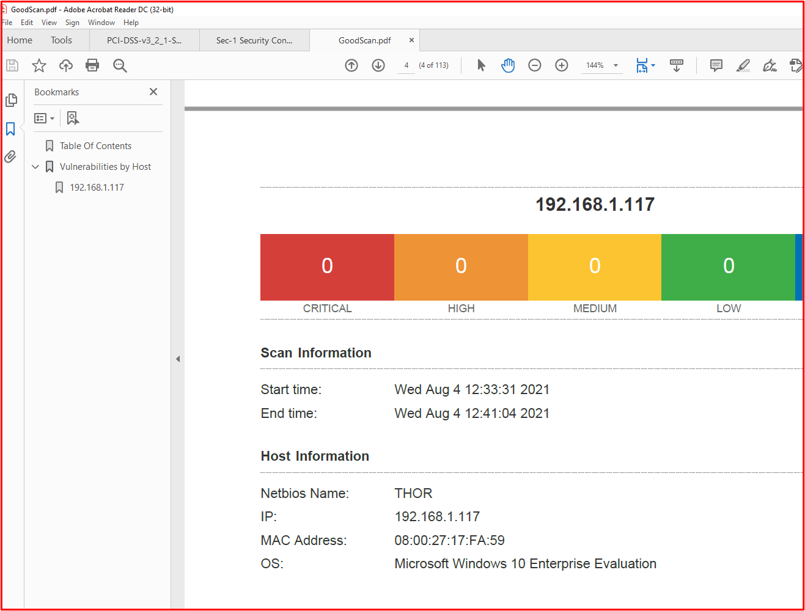
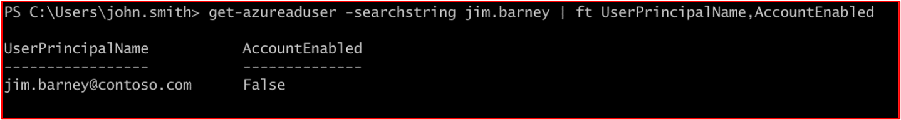
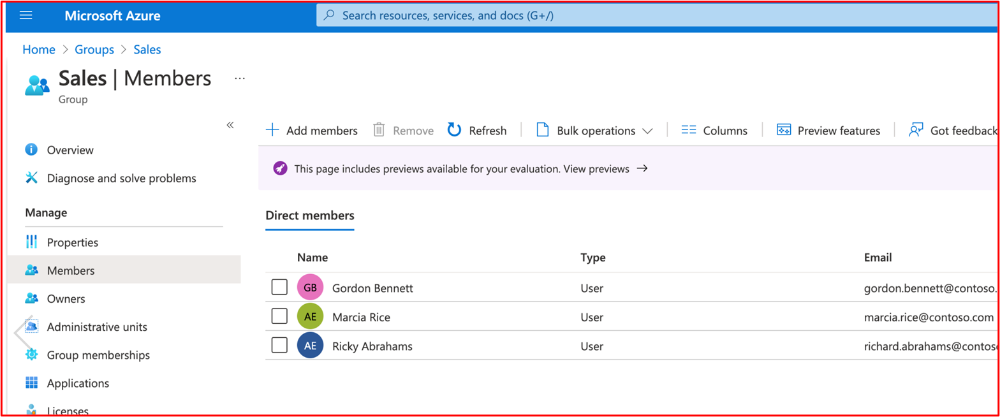
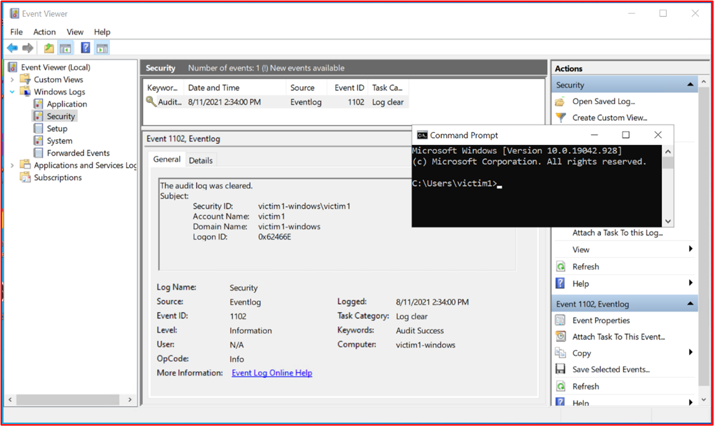
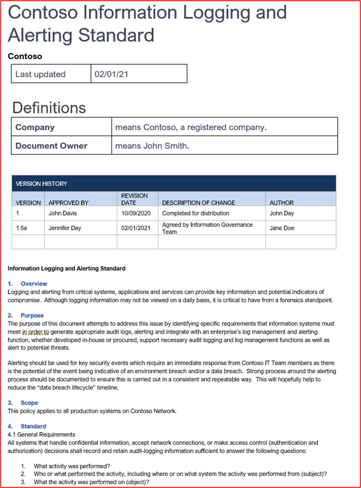
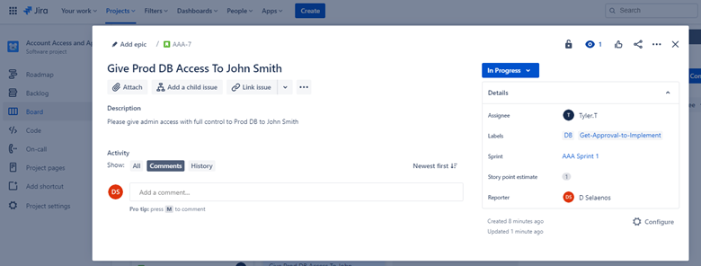

# Microsoft 365 certificazioni - Guida alle prove di esempio

## Panoramica

Questa guida è stata creata per fornire agli ISV esempi del tipo di prova e del livello di informazioni dettagliate necessarie per ognuno dei controlli Microsoft 365 certificazione. Gli esempi condivisi in questo documento non rappresentano l'unica prova che può essere utilizzata per dimostrare che i controlli vengono soddisfatti, ma agiscono solo come linee guida per il tipo di prova richiesto. 

Nota: le interfacce, gli screenshot e la documentazione effettivi usati per soddisfare i requisiti variano a seconda dell'utilizzo del prodotto, della configurazione del sistema e dei processi interni. Inoltre, tenere presente che se è necessaria la documentazione relativa ai criteri o alle procedure, l'ISV sarà necessario per inviare i documenti EFFETTIVI e non gli screenshot, come illustrato in alcuni esempi. 

Nella certificazione sono disponibili due sezioni che richiedono invii:
1. [**Invio documento iniziale:**](../docs/initialdocumentsubguide.md) un piccolo set di documenti di alto livello necessari per l'ambito della valutazione.
1. **L'invio di prove:** il set completo di prove necessarie per ogni controllo nell'ambito della valutazione della certificazione. 

## Struttura 

Questo documento è mappato direttamente ai controlli che verranno presentati durante la certificazione nel Centro per i partner. Le indicazioni fornite in questo documento sono dettagliate come segue:
- Dominio di sicurezza: i tre domini di sicurezza in cui sono raggruppati tutti i controlli: sicurezza delle applicazioni, sicurezza operativa e sicurezza dei dati e privacy.
- Controlli: = Descrizione attività di valutazione - Questi controlli e il numero associato (n.) vengono presi direttamente dall'elenco Microsoft 365 di certificazione.  
- Intento: = l'intento del motivo per cui il controllo di sicurezza è incluso nel programma e il rischio specifico che è destinato a mitigare.  L'auspicio è che queste informazioni forniranno agli ISV il ragionamento dietro il controllo per comprendere meglio i tipi di prove che devono essere raccolte e a quali ISV devono prestare attenzione e avere consapevolezza e comprensione per produrre le loro prove.
- Linee guida per le prove di esempio: = Fornite per guidare le attività di raccolta delle prove nel foglio di calcolo elenco di controllo di certificazione Microsoft 365, ciò consente agli ISV di visualizzare chiaramente esempi del tipo di prova che possono essere utilizzati dall'analista di certificazione che lo utilizzerà per certificazione sicura che un controllo sia in atto e mantenuto, non è affatto esaustivo.
- Esempio di prova: = In questa sezione vengono mostrati screenshot di esempio e immagini di potenziali prove acquisite su ognuno dei controlli contenuti nel foglio di calcolo elenco di controllo di certificazione Microsoft 365, in particolare per i domini di sicurezza operativa e sicurezza dei dati e privacy (schede all'interno del foglio di calcolo). Si noti che qualsiasi informazione con frecce e caselle rosse all'interno degli esempi consente di comprendere meglio i requisiti necessari per soddisfare qualsiasi controllo.

## Dominio di sicurezza: sicurezza dell'applicazione

**Controllo 1 - Controllo 16**:

I controlli di dominio di sicurezza dell'applicazione possono essere soddisfatti con un report di test di penetrazione emesso negli ultimi 12 mesi che mostra che l'app non presenta vulnerabilità in sospeso. L'unico invio necessario è un report pulito di una società indipendente affidabile. 

## Dominio di sicurezza: Sicurezza operativa / Sviluppo protetto

Il dominio di sicurezza "Sicurezza operativa/sviluppo sicuro" è progettato per garantire che gli ISV implementino una serie avanzata di tecniche di mitigazione della sicurezza contro una miriade di minacce affrontate dagli operatori delle minacce.  Questo è progettato per proteggere l'ambiente operativo e i processi di sviluppo software per creare ambienti sicuri.

#### Protezione antimalware - Anti-Virus

**Controllo n. 1:** Fornire la documentazione sui criteri che regola le procedure e le procedure antivirus.
- Intento: lo scopo di questo controllo è valutare la comprensione da parte di un ISV dei problemi che devono affrontare quando si considera la minaccia dei virus informatici. Stabilendo e utilizzando le procedure consigliate del settore nello sviluppo di criteri e processi antivirus, un ISV fornisce una risorsa personalizzata per la capacità dell'organizzazione di mitigare i rischi che il malware deve affrontare, elencando le procedure consigliate per il rilevamento e l'eliminazione di virus e fornisce la prova che i criteri documentati forniscono indicazioni sulla sicurezza consigliate per l'organizzazione e i dipendenti. Documentando un criterio e una procedura di distribuzione delle decenzie antimalware da parte dell'ISV, si garantisce l'implementazione e la manutenzione coerenti di questa tecnologia per ridurre il rischio di malware per l'ambiente.

- Linee guida sull'evidenza di esempio: fornire una copia dei criteri antivirus/antimalware in cui sono dettagliati i processi e le procedure implementati all'interno dell'infrastruttura per promuovere le procedure consigliate per antivirus/malware.
Esempio di prova

- Esempio di prova:

**Nota:** Questa schermata mostra un documento di criteri/processo, l'aspettativa è che gli ISV conosino la documentazione relativa ai criteri/procedure di supporto e non forniranno semplicemente uno screenshot.

**Controllo n. 2:** Fornire prove dimostrabili che il software antivirus è in esecuzione in tutti i componenti di sistema campionati.

- Intento: è importante che anti-virus (o difese antimalware) siano in esecuzione nell'ambiente per proteggersi da rischi di sicurezza informatica che potrebbero essere o meno a conoscenza del fatto che gli attacchi potenzialmente dannosi stanno aumentando, sia in sofisticatezza che in numeri. La distribuzione di AV in tutti i componenti di sistema che ne supportano l'utilizzo consente di ridurre alcuni dei rischi derivanti dall'introduzione di antimalware nell'ambiente. È necessario che un singolo endpoint non sia protetto per fornire potenzialmente un vettore di attacco per un attore di minacce per ottenere un punto d'appoggio nell'ambiente. Av deve pertanto essere usato come uno dei diversi livelli di difesa per proteggere da questo tipo di minaccia.

- Linee guida sull'evidenza di esempio: per dimostrare che un'istanza attiva di AV è in esecuzione nell'ambiente valutato. Fornisci uno screenshot per ogni dispositivo dell'esempio che supporta l'uso di antivirus che mostra il processo _antivirus in esecuzione_ , il software antivirus è attivo o se hai una console di gestione centralizzata per l'antivirus, potresti essere in grado di dimostrarlo da tale console di gestione. Se si usa la console di gestione, assicurarsi di verificare in uno screenshot che i dispositivi campionati siano connessi e funzionanti.

- Esempio di prova 1: lo screenshot seguente è stato preso dal Centro sicurezza di Azure; mostra che nella macchina virtuale denominata MSPGPRODAZUR01&quot; è stata distribuita un'estensione Antimalware&quot;.

- Esempio di prova 2

Lo screenshot seguente è stato preso da un dispositivo Windows 10, &quot;&quot; che mostra che è attivata la protezione in tempo reale per il nome host &quot;CLARANET-SBU-WM&quot;.

**Controllo n. 3:** Fornire prove dimostrabili che le firme antivirus sono aggiornate in tutti gli ambienti (entro 1 giorno).

- Intento: ogni giorno vengono identificati centinaia di migliaia di nuovi malware e applicazioni potenzialmente indesiderate. Per fornire una protezione adeguata contro il malware appena rilasciato, le firme AV devono essere aggiornate regolarmente per conto del malware appena rilasciato.

- Questo controllo esiste per garantire che l'ISV abbia preso in considerazione la sicurezza dell'ambiente e l'effetto che av obsoleto può avere sulla sicurezza.

- Linee guida di prova di esempio: fornire file di registro antivirus da ogni dispositivo campionato, che mostra che gli aggiornamenti vengono applicati ogni giorno.

- Esempio di prova: lo screenshot seguente mostra l'aggiornamento di Microsoft Defender almeno ogni giorno mostrando &#39;Evento 2000, Windows Defender&#39; che è l'aggiornamento. Viene visualizzato il nome host, che mostra che è stato preso dal sistema nell'ambito CLARANET-SBU-WM.The hostname is shown, showing that this was taken from the in-scope system &quot;CLARANET-SBU-WM&quot;.

**Nota:** Le prove fornite devono includere un'esportazione dei log per visualizzare gli aggiornamenti giornalieri in un periodo di tempo maggiore. Alcuni prodotti antivirus genereranno file di registro degli aggiornamenti in modo che questi file siano forniti o esportati dal Visualizzatore eventi.

**Controllo n. 4:** Fornire prove dimostrabili che l'antivirus è configurato per eseguire l'analisi all'accesso o periodica in tutti i componenti di sistema campionati.

**Nota:** Se l'analisi all'accesso non è abilitata, è necessario almeno l'analisi giornaliera e alerting_ **deve** _be abilitata.

- Intento: lo scopo di questo controllo è garantire che il malware venga identificato rapidamente per ridurre al minimo l'effetto che potrebbe avere sull'ambiente. Se l'analisi all'accesso viene eseguita e abbinata al blocco automatico del malware, ciò consente di arrestare le infezioni da malware note dal software antivirus. Se l'analisi all'accesso non è consigliabile&#39;causa dei rischi di falsi positivi che causano interruzioni del servizio, è necessario implementare meccanismi di analisi e avviso giornalieri adeguati (o più) per garantire una risposta immediata alle infezioni da malware per ridurre al minimo i danni.

- Linee guida per l'evidenza di esempio: fornire uno screenshot per ogni dispositivo dell'esempio che supporta l'antivirus, che mostra che l'antivirus _è in esecuzione_ nel dispositivo ed è configurato per l'analisi in tempo **reale oppure fornisce** uno screenshot che mostra che l'analisi periodica è abilitata per l'analisi giornaliera, gli avvisi sono  configurati e la data dell'ultima analisi per ogni dispositivo nell'esempio.

- Esempio di prova: lo screenshot seguente mostra che la protezione in tempo reale è abilitata per l'host, &quot;CLARANET-SBU-WM&quot;.

**Controllo n. 5:** Fornire prove dimostrabili che l'antivirus è configurato per bloccare automaticamente il malware o la quarantena e avvisare tutti i componenti di sistema campionati.

- Intento: la sofisticatità del malware è in continua evoluzione insieme ai diversi gradi di disaffezione che possono portare. Lo scopo di questo controllo è impedire l'esecuzione del malware e quindi impedirne l'esecuzione del payload potenzialmente dannoso oppure, se il blocco automatico non è un'opzione, limitando la quantità di tempo in cui il malware può creare il caos inviando avvisi e rispondendo immediatamente alla potenziale infezione da malware.

- Linee guida per l'evidenza di esempio: fornire uno screenshot per ogni dispositivo dell'esempio che supporta l'antivirus, che mostra che l'antivirus _è in esecuzione_ nel computer ed è configurato per bloccare automaticamente il malware, l'avviso o la quarantena e l'avviso.

- Esempio prova 1: lo screenshot seguente mostra l'host &quot;CLARANET-SBU-WM&quot; è configurato con la protezione in tempo reale per Antivirus Microsoft Defender. Come dice l'impostazione, questo consente di individuare e arrestare l'installazione o l'esecuzione di malware nel dispositivo.

**Control No.6:** Fornire prove dimostrabili che le applicazioni vengono approvate prima della distribuzione.

- Intento: con il controllo dell'applicazione, l'organizzazione approverà ogni applicazione/processo consentito per l'esecuzione nel sistema operativo. Lo scopo di questo controllo è garantire che sia in atto un processo di approvazione per autorizzare le applicazioni/processi che possono essere eseguiti.

- Linee guida per l'evidenza di esempio: è possibile dimostrare che il processo di approvazione viene seguito. Questo può essere fornito tramite documenti firmati, tracciando all'interno dei sistemi di controllo delle modifiche o usando qualcosa come Azure DevOps o JIRA per tenere traccia di queste richieste e autorizzazione.

- Esempio di prova: lo screenshot seguente illustra un'approvazione da parte della gestione che ogni applicazione autorizzata a eseguire nell'ambiente segue un processo di approvazione. Si tratta di un processo basato su carta presso Contoso, tuttavia è possibile utilizzare altri meccanismi.

**Controllo n.7:** Fornire prove dimostrabili che esiste e viene mantenuto un elenco completo delle applicazioni approvate con giustificazione aziendale.

- Intento: è importante che le organizzazioni mantengano un elenco di tutte le applicazioni approvate, insieme alle informazioni sul motivo per cui l'applicazione/processo è stato approvato. In questo modo si garantisce che la configurazione rimanga corrente e possa essere esaminata rispetto a una linea di base per garantire che le applicazioni/processi non autorizzati non siano configurati.

- Linee guida sull'evidenza di esempio: fornire l'elenco documentato di applicazioni/processi approvati insieme alla motivazione aziendale.

- Esempio di prova: lo screenshot seguente elenca le applicazioni approvate con giustificazione aziendale.

**Nota:** Questa schermata mostra un documento, l'aspettativa è che gli ISV conosino il documento di supporto effettivo e non forniranno semplicemente uno screenshot.

**Controllo n.8:** Fornire documentazione di supporto in cui viene descritto in dettaglio che il software di controllo delle applicazioni è configurato per soddisfare specifici meccanismi di controllo delle applicazioni.

- Intento: la configurazione della tecnologia di controllo delle applicazioni deve essere documentata insieme a un processo di gestione della tecnologia, ad esempio l'aggiunta e l'eliminazione di applicazioni/processi. Come parte di questa documentazione, il tipo di meccanismo utilizzato deve essere dettagliato per ogni applicazione/processo. In questo modo verrà inserito il controllo successivo per verificare che la tecnologia sia configurata come documentata.

- Linee guida sull'evidenza di esempio: fornire una documentazione di supporto che illustra in dettaglio come è stato configurato il controllo delle applicazioni e come ogni applicazione/processo è stato configurato all'interno della tecnologia.

- Esempio di prova: lo screenshot seguente elenca il meccanismo di controllo usato per implementare il controllo dell'applicazione. Puoi vedere di seguito che 1 app usa i controlli certificato e gli altri usando il percorso del file.

**Nota:** Questa schermata mostra un documento, l'aspettativa è che gli ISV conosino il documento di supporto effettivo e non forniranno semplicemente uno screenshot.

**Controllo n. 9:** Fornire prove dimostrabili che il controllo dell'applicazione è configurato come documentato da tutti i componenti di sistema campionati.

- Intento: lo scopo è convalidare che il controllo dell'applicazione sia configurato nell'esempio in base alla documentazione.

- Linee guida per l'evidenza di esempio: fornisci uno screenshot per _ogni_ dispositivo dell'esempio per mostrare che i controlli dell'applicazione sono configurati e attivati. Dovrebbero essere visualizzati i nomi dei computer, i gruppi a cui appartengono e i criteri di controllo dell'applicazione applicati a tali gruppi e computer.

- Esempio di prova: lo screenshot seguente mostra un oggetto Criteri di gruppo con Criteri di restrizione software abilitato.

Questa schermata successiva mostra la configurazione in linea con il controllo precedente.

Questa schermata successiva mostra l'ambiente M365 e i computer inclusi nell'ambito applicato a questo oggetto Criteri di gruppo &#39;computer di dominio Impostazioni&#39;.

Questa schermata finale mostra il server &quot;NELL'ambito DBServer1&quot; all'interno dell'unità organizzativa all'interno dello screenshot precedente.

### Gestione delle patch - Classificazione dei rischi

La rapida identificazione e correzione delle vulnerabilità della sicurezza consente di ridurre al minimo i rischi di un attore di minacce che compromette l'ambiente o l'applicazione. La gestione delle patch è suddivisa in due sezioni: classificazione dei rischi e applicazione di patch. Questi tre controlli riguardano l'identificazione delle vulnerabilità della sicurezza e le classificano in base al rischio che comportano.

Questo gruppo di controllo di sicurezza è nell'ambito degli ambienti di hosting PaaS (Platform-as-a-Service), poiché le raccolte software e la base di codice di terze parti dell'applicazione/componente aggiuntivo devono essere patchate in base alla classificazione dei rischi.

**Controllo n. 10:** Documentazione sui criteri di fornitura che regola il modo in cui vengono identificate le nuove vulnerabilità di sicurezza e viene assegnato un punteggio di rischio.

- Intento: lo scopo di questo controllo è disporre di documentazione di supporto per garantire che le vulnerabilità della sicurezza siano identificate rapidamente per ridurre la finestra di opportunità che gli interessati alle minacce devono sfruttare queste vulnerabilità. È necessario creare un meccanismo affidabile per identificare le vulnerabilità che coprono tutti i componenti di sistema in uso dalle organizzazioni; ad esempio sistemi operativi (Windows Server, Ubuntu e così via), applicazioni (Tomcat, MS Exchange, SolarWinds e così via), dipendenze del codice (AngularJS, jQuery e così via). Le organizzazioni devono non solo garantire l'identificazione in tempo reale delle vulnerabilità all'interno dell'azienda, ma anche classificare le eventuali vulnerabilità di conseguenza per garantire che la correzione sia eseguita entro un intervallo di tempo adeguato in base al rischio che la vulnerabilità presenta.

**Nota** Anche se l'esecuzione viene eseguita in un ambiente puramente Platform as a Service, è comunque responsabilità dell'utente identificare le vulnerabilità all'interno della codebase, ad esempio le librerie di terze parti.

- Linee guida per l'evidenza di esempio: fornire la documentazione di supporto (non gli screenshot)

- Esempio di prova: questa schermata mostra un frammento di un criterio di classificazione dei rischi.

**Nota:** Questa schermata mostra un documento di criteri/processi, l'aspettativa è che gli ISV conosino la documentazione effettiva dei criteri/procedure di supporto e non forniranno semplicemente un screenshot._

**Controllo n. 11:** Fornire prove di come vengono identificate le nuove vulnerabilità della sicurezza.

- Intento: lo scopo di questo controllo è garantire che il processo venga seguito e&#39;sia sufficientemente affidabile da identificare nuove vulnerabilità della sicurezza in tutto l'ambiente. Potrebbe non trattarsi solo dei sistemi operativi. può includere applicazioni in esecuzione all'interno dell'ambiente ed eventuali dipendenze del codice.

- Linee guida per le evidenze di esempio: le prove possono essere fornite mostrando le sottoscrizioni alle liste di distribuzione, esaminando manualmente le fonti di sicurezza per le vulnerabilità appena rilasciate (sarebbe necessario tenere traccia in modo adeguato con timestamp delle attività, ad esempio con JIRA o Azure DevOps), strumenti che rilevano software non aggiornato (ad esempio, potrebbe essere Snyk quando si cercano librerie software non aggiornate o potrebbe essere Nessus utilizzando analisi autenticate che identificano il software non aggiornato).  software non aggiornato).

**Nota** Se si utilizza Nessus, questa operazione deve essere eseguita regolarmente per identificare rapidamente le vulnerabilità. Ti consigliamo almeno ogni settimana.

- Esempio di prova: questo screenshot dimostra che un gruppo di mailing viene utilizzato per ricevere una notifica delle vulnerabilità di sicurezza.

**Controllo n. 12:** Fornire prove che dimostrano che a tutte le vulnerabilità viene assegnata una classificazione dei rischi una volta identificate.

- Intento: l'applicazione di patch deve essere basata sui rischi, più è rischiosa la vulnerabilità, più rapidamente è necessario correggere. La classificazione dei rischi delle vulnerabilità identificate è parte integrante di questo processo. L'intento di questo controllo è quello di garantire un processo documentato di classificazione dei rischi che viene seguito per garantire che tutte le vulnerabilità identificate siano adeguatamente classificate in base al rischio. Le organizzazioni in genere utilizzano la classificazione CVSS (Common Vulnerability Scoring System) fornita da fornitori o ricercatori di sicurezza. Se l'organizzazione si basa su CVSS, è consigliabile includere nel processo un meccanismo di classificazione per consentire all'organizzazione di modificare la classificazione in base a una valutazione dei rischi interna. A volte, la vulnerabilità potrebbe non essere un'applicazione a causa del modo in cui l'applicazione è stata distribuita all'interno dell'ambiente. Ad esempio, potrebbe Java una vulnerabilità che influisce su una raccolta specifica non utilizzata dall'organizzazione.

- Linee guida per l'evidenza di esempio: fornire le prove tramite screenshot o altri mezzi, ad esempio DevOps/Jira, che dimostra che le vulnerabilità stanno attraversando il processo di classificazione dei rischi e che l'organizzazione ha assegnato una classificazione dei rischi appropriata.

- Esempio di prova: questa schermata mostra la classificazione dei rischi che si verifica nella colonna D e una nuova classificazione nelle colonne F e G, se l'organizzazione esegue una valutazione dei rischi e determina che il rischio può essere declassato. La prova di una nuova classificazione dei rischi deve essere fornita come prova di supporto

### Gestione delle patch - Applicazione di patch

I controlli seguenti sono per l'elemento patch per gestione delle patch. Per mantenere un ambiente operativo sicuro, le applicazioni/componenti aggiuntivi e i sistemi di supporto devono essere adeguatamente patchati. Un intervallo di tempo adeguato tra l'identificazione (o il rilascio pubblico) e l'applicazione di patch deve essere gestito per ridurre la finestra di opportunità per sfruttare una vulnerabilità da parte di un attore di minacce. La Microsoft 365 certificazioni non prevede una &#39;di applicazione di patch&#39;, tuttavia gli analisti della certificazione rifiuteranno i tempi non ragionevoli.

Questo gruppo di controllo di sicurezza è nell'ambito degli ambienti di hosting PaaS (Platform-as-a-Service), poiché le raccolte software e la base di codice di terze parti dell'applicazione/componente aggiuntivo devono essere patchate in base alla classificazione dei rischi.

**Controllo n. 13:** Fornire la documentazione dei criteri per l'applicazione di patch ai componenti di sistema nell'ambito che includono un intervallo di tempo minimo adeguato per l'applicazione di patch per vulnerabilità critiche, ad alto e medio rischio; e rimozione delle autorizzazioni di eventuali sistemi operativi e software non supportati.

- Intento: la gestione delle patch è necessaria per molti framework di conformità della sicurezza, ad esempio PCI-DSS, ISO 27001, NIST (SP) 800-53. L'importanza di una buona gestione delle patch non può essere sottolineata in quanto può correggere i problemi di sicurezza e funzionalità nel software, nel firmware e ridurre le vulnerabilità, per ridurre le opportunità di sfruttamento. Lo scopo di questo controllo è ridurre al minimo la finestra di opportunità che un attore di minacce deve sfruttare le vulnerabilità che possono esistere all'interno dell'ambiente nell'ambito.

- Linee guida sull'evidenza di esempio: fornire una copia di tutti i criteri e le procedure che illustrano in dettaglio il processo di gestione delle patch. Deve includere una sezione in una finestra di applicazione di patch minima e che i sistemi operativi e il software non supportati non devono essere utilizzati nell'ambiente.

- Esempio di prova: di seguito è riportato un documento di criteri di esempio.

**Nota:** Questa schermata mostra un documento di criteri/processi, l'aspettativa è che gli ISV conosino la documentazione effettiva dei criteri/procedure di supporto e non forniranno semplicemente un screenshot._

**Controllo n. 14:** Fornire prove dimostrabili che tutti i componenti di sistema campionati vengono patchati.

**Nota:** Includere eventuali librerie software/di terze parti.

- Intento: l'applicazione di patch alle vulnerabilità garantisce che i diversi moduli che fanno parte dell'infrastruttura di information technology (hardware, software e servizi) siano aggiornati e liberi da vulnerabilità note. L'applicazione di patch deve essere eseguita il prima possibile per ridurre al minimo il potenziale di un incidente di sicurezza tra il rilascio dei dettagli della vulnerabilità e l'applicazione di patch. Questo è ancora più critico quando lo sfruttamento delle vulnerabilità è noto per essere in natura.

- Linee guida per le evidenze  di esempio: fornire uno screenshot per ogni dispositivo nell'esempio e supportare i componenti software che mostrano che le patch sono installate in linea con il processo di applicazione di patch documentato.

- Esempio di prova: lo screenshot &quot;seguente mostra che il componente di sistema nell'ambito CLARANET-SBU-WM&quot; sta eseguendo Windows aggiornamenti in linea con i criteri di applicazione delle patch.

**Nota:** L'applicazione di patch a tutti i componenti di sistema nell'ambito deve essere una prova. Sono inclusi elementi come; Aggiornamenti del sistema operativo, aggiornamenti di applicazioni/componenti (i.e__.,_ _Apache Tomcat, OpenSSL e così via), dipendenze software (ad esempio JQuery, AngularJS e così via) e così via._

**Controllo n. 15:** Fornire prove dimostrabili che i sistemi operativi e i componenti software non supportati non vengono utilizzati nell'ambiente.

- Intento: il software che non viene gestito dai fornitori risentirà di vulnerabilità note non fisse. Pertanto, l'utilizzo di sistemi operativi e componenti software non supportati non deve essere utilizzato negli ambienti di produzione.

- Linee guida per l'evidenza di esempio: fornisci uno screenshot per ogni dispositivo dell'esempio che mostra la versione del sistema _operativo in esecuzione_ (incluso il nome&#39;server nello screenshot). Inoltre, fornire la prova che i componenti software in esecuzione nell'ambiente eseguono versioni supportate. A tale scopo, è possibile fornire l'output dei report di analisi delle vulnerabilità interne (inclusa l'analisi autenticata) e/o l'output degli strumenti che controllano le librerie di terze parti, ad esempio [Snyk](https://snyk.io/), [Trivy](https://github.com/aquasecurity/trivy) o [NPM Audit](https://docs.npmjs.com/cli/v7/commands/npm-audit). Se è in esecuzione solo in PaaS, solo l'applicazione di patch alle librerie di terze parti deve essere coperta dai gruppi di controllo di applicazione delle patch.

- Prova di esempio: la prova seguente mostra che il componente di sistema nell'ambito DISR sta eseguendo software supportato dal fornitore dal momento che Nessus non ha&#39;contrassegnato alcun problema.

**Nota:** Il report completo deve essere condiviso con gli analisti della certificazione.

- Esempio di prova 2

Questa schermata mostra che il componente di &quot;sistema nell'ambito CLARANET-SBU-WM&quot; è in esecuzione su una versione Windows supportata.

- Esempio di prova 3

Lo screenshot seguente è dell'output [trivy](https://github.com/aquasecurity/trivy) , che il report completo&#39;elencare tutte le applicazioni non supportate.

**Nota:** Il report completo deve essere condiviso con gli analisti della certificazione.

### Analisi delle vulnerabilità

Con l'introduzione di valutazioni regolari delle vulnerabilità, le organizzazioni possono rilevare punti deboli e insicurezze all'interno dei propri ambienti che possono fornire un punto di ingresso per un attore malintenzionato per compromettere l'ambiente. L'analisi delle vulnerabilità può aiutare a identificare le patch mancanti o le configurazioni erre all'interno dell'ambiente. Eseguendo regolarmente queste analisi, un'organizzazione può fornire una correzione appropriata per ridurre al minimo il rischio di una compromissione a causa di problemi comunemente raccolti da questi strumenti di analisi delle vulnerabilità.

**Controllo n. 16:** Fornire i report di analisi delle vulnerabilità dell'infrastruttura trimestrale e delle applicazioni Web. L'analisi deve essere eseguita in base all'intero footprint pubblico (indirizzi IP e URL) e agli intervalli IP interni.

**Nota:** Deve **includere** l'ambito completo dell'ambiente.

- Intento: l'analisi delle vulnerabilità cerca possibili punti deboli in un sistema informatico, reti e applicazioni Web delle organizzazioni per identificare i buchi che potrebbero potenzialmente causare violazioni della sicurezza e l'esposizione di dati sensibili. L'analisi delle vulnerabilità è spesso richiesta dagli standard del settore e dalle normative governative, ad esempio pci DSS (Payment Card Industry Data Security Standard).

- Un report di Security Metric &quot; intitolato [2020 Security Metrics Guide to PCI DSS Compliance](https://info.securitymetrics.com/pci-guide-2020)&quot; afferma che &#39;in media sono stati impiegato 166 giorni dal momento in cui un'organizzazione è stata vista avere vulnerabilità per un utente malintenzionato per compromettere il sistema. Una volta compromessi, gli utenti malintenzionati hanno avuto accesso a dati sensibili per una media di 127 giorni&#39; pertanto questo controllo è finalizzato a identificare potenziali punti deboli della sicurezza all'interno dell'ambiente nell'ambito.

- Linee guida per le evidenze di esempio: fornire i report di analisi completi per ogni trimestre&#39;analisi delle vulnerabilità eseguite negli ultimi 12 mesi. I report devono chiaramente definire le destinazioni per verificare che sia incluso l'intero footprint pubblico e, se applicabile, ogni subnet interna. **Fornisci tutti** i report di analisi **per OGNI** trimestre.

- Esempio di prova: l'esempio di prova è fornire i report di analisi dallo strumento di analisi in uso. Ogni trimestre&#39;report di analisi devono essere forniti per la revisione. L'analisi deve includere gli interi componenti di sistema dell'ambiente. ogni subnet interna e ogni indirizzo IP pubblico/URL disponibile per l'ambiente.

**Controllo n. 17:** Fornire prove dimostrabili che la correzione delle vulnerabilità identificate durante l'analisi delle vulnerabilità viene patchata in base al periodo di tempo documentato per l'applicazione di patch.

- Intento: la mancata identificazione&#39;, la gestione e la correzione rapida di vulnerabilità e errori di configurazione può aumentare il rischio di una compromissione di un'organizzazione che causa potenziali violazioni dei dati. La corretta identificazione e correzione dei problemi è considerata importante per un'organizzazione&#39;una posizione e un ambiente di sicurezza generale che è in linea con le procedure consigliate di vari framework di sicurezza per; ad esempio ISO 27001 e PCI DSS.

- Linee guida per le evidenze di esempio: fornire artefatti adatti (ad esempio screenshot) che mostrano che un esempio di vulnerabilità individuate dall'analisi delle vulnerabilità viene corretti in linea con le finestre di applicazione di patch già fornite nel controllo 13 precedente.

- Prova di esempio: lo screenshot seguente mostra un'analisi Nessus dell'ambiente nell'ambito (un singolo computer in &quot;questo esempio denominato THOR&quot;) che mostra le vulnerabilità del 2 agosto 2021.

Lo screenshot seguente mostra che i problemi sono stati risolti, 2 giorni dopo, che si trova all'interno della finestra di applicazione delle patch definita all'interno del criterio di applicazione delle patch.

**Nota:** Per questo controllo, gli analisti della certificazione devono visualizzare i report di analisi delle vulnerabilità e le correzioni per ogni trimestre degli ultimi dodici mesi.

### Firewall

I firewall spesso forniscono un limite di sicurezza tra ambienti attendibili (rete interna), non attendibili (Internet) e semi-attendibili (DMZ). Questi in genere saranno la prima linea di difesa all'interno di una strategia di sicurezza di difesa approfondita delle organizzazioni, progettata per controllare i flussi di traffico per i servizi in ingresso e in uscita e per bloccare il traffico indesiderato. Questi dispositivi devono essere strettamente controllati per garantire che funzionino in modo efficace e siano esercitino errori di configurazione che potrebbero mettere a rischio l'ambiente.

**Controllo n. 18:** Fornire la documentazione sui criteri che regola le procedure e le procedure di gestione del firewall.

- Intento: i firewall sono una prima linea di difesa importante in una strategia di sicurezza a più livelli (difesa approfondita), che protegge gli ambienti da aree di rete meno attendibili. I firewall controllano in genere i flussi di traffico basati su indirizzi IP e protocolli/porte, più firewall &quot;&quot; più ricchi di funzionalità possono anche fornire ulteriori difese a livello di applicazione esaminando il traffico delle applicazioni per proteggersi da un uso improprio, vulnerabilità e minacce in base alle applicazioni a cui si accede. Queste protezioni sono buone solo come la configurazione del firewall, pertanto è necessario disporre di criteri firewall e procedure di supporto forti per garantire che siano configurate per fornire una protezione adeguata degli asset interni. Ad esempio, un firewall con una regola per consentire tutto il traffico da qualsiasi origine a qualsiasi destinazione agisce solo come router.

- Linee guida per le prove di esempio: fornire la documentazione completa relativa ai criteri e alle procedure del firewall. In questo documento devono essere riportati tutti i punti di seguito e tutte le procedure consigliate aggiuntive applicabili all'ambiente.

- Esempio di prova: di seguito è riportato un esempio del tipo di documento sui criteri firewall richiesto (questa è una demo e potrebbe non essere completa).

**Controllo n. 19:** Fornire prove dimostrabili che le credenziali amministrative predefinite vengono modificate prima dell'installazione in ambienti di produzione.

- Intento: le organizzazioni devono tenere conto delle credenziali amministrative predefinite fornite dal fornitore configurate durante la configurazione del dispositivo o del software. Le credenziali predefinite sono spesso disponibili pubblicamente dai fornitori e possono fornire a un attore di minacce esterne l'opportunità di compromettere un ambiente. Ad esempio, una semplice ricerca su Internet per le credenziali iDrac (Integrated Dell Remote Access Controller) evidenzia _root::calvin_ come nome utente e password predefiniti. In questo modo un utente avrà accesso remoto alla gestione remota dei server. Lo scopo di questo controllo è garantire che gli ambienti non siano soggetti ad attacchi tramite le credenziali predefinite del fornitore che non sono state modificate durante la protezione avanzata di dispositivi/applicazioni.

- Linee guida per l'evidenza di esempio

- Questa operazione può essere dimostrata in una sessione di condivisione dello screensharing in cui l'analista di certificazione può tentare di eseguire l'autenticazione nei dispositivi nell'ambito utilizzando le credenziali predefinite.

- Esempio di prova

Lo screenshot seguente mostra ciò che l'analista di certificazione vedrebbe da un nome utente/password non valido da un firewall WatchGuard.

**Controllo n. 20:** Fornire prove dimostrabili che i firewall vengono installati sul limite dell'ambiente nell'ambito e installati tra la rete perimetrale (nota anche come DMZ, zona demilitarizzata e subnet schermata) e le reti attendibili interne.

- Intento: i firewall consentono di controllare il traffico tra aree di rete diverse di livelli di sicurezza diversi. Poiché tutti gli ambienti sono connessi a Internet, è necessario installare firewall sul limite, ad esempio tra Internet e l'ambiente nell'ambito. Inoltre, i firewall devono essere installati tra le reti DMZ (De-Militarized Zone) meno attendibili e le reti attendibili interne. Le dmZ vengono in genere utilizzate per gestire il traffico da Internet e pertanto sono un obiettivo di attacco. Implementando una rete perimetrale e usando un firewall per controllare i flussi di traffico&#39;, una compromissione della rete perimetrale non significa necessariamente una compromissione delle reti attendibili interne e dei dati aziendali/dei clienti. È consigliabile creare una registrazione e un avviso adeguati per consentire alle organizzazioni di identificare rapidamente una compromissione per ridurre al minimo l'opportunità per l'attore della minaccia di compromettere ulteriormente le reti attendibili interne. Lo scopo di questo controllo è garantire un controllo adeguato tra reti attendibili e reti meno attendibili.

- Linee guida per l'evidenza di esempio: le prove devono essere fornite tramite file di configurazione del firewall o screenshot che dimostrano che è in atto una DMZ. Deve corrispondere ai diagrammi architettonici forniti che illustrano le diverse reti che supportano l'ambiente. Una schermata delle interfacce di rete nel firewall, insieme al diagramma di rete già fornito nell'ambito dell'Invio documento iniziale, dovrebbe fornire questa prova.

- Esempio di prova: di seguito è riportata una schermata di un firewall WatchGuard che mostra due DMZ, una per i servizi in ingresso (denominata DMZ), l'altra serve la jumpbox (Bastian Host).

**Controllo n. 21:** Fornire prove dimostrabili che tutti gli accessi pubblici terminano nella zona demilitarizzata (DMZ).

- Intento: le risorse accessibili pubblicamente sono aperte a una miriade di attacchi. Come già descritto in precedenza, l'intento di una rete perimetrale è segmentare le reti meno attendibili da reti interne attendibili che possono contenere dati sensibili. Una rete perimetrale è considerata meno attendibile poiché esiste un rischio molto elevato per gli host accessibili pubblicamente da minacce esterne. L'accesso pubblico deve sempre terminare in queste reti meno attendibili che sono adeguatamente segmentate dal firewall per proteggere le risorse interne e i dati. L'intento di questo controllo è garantire che tutti gli accessi pubblici terminino all'interno di queste dmZ meno attendibili come se le risorse nelle reti interne attendibili fossero pubbliche, una compromissione di queste risorse fornisce un attore di minaccia un punto di appoggio nella rete in cui vengono mantenuti i dati sensibili.

- Linee guida per l'evidenza di esempio

- Le evidenze fornite a questo scopo potrebbero essere configurazioni del firewall che mostrano le regole in ingresso e dove queste regole terminano, instradando gli indirizzi IP pubblici alle risorse o fornendo il NAT (Network Address Translation) del traffico in ingresso.

- Esempio di prova

Nello screenshot seguente, sono presenti tre regole in ingresso, ognuna delle quali mostra il NAT per le subnet 10.0.3.x e 10.0.4.x, che sono le subnet DMZ

**Controllo n. 22:** Fornire prove dimostrabili che tutto il traffico consentito attraverso il firewall attraversa un processo di approvazione.

- Intento: poiché i firewall sono una barriera difensiva tra il traffico non attendibile e le risorse interne e tra reti con livelli di attendibilità diversi, i firewall devono essere configurati in modo sicuro e assicurarsi che sia abilitato solo il traffico necessario per le operazioni aziendali. Consentendo un flusso di traffico non necessario o un flusso di traffico troppo permissivo, ciò può introdurre punti deboli all'interno della difesa al limite di queste diverse aree di rete. Stabilendo un solido processo di approvazione per tutte le modifiche del firewall, il rischio di introdurre una regola che introduce un rischio significativo per l'ambiente è ridotto. Verizon&#39;s [2020 Data Breach Investigation Report](https://enterprise.verizon.com/en-gb/resources/reports/dbir/) &quot;evidenzia che error&#39;s&quot;, che include configurazioni erre, è l'unico tipo di azione che sta aumentando costantemente da un anno all'altro.

- Linee guida sull'evidenza di esempio: l'evidenza può essere sotto forma di documentazione che mostra una richiesta di modifica del firewall autorizzata, che può essere minuti da una riunione CAB (Change Advisor Board) o da un sistema di controllo delle modifiche che verifica tutte le modifiche.

- Esempio di prova: lo screenshot seguente mostra una modifica della regola del firewall richiesta e autorizzata tramite un processo cartaceo. Questo risultato può essere ottenuto ad esempio DevOps o Jira.

**Controllo n. 23:** Fornire prove dimostrabili che la base di regole del firewall è configurata per rilasciare il traffico non definito in modo esplicito.

- Intento: la maggior parte dei firewall eelaborare le regole con un approccio dall'alto verso il basso per cercare di trovare una regola corrispondente. Se una regola corrisponde, verrà applicata l'azione di tale regola e verrà interrotta l'ulteriore elaborazione delle regole. Se non vengono trovate regole di corrispondenza, per impostazione predefinita il traffico viene negato. Lo scopo di questo controllo è che, se il&#39;firewall non rilascia il traffico per impostazione predefinita se non viene trovata alcuna regola corrispondente, la base &quot;&quot; di regole deve includere una regola Nega tutto alla fine di TUTTI gli **elenchi di firewall**. In questo modo si garantisce che il firewall non&#39;lo stato predefinito Consenti durante l'elaborazione delle regole, consentendo così il traffico che&#39;non è stato definito in modo esplicito.

- Linee guida per le evidenze di esempio: l'evidenza può essere fornita tramite la configurazione del firewall o tramite screenshot che mostrano tutte le regole del firewall che mostrano una regola Nega tutto alla fine o se il firewall rilascia il traffico che non corrisponde&#39;una regola per impostazione predefinita, quindi forniamo uno screenshot di tutte le regole del firewall &quot;&quot; e un collegamento alle guide amministrative dei fornitori che evidenziano che per impostazione predefinita il firewall rilascia tutto il traffico non corrispondente.

- Esempio di prova: di seguito è riportato uno screenshot della base di regole del firewall WatchGuard che dimostra che nessuna regola è configurata per consentire tutto il traffico. Non esiste una regola di negazione alla fine perché WatchGuard rilascia il traffico che&#39;non corrisponde per impostazione predefinita.

Il collegamento seguente del Centro assistenza WatchGuard; [https://www.watchguard.com/help/docs/help-center/en-US/Content/en-US/Fireware/policies/policies\_about\_c.html](https://www.watchguard.com/help/docs/help-center/en-US/Content/en-US/Fireware/policies/policies_about_c.html) include le informazioni seguenti:

**Controllo n. 24:** Fornire prove dimostrabili che il firewall supporta solo una crittografia solida in tutte le interfacce amministrative non della console.

- Intento: per ridurre gli attacchi man-in-the-middle del traffico amministrativo, tutte le interfacce amministrative non console devono supportare solo una crittografia solida. Lo scopo principale di questo controllo è proteggere le credenziali amministrative durante la configurazione della connessione non console. Inoltre, questo può aiutare a proteggere dalle intercettazioni nella connessione, cercando di riprodurre le funzioni amministrative per riconfigurare il dispositivo o come parte della ricognizione.

- Linee guida per l'evidenza di esempio: fornire la configurazione del firewall, se la configurazione fornisce la configurazione crittografica delle interfacce amministrative non della console (non tutti i dispositivi includeranno questa opzione come opzioni configurabili). Se questo non&#39;all'interno della configurazione, potresti essere in grado di emettere comandi al dispositivo per visualizzare ciò che è configurato per queste connessioni. Alcuni fornitori possono pubblicare queste informazioni all'interno di articoli in modo che questo possa anche essere un modo per dimostrarlo. Infine, potrebbe essere necessario eseguire gli strumenti per ottenere l'output della crittografia supportata.

- Esempio di prova: lo screenshot seguente mostra l'output di [SSLScan](https://github.com/rbsec/sslscan) sull'interfaccia di amministrazione Web del firewall WatchGuard sulla porta TCP 8080. Questo mostra TLS 1.2 o superiore con una crittografia di crittografia minima di AES-128bit.

**Nota**: i firewall WatchGuard supportano anche le funzioni amministrative tramite SSH (porta TCP 4118) e WatchGuard System Manager (porte TCP 4105 &amp; 4117). Dovrebbe essere fornita anche la prova di queste interfacce amministrative non della console.

**Controllo n. 25:** Fornire prove dimostrabili che si stanno eseguendo revisioni delle regole del firewall almeno ogni 6 mesi.

- Intento: nel tempo, esiste il rischio di problemi di configurazione nei componenti di sistema con l'ambiente nell'ambito. Questo può spesso introdurre insicurezze o configurazioni erre che possono aumentare il rischio di compromissione per l'ambiente. La configurazione può essere introdotta per numerosi motivi, ad esempio, modifiche temporanee per facilitare la risoluzione dei problemi, modifiche temporanee per modifiche funzionali ad hoc, per introdurre correzioni rapide a problemi che a volte possono essere troppo permissivi a causa delle pressioni dovute all'introduzione di una correzione rapida. Ad esempio, è possibile introdurre una regola firewall &quot;temporanea Consenti a tutti&quot; di risolvere un problema urgente. L'intento di questo controllo è duplice, in primo luogo per identificare dove sono presenti configurazioni erre che possono introdurre insicurezze e in secondo luogo per identificare le regole del firewall che non sono più necessarie e quindi possono essere rimosse, ad esempio se un servizio è stato ritirato ma la regola del firewall è stata lasciata indietro.

- Linee guida sull'evidenza di esempio: le prove devono essere in grado di dimostrare che si sono verificate riunioni di revisione. A tale scopo, è possibile condividere i minuti di riunione della revisione del firewall e qualsiasi prova di controllo delle modifiche aggiuntiva che mostra eventuali azioni eseguite dalla revisione. Assicurati che le date siano presenti&#39;necessario vedere almeno due di queste riunioni (ad esempio, ogni sei mesi)

- Esempio di prova: lo screenshot seguente mostra la prova di una revisione del firewall in corso a gennaio 2021.

Lo screenshot seguente mostra la prova di una revisione del firewall che si è verificata a luglio 2021.

### Firewall - WAF

È facoltativo distribuire un firewall dell'applicazione Web nella soluzione. Se viene utilizzato un waf, questo verrà conteggiato come crediti aggiuntivi per la matrice di punteggio all'interno del &#39;Operational Security&#39; security domain. Le WAF possono esaminare il traffico Web per filtrare e monitorare il traffico Web tra Internet e le applicazioni Web pubblicate per identificare gli attacchi specifici delle applicazioni Web. Le applicazioni Web possono subire molti attacchi specifici per le applicazioni Web, ad esempio SQL Injection (SQLi), Cross Site Scripting (XSS), Cross Site Request Forgery (CSRF/XSRF) e WAF, e le waf sono progettate per proteggere da questi tipi di payload dannosi per proteggere le applicazioni Web da attacchi e potenziali compromissione.

**Controllo n. 26:** Fornire prove dimostrabili che Il Firewall applicazione Web (WAF) è configurato per monitorare, avvisare e bloccare attivamente il traffico dannoso.

- Intento: questo controllo è in atto per verificare che il waf sia in atto per tutte le connessioni Web in ingresso e che sia configurato per bloccare o avvisare il traffico dannoso. Per fornire un ulteriore livello di difesa per il traffico Web, le waf devono essere configurate per tutte le connessioni Web in ingresso, altrimenti gli interessati alle minacce esterne potrebbero ignorare le waf progettate per fornire questo ulteriore livello di protezione. Se waf non è configurato&#39;per bloccare attivamente il traffico dannoso, waf deve essere in grado di fornire un avviso immediato al personale che può reagire rapidamente al potenziale traffico dannoso per mantenere la sicurezza dell'ambiente e arrestare gli attacchi.

- Linee guida sull'evidenza di esempio: fornire output di configurazione da WAF che evidenzia le connessioni Web in ingresso servite e che la configurazione blocca attivamente il traffico dannoso o sta monitorando e inviando avvisi. In alternativa, è possibile condividere screenshot delle impostazioni specifiche per dimostrare che un'organizzazione è in grado di soddisfare questo controllo.

- Prova di esempio: gli screenshot seguenti mostrano che il criterio WAF del gateway applicazione azure di contoso di produzione è abilitato e che è configurato per la modalità &#39;Prevention&#39;, che rilascia attivamente traffico dannoso.

Lo screenshot seguente mostra la configurazione IP front-end

**Nota:** Le prove devono dimostrare tutti gli IP pubblici usati dall'ambiente per garantire che tutti i punti di ingresso siano coperti, motivo per cui è incluso anche questo screenshot.

Lo screenshot seguente mostra le connessioni Web in ingresso che usano questo WAF.

Lo screenshot seguente mostra ContosoAppGWCoreRules\_\_ che mostra che si tratta del servizio api.contoso.com servizio.

**Controllo n. 27:** Fornire prove dimostrabili che waf supporta la ripartizione del carico di lavoro SSL.

- Intento: la possibilità di configurare waf per supportare la ripartizione del carico di lavoro SSL è importante, altrimenti waf non sarà in grado di controllare il traffico HTTPS. Poiché questi ambienti devono supportare il traffico HTTPS, questa è una funzione fondamentale per waf per garantire che i payload dannosi all'interno del traffico HTTPS possano essere identificati e arrestati.

- Linee guida per l'evidenza di esempio: fornire prove di configurazione tramite un'esportazione di configurazione o screenshot che mostrano che la ripartizione del carico di lavoro SSL è supportata e configurata.

- Esempio di prova: all'interno del gateway applicazione di Azure, la configurazione di un listener SSL ha abilitato la ripartizione del carico di lavoro SSL, vedere la pagina Panoramica della [terminazione TLS e end-to-end di TLS con application gateway](https://docs.microsoft.com/azure/application-gateway/ssl-overview) Microsoft docs. La schermata seguente mostra questa configurazione per contoso Production Azure Application Gateway.

**Controllo n. 28:** "Fornire prove dimostrabili che waf è protetto da alcune o tutte le seguenti classi di vulnerabilità in base al set di regole di base OWASP (3.0 o 3.1):
- problemi di protocollo e codifica,
- inserimento dell'intestazione, contrabbando delle richieste e suddivisione delle risposte,
- attacchi di attraversamento di file e percorsi,
- attacchi rfi (Remote File Inclusion),
- attacchi di esecuzione di codice remoto,
- Attacchi phP injection,
- attacchi di cross-site scripting,
- SQL attacchi di inserimento di dati,
- attacchi di correzione della sessione.

- Intento: le waf devono essere configurate per identificare i payload di attacco per classi comuni di vulnerabilità. Questo controllo intende garantire che il rilevamento adeguato delle classi di vulnerabilità sia coperto sfruttando il set di regole di base OWASP.

- Linee guida per l'evidenza di esempio: fornire prove di configurazione tramite un'esportazione di configurazione o screenshot dimostra che la maggior parte delle classi di vulnerabilità identificate in precedenza viene coperta dall'analisi.

- Esempio di prova: lo screenshot seguente mostra che il criterio WAF di Azure Application Gateway di Contoso Production è configurato per l'analisi in base al set di regole di base OWASP versione 3.2.

### Change Control

Un processo di controllo delle modifiche consolidato e compreso è essenziale per garantire che tutte le modifiche si snovino attraverso un processo strutturato ripetibile. Verificando che tutte le modifiche vengano apportate attraverso un processo strutturato, le organizzazioni possono garantire che le modifiche vengano gestite in modo efficace, esaminate e testate in modo adeguato prima di essere firmate. Ciò consente non solo di ridurre al minimo il rischio di interruzioni del sistema, ma anche di ridurre al minimo il rischio di potenziali incidenti di sicurezza tramite modifiche improprie introdotte.

**Controllo n. 29:** Fornire la documentazione dei criteri che regola i processi di controllo delle modifiche.

- Intento: per mantenere un ambiente sicuro e un'applicazione sicura, è necessario stabilire un solido processo di controllo delle modifiche per garantire che tutte le modifiche all'infrastruttura e al codice siano eseguite con una supervisione efficace e processi definiti. In questo modo si garantisce che le modifiche siano documentate, vengono considerate le implicazioni di sicurezza, si pensa all'impatto sulla sicurezza della modifica e così via. L'intento è garantire che il processo di controllo delle modifiche sia documentato per garantire un approccio sicuro e coerente a tutte le modifiche nell'ambiente e nelle procedure di sviluppo delle applicazioni.

- Linee guida sull'evidenza di esempio: i criteri/procedure di controllo delle modifiche documentati devono essere condivisi con gli analisti della certificazione.

- Esempio di prova: di seguito viene mostrato l'inizio di un criterio di gestione delle modifiche di esempio. Forniamo i criteri e le procedure completi come parte della valutazione.

**Nota:** Questa schermata mostra un documento di criteri/processo, l'aspettativa è che gli ISV conosino la documentazione relativa ai criteri/procedure di supporto e non forniranno semplicemente uno screenshot.

**Controllo n. 30:** Fornire prove dimostrabili che gli ambienti di sviluppo e test applicano la separazione dei compiti dall'ambiente di produzione.

- Intento: la maggior parte&#39;gli ambienti di sviluppo/test dell'organizzazione non sono configurati allo stesso vigore degli ambienti di produzione e pertanto sono meno sicuri. Inoltre, i test non devono essere eseguiti all'interno dell'ambiente di produzione perché ciò può introdurre problemi di sicurezza o può essere dannoso per la distribuzione dei servizi per i clienti. Mantenendo ambienti separati che applicano una separazione dei compiti, le organizzazioni possono garantire che le modifiche vengano applicate agli ambienti corretti, riducendo così il rischio di errori implementando modifiche agli ambienti di produzione quando erano destinate all'ambiente di sviluppo/test.

- Linee guida per l'evidenza di esempio: possono essere fornite schermate che illustrano diversi ambienti utilizzati per ambienti di sviluppo/test e ambienti di produzione. In genere, si dispone di persone/team diversi con accesso a ogni ambiente o, se ciò non è possibile, gli ambienti utilizzano servizi di autorizzazione diversi per garantire che gli utenti non siano in grado di accedere erroneamente all'ambiente sbagliato per applicare le modifiche.

- Esempio di prova: nella schermata seguente viene mostrata una sottoscrizione di Azure per l'&#39;test di Contoso.

Questa schermata successiva mostra una sottoscrizione di Azure separata per contoso&#39;'&#39;production&#39; ambiente.

**Controllo n. 31:** Fornire prove dimostrabili che i dati di produzione sensibili non vengono utilizzati all'interno degli ambienti di sviluppo o test.

- Intento: come già illustrato in precedenza, le organizzazioni non implementeranno misure di sicurezza di un ambiente di sviluppo/test allo stesso vigore dell'ambiente di produzione. Pertanto, utilizzando dati di produzione sensibili in questi ambienti di sviluppo/test, si aumenta il rischio di una compromissione ed è necessario evitare l'utilizzo di dati live/sensibili all'interno di questi ambienti di sviluppo/test.

**Nota:** È possibile utilizzare dati in tempo reale negli ambienti di sviluppo/test, fornendo che lo sviluppo/test sia incluso nell'ambito della valutazione in modo che la sicurezza possa essere valutata in base ai controlli Microsoft 365 certificazione.

- Linee guida per l'evidenza di esempio: le prove possono essere fornite condividendo screenshot dell'output della stessa query di SQL su un database di produzione (redazione di informazioni riservate) e del database di sviluppo/test. L'output degli stessi comandi deve produrre set di dati diversi. Dove vengono archiviati i file, anche la visualizzazione del contenuto delle cartelle in entrambi gli ambienti dovrebbe mostrare set di dati diversi.

- Esempio di prova: lo screenshot seguente mostra i 3 record principali (per l'invio di prove, fornisci i primi 20) dal database di produzione.

Nella schermata successiva viene mostrata la stessa query del database di sviluppo, che mostra record diversi.

Ciò dimostra che i set di dati sono diversi.

**Controllo n. 32:** Fornire prove dimostrabili che le richieste di modifica documentate contengono l'impatto della modifica, i dettagli delle procedure di back-out e dei test da eseguire.

- Intento: lo scopo di questo controllo è quello di garantire che il pensiero sia stato inserito nella modifica richiesta. L'impatto della modifica sulla sicurezza del sistema/ambiente deve essere preso in considerazione e chiaramente documentato, tutte le procedure di back-out devono essere documentate per facilitare il ripristino in caso di problemi e, infine, è necessario considerare e documentare i dettagli dei test necessari per convalidare l'esito positivo della modifica.

- Linee guida per l'evidenza di esempio: le prove possono essere fornite esportando un campione di richieste di modifica, fornendo richieste di modifica cartacee o fornendo screenshot delle richieste di modifica che mostrano questi tre dettagli contenuti all'interno della richiesta di modifica.

- Esempio di prova: l'immagine seguente mostra una nuova vulnerabilità XSS (Cross Site Scripting Vulnerability) assegnata e un documento per la richiesta di modifica.

I ticket seguenti mostrano le informazioni che sono state impostate o aggiunte al ticket durante il viaggio verso la risoluzione.

 

I due ticket seguenti mostrano l'impatto della modifica al sistema e le eventuali procedure di back-out che potrebbero essere necessarie in caso di problema. È possibile vedere l'impatto delle modifiche e le procedure di back-out hanno attraversato un processo di approvazione e sono state approvate per i test.

A sinistra dello schermo, è possibile vedere che il test delle modifiche è stato approvato, a destra si vede che le modifiche sono state approvate e testate.

Durante il processo si noti che la persona che sta eseguendo il lavoro, la persona che lo segnala e la persona che approva il lavoro da eseguire sono persone diverse.

Il ticket precedente mostra che le modifiche sono state approvate per l'implementazione nell'ambiente di produzione. La casella a destra mostra che il test ha avuto esito positivo e che le modifiche sono state implementate in Prod Environment.

**Controllo n. 33:** Fornire prove dimostrabili che le richieste di modifica sono sottoposte a un processo di autorizzazione e disconnessione.

- Intento: deve essere implementato un processo che proibisce l'esecuzione delle modifiche senza l'autorizzazione appropriata e la disconnessione. La modifica deve essere autorizzata prima di essere implementata e la modifica deve essere disconnessa una volta completata. In questo modo si garantisce che le richieste di modifica siano state esaminate correttamente e che un utente dell'autorità abbia firmato la modifica.

- Linee guida sull'evidenza di esempio: l'evidenza può essere fornita esportando un campione di richieste di modifica, fornendo richieste di modifica cartacee o fornendo screenshot delle richieste di modifica che mostrano che la modifica è stata autorizzata, prima dell'implementazione e che la modifica è stata firmata dopo il completamento.

- Prova di esempio: lo screenshot seguente mostra un ticket jira di esempio che mostra che la modifica deve essere autorizzata prima di essere implementata e approvata da un utente diverso dallo sviluppatore/richiedente. Puoi vedere le modifiche qui approvate da un utente con autorità. A destra è stato firmato da DP una volta completato.

Nel ticket seguente puoi vedere che la modifica è stata disconnessa una volta completata e mostra il processo completato e chiuso.

### Sviluppo/distribuzione di software sicuro

Le organizzazioni coinvolte nelle attività di sviluppo del software sono spesso confrontate a priorità concorrenti tra la sicurezza e le pressioni TTM (Time to Market), tuttavia, l'implementazione di attività correlate alla sicurezza durante tutto il ciclo di vita dello sviluppo software (SDLC) può non solo risparmiare denaro, ma anche risparmiare tempo. Quando la sicurezza viene lasciata come una conseguenza, i problemi vengono in genere identificati solo durante la fase di test del (DSLC), che spesso richiede più tempo e può essere più dispendioso da risolvere. L'intento di questa sezione di sicurezza è garantire che vengano seguite procedure di sviluppo software sicure per ridurre il rischio di introdurre difetti di codifica nel software sviluppato. Inoltre, questa sezione cerca di includere alcuni controlli per facilitare la distribuzione sicura del software.

**Controllo n. 34:** Fornire criteri e procedure che supportano lo sviluppo e la distribuzione di software sicuri, incluse indicazioni sulle procedure consigliate per la codifica sicura rispetto alle classi di vulnerabilità comuni, ad esempio OWASP Top 10 o SANS Top 25 CWE.

- Intento: le organizzazioni devono fare tutto il possibile per garantire che il software sia sviluppato in modo sicuro e privo di vulnerabilità. Per ottenere questo risultato, è necessario stabilire un solido ciclo di vita di sviluppo software sicuro (SDLC) e procedure consigliate per la codifica sicura per promuovere tecniche di codifica protette e uno sviluppo sicuro durante l'intero processo di sviluppo del software. Lo scopo è ridurre il numero e la gravità delle vulnerabilità nel software.

- Linee guida sull'evidenza di esempio: fornire la documentazione SDLC e/o di supporto documentata che dimostra che è in uso un ciclo di vita di sviluppo sicuro e che vengono fornite indicazioni a tutti gli sviluppatori per promuovere la procedura consigliata per la codifica sicura. Dai un'occhiata [a OWASP in SDLC](https://owasp.org/www-project-integration-standards/writeups/owasp_in_sdlc/) e [OWASP Software Assurance Maturity Model](https://owaspsamm.org/model/) (SAMM).

- Esempio di prova: di seguito è riportato un estratto di Contoso&#39;Secure Software Development Procedure, che illustra le procedure di sviluppo e codifica sicure.

**Nota:** Queste schermate mostrano il documento di sviluppo software sicuro, l'aspettativa è che gli ISV consecino la documentazione di supporto effettiva e non forniranno semplicemente uno screenshot.

**Controllo n. 35:** Fornire prove dimostrabili che le modifiche al codice vengono sottoposte a un processo di revisione e autorizzazione da parte di un secondo revisore.

- Intento: lo scopo di questo controllo è eseguire una revisione del codice da un altro sviluppatore per identificare eventuali errori di codifica che potrebbero introdurre una vulnerabilità nel software. L'autorizzazione deve essere stabilita per garantire che le revisioni del codice siano eseguite, che i test siano eseguiti e così via. prima della distribuzione. Il passaggio di autorizzazione può verificare che siano stati seguiti i processi corretti che sono alla base del contenuto SDLC definito in precedenza.

- Linee guida sull'evidenza di esempio: fornire la prova che il codice viene sottoposto a una revisione peer e deve essere autorizzato prima di poter essere applicato all'ambiente di produzione. Questa prova può essere tramite un'esportazione di ticket di modifica, dimostrando che sono state eseguite revisioni del codice e le modifiche autorizzate, oppure tramite software di revisione del codice come Crogiolo ([https://www.atlassian.com/software/crucible](https://www.atlassian.com/software/crucible)).

- Esempio di prova

Di seguito è riportato un ticket che mostra le modifiche al codice sottoposte a un processo di revisione e autorizzazione da parte di un utente diverso dallo sviluppatore originale. Mostra che è stata richiesta una revisione del codice dall'assegnatare e che verrà assegnata a un altro utente per la revisione del codice.

L'immagine seguente mostra che la revisione del codice è stata assegnata a un utente diverso dallo sviluppatore originale, come mostrato dalla sezione evidenziata sul lato destro dell'immagine seguente. Sul lato sinistro è possibile vedere che il codice è stato esaminato e che il revisore del codice ha &#39;passato&#39; stato di revisione del codice.

Il ticket deve ora ottenere l'approvazione di un responsabile prima di poter inserire le modifiche nei sistemi di produzione in tempo reale.

 L'immagine precedente mostra che al codice esaminato è stata data l'approvazione per l'implementazione nei sistemi di produzione in tempo reale.

 Dopo aver apportato le modifiche al codice, il processo finale viene disattivato come illustrato nell'immagine precedente.

Durante tutto il processo sono coinvolte tre persone, lo sviluppatore originale del codice, il revisore del codice e un responsabile per l'approvazione e la disconnessione. Per soddisfare i criteri di questo controllo, è necessario che i ticket seguano questo processo. Almeno tre persone coinvolte nel processo di controllo delle modifiche per le revisioni del codice.

**Controllo n. 36:** Fornire prove dimostrabili che gli sviluppatori vengono sottoposti a una formazione sullo sviluppo di software sicuro ogni anno.

- Intento: esistono procedure consigliate e tecniche di codifica per tutti i linguaggi di programmazione per garantire che il codice sia sviluppato in modo sicuro. Esistono corsi di formazione esterni progettati per insegnare agli sviluppatori i diversi tipi di classi di vulnerabilità software e le tecniche di codifica che possono essere utilizzate per interrompere l'introduzione di queste vulnerabilità nel software. Lo scopo di questo controllo è insegnare queste tecniche a tutti gli sviluppatori e garantire che queste tecniche non siano dimenticate o che le tecniche più nuove siano apprese eseguendo queste tecniche su base annuale.

- Linee guida per l'evidenza di esempio: fornire prove tramite certificati se eseguite da una società di formazione esterna o fornendo screenshot dei diari di formazione o altri elementi che dimostrano che gli sviluppatori hanno partecipato alla formazione. Se questa formazione viene eseguita tramite risorse interne, fornire anche la prova del materiale di formazione.

- Esempio di prova: di seguito è riportato il personale che richiede la posta elettronica nel team DevOps essere iscritto alla formazione annuale OWASP Top Ten Training

Di seguito viene mostrato che è stata richiesta una formazione con giustificazione e approvazione aziendale. A questo punto vengono mostrati screenshot presi dal training e un record di completamento che mostra che la persona ha completato la formazione annuale.

**Controllo n. 37:** Fornire prove dimostrabili che gli archivi di codice sono protetti con l'autenticazione a più fattori (MFA).

- Intento: se un attore di minacce può accedere e modificare una base di codice del&#39;software, potrebbe introdurre vulnerabilità, backdoor o codice dannoso nella base di codice e quindi nell'applicazione. Ci sono già state diverse istanze di questo tipo, con probabilmente il più pubblicizzato è l'attacco ransomware NotPetya, che è stato infettato da un aggiornamento compromesso del software fiscale ucraino denominato M.E.Doc (vedere What [is NotPetya](https://www.itpro.co.uk/malware/34381/what-is-notpetya)).

- Linee guida sull'evidenza di esempio: fornire la prova tramite screenshot dall'archivio del codice che **tutti** gli utenti hanno abilitato la MFA.

- Esempio di prova: lo screenshot seguente mostra che l'autenticazione a più fattori è abilitata per tutti gli 8 utenti GitLab.

**Controllo n. 38:** Fornire prove dimostrabili che i controlli di accesso sono in atto per proteggere gli archivi di codice.

- Intento: a partire dal controllo precedente, i controlli di accesso devono essere implementati per limitare l'accesso solo ai singoli utenti che lavorano a progetti specifici. Limitando l'accesso, si limita il rischio di modifiche non autorizzate e quindi si introducono modifiche al codice non sicuro. È consigliabile utilizzare un approccio con privilegi minimi per proteggere l'archivio del codice.

- Linee guida per l'evidenza di esempio: fornire prove tramite screenshot dall'archivio di codice che l'accesso è limitato ai singoli utenti necessari, inclusi privilegi diversi.

- Esempio di prova: lo screenshot seguente mostra i membri &quot;del progetto Clienti&quot; in GitLab, che è il Portale clienti contoso&quot;&quot;. Come si può vedere nella schermata, gli utenti hanno ruoli &quot;diversi&quot; per limitare l'accesso al progetto.

### Gestione account

Le procedure di gestione sicura degli account sono importanti in quanto gli account utente sono alla base del consentire l'accesso ai sistemi informatici, agli ambienti di sistema e ai dati. Gli account utente devono essere protetti correttamente come compromissione delle credenziali dell'utente&#39;può non solo fornire un punto d'appoggio nell'ambiente e l'accesso ai dati sensibili, ma può anche fornire il controllo amministrativo sull'intero ambiente o sui sistemi chiave se le credenziali dell'utente&#39;dispongono di privilegi amministrativi.

**Controllo n. 39:** Fornire la documentazione relativa ai criteri che regola le procedure e le procedure di gestione degli account.

- Intento: gli account utente continuano a essere presi di mira dagli operatori delle minacce e spesso sono l'origine di una compromissione dei dati. Configurando account esenti da permissivi, le organizzazioni non solo aumentano il pool di account&#39; con privilegi di &#39;che possono essere sfruttati da un attore di minacce per eseguire una violazione dei dati, ma possono anche aumentare il rischio di uno sfruttamento corretto di una vulnerabilità che richiederebbe privilegi specifici per avere esito positivo.

-  BeyondTrust produce &quot;ogni anno un rapporto sulle vulnerabilità Microsoft&quot; che analizza le vulnerabilità della sicurezza Microsoft per l'anno precedente e fornisce informazioni dettagliate sulle percentuali di queste vulnerabilità che si basano sull'account utente con diritti di amministratore. In un post di blog &quot; recente Il nuovo report delle vulnerabilità di Microsoft rivela un aumento del [48% &amp;](https://www.beyondtrust.com/blog/entry/microsoft-vulnerabilities-report)&quot;delle vulnerabilità a livello annuale su come potrebbero essere mitigate con privilegi minimi, il 90% delle vulnerabilità critiche in Internet Explorer, l'85% delle vulnerabilità critiche in Microsoft Edge e il 100% delle vulnerabilità critiche in Microsoft Outlook sarebbero state attenuate rimuovendo i diritti di amministratore. Per supportare la gestione sicura degli account, le organizzazioni devono garantire che i criteri e le procedure di supporto che promuovino le procedure consigliate per la sicurezza siano in atto e siano seguite per attenuare queste minacce.

- Linee guida sull'evidenza di esempio: fornire i criteri e i documenti di procedura documentati che riguardano le procedure di gestione degli account. Come minimo, gli argomenti trattati devono essere allineati ai controlli all'interno della Microsoft 365 certificazioni.

- Prova di esempio: lo screenshot seguente mostra un esempio di Criteri di gestione account per Contoso.

**Nota:** Questa schermata mostra un documento di criteri/processo, l'aspettativa è che gli ISV conosino la documentazione relativa ai criteri/procedure di supporto e non forniranno semplicemente uno screenshot.

**Controllo n. 40:** Fornire prove dimostrabili che le credenziali predefinite sono disabilitate, rimosse o modificate nei componenti di sistema campionati.

- Intento: anche se questo è sempre meno diffuso, esistono ancora casi in cui gli operatori delle minacce possono sfruttare le credenziali utente predefinite e ben documentate per compromettere i componenti del sistema di produzione. Un esempio diffuso è con Dell iDRAC (Integrated Dell Remote Access Controller). Questo sistema può essere utilizzato per gestire in remoto un server Dell, che potrebbe essere utilizzato da un attore di minacce per ottenere il controllo sul sistema operativo&#39;server. La credenziale predefinita di root::calvin è documentata e spesso può essere sfruttata dagli operatori delle minacce per ottenere l'accesso ai sistemi utilizzati dalle organizzazioni. Lo scopo di questo controllo è garantire che queste credenziali predefinite siano disabilitate o rimosse

- Linee guida per le prove di esempio: esistono diversi modi in cui è possibile raccogliere le prove per supportare questo controllo. Screenshot degli utenti configurati in tutti i componenti di sistema possono aiutare, ad esempio, screenshot dei file Linux /etc/shadow e /etc/passwd per dimostrare se gli account sono stati disabilitati. Tenere presente che il file /etc/shadow sarebbe necessario per dimostrare che gli account sono realmente disabilitati osservando che l'hash della password inizia con un carattere non valido, ad esempio &#39;!&#39; che indica che la password è inutilizzabile. Il consiglio sarebbe di disabilitare solo alcuni caratteri della password e rievocare il resto. Altre opzioni sono per le sessioni di condivisione dello screensharing in cui il valutatore è stato in grado di provare manualmente le credenziali predefinite, ad esempio nella discussione precedente su Dell iDRAC, il valutatore deve tentare di eseguire l'autenticazione su tutte le interfacce iDRAC dell'Dell utilizzando le credenziali predefinite.

- Esempio di prova: lo screenshot seguente mostra gli account utente configurati per il componente di sistema &quot;nell'ambito DISAMM-SBU-WM&quot;. Vengono mostrati diversi account predefiniti. Administrator, DefaultAccount e Guest, tuttavia, gli screenshot seguenti mostrano che questi account sono disabilitati.

Questa schermata successiva mostra che l'account Administrator è disabilitato nel componente di sistema nell'ambito CLARANET-SBU-WM.This next screenshot shows the Administrator account is disabled on the in-scope system component &quot;CLARANET-SBU-WM&quot;.

Questa schermata successiva mostra che l'account Guest è disabilitato nel componente di &quot;sistema nell'ambito CLARANET-SBU-WM&quot;.

Questa schermata successiva mostra che DefaultAccount è disabilitato nel componente di sistema nell'ambito CLARANET-SBU-WM.This next screenshot shows that the DefaultAccount is disabled on the in-scope system component &quot;CLARANET-SBU-WM&quot;.

**Control No. 41:** Fornire prove dimostrabili che la creazione, la modifica e l'eliminazione degli account attraversano un processo di approvazione stabilito.

- Intento: l'intento è quello di disporre di un processo stabilito per garantire che tutte le attività di gestione degli account siano approvate garantendo che i privilegi dell'account mantenino i principi dei privilegi minimi e che le attività di gestione degli account possano essere esaminate e monitorate correttamente.

- Linee guida per l'evidenza di esempio: le prove in genere sono sotto forma di ticket di richiesta di modifica, richieste ITSM (gestione dei servizi IT) o documenti che mostrano le richieste di creazione, modifica o eliminazione degli account che sono stati approvati.

- Esempio di prova: le immagini seguenti mostrano la creazione di un account per un nuovo avvio al team di DevOps che deve disporre dell'impostazione RBAC in base alle autorizzazioni dell'ambiente di produzione senza accesso all'ambiente di sviluppo e all'accesso standard non privilegiato a tutto il resto.

La creazione dell'account ha attraversato il processo di approvazione e il processo di disconnessione dopo la creazione dell'account e la chiusura del ticket.

**Controllo n. 42:** Fornire prove dimostrabili che è in corso un processo per disabilitare o eliminare gli account non utilizzati entro 3 mesi.

- Intento: gli account inattivi a volte possono essere compromessi perché sono mirati ad attacchi di forza bruta che potrebbero non essere contrassegnati perché l'utente non sta tentando di accedere agli account o tramite una violazione del database delle password in cui la password di un utente&#39;è stata riutilizzata ed è disponibile all'interno di un dump nome utente/password su Internet. Gli account inutilizzati devono essere disabilitati/rimossi per ridurre la superficie di attacco che un attore di minacce deve eseguire attività di compromissione dell'account. Questi account possono essere dovuti a un processo di congedo non eseguito correttamente, a un membro del personale a lungo termine o a un membro del personale in congedo di maternità/paternità. Implementando un processo trimestrale per identificare questi account, le organizzazioni possono ridurre al minimo la superficie di attacco.

- Linee guida per le prove di esempio: le prove devono essere due volte. In primo luogo, una schermata o un'esportazione di file che mostra &quot;l'ultimo accesso&quot; di tutti gli account utente all'interno dell'ambiente nell'ambito. Possono trattarsi di account locali e di account all'interno di un servizio directory centralizzato, ad esempio AAD (Azure Active Directory). In questo modo verrà dimostrato che non sono abilitati account precedenti a 3 mesi. In secondo luogo, le prove del processo di revisione trimestrale che possono essere prove documentali dell'attività completata all'interno dei ticket ADO (Azure DevOps) o JIRA o tramite documenti cartacei che devono essere firmati.

- Esempio di prova: questa prima schermata mostra l'output dello script che viene eseguito ogni trimestre per visualizzare l'ultimo attributo di accesso per gli utenti all'interno di AAD.

Come si può vedere nella schermata precedente, due utenti mostrano che non hanno effettuato l'accesso per un certo periodo di tempo. Le due schermate seguenti mostrano che questi due utenti sono disabilitati.

**Controllo n. 43:** Fornire prove dimostrabili che sono in atto criteri password complessa o altre misure di prevenzione adeguate per proteggere le credenziali utente.  Come linea guida minima, è consigliabile utilizzare quanto segue:
- Lunghezza minima password di 8 caratteri
- Soglia di blocco account non superiore a 10 tentativi
- Cronologia delle password di almeno 5 password
- Applicazione dell'uso di password complessa

- Intento: come già illustrato, le credenziali utente sono spesso l'obiettivo di un attacco da parte degli operatori delle minacce che tentano di ottenere l'accesso a un'&#39;'ambiente. L'intento di un criterio password complessa è quello di cercare di obbligare gli utenti a scegliere password complesse per ridurre le probabilità che gli operatori delle minacce possano forzarli. L'intento di aggiungere o altre misure di prevenzione adeguate è riconoscere che le organizzazioni possono implementare altre misure di sicurezza per proteggere le credenziali degli utenti in base agli sviluppi del settore, ad esempio [NIST Special Publication 800-63B](https://pages.nist.gov/800-63-3/sp800-63b.html)&quot;.&quot;&quot; &quot;

- Linee guida di prova di esempio: le prove per dimostrare un criterio password complessa possono essere sotto forma di uno screenshot &quot;di un oggetto Criteri di gruppo o criteri di sicurezza locali Criteri account criteri di sicurezza locali à Criteri&quot; &quot;password e Criteri account à Impostazioni&quot; dei criteri di blocco account. L'evidenza dipende dalle tecnologie utilizzate; Ad esempio, per Linux potrebbe essere il file di configurazione /etc/pam.d/common-password, per BitBucket &quot;la sezione Criteri&quot; di autenticazione nel portale di amministrazione ([https://support.atlassian.com/security-and-access-policies/docs/manage-your-password-policy/](https://support.atlassian.com/security-and-access-policies/docs/manage-your-password-policy/)), e così via.

- Esempio di prova: l'evidenza seguente mostra i criteri password &quot;&quot; configurati all'interno dei criteri di sicurezza locali del componente di &quot;sistema nell'ambito CLARANET-SBU-WM&quot;.

Lo screenshot seguente mostra le impostazioni di blocco dell'account per un firewall WatchGuard.

Di seguito è riportato un esempio di lunghezza minima della passphrase per il firewall WatchGaurd.

**Controllo n. 44:** Fornire prove dimostrabili che gli account utente univoci vengono emessi a tutti gli utenti.

- Intento: lo scopo di questo controllo è la responsabilità. Emettendo gli utenti con i propri account utente univoci, gli utenti saranno in grado di tenere traccia delle proprie azioni in quanto le attività degli utenti possono essere rilevate a un singolo utente.

- Linee guida per l'evidenza di esempio: le evidenze sono tramite screenshot che mostrano gli account utente configurati tra i componenti di sistema nell'ambito che possono includere server, archivi di codice, piattaforme di gestione cloud, Active Directory, firewall e così via.

- Esempio di prova: lo screenshot seguente mostra gli account utente configurati per il componente di sistema &quot;nell'ambito DISAMM-SBU-WM&quot;.

Questa schermata successiva mostra che l'account Administrator è disabilitato nel componente di sistema nell'ambito CLARANET-SBU-WM.This next screenshot shows the Administrator account is disabled on the in-scope system component &quot;CLARANET-SBU-WM&quot;.

Questa schermata successiva mostra che l'account Guest è disabilitato nel componente di &quot;sistema nell'ambito CLARANET-SBU-WM&quot;.

Questa schermata successiva mostra che DefaultAccount è disabilitato nel componente di sistema nell'ambito CLARANET-SBU-WM.This next screenshot shows that the DefaultAccount is disabled on the in-scope system component &quot;CLARANET-SBU-WM&quot;.

**Controllo n. 45:** Fornire prove dimostrabili che i principi dei privilegi minimi vengono seguiti all'interno dell'ambiente.

- Intento: agli utenti devono essere forniti solo i privilegi necessari per svolgere la propria funzione lavorativa. Ciò consente di limitare il rischio che un utente accedono intenzionalmente o involontariamente ai dati che non&#39;o che eseguino un atto dannoso. Seguendo questo principio, riduce anche la potenziale superficie di attacco (ad esempio, gli account con privilegi) che può essere mirata da un attore di minacce dannose.

- Linee guida sull'evidenza di esempio: la maggior parte delle organizzazioni utilizzerà i gruppi per assegnare privilegi in base ai team all'interno dell'organizzazione. Le prove possono essere screenshot che mostrano i vari gruppi con privilegi e solo gli account utente dei team che richiedono questi privilegi. In genere, viene eseguito il backup con criteri/processi di supporto che definiscono ogni gruppo definito con i privilegi necessari e la giustificazione aziendale e una gerarchia di membri del team per convalidare che l'appartenenza al gruppo sia configurata correttamente.

- Ad esempio: all'interno di Azure, il gruppo Proprietari deve essere molto limitato, quindi dovrebbe essere documentato e avere un numero limitato di persone assegnate a tale gruppo. Un altro esempio potrebbe essere un numero limitato di membri del personale con la possibilità di apportare modifiche al codice, un gruppo può essere configurato con questo privilegio con i membri del personale ritenuti necessari per la configurazione di questa autorizzazione. Questo documento deve essere documentato in modo che l'analista di certificazione possa fare riferimento incrociato al documento con i gruppi configurati e così via.

- Esempio di prova: lo screenshot seguente mostra che l'ambiente è configurato con gruppi assegnati in base alla funzione del processo.

La schermata seguente mostra che gli utenti vengono allocati ai gruppi in base alla loro funzione lavorativa.

**Controllo n. 46:** Fornire prove dimostrabili che è in atto un processo per proteggere o proteggere gli account di servizio e il processo viene seguito.

- Intento: gli account di servizio vengono spesso presi di mira dagli operatori delle minacce perché sono spesso configurati con privilegi elevati. Questi account potrebbero non seguire i criteri password standard perché la scadenza delle password degli account di servizio spesso interrompe la funzionalità. Pertanto, possono essere configurati con password deboli o password riutilizzate all'interno dell'organizzazione. Un altro potenziale problema, in particolare in un ambiente Windows, può essere che il sistema operativo memorizza nella cache l'hash delle password. Questo può essere un problema grave se: l'account di servizio è configurato all'interno di un servizio directory, poiché questo account può essere utilizzato per l'accesso in più sistemi con il livello di privilegi configurato o l'account di servizio è locale, la probabilità è che lo stesso account/password verrà utilizzato in più sistemi all'interno dell'ambiente. I problemi descritti in precedenza possono portare un attore di minacce a ottenere l'accesso a più sistemi all'interno dell'ambiente e può portare a un'ulteriore elevazione dei privilegi e/o del movimento laterale. L'intento è pertanto quello di garantire che gli account di servizio siano protetti e protetti correttamente per proteggerli dall'essere presi in considerazione da un attore di minacce o limitando il rischio in caso di compromissione di uno di questi account di servizio.

- Linee guida sull'evidenza di esempio: in Internet sono disponibili numerose guide per la protezione avanzata degli account di servizio. Le prove possono essere sotto forma di screenshot che dimostrano come l'organizzazione abbia implementato la protezione avanzata dell'account. Alcuni esempi (l'aspettativa è che siano utilizzate più tecniche) includono:
- Limitazione degli account a un set di computer all'interno di Active Directory,
- L'impostazione dell'account in modo che l'accesso interattivo&#39;non sia consentito,
- Impostazione di una password estremamente complessa,
- Per Active Directory, abilitare l'account &quot;è sensibile e non può essere delegato&quot; . Queste tecniche sono descritte nell'articolo &quot;[Segmentazione e Active Directory condiviso per un ambiente dati cardholder](https://pciramblings.com/2019/12/13/segmentation-and-shared-active-directory-of-a-cardholder-data-environment/)&quot;.

- Esempio di prova: esistono diversi modi per eseguire la protezione avanzata di un account di servizio, che dipenderà da ogni singolo ambiente. I meccanismi adatti all'ambiente, che vengono utilizzati, verranno documentati nel documento di procedura/criteri di gestione degli account in precedenza, che aiuterà a esaminare questa prova. Di seguito sono riportati alcuni dei meccanismi che possono essere utilizzati:

Lo screenshot seguente mostra l'&#39;account è sensibile e l'opzione Connetti&#39; delegata è selezionata nell'account &quot;\_di servizio Prod SQL Service Account&quot;.

Questa schermata successiva mostra che l'account &quot;\_di servizio Prod SQL Service Account&quot; è bloccato nel SQL Server e può accedere solo a tale server.

Questa schermata successiva mostra che l'account &quot;\_di servizio Prod SQL Service Account&quot; può accedere solo come servizio.

**Controllo n. 47:** Fornire una prova dimostrabile che l'autenticazione a più fattori è configurata per tutte le connessioni di accesso remoto e tutte le interfacce amministrative non della console.

Termini definiti come:
- **Accesso remoto** : in genere, si riferisce alle tecnologie utilizzate per accedere all'ambiente di supporto. Ad esempio, VPN IPSec di Accesso remoto, VPN SSL o Jumpbox/Host Bastiano.
- **Interfacce amministrative non console** : in genere, si riferisce alle connessioni amministrative di rete ai componenti di sistema. Potrebbe trattarsi di Desktop remoto, SSH o un'interfaccia Web.

- Intento: lo scopo di questo controllo è di fornire misure di prevenzione contro gli account con privilegi di forza bruta e gli account con accesso sicuro nell'ambiente. Fornendo l'autenticazione a più fattori( MFA), una password compromessa deve comunque essere protetta da un accesso riuscito, poiché il meccanismo MFA deve essere ancora protetto. In questo modo, tutti gli accessi e le azioni amministrative vengono eseguiti solo da membri del personale autorizzati e attendibili.

- Linee guida sull'evidenza di esempio: l'evidenza deve mostrare che l'autenticazione a più fattori è abilitata in tutte le tecnologie che rientrano nelle categorie precedenti. Questo può essere tramite uno screenshot che mostra che l'autenticazione a più fattori è abilitata a livello di sistema. A livello di sistema, è necessaria la prova che sia abilitata per tutti gli utenti e non solo un esempio di account con la MFA abilitata. Se la tecnologia viene supportata in una soluzione MFA, sono necessarie le prove per dimostrare che è abilitata e in uso. Ciò che si intende è; dove la tecnologia è configurata per l'autenticazione Radius, che punta a un provider MFA, è inoltre necessario prova che il server Radius a cui punta, è una soluzione MFA e che gli account sono configurati per utilizzarla.

- Esempio di prova 1: gli screenshot seguenti mostrano le aree di autenticazione configurate in Pulse Secure, che vengono utilizzate per l'accesso remoto nell'ambiente. L'autenticazione è supportata dal servizio Duo SaaS per il supporto MFA.

Questa schermata dimostra che è abilitato un server &quot;di autenticazione aggiuntivo che punta a Duo-LDAP&quot; per l'area di autenticazione &#39;Duo - Route predefinita&#39; autenticazione.

Questa schermata finale mostra la configurazione per il server di autenticazione Duo-LDAP che dimostra che questo sta puntando al servizio Duo SaaS per MFA.

Prova di esempio 2: gli screenshot seguenti mostrano che tutti gli utenti di Azure hanno abilitato la MFA.

**Nota:** Dovrai fornire prove per tutte le connessioni non console per dimostrare che l'autenticazione a più fattori è abilitata per loro. Quindi, ad esempio, se si rdP o SSH ai server o ad altri componenti di sistema (ad esempio, Firewall).

**Controllo n. 48:** Fornire prove dimostrabili che la crittografia avanzata è configurata per tutte le connessioni di accesso remoto e tutte le interfacce amministrative non della console, incluso l'accesso a qualsiasi archivio di codice e alle interfacce di gestione cloud.

Termini definiti come:
- **Archivi di codice** : la base di codice dell'app deve essere protetta da modifiche dannose che potrebbero introdurre malware nell'app. L'autenticazione a più fattori deve essere configurata nell'archivio di codice.
- **Interfacce di gestione cloud** : se alcuni o tutti gli ambienti sono ospitati all'interno del provider di servizi cloud (CSP), l'interfaccia amministrativa per la gestione del cloud è inclusa qui.

- Intento: lo scopo di questo controllo è garantire che tutto il traffico amministrativo sia adeguatamente crittografato per proteggere dagli attacchi man-in-the-middle.

- Linee guida per l'evidenza di esempio: le prove possono essere fornite da screenshot che mostrano le impostazioni di crittografia per le tecnologie di accesso remoto, RDP, SSH e interfacce di amministrazione Web. Per le interfacce di amministrazione Web, è possibile utilizzare lo scanner Qualys SSL Labs (se accessibile pubblicamente, ad esempio, interfacce di gestione cloud, archivi di codice SaaS o connessioni VPN SSL).

- Prova di esempio: l'evidenza seguente mostra il livello di crittografia RDP &quot;in Webserver01&quot; configurato con un'impostazione &#39;livello elevato&quot;. Come illustrato nel testo della Guida, si utilizza una crittografia avanzata a 128 bit (che è il livello più alto per Microsoft Windows RDP.

L'evidenza seguente mostra anche che la sicurezza del trasporto RDP è configurata per l'utilizzo di TLS 1.0 &quot;in Webserver01&quot; (che è il più alto per Windows Server).

**Controllo n. 49:** Fornire prove dimostrabili che l'autenticazione a più fattori viene utilizzata per proteggere il portale di amministrazione utilizzato per gestire e gestire tutti i record DNS (Public Domain Name Service).

- Intento: se un attore di minacce dannose può ottenere l'accesso ai record DNS pubblici, esiste il rischio che sia in grado di modificare gli URL utilizzati dall'app o in cui il file manifesto punta a introdurre codice dannoso o a indirizzare il traffico degli utenti a un endpoint sotto il controllo degli attori. Ciò potrebbe causare una perdita di dati dell'utente o infezioni malware/ransomware nella base di utenti dell'app.

- Linee guida per l'evidenza di esempio: fornire prove che dimostrano che i portali amministrativi DNS pubblici sono protetti da MFA. Anche se IL DNS pubblico è ospitato nei server all'interno dell'ambiente nell'ambito (ad esempio, il controllo e l'attività dell'organizzazione), potrebbe essere ancora presente un portale di amministrazione in un punto in cui è stato registrato il nome di dominio e i record DNS sono stati &#39;Managed&#39; per puntare i server DNS alla propria infrastruttura. In questo caso, l'autenticazione a più fattori deve essere abilitata nell'interfaccia amministrativa del registrar di dominio se i record DNS dei domini possono essere modificati. Dovrebbe essere fornita una schermata che mostra l'interfaccia amministrativa abilitata per la MFA a livello di sistema (ad esempio, tutti gli account con privilegi).

- Esempio di prova: lo screenshot seguente mostra il contoso.com DNS viene gestito all'interno Microsoft Azure per Contoso Corporation.

**Nota:** Gli indirizzi IP sono indirizzi RFC 1918 privati e non instradati pubblicamente. Questo è solo a scopo dimostrativo.

Gli screenshot seguenti mostrano che tutti gli utenti di Azure hanno abilitato la MFA.

### Rilevamento e prevenzione delle intrusioni (facoltativo)

I sistemi di rilevamento e prevenzione delle intrusioni (IDPS) nel gateway possono fornire un ulteriore livello di protezione da una miriade di minacce interne e basate su Internet. Questi sistemi possono contribuire a impedire il successo di queste minacce e possono fornire funzionalità di avviso cruciali per avvisare le organizzazioni di tentativi di compromesso in tempo reale per consentire alle organizzazioni di implementare ulteriori strategie difensive per proteggere ulteriormente l'ambiente da queste minacce attive.

**Questa sezione è per un credito aggiuntivo ed è pertanto facoltativa. Non è un requisito, tuttavia, se lo si completa, la valutazione mostrerà un quadro più completo dell'ambiente e dei controlli e degli standard che sono stati messi in atto.**

**Control No. 50:** Fornire prove dimostrabili che i sistemi di rilevamento e prevenzione delle intrusioni (IDPS) vengono distribuiti nel perimetro degli ambienti nell'ambito.

- Intento: sebbene alcune fonti descrivano le minacce insider come ora superino le minacce di soggetti esterni, le minacce insider includono anche la negligenza, con l'aumento degli errori umani in percentuale anno dopo anno. Lo scopo dell'installazione di IDPS nel perimetro degli ambienti nell'ambito è che spesso le minacce esterne possono essere rilevate tramite meccanismi IDPS a causa della natura e delle tecniche utilizzate da questi tipi di minacce.

- Linee guida per le evidenze di esempio: devono essere fornite prove che dimostrano che l'IDPS è installato nel perimetro, che potrebbe essere direttamente nel firewall se si esegue un firewall NextGen o può essere da sensori IDPS di distribuzione configurati sulle porte del commutatore mirror per garantire che tutto il traffico sia visto dai sensori distribuiti. Se vengono utilizzati sensori IDPS, potrebbe essere necessario fornire prove aggiuntive per dimostrare che i sensori sono in grado di visualizzare tutti i flussi di traffico esterno.

- Esempio di prova: lo screenshot seguente mostra che la funzionalità IDPS è abilitata nel firewall WatchGuard.

Lo screenshot aggiuntivo seguente mostra che IDPS è abilitato in tutte le regole all'interno del firewall WatchGuard&#39;configurazione s.

**Control No. 51:** Fornire prove dimostrabili che le firme IDPS vengono mantenute correnti (entro 24 ore).

- Intento: esistono più modalità operative per IDPS, la più comune è l'uso delle firme per identificare il traffico di attacco. Con l'evolversi degli attacchi e l'identificazione di vulnerabilità più nuove, è importante che le firme IDPS siano aggiornate per fornire una protezione adeguata. L'intento di questo controllo è garantire che gli IDPS vengano mantenuti.

- Linee guida per l'evidenza di esempio: l'evidenza sarà probabilmente tramite uno screenshot che mostra che l'IDPS è configurato per aggiornare le firme almeno ogni giorno e visualizzare l'ultimo aggiornamento.

- Esempio di prova: anche se questo&#39;screenshot non mostra che le firme IDPS sono state aggiornate nelle ultime 24 ore, dimostra che è installata la versione più recente, che era di una settimana fa (prove raccolte _nel 18__th_ _maggio_). Questo, in combinazione con lo screenshot seguente, mostra che le firme saranno aggiornate entro un periodo di 24 ore.

**Controllo n. 52:** Fornire prove dimostrabili che IDPS è configurato per supportare l'ispezione TLS di tutto il traffico Web in ingresso.

- Intento: poiché IDPS si basa sulle firme, deve essere in grado di esaminare tutti i flussi di traffico per identificare il traffico di attacco. Il traffico TLS è crittografato e pertanto IDPS non è in grado di controllare correttamente il traffico. Questo è fondamentale per il traffico HTTPS, dal momento che esiste una miriade di minacce comuni ai servizi Web. Lo scopo di questo controllo è garantire che i flussi di traffico crittografati possano essere controllati anche per gli IDPS.

- Linee guida sull'evidenza di esempio: le prove devono essere fornite tramite screenshot, dimostrando che anche il traffico TLS crittografato viene esaminato dalla soluzione IDPS.

- Esempio di prova: questa schermata mostra le regole HTTPS nel firewall

Questa schermata successiva mostra che IDPS è abilitato per queste regole.

Nella schermata seguente viene &quot;&quot; mostrata un'azione proxy applicata alla regola &#39;inboundBotTraffic\_\_&#39;, che viene utilizzata per attivare l'ispezione del contenuto.

La schermata seguente mostra che l'ispezione del contenuto è abilitata.

**Control No. 53:** Fornire la prova dimostrabile che IDPS è configurato per monitorare tutti i flussi di traffico in ingresso.

- Intento: come già illustrato, è importante che tutti i flussi di traffico in ingresso siano monitorati da IDPS per identificare qualsiasi forma di traffico di attacco.

- Linee guida per l'evidenza di esempio: le prove tramite screenshot devono essere fornite per dimostrare che tutti i flussi di traffico in ingresso vengono monitorati. Questo può essere l'utilizzo del firewall NextGen, che mostra che tutte le regole in ingresso sono abilitate per IDPS, oppure può essere tramite l'uso di sensori IDPS e la dimostrazione che tutto il traffico è configurato per raggiungere il sensore IDPS.

- Prova di esempio: questa schermata mostra che IDPS è configurato in tutte le regole (criteri) di WatchGuard Firewall&#39;regole.

**Controllo n. 54:** Fornire una prova dimostrabile che IDPS è configurato per monitorare tutti i flussi di traffico in uscita.

- Intento: come già descritto, è importante che tutti i flussi di traffico in uscita siano monitorati da IDPS per identificare qualsiasi forma di traffico di attacco. Alcuni sistemi IDPS possono anche identificare potenziali violazioni interne monitorando tutto il traffico in uscita. Questa operazione può essere eseguita identificando il traffico destinato agli endpoint &#39;Command e Control&#39; endpoint.

- Linee guida per l'evidenza di esempio: le prove tramite screenshot devono essere fornite per dimostrare che tutti i flussi di traffico in uscita vengono monitorati. Questo può essere l'uso del firewall NextGen, che mostra che tutte le regole in uscita sono abilitate per IDPS, oppure può essere tramite l'uso di sensori IDPS e la dimostrazione che tutto il traffico è configurato per raggiungere il sensore IDPS.

- Prova di esempio: questa schermata mostra che IDPS è configurato in tutte le regole (criteri) di WatchGuard Firewall&#39;regole.

- Esempio di prova 2: Azure offre l'IDPS tramite app di terze parti. Nell'esempio seguente l'acquisizione di pacchetti Netwatcher è stata usata per acquisire pacchetti e usata insieme a Suricata, che è uno Open-Source IDS.

Combinando l'acquisizione di pacchetti fornita da Network Watcher e strumenti IDS open source come Suricata, è possibile eseguire il rilevamento delle intrusioni di rete per un'ampia gamma di minacce. L'immagine seguente mostra l'interfaccia Suricata.

Le firme vengono utilizzate per attivare gli avvisi e possono essere installate e aggiornate facilmente. L'immagine seguente mostra uno snapshot di alcune firme.

L'immagine seguente mostra come monitorare la configurazione idPS del software di terze parti Netwatcher e Suricata con Sentinel SIEM/SOAR.

- Esempio di prova 3: l'immagine seguente mostra come aggiungere la firma di intrusione di sostituzione o una regola di bypass per il rilevamento delle intrusioni. Utilizzo dell'interfaccia della riga di comando

L'immagine seguente mostra come elencare tutte le configurazioni di rilevamento delle intrusioni tramite CLI

- Esempio prova 4: Azure ha recentemente iniziato a offrire idPS denominato Azure Firewall Premium che consentirà la configurazione di TLS, Threat Intelligence, IDPS attraverso i criteri, tuttavia, tenere presente che sarà comunque necessario usare Front Door o il gateway applicazione per la ripartizione del carico di lavoro SSL del traffico in ingresso poiché Azure Firewall Premium non supporta IDPS sulle connessioni SSL in ingresso.

Nell'esempio seguente sono state usate le impostazioni premium predefinite per la configurazione delle regole dei criteri e l'ispezione TLS, la modalità IDPS, Threat Intelligence sono state abilitate insieme alla protezione della rete virtuale.

### Registrazione eventi di sicurezza

La registrazione degli eventi di sicurezza è parte integrante di un'&#39;programma di sicurezza. Un'adeguata registrazione degli eventi di sicurezza, insieme a processi di avviso e revisione ottimizzati, consente alle organizzazioni di identificare le violazioni o i tentativi di violazione che possono essere utilizzati dall'organizzazione per migliorare le strategie di sicurezza e di difesa. Inoltre, una registrazione adeguata sarà fondamentale per una funzionalità di risposta agli incidenti delle organizzazioni che può essere utilizzata in altre attività, ad esempio la possibilità di identificare con precisione cosa e chi è stato compromesso i dati di&#39;, il periodo di compromissione, fornire report di analisi dettagliati alle agenzie governative e così via.

**Controllo n. 55:** Fornire la documentazione relativa ai criteri per le procedure consigliate che regolano la registrazione degli eventi di sicurezza.

- Intento: la registrazione degli eventi di sicurezza è una funzione importante di qualsiasi&#39;programma di sicurezza. I criteri e le procedure devono essere implementati per garantire chiarezza e coerenza per garantire che le organizzazioni implementino i controlli di registrazione in linea con le procedure consigliate dal fornitore e dal settore. Ciò consente di garantire l'utilizzo di log pertinenti e dettagliati che non solo sono utili per identificare eventi di sicurezza potenziali o effettivi, ma possono anche aiutare un'attività di risposta agli eventi imprevisti a identificare l'entità di una violazione della sicurezza.

- Linee guida sull'evidenza di esempio: fornire alle organizzazioni documenti documentati relativi a criteri e procedure che riguardano la procedura consigliata per la registrazione degli eventi di sicurezza.

- Esempio di prova: di seguito è riportato un estratto dal criterio/procedura di registrazione.

**Nota:** Questa schermata mostra un documento di criteri/processo, l'aspettativa è che gli ISV conosino la documentazione relativa ai criteri/procedure di supporto e non forniranno semplicemente uno screenshot.

**Control No. 56:** Fornire prove dimostrabili che mostrano che la registrazione degli eventi di sicurezza è impostata in tutti i componenti di sistema campionati per registrare gli eventi seguenti:
- Accesso utente ai componenti di sistema e all'applicazione
- Tutte le azioni eseguite da un utente con privilegi elevati
- Tentativi di accesso logico non validi
- Creazione o modifica di account con privilegi
- Manomissione del registro eventi
- Disabilitazione di strumenti di sicurezza, ad esempio antimalware o registrazione eventi
- Registrazione antimalware, ad esempio aggiornamenti, rilevamento malware ed errori di analisi
- Eventi IDPS e WAF, se configurati

- Intento: per identificare le violazioni tentate ed effettive, è importante che i registri eventi di sicurezza adeguati vengano raccolti da tutti i sistemi che costituiscono l'ambiente. Lo scopo di questo controllo è garantire che vengano acquisiti i tipi corretti di eventi di sicurezza che possono quindi essere esaminati e avvisati per identificare e rispondere a questi eventi.

- Linee guida per l'evidenza di esempio: le prove tramite screenshot o impostazioni di configurazione devono essere fornite in tutti i dispositivi campionati e in tutti i componenti di sistema di rilevanza per dimostrare come la registrazione è configurata per garantire che questi tipi di eventi di sicurezza siano acquisiti.

- Prova di esempio 1: lo screenshot seguente mostra le impostazioni di configurazione di uno dei dispositivi campionati denominati &quot;VICTIM1-WINDOWS&quot;. Le impostazioni mostrano varie impostazioni di controllo abilitate &#39;criteri di sicurezza locali  criteri locali  criteri di controllo&#39; impostazioni.

Questa schermata successiva mostra un evento in cui un utente ha cancellato un registro eventi da uno dei dispositivi campionati denominato &quot;VICTIM1-WINDOWS&quot;.

Questa schermata finale mostra il messaggio di registro visualizzato all'interno della soluzione di registrazione centralizzata.

**Nota**: le schermate sono necessarie in tutti i componenti di sistema campionati **E DEVONO**  essere evidenze di tutti gli eventi di sicurezza descritti in precedenza.

**Controllo n. 57:** Fornire prove dimostrabili che gli eventi di sicurezza registrati contengono le informazioni minime seguenti:
- Utente
- Tipo di evento
- Data e ora
- Indicatori di esito positivo o negativo
- Etichetta che identifica il sistema interessato

- Intento: gli eventi di sicurezza registrati devono fornire informazioni sufficienti per determinare se il traffico di attacco ha avuto esito positivo, quali informazioni sono state accessibili, a quale livello, chi è stato responsabile, dove ha avuto origine e così via.

- Linee guida per l'evidenza di esempio: l'evidenza deve mostrare esempi di log di tutti i componenti di sistema che mostrano questi tipi di eventi di sicurezza. I log devono includere tutte le informazioni elencate in precedenza.

- Esempio di prova: lo screenshot seguente mostra le informazioni degli eventi di sicurezza all'interno del Visualizzatore eventi di Windows &quot;dal componente di sistema seGSVR02 nell'ambito&quot;.

**Nota**: le schermate sono necessarie in tutti i componenti di sistema campionati **E DEVONO** essere evidenze di tutti gli eventi di sicurezza descritti nel controllo precedente. È probabile che anche le prove raccolte per il controllo precedente soddisfino questo controllo, fornendo un adeguato dettaglio delle informazioni di registrazione fornite.

**Controllo n. 58:** Fornire una prova dimostrabile che tutti i componenti di sistema campionati vengono sincronizzati nel tempo con gli stessi server primari e secondari.

- Intento: un componente fondamentale della registrazione è garantire che i registri in tutti i sistemi siano tutti sincronizzati. Questo è importante quando è necessaria un'indagine per tenere traccia di una compromissione e/o di una violazione dei dati. Tenere traccia degli eventi attraverso diversi sistemi può diventare quasi impossibile se i registri hanno diversi gradi di indicatori di data e ora, poiché i registri importanti potrebbero non essere registrati e sarà difficile da tenere traccia.

- Linee guida per l'evidenza di esempio: idealmente, è consigliabile mantenere una topologia di sincronizzazione dell'ora che mostra come l'ora viene sincronizzata nell'insieme. Le prove possono quindi essere fornite tramite screenshot delle impostazioni di sincronizzazione dell'ora tra i componenti di sistema campionati. Questo dovrebbe mostrare che la sincronizzazione di tutti i tempi è nello stesso server primario (o se sul posto secondario).

- Esempio di prova: questo diagramma mostra la topologia di sincronizzazione dell'ora in uso.

La schermata successiva mostra WatchGuard configurato come server NTP e punta a time.windows.com'origine&#39;'ora.

Questa schermata finale mostra il componente di sistema nell'ambito, &quot;CLARANET-SBU-WM&quot; è configurato per NTP in modo che punti al server primario che è WatchGuard Firewall (10.0.1.1).

**Controllo n. 59:** Fornire prove dimostrabili quando i sistemi pubblici sono in uso, che i registri eventi di sicurezza vengono inviati a una soluzione di registrazione centralizzata non all'interno della rete perimetrale.

- Intento: lo scopo di questo controllo è garantire una separazione logica o fisica tra la DMZ e l'endpoint di registrazione. Con la rete perimetrale pubblica, questa è esposta agli operatori delle minacce esterne e quindi a più rischi rispetto ad altri componenti all'interno dell'ambiente. In caso di compromissione di un componente DMZ, è necessario mantenere l'integrità dei dati di registrazione non solo per impedire all'attore della minaccia di manomettere i registri per nascondere la compromissione, ma anche per facilitare qualsiasi lavoro di indagine forense che potrebbe essere necessario. Accedendo a sistemi esterni alla rete perimetrale, i controlli di sicurezza utilizzati per limitare il traffico dalla rete perimetrale a questi sistemi di sicurezza dovrebbero contribuire a proteggerli da attività dannose e tentativi di manomissione.

- Linee guida per l'evidenza di esempio: l'evidenza deve essere fornita tramite screenshot o impostazioni di configurazione, dimostrando che i log sono configurati per essere inviati immediatamente (o quasi) a una soluzione di registrazione centralizzata che si trova all'esterno della rete perimetrale. Stiamo cercando la spedizione quasi immediata dei log perché più tempo è necessario per la spedizione dei log alla soluzione di registrazione centralizzata, più tempo un attore di trattamento dovrebbe manomettere i log locali prima che si verifichi la spedizione.

- Esempio di prova: i sistemi DMZ contoso utilizzano NXLog per la spedizione dei file di registro. Lo screenshot seguente mostra il servizio &#39;nxlog&#39; in &quot;esecuzione nella jumpbox DMZ DESKTOP-7S65PN&quot; che viene utilizzata per gestire tutti i server DMZ.

Lo screenshot seguente mostra un estratto dal file nxlog.conf, che mostra che la destinazione è un agente di raccolta log interno nella subnet dell'applicazione su 10.0.1.250 che viene usato per spedire a AlienVault.

L'URL seguente per NXLog ([https://nxlog.co/documentation/nxlog-user-guide/modes.html](https://nxlog.co/documentation/nxlog-user-guide/modes.html)) mostra che il log shipping è in tempo reale tramite l'estratto seguente:

**Control No. 60:** Fornire prove dimostrabili per dimostrare che la soluzione di registrazione centralizzata è protetta da manomissioni non autorizzate dei dati di registrazione.

- Intento: sebbene la separazione logica/fisica sia spesso in atto tra i dispositivi di registrazione e la soluzione di registrazione centralizzata, esiste comunque il rischio che qualcuno possa tentare di manomettere i registri per nascondere le proprie attività. Lo scopo di questo controllo è garantire meccanismi di autorizzazione adeguati per limitare il numero di utenti che possono eseguire azioni amministrative sulla soluzione di registrazione centralizzata.

- Linee guida per l'evidenza di esempio: l'evidenza in genere è basata su screenshot che mostrano la configurazione di autorizzazione e autenticazione della soluzione di registrazione centralizzata, dimostrando che gli utenti sono limitati a quelli necessari per il ruolo/funzione del processo.

- Esempio di prova: il SOC esternalizzato contoso utilizza AlienVault come strumento SIEM centralizzato. AlienVault è stato acquistato da ATT&amp; nel 2018 e ora passa da USM Anywhere. Nella pagina Web seguente ([https://cybersecurity.att.com/documentation/usm-anywhere/deployment-guide/admin/usm-anywhere-data-security.htm](https://cybersecurity.att.com/documentation/usm-anywhere/deployment-guide/admin/usm-anywhere-data-security.htm)) viene illustrato come USM via Internet protegge i dati da manomissioni non autorizzate. Il collegamento seguente ([https://cybersecurity.att.com/documentation/usm-appliance/raw-logs/raw-log-management.htm](https://cybersecurity.att.com/documentation/usm-appliance/raw-logs/raw-log-management.htm)) evidenzia come il prodotto USM via Internet garantisca anche l'integrità dei log archiviati.

**Nota:** Se il SIEM è interno, sarà necessario dimostrare che l'accesso ai dati di registrazione è limitato a un numero selezionato di utenti in base alle loro necessità lavorative e che la piattaforma stessa è protetta da manomissioni (la maggior parte delle soluzioni lo farà entrare nella funzionalità della soluzione di registrazione).

**Control No. 61:** Fornire una prova dimostrabile che sono immediatamente disponibili almeno 30 giorni di dati di registrazione degli eventi di sicurezza, con 90 giorni di registri eventi di sicurezza conservati.

- Intento: a volte, esiste una differenza di tempo tra una compromissione o un evento di sicurezza e un'organizzazione che lo identifica. Lo scopo di questo controllo è garantire all'organizzazione l'accesso ai dati degli eventi storici per facilitare la risposta agli incidenti e qualsiasi lavoro di indagine forense che potrebbe essere necessario.

- Linee guida sull'evidenza di esempio: l'evidenza in genere consiste nel mostrare la soluzione di registrazione centralizzata&#39;impostazioni di configurazione che mostrano per quanto tempo vengono conservati i dati. I dati della registrazione degli eventi di sicurezza per 30 giorni devono essere immediatamente disponibili all'interno della soluzione, tuttavia, quando i dati vengono archiviati, questa necessità deve dimostrare che il valore di 90 giorni è disponibile. Ciò potrebbe essere visualizzando le cartelle di archiviazione con le date dei dati esportati.

- Esempio di prova 1: gli screenshot seguenti mostrano che i log per 30 giorni sono disponibili all'interno di AlienVault.

**Nota**: poiché si tratta di un documento pubblico, il numero di serie del firewall è stato modificato&#39;, tuttavia, non è previsto che gli ISV supportino gli screenshot redatti, a meno che non contenga informazioni personali.

Questa schermata successiva mostra che i registri sono disponibili mostrando un estratto di log che risale a 5 mesi fa.

**Nota**: poiché si tratta di un documento pubblico, gli indirizzi IP pubblici sono stati redatti&#39;, tuttavia, non è previsto che gli ISV supportino gli screenshot redatti, a meno che non contenga informazioni personali.

- Esempio di prova 2: lo screenshot seguente mostra che gli eventi di registro vengono mantenuti per 30 giorni disponibili in tempo reale e 90 giorni in archiviazione a freddo all'interno di Azure.

### Revisione (dati di registrazione eventi di sicurezza)

La revisione dei registri di sicurezza è una funzione importante per aiutare le organizzazioni a identificare gli eventi di sicurezza che potrebbero essere indicativi di una violazione della sicurezza o di attività di ricognizione che potrebbero essere un'indicazione di qualcosa a venire. Questa operazione può essere eseguita tramite un processo manuale su base giornaliera o tramite l'utilizzo di una soluzione SIEM (Security Information and Event Management) che consente di analizzare i log di controllo, cercando correlazioni e anomalie che possono essere contrassegnate per un'ispezione manuale.

**Controllo n. 62:** Fornire la documentazione dei criteri che regola le procedure e le procedure di revisione dei registri.

- Intento: un rapporto di IBM &quot; intitolato [Cost of a data breach Report 2020](https://www.ibm.com/security/digital-assets/cost-data-breach-report/#/)&quot; evidenzia che il tempo medio per identificare e contenere una violazione dei dati può richiedere 280 giorni, questo è maggiore quando la violazione è da parte di un attore di minacce dannose che viene segnalato come 315days. Con il costo medio di una violazione dei dati segnalato in milioni di dollari, è fondamentale che il ciclo di vita della violazione dei dati sia ridotto non solo per ridurre al minimo la finestra di esposizione ai dati, ma anche per ridurre l'intervallo di tempo in cui un attore di minacce deve esfiltrare i dati dall'ambiente. Riducendo questa finestra, le organizzazioni possono ridurre il costo complessivo di una violazione dei dati.

- Implementando un solido processo di revisione e avviso, le organizzazioni sono molto più dotate per identificare le violazioni molto prima nel ciclo di vita della violazione dei dati per ridurre al minimo l'impatto sull'organizzazione. Inoltre, un processo solido può aiutare a identificare i tentativi di violazione, consentendo alle organizzazioni di rafforzare i meccanismi difensivi di sicurezza per mitigare questa maggiore minaccia per ridurre ulteriormente le probabilità di una compromissione da parte della campagna di attacco.

- Linee guida sull'evidenza di esempio: fornire alle organizzazioni documenti documentati su criteri e procedure relativi alle procedure consigliate per la revisione dei registri.

- Esempio di prova: di seguito è riportato un estratto dal criterio/procedura di revisione del log.

**Nota:** Questa schermata mostra un documento di criteri/processo, l'aspettativa è che gli ISV conosino la documentazione relativa ai criteri/procedure di supporto e non forniranno semplicemente uno screenshot.

**Control No. 63:** Fornire prove dimostrabili che i registri vengono esaminati quotidianamente da strumenti umani o automatizzati per identificare potenziali eventi di sicurezza.

- Intento: lo scopo di questo controllo è garantire che vengano eseguite revisioni giornaliere dei log. Questo è importante per identificare eventuali anomalie che potrebbero non essere individuate dagli script/query di avviso configurati per fornire avvisi per gli eventi di sicurezza.

- Linee guida per le prove di esempio: le prove in genere vengono fornite tramite screenshot o una condivisione dello schermo, a dimostrazione che vengono eseguite le revisioni dei log. Questo può essere tramite moduli che vengono completati ogni giorno o tramite un ticket JIRA o DevOps con commenti rilevanti pubblicati per mostrare che questo viene eseguito ogni giorno. Ad esempio, un ticket &quot;JIRA settimanale può essere creato Daily Log Review W/C 26 giugno 2021&quot;, ogni giorno qualcuno pubblica i risultati della revisione del log giornaliero. Se vengono segnalate anomalie, è possibile documentarlo all'interno dello stesso ticket per dimostrare il controllo successivo in un'unica jira.

- Se si usa lo strumento automatico, è possibile fornire una prova dello screenshot per dimostrare l'automazione configurata e per fornire ulteriori prove per mostrare che l'automazione è in esecuzione e qualcuno sta esaminando l'output automatizzato.

- Esempio di prova: Contoso utilizza un provider SOC di terze parti, Claranet Cyber Security, per la correlazione dei registri e le revisioni. AlienVault viene utilizzato dal provider SOC che ha le funzionalità di fornire l'analisi dei log automatizzata per registri anomali ed eventi concatenati che potrebbero evidenziare un potenziale evento di sicurezza. Le tre schermate seguenti mostrano le regole di correlazione all'interno di AlienVault.

Questa prima schermata identifica la posizione in cui un utente è stato aggiunto al &#39;Domain Admins&#39; gruppo.

Questa schermata successiva identifica dove più tentativi di accesso non riusciti vengono quindi seguiti da un accesso riuscito che potrebbe evidenziare un attacco di forza bruta riuscito.

Questa schermata finale identifica il punto in cui si è verificata una modifica dei criteri password impostando il criterio, in modo che le password&#39;account non scadono.

Questa schermata successiva mostra che un ticket viene generato automaticamente all'interno dello strumento SOC&#39;ServiceNow, attivando la regola precedente.

**Controllo n. 64:** Fornire prove dimostrabili che vengono esaminati e corretti potenziali eventi di sicurezza e anomalie.

- Intento: l'intento è che tutte le anomalie identificate durante il processo di revisione del log giornaliero siano esaminate e che siano eseguite le correzioni o le azioni appropriate. Ciò comporta in genere un processo di triage per identificare se le anomalie richiedono un'azione e quindi potrebbe essere necessario richiamare il processo di risposta agli eventi imprevisti.

- Linee guida per l'evidenza di esempio: le prove devono essere fornite tramite screenshot che dimostra che le anomalie identificate nell'ambito della revisione giornaliera del log vengono seguite. Come già descritto in precedenza, questo può essere tramite ticket JIRA che mostrano un'anomalia segnalata e quindi dettagli sulle attività eseguite in seguito. Ciò può richiedere la raccolta di un ticket JIRA specifico per tenere traccia di tutte le attività in corso oppure può essere semplicemente documentato all'interno del ticket di revisione del registro giornaliero. Se è necessaria un'azione di risposta a un evento imprevisto, è necessario documentarlo come parte del processo di risposta agli eventi imprevisti e devono essere fornite prove per dimostrarlo.

- Esempio di prova: l'esempio di screenshot seguente mostra un avviso di sicurezza monitorato all'interno di ServiceNow dal MDR (Managed Detection and Response) di Claranet Cyber Security MDR (Managed Detection and Response).

Questa schermata successiva mostra la conferma che questo problema è stato risolto da David Ashton @ Contoso tramite un aggiornamento all'interno del portale del cliente ServiceNow.

### Avviso eventi di sicurezza

Gli eventi di sicurezza critici devono essere immediatamente esaminati per ridurre al minimo l'impatto sui dati e sull'ambiente operativo. L'avviso consente di evidenziare immediatamente potenziali violazioni della sicurezza per il personale per garantire una risposta immediata in modo che l'organizzazione possa contenere l'evento di sicurezza il più rapidamente possibile. Assicurando che l'avviso funzioni in modo efficace, le organizzazioni possono ridurre al minimo l'impatto di una violazione della sicurezza, riducendo così la possibilità di una violazione grave che potrebbe danneggiare il marchio dell'organizzazione e imporre perdite finanziarie tramite sanzioni e danni alla reputazione.

**Controllo n. 65:** Fornire la documentazione relativa ai criteri che regola le procedure e le procedure di avviso degli eventi di sicurezza.

- Intento: l'avviso deve essere utilizzato per gli eventi di sicurezza chiave che richiedono una risposta immediata da un'organizzazione in quanto l'evento potrebbe essere indicativo di una violazione dell'ambiente e/o di una violazione dei dati. È consigliabile documentare un processo solido attorno al processo di avviso per garantire che questo processo sia eseguito in modo coerente e ripetibile. Ciò aiuterà a ridurre la sequenza temporale del ciclo &quot;di vita della violazione dei&quot; dati.

- Linee guida sull'evidenza di esempio: fornire alle organizzazioni documenti documentati relativi a criteri e procedure che riguardano la procedura consigliata per l'avviso di eventi di sicurezza.

- Esempio di prova: di seguito è riportato un estratto dal criterio/procedura di avviso degli eventi di sicurezza. Fornire i documenti completi dei criteri e delle procedure per supportare la valutazione.

**Nota:** Questa schermata mostra un documento di criteri/processo, l'aspettativa è che gli ISV conosino la documentazione relativa ai criteri/procedure di supporto e non forniranno semplicemente uno screenshot.

**Controllo n. 66:** Fornire prove dimostrabili che gli avvisi vengono attivati per una verifica immediata per i seguenti tipi di eventi di sicurezza:
- Creazione o modifica di account con privilegi
- Eventi di virus o malware
- Manomissione del registro eventi
- Eventi IDPS o WAF, se configurati

- Intento: sopra è riportato un elenco di alcuni tipi di eventi di sicurezza che potrebbero evidenziare un evento di sicurezza che potrebbe puntare a una violazione dell'ambiente e/o a una violazione dei dati.

- Linee guida per l'evidenza di esempio: le prove devono essere fornite tramite screenshot della configurazione degli avvisi **e** la prova degli avvisi ricevuti. Gli screenshot di configurazione dovrebbero mostrare la logica che attiva gli avvisi e la modalità di invio degli avvisi. Gli avvisi possono essere inviati tramite SMS, e-mail, Teams canali, canali Slack e così via...

- Esempio di prova: Contoso utilizza un SOC di terze parti fornito da [Claranet Cyber Security](https://www.claranet.co.uk/services/cybersecurity/managed-detection-and-response). L'esempio seguente mostra che l'avviso all'interno di AlienVault, utilizzato dal SOC, è configurato per inviare un avviso a un membro del team SOC, Dan Turner di Claranet Cyber Security.

Questa schermata successiva mostra un avviso ricevuto da Dan.

**Controllo n. 67:** Fornire prove dimostrabili che mostrano che il personale è sempre disponibile, tutto il giorno, ogni giorno, per rispondere agli avvisi di sicurezza.

- Intento: è importante che gli avvisi di sicurezza siano valutati il prima possibile per limitare l'esposizione all'ambiente e/o ai dati. Il personale deve essere sempre disponibile per rispondere agli avvisi e fornire un lavoro di indagine critico se viene identificata una violazione. Più rapidamente questo processo viene avviato, più rapidamente l'incidente di sicurezza può essere contenuto per proteggere i dati o per limitare l'impatto della violazione.

- Linee guida per l'evidenza di esempio: devono essere fornite prove che dimostrino che i membri del personale sono disponibili 24 ore al giorno per rispondere agli avvisi di sicurezza. Questo può essere tramite una rotazione di chiamata.

- Esempio di prova: lo screenshot seguente mostra una rotazione di chiamata per dicembre 2020 per Contoso. Il team SOC per la sicurezza informatica di Claranet avvisa i membri del team di chiamata di Contoso.

### Gestione dei rischi per la sicurezza delle informazioni

La gestione dei rischi per la sicurezza delle informazioni è un'attività importante che tutte le organizzazioni devono svolgere almeno ogni anno. Le organizzazioni devono comprendere le minacce e i rischi per attenuare in modo efficace tali minacce. Senza una gestione efficace dei rischi, le organizzazioni possono implementare procedure consigliate per la sicurezza in aree che ritengono importanti e quindi investire risorse, tempo e denaro in tali aree, quando altre minacce sono molto più probabili e pertanto devono essere attenuate. Una gestione efficace dei rischi aiuterà le organizzazioni a concentrarsi sui rischi che rappresentano la minaccia più grave per l'azienda. Questa operazione deve essere eseguita ogni anno in quanto il panorama della sicurezza è in continua evoluzione e pertanto le minacce e i rischi possono cambiare il lavoro straordinario. Un buon esempio di ciò può essere visto con COVID-19 che ha visto un aumento significativo degli attacchi di phishing e l'implementazione di massa (e veloce) del lavoro remoto per centinaia o migliaia di lavoratori.

**Control No. 68:** Fornire prove dimostrabili che è stato stabilito un processo formale di gestione dei rischi per la sicurezza delle informazioni.

- Intento: come descritto in precedenza, un solido processo di gestione dei rischi per la sicurezza delle informazioni è importante per aiutare le organizzazioni a gestire i rischi in modo efficace. Ciò consente alle organizzazioni di pianificare misure di prevenzione efficaci contro le minacce per l'ambiente.

**È importante che la valutazione dei rischi includa i rischi per la sicurezza delle informazioni e non solo i rischi aziendali &quot;&quot; generali.**

- Linee guida sull'evidenza di esempio: deve essere fornito il processo di gestione della valutazione dei rischi formalmente documentato.

- Esempio di prova: la prova seguente è uno screenshot di parte del processo di valutazione dei rischi&#39;Contoso.

**Nota:** Questa schermata mostra un documento di criteri/processo, l'aspettativa è che gli ISV conosino la documentazione relativa ai criteri/procedure di supporto e non forniranno semplicemente uno screenshot.

**Controllo n. 69:** Fornire prove dimostrabili che una valutazione formale dei rischi avviene ogni anno, almeno.

- Intento: le minacce alla sicurezza cambiano costantemente in base alle modifiche apportate all'ambiente, alle modifiche ai servizi offerti, alle influenze esterne, all'evoluzione del panorama delle minacce alla sicurezza e così via. Le organizzazioni devono eseguire questo processo almeno ogni anno. È consigliabile eseguire questo processo anche in base a modifiche significative, in quanto le minacce possono cambiare.

- Linee guida per le prove di esempio: le prove possono essere tramite il monitoraggio della versione o una prova datata. Devono essere fornite prove che mostrano l'output della valutazione dei rischi per la sicurezza delle informazioni e **non** le date del processo stesso di valutazione dei rischi per la sicurezza delle informazioni.

- Esempio di prova: questa schermata mostra una riunione di valutazione dei rischi pianificata ogni sei mesi.

Questi due screenshot mostrano i minuti di riunione di due riunioni di valutazione dei rischi.

**Controllo n. 70:** Fornire prove dimostrabili che la valutazione dei rischi per la sicurezza delle informazioni include minacce, vulnerabilità o l'equivalente.

- Intento: le valutazioni dei rischi per la sicurezza delle informazioni devono essere eseguite contro le minacce contro l'ambiente e i dati e contro le possibili vulnerabilità che possono essere presenti. Ciò consente alle organizzazioni di identificare la miriade di minacce/vulnerabilità che possono rappresentare un rischio significativo.

- Linee guida sull'evidenza di esempio: le prove devono essere fornite non solo tramite il processo di valutazione dei rischi di sicurezza delle informazioni già fornito, ma anche l'output della valutazione dei rischi (tramite un registro dei rischi/piano di trattamento dei rischi) che dovrebbe includere rischi e vulnerabilità.

- Esempio di prova: lo screenshot seguente mostra il registro dei rischi che illustra le minacce e le vulnerabilità incluse.

**Nota:** La documentazione completa sulla valutazione dei rischi deve essere fornita invece di uno screenshot.

**Control No. 71:** Fornire prove dimostrabili che la valutazione dei rischi per la sicurezza delle informazioni include l'impatto, la matrice dei rischi di probabilità o l'equivalente.

- Intento: le valutazioni dei rischi per la sicurezza delle informazioni devono documentare le valutazioni di impatto e probabilità. Queste matrici vengono in genere utilizzate per identificare un valore di rischio che può essere utilizzato dall'organizzazione per definire la priorità del trattamento dei rischi per ridurre il valore di rischio.

- Linee guida sull'evidenza di esempio: le prove devono essere fornite non solo tramite il processo di valutazione dei rischi di sicurezza delle informazioni già fornito, ma anche l'output della valutazione dei rischi (tramite un registro dei rischi /piano di trattamento dei rischi) che dovrebbe includere valutazioni di impatto e probabilità.

- Esempio di prova: lo screenshot seguente mostra il registro dei rischi che dimostra l'impatto e le probabilità sono incluse.

**Nota:** È consigliabile assessment_ _document__ation il rischio completo anziché uno screenshot.

**Controllo n. 72:** Fornire prove dimostrabili che la valutazione dei rischi per la sicurezza delle informazioni include un registro dei rischi e un piano di trattamento.

- Intento: le organizzazioni devono gestire i rischi in modo efficace. Questo deve essere monitorato correttamente per fornire un record di uno dei quattro trattamenti a rischio applicati. I trattamenti a rischio sono:

- **Evita/Termina** : l'azienda può determinare che il costo di gestione del rischio è superiore ai ricavi generati dal servizio. L'azienda può pertanto scegliere di interrompere l'esecuzione del servizio.
- **Trasferimento/condivisione** : l'azienda può scegliere di trasferire il rischio a una terza parte spostando l'elaborazione a una terza parte.
- **Accetta/Tollera/Mantieni** : l'azienda può decidere che il rischio sia accettabile. Questo dipende in gran parte dal rischio per le aziende e può variare in base all'organizzazione.
- **Treat/Mitigate/Modify** : l'azienda decide di implementare controlli di mitigazione per ridurre il rischio a un livello accettabile.

- L'intento di questo controllo è quello di garantire che l'organizzazione eserciti la valutazione dei rischi e agiti di conseguenza.

- Linee guida sull'evidenza di esempio: il piano di trattamento dei rischi/ il registro dei rischi (o qualcosa di equivalente) deve essere fornito per dimostrare che il processo di valutazione dei rischi viene eseguito correttamente.

- Esempio di prova: di seguito è riportato un registro dei rischi per Contoso.

**Nota:** La documentazione completa sulla valutazione dei rischi deve essere fornita invece di uno screenshot.

Lo screenshot seguente illustra un piano di trattamento dei rischi.

### Risposta agli incidenti di sicurezza

Una risposta agli incidenti di sicurezza è importante per tutte le organizzazioni, in quanto può ridurre il tempo dedicato da un'organizzazione per contenere un incidente di sicurezza e limitare il livello di esposizione delle organizzazioni all'esfiltrazione dei dati. Sviluppando un piano completo e dettagliato di risposta agli incidenti di sicurezza, questa esposizione può essere significativamente ridotta dal momento dell'identificazione al momento del contenimento.

Un report di IBM intitolato &quot;[Cost of a data breach Report 2020](https://www.ibm.com/security/digital-assets/cost-data-breach-report/#/)&quot; evidenzia che, in media, il tempo impiegato per contenere una violazione era di 73 giorni. Inoltre, lo stesso report identifica il più grande risparmio sui costi per le organizzazioni che hanno subito una violazione, è stata la preparazione della risposta agli incidenti, fornendo un risparmio medio di $ 2.000.000.

Le organizzazioni devono seguire le procedure consigliate per la conformità della sicurezza utilizzando framework standard del settore come ISO 27001, NIST, SOC 2, PCI DSS e così via.

**Controllo n. 73:** Fornire il piano di risposta agli incidenti di sicurezza (IRP).

- Intento: come già illustrato, lo scopo di questo controllo è richiedere un piano di risposta agli incidenti documentato formalmente. Ciò consente di gestire in modo più efficiente una risposta agli incidenti di sicurezza che può in ultima analisi limitare l'esposizione alla perdita di dati delle organizzazioni e ridurre i costi della compromissione.

- Linee guida sull'evidenza di esempio: fornire la versione completa del piano o della procedura di risposta agli eventi imprevisti. Deve essere incluso un processo di comunicazione documentato trattato nel controllo successivo.

- Esempio di prova: lo screenshot seguente mostra l'inizio del piano di risposta&#39;evento imprevisto di Contoso. Come parte dell'invio di prove, è necessario fornire l'intero piano di risposta agli eventi imprevisti.

**Nota:** Questa schermata mostra un documento di criteri/processo, l'aspettativa è che gli ISV conosino la documentazione relativa ai criteri/procedure di supporto e non forniranno semplicemente uno screenshot.

**Controllo n. 74:** Fornire prove dimostrabili che l'IRP per la sicurezza include un processo di comunicazione documentato per garantire una notifica in tempo reale ai principali stakeholder, come marchi di pagamento e acquirenti, enti normativi, autorità di vigilanza, amministratori e clienti.

- Intento: le organizzazioni possono avere obblighi di notifica di violazione in base al paese/paesi in cui operano (ad esempio, il regolamento generale sulla protezione dei dati; GDPR) o in base alle funzionalità offerte (ad esempio, PCI DSS se vengono gestiti i dati di pagamento). La mancata notifica in tempo reale può portare gravi conseguenze, pertanto, per garantire che gli obblighi di notifica siano soddisfatti, i piani di risposta agli incidenti dovrebbero includere un processo di comunicazione che includa la comunicazione con tutte le parti interessate, i processi di comunicazione multimediale e chi può e non può parlare con i media.

- Linee guida sull'evidenza di esempio: fornire la versione completa del piano o della procedura di risposta agli incidenti che deve includere una sezione che copre il processo di comunicazione.

- Esempio di prova: lo screenshot seguente mostra un estratto dal piano di risposta agli eventi imprevisti che mostra il processo di comunicazione

**Controllo n. 75:** Fornire prove dimostrabili che tutti i membri del team di risposta agli eventi imprevisti hanno completato una formazione annuale o un esercizio top della tabella.

- Intento: come già illustrato in precedenza, più tempo è necessario per un'organizzazione per contenere una compromissione, maggiore è il rischio di esfiltrazione dei dati, con conseguente potenziale volume maggiore di dati esfiltrati e maggiore è il costo complessivo della compromissione. È importante che i team&#39;di risposta agli incidenti dell'organizzazione siano in grado di rispondere in modo appropriato agli incidenti di sicurezza. Grazie alla formazione regolare e all'esecuzione di esercitazioni da tavolo, il team è in grado di gestire gli incidenti di sicurezza in modo rapido ed efficiente.

- È consigliabile eseguire sia una formazione interna per la risposta agli incidenti per **il team di** risposta agli incidenti sia eseguire normali esercitazioni da tavolo, che dovrebbero collegarsi alla valutazione dei rischi per la sicurezza delle informazioni per identificare gli incidenti di sicurezza più probabili. In questo modo, il team saprà rapidamente quali operazioni eseguire per contenere e analizzare gli incidenti di sicurezza più probabili.

- Linee guida sull'evidenza di esempio: devono essere fornite prove che dimostrino che la formazione è stata effettuata tramite la condivisione del contenuto della formazione e i record che mostrano chi ha partecipato (che dovrebbe includere tutto il team di risposta agli incidenti). In alternativa, o anche, i record che mostrano che è stato eseguito un esercizio da tavolo. Tutto questo deve essere stato completato entro un periodo di 12 mesi dalla data di invio delle prove.

- Esempio di prova: Contoso ha eseguito un esercizio di tabletop di risposta agli incidenti usando una società di sicurezza esterna denominata Sicurezza informatica Disattesa. Di seguito è riportato un esempio del report generato nell'ambito della consulenza.

**Nota:** Il report completo deve essere condiviso. Questo esercizio può essere eseguito anche internamente, in quanto non è necessario Microsoft 365 da parte di una società di terze parti.

**Controllo n. 76:** Fornire prove dimostrabili per mostrare che l'IRP di sicurezza viene aggiornato in base alle lezioni apprese o alle modifiche dell'organizzazione.

- Intento: nel tempo, il piano di risposta agli incidenti (IRP) deve evolversi in base alle modifiche dell'organizzazione o in base alle lezioni apprese durante l'applicazione dell'IRP. Le modifiche all'ambiente operativo possono richiedere modifiche all'IRP in quanto le minacce possono cambiare o i requisiti normativi possono cambiare. Inoltre, quando vengono eseguiti esercizi da tavolo e risposte effettive di incidenti di sicurezza, questo spesso può identificare le aree dell'IRP che possono essere migliorate. Questo deve essere incorporato nel piano e l'intento di questo controllo è quello di garantire che questo processo sia incluso nell'IRP.

- Linee guida per l'evidenza di esempio: questo spesso viene indicato esaminando i risultati di incidenti di sicurezza o esercitazioni da tavolo in cui le lezioni apprese sono state identificate e risultate in un aggiornamento all'IRP. L'IRP deve mantenere un registro delle modifiche, che dovrebbe fare riferimento anche alle modifiche implementate in base alle lezioni apprese o alle modifiche organizzative.

- Esempio di prova: gli screenshot seguenti sono tratti dall'IRP fornito, che include una sezione sull'aggiornamento dell'IRP in base alle lezioni apprese e/o alle modifiche dell'organizzazione.

Il registro delle modifiche IRP mostra un aggiornamento eseguito sul retro dell'esercizio da tavolo effettuato a luglio del 2021.

## Security Domain: Data Handling Security and Privacy

Questo dominio di sicurezza è incluso per garantire che tutti i dati utilizzati da M365 siano adeguatamente protetti sia in transito che in pausa. Questo dominio garantisce inoltre che i consumatori (soggetti dei dati) siano soddisfatti dall'ISV, in linea con il Regolamento generale sulla protezione dei dati (GDPR) che si occupa della privacy dei cittadini dell'UNIONE.

### Dati in transito

A causa dei requisiti di connettività delle app e dei componenti aggiuntivi sviluppati da M365, le comunicazioni si verificheranno su reti pubbliche, in modo cio? Internet. Per questo motivo, i dati in transito devono essere adeguatamente protetti. In questa sezione viene illustrata la protezione delle comunicazioni dati su Internet.

**Controllo n. 1:** Fornire prove dimostrabili che la configurazione TLS soddisfa o supera i requisiti di crittografia nei requisiti di configurazione [del profilo TLS](../docs/certification-submission-guide.md#appendix-a).

- Intento: lo scopo di questo controllo è garantire che i dati M365 utilizzati dall'organizzazione vengano trasmessi in modo sicuro. La configurazione del profilo TLS definisce i requisiti specifici di TLS per garantire che il traffico sia sicuro dagli attacchi man-in-the-middle.

- Linee guida sull'evidenza di esempio: il modo più semplice per provare questo problema è eseguire lo strumento [qualys SSL Server Test](https://www.ssllabs.com/ssltest/) su **TUTTI** i listener Web, inclusi quelli eseguiti su porte non standard.

- Ricordati di selezionare l'opzione &quot;Non&quot; mostrare i risultati nelle bacheche, che impedisce l'aggiunta dell'URL al sito Web.

- Puoi anche fornire prove per dimostrare i singoli controlli all'interno dei requisiti di configurazione del profilo TLS. È possibile utilizzare le impostazioni di configurazione, insieme a script e strumenti software per fornire la prova di alcune impostazioni specifiche, ad esempio la compressione TLS è disabilitata.

- Esempio di prova: lo screenshot seguente mostra i risultati per il listener [Www.clara.net:443](http://www.clara.net:443/) Web.

**Nota**: gli analisti della certificazione esamineranno l'output completo per verificare che tutti i requisiti dei requisiti di configurazione del profilo TLS siano soddisfatti (fornire screenshot dell'output dell'analisi completa). Depending_ _su _what_ sono state fornite prove, gli analisti possono eseguire la propria analisi Qualys.

- Prova di esempio 2: lo screenshot seguente mostra che TLS 1.2 è configurato nell'archiviazione.

**Nota:** Questo screenshot da solo non sarebbe in grado di soddisfare questo requisito.

- Prova di esempio 3: gli screenshot seguenti mostrano che TLS V1.3 è abilitato solo nel server.

In questo esempio vengono utilizzate le chiavi del Registro di sistema per disabilitare o abilitare un protocollo modificando i valori come segue:

Binario: 0 - off 1 - on

Esadecimale: 0x00000000 - off 0xffffffff - on

**Nota** : - Non usare questa metodologia se non la comprendi, poiché microsoft (Microsoft) non è responsabile dell'utilizzo o del seguito di questo esempio o di eventuali effetti che il suo utilizzo potrebbe avere sui sistemi. È qui per illustrare semplicemente un altro modo per mostrare se TLS è abilitato o disabilitato.

**Nota**: questi screenshot da soli non sarebbero in grado di soddisfare questo requisito.

**Controllo n. 2:** Fornire prove dimostrabili che la compressione TLS è disabilitata in tutti i servizi pubblici che gestiscono le richieste Web.

- Intento: esiste una vulnerabilità TLS specifica, CRIME ([CVE-2012-4929](https://nvd.nist.gov/vuln/detail/CVE-2012-4929)), che influisce sulla compressione TLS. Per questo motivo, i consigli del settore sono di disattivare questa funzionalità.

- Linee guida per le prove di esempio: può essere una prova tramite lo strumento Qualys SSL Labs.

- Esempio di prova: lo screenshot seguente mostra questo tramite lo strumento Qualys SSL Labs.

**Controllo n. 3:** Fornire prove dimostrabili che la sicurezza del trasporto RIGIDO TLS HTTP è abilitata e configurata per >= 15552000 in tutti i siti.

- Intento: HTTP Strict Transport Security (HSTS) è un meccanismo di sicurezza progettato per proteggere i siti Web da attacchi man-in-the-middle forzando le connessioni TLS tramite un campo di intestazione di risposta HTTPS &quot;denominato Strict-Transport-Security&quot;.

- Linee guida sull'evidenza di esempio: può essere una prova tramite lo strumento Qualys SSL Labs o altri strumenti e componenti aggiuntivi per web browser.

- Esempio di prova: lo screenshot seguente mostra questo elemento tramite un componente aggiuntivo del Web browser denominato &#39;intestazione HTTP Spy&#39; per il [sito Web www.microsoft.com](https://www.microsoft.com/) web.

### Dati in pausa

Quando i dati utilizzati dalla piattaforma Microsoft 365 vengono archiviati dagli ISV, i dati devono essere adeguatamente protetti. In questa sezione vengono illustrati i requisiti di protezione dei dati archiviati all'interno di database e archivi file.

**Controllo n. 4:** Fornire prove dimostrabili che i dati in stato di inquieto sono crittografati in linea con i requisiti del profilo di crittografia, usando algoritmi di crittografia come AES, Blowfish, TDES e le dimensioni delle chiavi di crittografia a 128 bit e a 256 bit.

- Intento: alcuni algoritmi di crittografia meno recenti sono noti per contenere alcune debolezze crittografiche che aumentano le probabilità che un attore di minacce sia in grado di decrittografare i dati senza conoscere la chiave. Per questo motivo, lo scopo di questo controllo è garantire che solo gli algoritmi di crittografia accettati dal settore siano usati per proteggere i dati M365 archiviati.

- Linee guida sull'evidenza di esempio: le prove possono essere fornite tramite screenshot, che mostrano la crittografia utilizzata per proteggere i dati M365 all'interno di database e altre posizioni di archiviazione. L'evidenza dovrebbe dimostrare che la configurazione della crittografia è in linea con i requisiti [di](../docs/certification-submission-guide.md#appendix-b) configurazione del profilo di crittografia della certificazione Microsoft 365 certificato.

- Esempio di prova: lo screenshot seguente mostra che TDE (Transparent Data Encryption) è abilitato nel database contoso. La seconda schermata mostra la pagina del documento Microsoft &#39;[Transparent data encryption for database SQL, SQL Managed Instance e Azure Synapse Analytics](https://docs.microsoft.com/azure/azure-sql/database/transparent-data-encryption-tde-overview?view=sql-server-ver15&amp;tabs=azure-portal)&#39; che mostra che la crittografia AES 256 viene usata per Azure TDE.

- Esempio prova 2: la schermata seguente mostra Archiviazione di Azure configurata con la crittografia per BLOB e file. Lo screenshot seguente mostra la pagina documentazione Microsoft &quot;&quot; Archiviazione di Azure per i dati in stato di inaltere che Archiviazione di Azure utilizza AES-256 per la crittografia.

**Controllo n. 5:** Fornire prove dimostrabili che la funzione hash o l'autenticazione dei messaggi (HMAC-SHA1) viene utilizzata solo per proteggere i dati in stato di inquieto in linea con i requisiti del profilo di crittografia.

- Intento: come per gli algoritmi di crittografia, alcune funzioni hash e algoritmi di autenticazione dei messaggi si basano su algoritmi con debolezze crittografiche. Lo scopo di questo controllo è garantire che i dati M365 siano protetti con funzioni hash avanzate se l'hashing viene utilizzato come meccanismo di protezione dei dati. Se non viene utilizzato dall'ambiente e/o dall'applicazione, è necessario che siano fornite prove che possano confermare questa condizione.

- Linee guida per l'evidenza di esempio: le prove possono essere sotto forma di screenshot che mostrano frammenti di codice in cui la funzione di hashing funziona.

- Esempio di prova: Contoso utilizza la funzionalità di hashing all'interno dell'applicazione. Lo screenshot seguente mostra che SHA256 viene utilizzato come parte della funzione di hashing.

**Controllo n. 6:** Fornire un inventario di tutti i dati archiviati, inclusa la posizione di archiviazione e la crittografia utilizzate per proteggere i dati.

- Intento: per proteggere correttamente i dati, le organizzazioni devono essere consapevoli dei dati utilizzati dall'ambiente/dai sistemi e della posizione in cui vengono archiviati i dati. Una volta compreso e documentato, le organizzazioni sono in grado non solo di implementare una protezione dei dati adeguata, ma anche di consolidare la posizione in cui si trovano i dati per implementare la protezione in modo più efficace. Inoltre, quando i dati vengono consolidati in meno posizioni possibili, è molto più semplice implementare un controllo degli accessi basato sui ruoli adeguato per limitare l'accesso al numero di dipendenti necessario.

- Linee guida sull'evidenza di esempio: l'evidenza deve essere fornita tramite un documento o un'esportazione da un sistema interno, ad esempio SharePoint o Confluence, con informazioni dettagliate su tutti i dati utilizzati, su tutte le posizioni di archiviazione e sul livello di crittografia implementato.

- Esempio di prova: lo screenshot seguente mostra un esempio dell'aspetto di un documento che mostra i tipi di dati.

### Conservazione ed eliminazione dei dati

Se gli ISV utilizzano e archiviano i dati M365, ciò è a rischio di una compromissione dei dati se un attore di minacce compromette l'ambiente ISV. Per ridurre al minimo questo rischio, &quot;&quot; le organizzazioni devono conservare solo i dati necessari per la distribuzione dei servizi e non i dati che potrebbero essere utilizzati in futuro. Inoltre, i dati devono essere conservati solo per tutto il tempo necessario per fornire i servizi per cui sono stati acquisiti i dati. La conservazione dei dati deve essere definita e comunicata con gli utenti. Una volta superato il periodo di conservazione definito, i dati devono essere eliminati in modo sicuro in modo che non sia possibile ricostruire o ripristinare i dati.

**Controllo n. 7:** Fornire prove dimostrabili che viene formalmente stabilito un periodo di conservazione dei dati approvato e documentato.

- Intento: un criterio di conservazione documentato e seguito è importante non solo per soddisfare alcuni obblighi legali, ad esempio la normativa sulla privacy dei dati come, ma non solo, il Regolamento generale sulla protezione dei dati (GDPR UE) e il Data Protection Act (UK DPA 2018), ma anche per limitare un rischio per le organizzazioni. Comprendendo i requisiti dei dati delle organizzazioni e il tempo necessario per l'esecuzione delle proprie funzioni da parte dell'azienda, le organizzazioni possono garantire che i dati siano eliminati correttamente dopo la scadenza dell'utilità. Riducendo i volumi di dati archiviati, le organizzazioni riducono la quantità di dati che verrebbero esposti in caso di compromissione dei dati. Questo limiterà l'impatto complessivo.

- &quot;&quot;Spesso le organizzazioni archiviano i dati semplicemente perché&#39;è utile avere solo nel caso in cui, tuttavia&#39;, se l'organizzazione non ha bisogno dei dati per eseguire il servizio o la funzione aziendale, i dati non devono essere archiviati in quanto ciò sta aumentando inutilmente i rischi dell'organizzazione.

- Linee guida sull'evidenza di esempio: fornire i criteri di conservazione dei dati completi che indicano chiaramente per quanto tempo devono essere conservati i dati (devono coprire tutti i tipi di dati) in modo che l'azienda possa eseguire le sue funzioni aziendali.

- Esempio di prova: lo screenshot seguente mostra contoso&#39;criteri di conservazione dei dati.

**Nota:** Questa schermata mostra un documento di criteri/processo, l'aspettativa è che gli ISV conosino la documentazione relativa ai criteri/procedure di supporto e non forniranno semplicemente uno screenshot.

**Controllo n. 8:** Fornire prove dimostrabili che i dati conservati corrispondono al periodo di conservazione definito.

- Intento: lo scopo di questo controllo è semplicemente convalidare che i periodi di conservazione dei dati definiti siano soddisfatti. Come già descritto, le organizzazioni possono avere un obbligo legale per soddisfare questo problema, ma anche mantenendo i dati necessari e per tutto il tempo necessario aiuta a ridurre il rischio per l'organizzazione in caso di violazione dei dati.

- Linee guida per l'evidenza di esempio: fornire una prova dello screenshot (o tramite condivisione dello schermo) che mostra che i dati archiviati (in tutti i vari percorsi di dati, ad esempio database, condivisioni file,&#39;archivi e così via) non superano i criteri di conservazione dei dati definiti. Alcuni esempi possono essere screenshot di record di database con un campo data, ricercati nell'ordine di record meno recente e/o percorsi di archiviazione dei file che mostrano timestamp entro il periodo di conservazione.

**Nota:** Tutti i dati personali/sensibili dei clienti devono essere redatti all'interno dello screenshot.

- Prova di esempio: l'evidenza seguente mostra una query SQL che mostra il contenuto della tabella di database in ordine crescente nel campo&#39; &#39;DATETRANSACTION\_ per visualizzare i record meno recenti all'interno del database. I dati devono essere vecchi di due mesi e&#39;non superino il periodo di conservazione definito.

**Nota:** Si tratta di un database di test, pertanto non&#39;molti dati cronologici al suo interno.

**Controllo n. 9:** Fornire prove dimostrabili che sono in atto processi per eliminare in modo sicuro i dati dopo il periodo di conservazione.

- Intento: lo scopo di questo controllo è garantire che il meccanismo utilizzato per eliminare i dati che superano il periodo di conservazione lo stia facendo in modo sicuro. I dati eliminati a volte possono essere ripristinati. Pertanto, il processo di eliminazione deve essere sufficientemente affidabile da garantire che i dati non siano più ripristinati dopo l'eliminazione.

- Linee guida per l'evidenza di esempio: se il processo di eliminazione viene eseguito a livello di programmazione, fornire uno screenshot dello script utilizzato per eseguire questa operazione. Se viene&#39;eseguito in base a una pianificazione, fornire uno screenshot che mostra la pianificazione. Ad esempio, uno script per eliminare i file all'interno di una condivisione file può essere configurato come processo CRON, screenshot del processo CRON che mostra la pianificazione e lo script che viene eseguito e fornisce lo script che mostra il comando utilizzato.

- Esempio prova 1: si tratta di uno script semplice che può essere utilizzato per eliminare tutti i record di dati conservati in base alla data -WHERE DateAdd è -30 giorni che eliminerà tutti i record conservati precedenti a 30 giorni dopo la data di conservazione dei dati selezionata. Si noti che sarà necessario lo script, ma anche la prova del processo in esecuzione e dei risultati.

- Esempio di prova 2: quanto segue è stato preso dal piano di conservazione dei dati di Contoso nel controllo 7: vengono illustrate le procedure utilizzate per la distruzione dei dati.

**Nota:** Questa schermata mostra un documento di criteri/processo, l'aspettativa è che gli ISV conosino la documentazione relativa ai criteri/procedure di supporto e non forniranno semplicemente uno screenshot.

- Esempio prova 3: in questo esempio è stato creato un Runbook e una pianificazione corrispondente in Azure per eliminare in modo sicuro i record con una data di fine creata a partire dai 30 giorni successivi alla scadenza dei criteri di conservazione dei record di dati. Questo processo viene impostato per l'esecuzione ogni mese nell'ultimo giorno del mese.

La finestra seguente mostra che il Runbook è stato modificato per trovare i record e che i comandi di eliminazione non sono visualizzati come lo script. Tieni presente che l'URL completo e il nome utente devono essere in visualizzazione per queste schermate e isV&#39;s sarà necessario per visualizzare uno screenshot prima del conteggio dei record di eliminazione e uno screenshot del conteggio dei record dopo l'eliminazione. Questi screenshot sono puramente esempi dei diversi modi in cui è possibile affrontare questo problema.

### Gestione accesso ai dati

L'accesso ai dati deve limitarsi al numero di persone necessario per ridurre le probabilità che i dati vengano compromessi in modo dannoso o accidentale. L'accesso ai dati e alle chiavi di crittografia deve essere limitato agli utenti con una legittima necessità aziendale di accedere per svolgere il proprio ruolo lavorativo. Questo dovrebbe essere ben documentato e deve essere implementato un processo consolidato per richiedere l'accesso. L'accesso ai dati e alle chiavi di crittografia deve seguire il principio dei privilegi minimi.

**Controllo n. 10:** Fornire un elenco di tutti gli utenti con accesso ai dati o alle chiavi di crittografia, inclusa la giustificazione aziendale.

- Intento: le organizzazioni devono limitare l'accesso ai dati e alle chiavi di crittografia al maggior numero possibile di dipendenti. Lo scopo di questo controllo è garantire che l'accesso dei dipendenti ai dati e/o alle chiavi di crittografia sia limitato ai dipendenti con una chiara necessità aziendale di tale accesso.

- Linee guida sull'evidenza di esempio: devono essere fornite documentazione o screenshot di sistemi interni che documentano tutti i dipendenti con accesso ai dati e/o alle chiavi di crittografia insieme alla giustificazione aziendale del motivo per cui questi utenti hanno accesso. Questo elenco verrà utilizzato dall'analista di certificazione per campionare gli utenti per i controlli successivi.

- Esempio di prova: il documento seguente mostra l'elenco documentato degli utenti con accesso ai dati e la giustificazione aziendale.

**Controllo n. 11:** Fornire prove dimostrabili che gli utenti campionati che hanno accesso a dati o chiavi di crittografia sono stati formalmente approvati, indicando in dettaglio i privilegi necessari per la loro funzione lavorativa.

- Intento: il processo per concedere l'accesso ai dati e/o alle chiavi di crittografia deve includere l'approvazione, garantendo che un singolo&#39;sia necessario per la funzione del processo. In questo modo i dipendenti senza un vero motivo di accesso&#39;non ottengono accesso non necessario.

- Linee guida sull'evidenza di esempio: in genere, le prove fornite per il controllo precedente possono aiutare a supportare questo controllo. Se non è&#39;un'approvazione formale nella documentazione fornita, la prova può essere costituita da una richiesta di modifica che viene sollevata e approvata per l'accesso all'interno di uno strumento come, ad esempio, Azure DevOps o Jira.

- Esempio di prova: questo set di immagini mostra i ticket Jira creati e approvati per l'elenco precedente in Control 10 per concedere o negare l'accesso a dati sensibili e/o chiavi di crittografia.

Questa immagine dimostra che è stata creata una richiesta in Jira per ottenere l'approvazione giornaliera sam per le chiavi di crittografia nell'ambiente back-end dei sistemi. Questa operazione viene eseguita come passaggio successivo per controllare 10 sopra in cui è stata ottenuta l'autorizzazione scritta.

Questo mostra che la richiesta di concedere a Sam Daily l'accesso è stata approvata da Jon Smith una persona della direzione che può essere vista nel controllo 10. Nota che l'approvazione deve essere inviata da un utente con autorità sufficiente per consentire la richiesta di modifica, non può essere un altro sviluppatore.

Quanto sopra mostra un flusso di lavoro in Jira per questo processo nota che non è possibile aggiungere nulla come Fatto a meno che non sia stato superato il processo di approvazione che è automatizzato, quindi non può essere superato.

La Project precedente mostra ora che è stata data l'approvazione per Sam Daily&#39;'accesso alle chiavi di crittografia. Di seguito il backlog mostra Sam Daily&#39;l'approvazione della richiesta e la persona assegnata per eseguire il lavoro.

Per soddisfare i requisiti di questo controllo, devi mostrare tutti questi screenshot o simili con una spiegazione per dimostrare di aver soddisfatto i requisiti di controllo.

- Esempio prova 2: nell'esempio seguente sono state richieste autorizzazioni di accesso amministratore e controllo completo per un utente al database di produzione. La richiesta è stata inviata per l'approvazione, come si può vedere a destra dell'immagine e questa è stata approvata come si può vedere a sinistra.

Sopra puoi vedere che l'accesso è stato approvato e firmato come fatto.

**Controllo n. 12:** Fornire prove dimostrabili che gli utenti campionati che hanno accesso ai dati o alle chiavi di crittografia dispongono solo dei privilegi inclusi nell'approvazione.

- Intento: lo scopo di questo controllo è verificare che l'accesso ai dati e/o alla chiave di crittografia sia configurato come documentato.

- Linee guida per l'evidenza di esempio: l'evidenza può essere fornita tramite screenshot che mostra i dati e/o i privilegi di accesso alle chiavi di crittografia concessi agli utenti campionati. Le prove devono coprire tutte le posizioni dei dati.

- Esempio di prova: questa schermata &quot;mostra le autorizzazioni concesse all'utente John Smith&quot; a cui verrebbe fatto riferimento incrociato rispetto alla richiesta di approvazione per lo stesso utente in base alla prova per il controllo precedente.

**Controllo n. 13:** Fornire un elenco di tutte le terze parti con cui vengono condivisi i dati dei clienti.

- Intento: se terze parti vengono utilizzate per l'archiviazione o l'elaborazione dei dati M365, queste entità possono rappresentare un rischio significativo. Le organizzazioni devono sviluppare un buon processo di due diligence e gestione di terze parti per garantire che queste terze parti archiviano/trattano i dati in modo sicuro e per garantire che ritienino gli obblighi legali che potrebbero avere, ad esempio come trattamento dei dati ai sensi del GDPR.

- Le organizzazioni devono mantenere un elenco di tutte le terze parti con cui condividono i dati con alcuni o tutti gli elementi seguenti:

- quali servizi sono forniti,
- quali dati vengono condivisi,
- perché i dati vengono condivisi,
- informazioni di contatto chiave (ad esempio, contatto principale, contatto di notifica di violazione, DPO e così via),
- rinnovo/scadenza del contratto
- obblighi legali/di conformità (ad esempio GDPR, HIPPA, PCI DSS, FedRamp e così via)

- Linee guida per l'evidenza di esempio: fornire la documentazione dettagliata **di TUTTE** le terze parti con cui vengono condivisi i dati M365.

**Nota:** Se terze parti non sono in uso, questo dovrà essere confermato per iscritto (e-mail) da un membro del senior leadership team.

- Esempio di prova 1

- Esempio prova 2: questa schermata mostra un esempio di posta elettronica di un membro del team di leadership senior che conferma che non vengono utilizzate terze parti per elaborare i dati M365.

**Controllo n. 14:** Fornire prove dimostrabili che tutte le terze parti che utilizzano i dati dei clienti hanno stipulato accordi di condivisione.

- Intento: quando i dati M365 vengono condivisi con terze parti, è importante che i dati vengano gestiti in modo appropriato e sicuro. I contratti di condivisione dei dati devono essere stipulati per garantire che terze parti esercitino i dati solo in base alle esigenze e comprendino i propri obblighi di sicurezza. La sicurezza di un'organizzazione è forte solo quanto il collegamento più debole. Lo scopo di questo controllo è garantire che terze parti non diventino un anello debole delle organizzazioni.

- Linee guida sull'evidenza di esempio: condividere i contratti di condivisione dei dati in essere con le terze parti.

- Esempio di prova: lo screenshot seguente mostra un accordo di condivisione dei dati di esempio semplificato.

**Nota:** Il contratto completo deve essere condiviso e non uno screenshot.

### GDPR

La maggior parte delle organizzazioni sta elaborando dati potenzialmente&#39;(soggetti dei dati). Quando vengono elaborati **i dati** di qualsiasi soggetto di dati, le organizzazioni dovranno rispettare il Regolamento generale sulla protezione dei dati (GDPR). Questo vale sia per i data controller (si stanno acquisendo direttamente questi dati) che per i data processori (questi dati vengono processato per conto di un controller di dati). Sebbene questa sezione non&#39;riguarda l'intero regolamento, affronta alcuni degli elementi chiave del GDPR per garantire che l'organizzazione prende sul serio il GDPR.

**Controllo n. 15:** Fornire un processo documentato di richiesta di accesso soggetto (SAR) e fornire prove che dimostrano che gli interessati sono in grado di generare le richieste di accesso degli interessati.

- Intento: il GDPR include obblighi specifici che devono essere soddisfatti dalle organizzazioni che elaborano i dati&#39; dati. L'obbligo per le organizzazioni di gestire le richieste di accesso soggetto (SAR) è incluso nell'articolo 12 che, ai sensi dell'articolo 12,3, concede a un controllore dei dati un mese di ricezione del SAR per rispondere alla richiesta. Se necessario, è consentita una proroga per altri due mesi. Anche se l'organizzazione svolge il ruolo di data processor, questa operazione sarà comunque necessaria per aiutare i clienti (il data controller) a adempiere ai propri obblighi sarti.

- Linee guida sull'evidenza di esempio: fornire il processo documentato per la gestione delle richieste di firma di accesso condiviso.

- Esempio di prova: nell'esempio seguente viene illustrato un processo documentato per la gestione delle richieste di firma di accesso condiviso.

**Nota:** Questa schermata mostra un documento di criteri/processo, l'aspettativa è che gli ISV conosino la documentazione relativa ai criteri/procedure di supporto e non forniranno semplicemente uno screenshot.

**Controllo n. 16:** Fornire prove dimostrabili che sei in grado di identificare tutte le posizioni dei dati degli interessati quando rispondi a un sar.

- Intento: lo scopo di questo controllo è garantire che l'organizzazione abbia un meccanismo affidabile per identificare tutti gli interessati&#39; dati. Può trattarsi di un processo manuale perché l'archiviazione dei dati è ben documentata oppure è possibile utilizzare altri strumenti per garantire che tutti i dati siano presenti nell'ambito del processo di registrazione dei dati.

- Linee guida per l'evidenza di esempio: le prove possono essere fornite tramite un elenco di tutte le posizioni di dati e un processo documentato per cercare dati in tutte le posizioni di dati. Ciò includerebbe tutti i comandi necessari per cercare i dati, ad esempio, se sono incluse posizioni di SQL, verranno fornite istruzioni di SQL specifiche per garantire che i dati siano trovati correttamente.

- Esempio di prova: lo screenshot seguente è un frammento di codice della procedura s&#39;SAR precedente che mostra come verranno trovati i dati.

Le quattro immagini seguenti mostrano il modo in cui i percorsi dei dati ISV in cui è stata eseguita una query e quindi Archiviazione Explorer sono stati usati per eseguire il drill-down dei file o dei BLOB che devono essere rimossi dall'archiviazione per soddisfare la richiesta sars.

Questa query conferma gli account di archiviazione in uso. Puoi eseguire query e rimuovere archiviazione, BLOB e/o file usando Esplora Graph risorse (Kusto) o PowerShell (vedi di seguito).

L'immagine precedente mostra i dati trovati all'interno del contenitore BLOB per il client che deve essere rimosso e di seguito viene mostrata l'azione per eliminare o eliminare in modo reciso le informazioni nel BLOB.

**Controllo n. 17:** Fornire un collegamento all'informativa sulla privacy che deve contenere tutti gli elementi necessari nel modo seguente:

- Dettagli società (Nome, Indirizzo e così via).
- Dettagli sui tipi di dati personali elaborati.
- Dettagli sulla lecita' del trattamento dei dati personali.
- Dettagli sull'&#39;dei dati:
  - - Diritto di essere informati,
  - - Diritto di accesso da parte dell'oggetto dei dati,
  - - Diritto di cancellazione,
  - - Diritto alla restrizione dell'elaborazione,
  - - Diritto alla portabilità dei dati,
  - - Diritto all'oggetto,
  - - Diritti relativi al processo decisionale automatizzato, inclusa la profilatura.
- Dettagli su quanto tempo verranno conservati i dati personali.

- Intento: l'articolo 13 del GDPR include informazioni specifiche che devono essere fornite agli interessati al momento in cui vengono ottenuti i dati personali. L'intento di questo controllo è garantire che l'informativa sulla privacy dei dati delle organizzazioni ofti agli interessati alcune delle informazioni chiave incluse nell'articolo 13.

- Linee guida per l'evidenza di esempio: in genere questo viene fornito fornendo l'informativa sulla privacy dei dati. Gli analisti della certificazione esaminino questa informazione per garantire che tutte le informazioni fornite all'interno del controllo siano incluse nell'informativa sulla privacy dei dati.

- Esempio di prova

Le immagini di una Informativa sulla privacy sopra e accanto mostrano un esempio di informativa sulla privacy online con l'articolo 13 del GDPR incluso.

Di seguito è riportato un criterio di protezione dei dati che può essere usato insieme all'informativa sulla privacy mostrata in precedenza.

L'immagine precedente di Azure mostra come Azure è stato configurato per soddisfare i requisiti di conformità del GDPR per i dati archiviati in un ambiente back-end. Il criterio (che può essere personalizzato o creato da _Blueprint di Azure_) consente all'ISV di garantire che i dati del&#39;client siano archiviati correttamente e che siano accessibili solo tramite le metriche impostate e gli avvisi sono impostati per garantire la conformità e mostreranno dati non conformi o l'accesso utente nel dashboard di Compliance Manager.

Documentazione

Manuale del team blu di Murdoch D. (2018): Incident Response Edition: una guida sul campo condensata per il risponditore di incidenti di cyber security. 2nd Edition, Publisher: CreateSpace Independent Publishing Platform.

Riferimenti

- Segnalazione di reati informatici per frode azione disponibile all'indirizzo: [https://www.actionfraud.police.uk/](https://www.actionfraud.police.uk/) (Accessibile il 21/08/02/21).
- UE. (2021) Elenco di controllo GDPR per i controller di dati Disponibile all'indirizzo: [https://gdpr.eu/checklist/](https://gdpr.eu/checklist/) (Accessibile il 21/01/02/21).
- Microsoft. (2018) Event Logging (Windows Installer) Disponibile all'indirizzo: docs.microsoft.com/en-us/windows/win32/msi/event-logging (Accessed: 23/12/20).
- Tecnologie positive. (2020) Come affrontare lo sviluppo di software sicuro Disponibile all'indirizzo: [https://www.ptsecurity.com/ww-en/analytics/knowledge-base/how-to-approach-secure-software-development/](https://www.ptsecurity.com/ww-en/analytics/knowledge-base/how-to-approach-secure-software-development/)(Accesso: 21/12/20).
- Regolamento (UE) 2016/679 del Parlamento europeo e del Consiglio del 27 aprile 2016 sulla protezione delle persone fisiche per quanto riguarda il trattamento dei dati personali e la libera circolazione di tali dati, e abrogazione della direttiva 95/46/CE (Regolamento generale sulla protezione dei dati) (testo con rilevanza AIE) (2016) Disponibile all'indirizzo: [https://www.legislation.gov.uk/eur/2016/679/contents](https://www.legislation.gov.uk/eur/2016/679/contents) (Accessibile: 01/11/2021).
- Metriche di sicurezza. (2020) Guida alle metriche di sicurezza per la conformità PCI DSS. Disponibile all'indirizzo : [https://info.securitymetrics.com/pci-guide-2020](https://info.securitymetrics.com/pci-guide-2020)(Accessibile: 06/01/21).
- Williams J. OWASP Risk Ranking Available at: [https://owasp.org/www-community/OWASP\_Risk\_Rating\_Methodology](https://owasp.org/www-community/OWASP_Risk_Rating_Methodology) (Accessed: 08/12/20).
- Qualys. (2014) Laboratori SSL: Nuovi livelli di attendibilità (T) e Non corrispondenza (M) Problemi disponibili all'indirizzo: [https://blog.qualys.com/product-tech/2014/06/17/ssl-labs-new-grades-for-trust-t-and-mismatch-m-issues](https://blog.qualys.com/product-tech/2014/06/17/ssl-labs-new-grades-for-trust-t-and-mismatch-m-issues) (Accesso: 29/01/21).
- NIST SP800-61r2: Guida alla gestione degli incidenti di sicurezza del computer disponibile all'indirizzo:[https://csrc.nist.gov/publications/detail/sp/800-61/rev-2/final](https://csrc.nist.gov/publications/detail/sp/800-61/rev-2/final) (Accessibile il 24/01/21).

**Immagini prese da Documenti Microsoft**

- [https://www.sans.org/information-security-policy/](https://www.sans.org/information-security-policy/)(Accesso eseguito il 21/02/18).
- [https://docs.microsoft.com/cloud-app-security/anomaly-detection-policy](https://docs.microsoft.com/cloud-app-security/anomaly-detection-policy)(Accesso eseguito il 21/02/16).
- [https://docs.microsoft.com/azure/azure-monitor/alerts/alerts-overview](https://docs.microsoft.com/azure/azure-monitor/alerts/alerts-overview) (Accesso eseguito il 21/02/17).
- [https://docs.microsoft.com/cloud-app-security/anomaly-detection-policy](https://docs.microsoft.com/cloud-app-security/anomaly-detection-policy) (Accesso eseguito il 22/02/21).
- [https://docs.microsoft.com/azure/security-center/security-center-managing-and-responding-alerts](https://docs.microsoft.com/azure/security-center/security-center-managing-and-responding-alerts) (Accesso eseguito il 24/02/21).
- [https://docs.microsoft.com/azure/security-center/security-center-managing-and-responding-alerts](https://docs.microsoft.com/azure/security-center/security-center-managing-and-responding-alerts) (Accesso eseguito il 24/02/21).
- [https://microsoft.github.io/AzureTipsAndTricks/blog/tip272.html](https://microsoft.github.io/AzureTipsAndTricks/blog/tip272.html)
- [https://docs.microsoft.com/azure/information-protection/what-is-information-protection](https://docs.microsoft.com/azure/information-protection/what-is-information-protection)
- [https://docs.microsoft.com/azure/azure-sql/database/transparent-data-encryption-tde-overview?tabs=azure-portal](https://docs.microsoft.com/azure/azure-sql/database/transparent-data-encryption-tde-overview?tabs=azure-portal)
- [https://docs.microsoft.com/azure/governance/policy/assign-policy-portal](https://docs.microsoft.com/azure/governance/policy/assign-policy-portal)
- [https://docs.microsoft.com/azure/azure-sql/database/threat-detection-configure](https://docs.microsoft.com/azure/azure-sql/database/threat-detection-configure)
