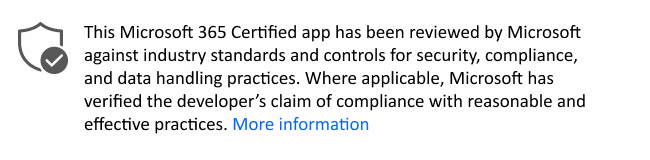

# Adobe Sign

Ultimo aggiornamento da parte dello sviluppatore: 1 marzo 2021

* <a href="https://teams.microsoft.com/l/app/0f56a9d1-f502-40f9-a9e8-816d7adbb68b" target="_blank">Visualizza nel Teams negozio</a>
* <a href="https://appsource.microsoft.com/product/office/WA104381233" target="_blank">Visualizza in AppSource</a>

::: zone pivot="general"

### Informazioni generali

Informazioni fornite da Adobe Systems Inc.

| **Informazioni** | **risposta** |
|:----------------|:-------------|
| Nome dell'app | Adobe Sign |
| ID | WA104381233 |
| Office 365 client supportati | Microsoft Teams |
| Nome della società partner | Adobe Systems Inc. |
| URL del sito Web partner | [https://acrobat.adobe.com/us/en/sign.html](https://acrobat.adobe.com/us/en/sign.html) |
| URL della pagina Teams informazioni sull'applicazione | [https://helpx.adobe.com/sign/help/adobesign_microsoft_teams...](https://helpx.adobe.com/sign/help/adobesign_microsoft_teams.html) |
| URL dell'Informativa sulla privacy | [https://www.adobe.com/privacy/policy.html](https://www.adobe.com/privacy/policy.html) |
| URL delle Condizioni d'uso | [https://www.adobe.com/legal/licenses-terms.html](https://www.adobe.com/legal/licenses-terms.html) |

 [!INCLUDE [Corrections or suggestions contact information](../includes/corrections-or-suggestions.md)]

::: zone-end

::: zone pivot="data"

### Come l'app gestisce i dati

Queste informazioni sono state fornite da Adobe Systems Inc.

#### Accesso ai dati tramite Microsoft Graph

Elenca tutte [le autorizzazioni Graph microsoft richieste](https://docs.microsoft.com/graph/permissions-reference) da questa app.

>| **Autorizzazione**  | **Tipo di autorizzazione (delegata/applicazione)** | **I dati vengono raccolti? Giustificazione per raccoglierlo?** | **I dati vengono archiviati? Giustificazione per conservarlo?** | **Azure AD App ID** |
>|:----------------|:--------------------|:---------------------------------------------------|:--------------------------|:--------------------------|
>| Mail.ReadWrite | delegato | Per popolare i messaggi di posta elettronica del documento, del mittente e del destinatario allegati e il contenuto del messaggio dai messaggi di posta elettronica al segno Adobe da inviare per la firma. Questo per risparmiare tempo all'utente per ridigitare questi campi in Adobe Sign. Dopo la firma di un accordo, componiamo automaticamente una nuova e-mail per l'utente per inviare un'e-mail per informare i suoi destinatari che la transazione è stata eseguita. | Adobe Sign salverà gli allegati come file temporanei, con una scadenza di 24 ore. | 72d5ac5d-a427-408b-907d-72da3f33ddd1 |
>| Persone.Lettura | delegato | Per riempire automaticamente l'indirizzo di posta elettronica &quot; nell'esperienza &quot; Invia per la firma, digitando alcune lettere iniziali, non richiedere agli utenti di digitare l'intero messaggio di posta elettronica. | Adobe Sign archivierà solo la posta elettronica e displayName dei destinatari nei contratti. | 72d5ac5d-a427-408b-907d-72da3f33ddd1 |
>| User.Read | delegato | Per leggere il profilo dell'utente e abbinare il proprio profilo (fondamentalmente, la sua e-mail e userId) al nostro database in modo che possano utilizzare Adobe Sign. | Per leggere il profilo dell'utente e abbinare il proprio profilo (fondamentalmente, la sua e-mail e userId) al nostro database in modo che possano utilizzare Adobe Sign. | 72d5ac5d-a427-408b-907d-72da3f33ddd1 |
>| offline_access | delegato | Per aggiornare il token di accesso, quando quello corrente è scaduto. Ad esempio, quando l'utente si trova in una finestra di invio &quot; per la firma e lo lascia &quot; inattivo per troppo tempo, è necessario aggiornare un nuovo token per mantenere attivo l'utente | Per aggiornare il token di accesso, quando quello corrente è scaduto. Ad esempio, quando l'utente si trova in una finestra di invio per &quot; la firma e lo lascia &quot; inattivo per troppo tempo, è necessario aggiornare un nuovo token per mantenere attivo l'utente. | 72d5ac5d-a427-408b-907d-72da3f33ddd1 |
>| openid | delegato | Email e UserId. Per accedere all'utente per garantire il consenso per l'autorizzazione all'uso dell'app Adobe Sign.  | La posta elettronica è l'identificatore univoco per gli utenti in Adobe Sign. Archiviamo l'ID e-mail in modo da poter mappare tutte le attività di quell'utente al suo record Adobe Sign.  | 72d5ac5d-a427-408b-907d-72da3f33ddd1 |

#### Accesso ai dati tramite altre API Microsoft

Le app e i componenti aggiuntivi Microsoft 365 possono utilizzare API Microsoft aggiuntive diverse da Microsoft Graph per raccogliere o elaborare informazioni di identificazione dell'organizzazione ( OII). Elenca tutte le API Microsoft diverse da Microsoft Graph questa app.

>| **API** |  **OII viene raccolto?** |  **Quale OII viene raccolto?** | **Giustificazione per la raccolta di OII?** | **OII è memorizzato?** | **Giustificazione per l'archiviazione di OII?** |
>|:-------------------|:-------------------|:--------------------------|:--------------------------|:---------------------------------------------------|:--------------------------|
>| Teams API | No |  |  |  |  |

#### Non servizi Microsoft utilizzati

Se l'app trasferisce o condivide dati dell'organizzazione con un servizio non Microsoft, elenca il servizio non Microsoft utilizzato dall'app, quali dati vengono trasferiti e includi una giustificazione del motivo per cui l'app deve trasferire queste informazioni.

>Non vengono servizi Microsoft non vengono utilizzati.

#### Accesso ai dati tramite bot

Se questa app contiene un bot o un'estensione di messaggistica, può accedere alle informazioni di identificazione dell'utente finale (EUII): l'elenco (nome, cognome, nome visualizzato, indirizzo e-mail) di qualsiasi membro del team o della chat a cui è aggiunta. Questa app utilizza questa funzionalità?

>| **Giustificazione per l'accesso all'I EUII?**  | **L'III è memorizzato in database?** | **Giustificazione per la conservazione dell'III?** |
>|:--------------------------------|:---------------------|:--------------------------|
>| Per la personalizzazione dei messaggi di chat e l'autenticazione | UserPrincipalName, nome, posta elettronica e objectId | Queste informazioni vengono memorizzare per la personalizzazione delle risposte asincrone e per scopi di autenticazione |

#### Dati di telemetria

Nella telemetria o nei registri dell'applicazione vengono visualizzate informazioni di identificazione dell'organizzazione (OII) o dell'utente finale (EUII)? In caso affermativo, descrivere quali dati vengono archiviati e quali sono i criteri di conservazione e rimozione?

>I nostri registri contengono informazioni sufficienti per essere in grado di identificare e risolvere i problemi dei clienti. I registri vengono conservati per 90 giorni e l'accesso è limitato. Il nostro archivio database hashed informazioni di identificazione per l'autenticazione mentre l'utente è offline. Il criterio di conservazione del database è a 30 giorni dall'ultimo utilizzato

#### Controlli dell'organizzazione per i dati archiviati dal partner

Descrivere in che modo gli amministratori dell'organizzazione possono controllare le proprie informazioni nei sistemi partner? ad esempio eliminazione, conservazione, controllo, archiviazione, politica dell'utente finale, ecc.

>Non abbiamo alcuna interazione con l'amministratore del cliente nel nostro sistema per Microsoft Teams applicazione.

#### Revisione umana delle informazioni organizzative

Gli esseri umani sono coinvolti nella revisione o nell'analisi di dati di informazioni di identificazione dell'organizzazione (OII) raccolti o archiviati da questa app?

>Sì

[!INCLUDE [Corrections or suggestions contact information](../includes/corrections-or-suggestions.md)]

::: zone-end

::: zone pivot="mcas"

Di seguito sono [riportate Microsoft Cloud App Security informazioni](https://www.microsoft.com/enterprise-mobility-security/cloud-app-security) dal catalogo di Microsoft Cloud App Security.

<iframe height='1020' title='Microsoft Cloud App Security informazione' src='https://appmcasinfoprod.azurewebsites.net/#/dashboard/11641' frameborder='no' style='width: 100%;'></iframe>

<a href="https://appmcasinfoprod.azurewebsites.net/#/dashboard/11641" target="_blank">Visualizzare in una nuova scheda</a>

[!INCLUDE [Corrections or suggestions contact information](../includes/corrections-or-suggestions.md)]

::: zone-end

::: zone pivot="identity"

### Informazioni sull'identità

Queste informazioni sono state fornite da Adobe Systems Inc.

| **Informazioni** | **risposta** |
|:----------------|:-------------|
| Ti integri con Microsoft Identify Platform (Azure AD)?  | Sì |
| Hai esaminato e rispettato tutte le best practice applicabili descritte nell'elenco di controllo Microsoft Identity Platform integrazione?  | Sì |
| La tua app usa MSAL (Microsoft Authentication Library) per l'autenticazione? | No |
| L'app supporta i criteri di accesso condizionale? | No |
| L'app richiede autorizzazioni con privilegi minimi per lo scenario? | Sì |
| Le autorizzazioni registrate staticamente dell'app riflettono accuratamente le autorizzazioni richieste dall'app in modo dinamico e incrementale? | Sì |
| La tua app supporta la multi-tenancy? | Sì |
| La tua app ha un client riservato? | No |
| Possiedi tutti gli URI (Unified Resource Identifier) di reindirizzamento registrati per la tua app? | Sì |
| Per la tua app, cosa eviti di usare? | - Gli URI di reindirizzamento dei caratteri jolly, - OAuth2 Implicit Flow, a meno che non sia necessario per una SPA - Flusso ROPC (Resource Owner Password Credential) |
| La tua app espone api Web? | Sì |
| Il modello di autorizzazione consente l'esito positivo delle chiamate solo se l'app client riceve il consenso corretto? | Sì |
| La tua app usa le API di anteprima? | No |
| La tua app usa API deprecate? | No |

[!INCLUDE [Corrections or suggestions contact information](../includes/corrections-or-suggestions.md)]

::: zone-end
