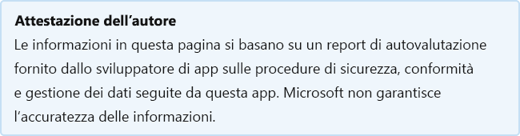

# Stack Overflow for TeamsStack Overflow for Teams

Last updated by the developer on: August 6, 2020Last updated by the developer on: August 6, 2020

* <a href="https://teams.microsoft.com/l/app/4783e622-5303-4ea7-a211-ef0dd405da73" target="_blank">Visualizzazione in Teams store</a><a href="https://teams.microsoft.com/l/app/4783e622-5303-4ea7-a211-ef0dd405da73" target="_blank">View in Teams store</a>
* <a href="https://appsource.microsoft.com/product/office/WA200000739" target="_blank">Visualizzazione in AppSource</a><a href="https://appsource.microsoft.com/product/office/WA200000739" target="_blank">View in AppSource</a>

::: zone pivot="general"

### Informazioni generaliGeneral information

Informazioni fornite da Stack Overflow a Microsoft:Information provided by Stack Overflow to Microsoft:

| **Informazioni****Information** | **Risposta****Response** |
|:----------------|:-------------|
| Nome appApp name | Stack Overflow for TeamsStack Overflow for Teams |
| IDID | WA200000739WA200000739 |
| Office 365 client supportatiOffice 365 clients supported | Microsoft TeamsMicrosoft Teams |
| Nome società partnerPartner company name | Stack OverflowStack Overflow |
| URL del sito Web del partnerURL of partner website | [https://stackoverflow.com](https://stackoverflow.com) |
| URL dell'informativa sulla privacyURL of Privacy Policy | [https://stackoverflow.com/legal/privacy-policy](https://stackoverflow.com/legal/privacy-policy) |
| URL delle Condizioni per l'utilizzoURL of Terms of Use | [https://stackoverflow.com/legal/terms-of-service/public](https://stackoverflow.com/legal/terms-of-service/public) |

 [!INCLUDE [Corrections or suggestions contact information](../includes/corrections-or-suggestions.md)]

::: zone-end

::: zone pivot="data"

### Modalità di gestione dei dati da parte dell'appHow the app handles data

Queste informazioni sono state fornite da Stack Overflow sul modo in cui questa app raccoglie e archivia i dati dell'organizzazione e il controllo che l'organizzazione avrà sui dati raccolti dall'app.This information has been provided by Stack Overflow about how this app collects and stores organizational data and the control that your organization will have over the data the app collects.

#### Accesso ai dati tramite Microsoft GraphData access using Microsoft Graph

Elenca tutte [le autorizzazioni Graph Microsoft richieste](https://docs.microsoft.com/graph/permissions-reference) da questa app.List any [Microsoft Graph permissions](https://docs.microsoft.com/graph/permissions-reference) this app requires.

>Questa applicazione non utilizza Microsoft Graph.This application does not use Microsoft Graph.

#### Non servizi Microsoft usatoNon-Microsoft services used

Se l'app trasferisce o condivide i dati dell'organizzazione con servizi non Microsoft, elenca il servizio non Microsoft utilizzato dall'app, i dati trasferiti e include una giustificazione del motivo per cui l'app deve trasferire queste informazioni.If the app transfers or shares organizational data with non-Microsoft service, list the non-Microsoft service the app uses, what data is transferred, and include a justification for why the app needs to transfer this information.

>Non vengono servizi Microsoft non vengono utilizzati.Non-Microsoft services are not used.

#### Accesso ai dati tramite botData access via bots

Se questa app contiene un bot o un'estensione di messaggistica, può accedere alle informazioni di identificazione dell'utente finale (EUII): l'elenco (nome, cognome, nome visualizzato, indirizzo di posta elettronica) di qualsiasi membro del team in un team o chat a cui viene aggiunta.If this app contains a bot or a messaging extension, it can access end-user identifiable information (EUII): the roster (first name, last name, display name, email address) of any team member in a team or chat it's added to. Questa app usa questa funzionalità?Does this app make use of this capability?

>| **Giustificazione per l'accesso a EUII?****Justification for accessing EUII?**  | **L'EUII è archiviato nei database?****Is EUII stored in database(s)?** | **Giustificazione per l'archiviazione di EUII?****Justification for storing EUII?** |
>|:--------------------------------|:---------------------|:--------------------------|
>| Il bot usa l'API di conversazione per pubblicare messaggi direttamente nella chat di Teams.The bot uses the conversation API to post messages directly to the teams chat. Il bot usa anche l'elenco per inviare messaggi direttamente agli utentiThe bot also uses the roster to message the users directly | I dati dell'elenco non vengono archiviatiWe don't store data from the roster |  |

#### Dati di telemetriaTelemetry data

Le informazioni di identificazione dell'organizzazione (OII) o dell'utente finale (EUII) vengono visualizzate nei registri o nei dati di telemetria dell'applicazione?Does any organizational identifiable information (OII) or end-user identifiable information (EUII) appear in this application's telemetry or logs? In caso affermativa, descrivere quali dati sono archiviati e quali sono i criteri di conservazione e rimozione?If yes, describe what data is stored and what are the retention and removal policies?

>No.No. Il mapping dell'utente DIS Teams e dell'utente Teams so avviene nel prodotto TEAMS.The mapping of the MS Teams user and the SO Teams user happens in the SO Teams product.
MS Teams invia i loro ID identificabili e li salviamo internamente per mappare l'utente.MS Teams sends us their identifiable ids and we save those internally to map the user.
Inoltre, MS Teams invia un token JWT per le richieste di bot (impedisce la falsificazione delle richieste) e le richieste tab convalidano usando il cookie SO.In addition, MS Teams sends us a JWT for bot requests (prevents request forgery) and Tab requests validate using the SO cookie.

#### Controlli dell'organizzazione per i dati archiviati dal partnerOrganizational controls for data stored by partner

Descrivere in che modo gli amministratori dell'organizzazione possono controllare le informazioni nei sistemi partner? ad esempio eliminazione, conservazione, controllo, archiviazione, criteri per gli utenti finali e così via.Describe how organization's administrators can control their information in partner systems? e.g. deletion, retention, auditing, archiving, end-user policy, etc.

>Microsoft crea il programma di sicurezza basato su ISO27001.We build our security program based on the ISO27001. I dati vengono separati logicamente nel proprio schema SQL e archiviati in un set separato di database.Data is logically separated into its own SQL schema and stored in a separate set of database. I dati vengono archiviati in un archivio dati separato logicamente accessibile solo dalle richieste per il team.Your data is stored in a logically separate data store that is accessible only by requests for your Team.

#### Revisione umana delle informazioni organizzativeHuman review of organizational information

Gli utenti sono coinvolti nella revisione o nell'analisi di dati OII (Organizational Identifiable Information) raccolti o archiviati da questa app?Are humans involved in reviewing or analyzing any organizational identifiable information (OII) data that is collected or stored by this app?

>NoNo

[!INCLUDE [Corrections or suggestions contact information](../includes/corrections-or-suggestions.md)]

::: zone-end

::: zone pivot="mcas"

Le informazioni del [Microsoft Cloud App Security](https://www.microsoft.com/enterprise-mobility-security/cloud-app-security) vengono visualizzate di seguito.Information from the [Microsoft Cloud App Security](https://www.microsoft.com/enterprise-mobility-security/cloud-app-security) catalog appears below.

<iframe height='1020' title='Microsoft Cloud App Security InformazioniMicrosoft Cloud App Security Information' src='https://appmcasinfoprod.azurewebsites.net/#/dashboard/23308' frameborder='no' style='width: 100%;'></iframe>

<a href="https://appmcasinfoprod.azurewebsites.net/#/dashboard/23308" target="_blank">Visualizzazione in una nuova scheda</a>

<a href="https://appmcasinfoprod.azurewebsites.net/#/dashboard/23308" target="_blank">View in a new tab</a>

[!INCLUDE [Corrections or suggestions contact information](../includes/corrections-or-suggestions.md)]

::: zone-end

